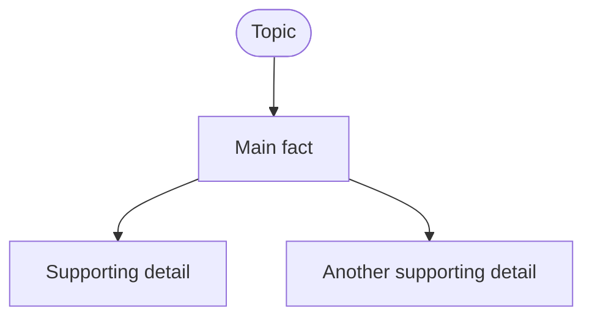
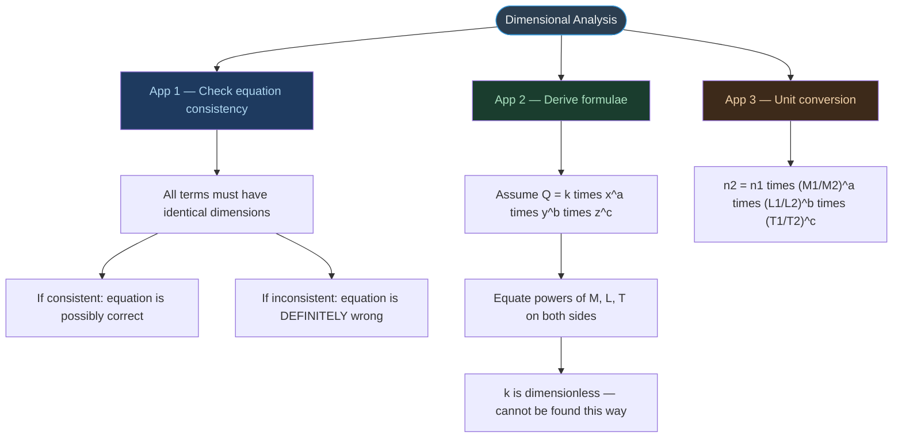

# 📘 GUIDE — Obsidian-Friendly Markdown
> A complete reference for writing Markdown that renders correctly in Obsidian.
> Based on real failures, fixes, and systematic testing.

---

## TABLE OF CONTENTS

1. [The Core Principle](#1-the-core-principle)
2. [Mermaid Diagrams — The Complete Ruleset](#2-mermaid-diagrams)
3. [LaTeX and Mathematical Notation](#3-latex-and-mathematical-notation)
4. [Tables](#4-tables)
5. [Callout Blocks](#5-callout-blocks)
6. [Significant Figures Quick Reference](#6-significant-figures-quick-reference)
7. [Lists and Numbered Items](#7-lists-and-numbered-items)
8. [Headers and Structure](#8-headers-and-structure)
9. [Code Blocks](#9-code-blocks)
10. [Links and Embeds](#10-links-and-embeds)
11. [Full Compatibility Checklist](#11-full-compatibility-checklist)
12. [Quick-Reference Anti-Pattern Table](#12-quick-reference-anti-pattern-table)
13. [Content Rules for Notes and Question Banks](#13-content-rules-for-notes-and-question-banks)

---

## 1. The Core Principle

> [!important] One Rule to Rule Them All
> **Obsidian renders each element in isolation.** Markdown syntax inside a Mermaid node is not Markdown. LaTeX inside a Mermaid label is not LaTeX. HTML inside a callout is not HTML. Each context has its own parser, and they do not share syntax.

The three parsers active in an Obsidian document are:

| Parser | Handles | Does NOT handle |
|:---|:---|:---|
| **Markdown parser** | Headers, bold, italic, lists, tables, callouts, links | Content inside ` ```mermaid ``` ` blocks |
| **Mermaid renderer** | Flowchart nodes, edges, styles | `**bold**`, `$$LaTeX$$`, `\n` as newline, `→`, `·`, `≠`, `½`, `π` |
| **KaTeX renderer** | `$inline$` and `$$block$$` math | Content inside Mermaid blocks, content inside HTML tags |

Crossing these boundaries is the source of every rendering error.

---

## 2. Mermaid Diagrams

### 2.1 Diagram Type Selection

| Diagram type | Use for | Obsidian support |
|:---|:---|:---:|
| `flowchart TD` / `LR` | Concept maps, decision trees, step-by-step processes | ✅ Reliable |
| `flowchart TD` with chained nodes | Multi-line information (replace `\n`) | ✅ Reliable |
| `sequenceDiagram` | Interactions between systems | ✅ Reliable |
| `classDiagram` | Object/data structure relationships | ✅ Reliable |
| `mindmap` | Hierarchical topic overviews | ⚠️ Unreliable — avoid |
| `timeline` | Chronological events | ⚠️ Version-dependent |

> [!danger] Never Use the `mindmap` Diagram Type
> Obsidian's bundled Mermaid version has a strict tokeniser for `mindmap`. It breaks silently on `\n`, `→`, `·`, `≠`, `½`, `π`, `<br/>`, emoji, and `**bold**` inside node text. Use `flowchart TD` instead — it handles all the same content reliably.

---

### 2.2 Node Label Rules — The Most Important Section

#### Rule 1 — No `\n` inside any node label. Ever.

`\n` inside a quoted string `"..."` renders as the literal characters `\` and `n` — not a line break.

```
WRONG:   A["Line one\nLine two"]
CORRECT: A["Line one"] --> B["Line two"]
```

**The fix is always to split into separate nodes and connect them with arrows.** Each node carries one idea. This also makes diagrams cleaner.

---

#### Rule 2 — No `**bold**` inside node labels

The `**` asterisks are passed through literally by the Mermaid parser. Some downstream renderers strip them (leaving dangling numbers like `1` on their own line), others show raw `**` characters.

```
WRONG:   A["**APPLICATION 1**\nCheck equations"]
CORRECT: A["APPLICATION 1 — Check equations"]
```

---

#### Rule 3 — No `$$...$$` or `$...$` LaTeX inside node labels

KaTeX does not run inside Mermaid blocks. LaTeX commands render as raw text.

```
WRONG:   A["$$T = k\sqrt{\frac{l}{g}}$$"]
CORRECT: A["T = k times sqrt(l/g)"]
```

**LaTeX has no place inside any Mermaid node.** Write mathematical expressions as plain descriptive ASCII.

---

#### Rule 4 — No LaTeX commands (`\frac`, `\sqrt`, `\cdot`, `\times`, `\pi`, `\left`, `\right`, etc.)

Even without `$$` delimiters, LaTeX backslash commands inside node labels cause parse errors or render as junk.

```
WRONG:   A["n2 = n1 \times \left[\frac{M_1}{M_2}\right]^a"]
CORRECT: A["n2 = n1 times (M1/M2)^a times (L1/L2)^b times (T1/T2)^c"]
```

---

#### Rule 5 — No middle-dot `·`, arrow `→`, inequality `≠ ≤ ≥`, or fraction symbols `½ ¼`

These Unicode characters are not in the character set Mermaid's tokeniser expects inside node strings.

```
WRONG:   A["CGS · FPS · MKS"]
CORRECT: A["CGS, FPS, MKS"]

WRONG:   A["Consistent ≠ Correct"]
CORRECT: A["Consistent does not mean correct"]

WRONG:   A["k = ½mv²"]
CORRECT: A["k = (1/2) m v^2"]
```

---

#### Rule 6 — No HTML tags (`<br/>`, `<br>`, `&amp;`, `&nbsp;`) inside nodes

```
WRONG:   A["Line one<br/>Line two"]
CORRECT: A["Line one"] --> B["Line two"]
```

---

#### Rule 7 — Emoji in node labels: use sparingly

Most emoji work in `flowchart` node labels in Obsidian. However, they can break certain Mermaid versions and are not supported at all in `mindmap`. When in doubt, leave them out.

```
SAFER:   A(["UNITS AND MEASUREMENT"])
RISKY:   A(["⚛️ UNITS AND MEASUREMENT"])
```

---

#### Rule 8 — Superscripts: use `^` notation, not Unicode superscript characters

```
WRONG:   A["10⁻³ m"]          ← Unicode superscripts — unpredictable
CORRECT: A["10^-3 m"]          ← ASCII caret notation — always safe
```

---

### 2.3 Node Shape Reference

| Shape | Syntax | Use for |
|:---|:---:|:---|
| Rectangle | `A["text"]` | Regular process or fact |
| Stadium / Pill | `A(["text"])` | Start / end nodes, titles |
| Rounded rectangle | `A("text")` | Soft steps |
| Diamond | `A{"text"}` | Decision / branch |
| Parallelogram | `A[/"text"/]` | Input / output |
| Circle | `A(("text"))` | Connector |

---

### 2.4 Multi-Line Information — The Correct Pattern

When a node needs to convey multiple facts, **chain nodes**:



Do **not** pack all facts into one node with `\n`. The diagram becomes cleaner and every piece of text renders reliably.

---

### 2.5 Style Declarations

Style lines are safe and do not affect parsing of node labels:

```
style NODEID fill:#1a3d2e,color:#a9dfbf,stroke:#27ae60,stroke-width:2px
```

- Use hex colour codes only — not named colours like `red` or `darkblue`
- `color` = text colour, `fill` = background, `stroke` = border
- Always place all `style` lines **after** all edge declarations

---

### 2.6 Complete Valid Example



---

## 3. LaTeX and Mathematical Notation

### 3.1 Where LaTeX Works

| Location | Syntax | Renders? |
|:---|:---:|:---:|
| Inline in paragraph text | `$...$` | ✅ Yes |
| Display block in paragraph | `$$...$$` (own line, blank lines around it) | ✅ Yes |
| Inside callout blocks | `$...$` and `$$...$$` | ✅ Yes |
| Inside table cells | `$...$` | ✅ Yes |
| Inside Mermaid node labels | any | ❌ Never |
| Inside code blocks (` ``` `) | any | ❌ Never (rendered as plain text) |

---

### 3.2 Display Block LaTeX — Required Spacing

A `$$` block must have a **blank line before and after** it to render as a centred display equation:

```
WRONG:
Some text.
$$E = mc^2$$
More text.

CORRECT:
Some text.

$$E = mc^2$$

More text.
```

---

### 3.3 Pipe Characters Inside LaTeX in Tables

The `|` character inside a `$...$` expression inside a table cell **breaks the column parser**. Use `\mid` or `\vert` instead:

```
WRONG:   | $[M|L|T]$ |
CORRECT: | $[M \mid L \mid T]$ |
```

---

### 3.4 Common Safe LaTeX Patterns

| What you want | Write this |
|:---|:---|
| Dimensional formula | `$[M L^2 T^{-2}]$` |
| Fraction | `$\dfrac{5}{18}$` |
| Square root | `$\sqrt{\dfrac{l}{g}}$` |
| Arrow implication | `$\implies$` |
| Approximately | `$\approx$` |
| Plus/minus | `$\pm$` |
| Superscript in text | `$10^{-3}$` |
| Subscript in text | `$m_e$` |
| Times sign | `$\times$` |
| Dot product | `$\cdot$` |
| Unit formatting | `$3.00 \times 10^8 \text{ m s}^{-1}$` |

---

## 4. Tables

### 4.1 Required Blank Line Before Every Table

Obsidian's Markdown parser requires a **blank line** between any non-table element and the first `|` of a table header:

```
WRONG:
**Some label:**
| Col A | Col B |
|:---:|:---:|

CORRECT:
**Some label:**

| Col A | Col B |
|:---:|:---:|
```

This is the single most common table-rendering failure. It causes tables to appear as plain text lines.

---

### 4.2 Separator Row is Mandatory

Every table must have a separator row immediately after the header row:

```
| Header 1 | Header 2 |
|:---|:---:|          ← this line is mandatory
| data     | data     |
```

Alignment codes: `:---` = left, `:---:` = centre, `---:` = right.

---

### 4.3 Tables Inside Callout Blocks

Every row of a table that sits inside a callout block must begin with `> `:

```
WRONG (breaks out of callout):
> [!info] My callout
> Some intro text.
| Col A | Col B |
|:---|:---|

CORRECT:
> [!info] My callout
> Some intro text.
>
> | Col A | Col B |
> |:---|:---|
> | data  | data  |
```

---

### 4.4 No Pipe Characters Inside LaTeX Table Cells

See Section 3.3. Use `\mid` instead of `|` inside any `$...$` expression that sits in a table cell.

---

### 4.5 Keep Table Rows Simple

Avoid putting very long LaTeX expressions inside narrow table columns — Obsidian does not horizontally scroll tables and the cell will overflow or wrap unpredictably.

---

## 5. Callout Blocks

### 5.1 Callout Syntax

```
> [!type] Optional title
> Content of the callout.
> More content on the next line.
```

Every line of the callout body must start with `> `.

---

### 5.2 Available Callout Types

| Type | Visual meaning | Use for |
|:---|:---|:---|
| `[!info]` | Blue — neutral information | Definitions, background |
| `[!note]` | Blue — note | Supplementary points |
| `[!tip]` | Green — positive | Exam shortcuts, tricks |
| `[!important]` | Orange — emphasis | Critical rules, key facts |
| `[!warning]` | Yellow — caution | Common mistakes, traps |
| `[!danger]` | Red — strong warning | Hard limits, fatal errors |
| `[!example]` | Purple — illustration | Worked examples, passages |
| `[!question]` | Teal — question | Practice questions |
| `[!success]` | Green — correct | Correct answers, confirmations |
| `[!failure]` | Red — incorrect | Wrong approaches |

---

### 5.3 Blank Lines Inside Callouts

A blank line inside a callout must still carry the `> ` prefix, otherwise it ends the callout:

```
WRONG (callout ends at blank line):
> [!info] Title
> First paragraph.

> Second paragraph — this starts a new blockquote, not a continuation.

CORRECT:
> [!info] Title
> First paragraph.
>
> Second paragraph — still inside the callout.
```

---

### 5.4 Nested Content Inside Callouts

| Content type | Syntax inside callout | Works? |
|:---|:---|:---:|
| Bold / italic | `> **bold**` | ✅ |
| Inline LaTeX | `> $E = mc^2$` | ✅ |
| Display LaTeX | `> $$E = mc^2$$` | ✅ |
| Table | `> \| col \| col \|` (every row `> \|`) | ✅ |
| Bullet list | `> - item` | ✅ |
| Numbered list | `> 1. item` | ✅ |
| Code block | `> \`\`\`lang` ... `> \`\`\`` | ✅ |
| Mermaid block | `> \`\`\`mermaid` inside callout | ⚠️ Unreliable — keep diagrams outside callouts |

---

## 6. Significant Figures Quick Reference

*(This section is specific to physics/chemistry note sets using the NoteBooks-XI template.)*

When writing SF rules as Markdown, use tables — not code blocks or ASCII art:

```markdown
| Type of digit | Significant? | Example | SF count |
|:---|:---:|:---:|:---:|
| All non-zero digits | YES | 285.7 | 4 |
| Zeros between non-zero digits | YES | 2005 | 4 |
| Leading zeros | NO | 0.0023 | 2 |
| Trailing zeros — no decimal | NO | 2500 | 2 |
| Trailing zeros — with decimal | YES | 2.500 | 4 |
```

For arithmetic operation rules, use a separate pair of callout blocks rather than a code block — the colour coding adds immediate visual hierarchy.

---

## 7. Lists and Numbered Items

### 7.1 Blank Lines Between List and Surrounding Content

Always leave a blank line **before** a list and **after** a list:

```
WRONG:
Some paragraph.
- Item one
- Item two
Next paragraph.

CORRECT:
Some paragraph.

- Item one
- Item two

Next paragraph.
```

---

### 7.2 Numbered Lists — The Dangling Number Problem

If a numbered list item wraps across lines in your source, the line break may be misread as a new list item. Keep each numbered item on a single source line:

```
WRONG:
1. Check equation
consistency of equations

CORRECT:
1. Check the dimensional consistency of equations
```

---

### 7.3 Nested Lists

Use 4 spaces (not 2, not a tab) for each level of nesting for maximum compatibility:

```
- Level 1
    - Level 2
        - Level 3
```

---

## 8. Headers and Structure

### 8.1 Blank Line After Every Header

Always leave a blank line between a header and the content following it:

```
WRONG:
## Section Title
Content starts here.

CORRECT:
## Section Title

Content starts here.
```

---

### 8.2 Header Hierarchy

Use a logical hierarchy and do not skip levels:

```
# H1 — Document title (one per file)
## H2 — Major sections
### H3 — Subsections
#### H4 — Sub-subsections (use sparingly)
```

Skipping from `##` to `####` can cause the Obsidian outline panel to display incorrectly.

---

### 8.3 Horizontal Rules

Use `---` on its own line with blank lines both before and after:

```
WRONG:
Some text.
---
Next section.

CORRECT:
Some text.

---

Next section.
```

A `---` immediately after a paragraph with no blank line is interpreted as a Setext-style heading underline, not a horizontal rule.

---

## 9. Code Blocks

### 9.1 When to Use Code Blocks vs Tables

| Content | Use |
|:---|:---|
| Actual code (Python, C, bash, etc.) | Code block with language tag |
| Mathematical derivation steps | LaTeX display blocks or a table |
| Comparison of multiple items | Table |
| Dimensional formulae reference list | Table |
| SI prefix list | Table |
| ASCII art / diagrams | Mermaid flowchart instead |

> [!warning] Do Not Use Code Blocks for Reference Tables
> A code block uses a monospace font and is not searchable by Obsidian's graph or tag system. A table is indexed, filterable, and visually clearer for structured data.

---

### 9.2 Specify the Language Tag

Always specify the language so Obsidian can apply syntax highlighting:

```
```python
def hello():
    return "world"
```
```

Common language tags: `python`, `c`, `cpp`, `bash`, `javascript`, `json`, `yaml`, `mermaid`, `latex`, `markdown`.

---

## 10. Links and Embeds

### 10.1 Internal Links

```
[[Note Name]]               ← links to a note in the vault
[[Note Name#Section]]       ← links to a specific heading
[[Note Name|Display text]]  ← links with custom display text
```

---

### 10.2 Embedding Notes and Images

```
![[Note Name]]              ← embeds entire note inline
![[image.png]]              ← embeds an image
![[image.png|400]]          ← embeds image with fixed pixel width
```

---

### 10.3 External Links

```
[Display text](https://example.com)
```

Raw URLs without Markdown link syntax are not auto-linked in all Obsidian themes — always wrap them.

---

## 11. Full Compatibility Checklist

Run through this list before saving any note intended for Obsidian rendering.

### Mermaid Diagrams

- [ ] No `mindmap` diagram type used — replaced with `flowchart TD`
- [ ] Zero `\n` characters inside any node label string `"..."`
- [ ] Zero `**bold**` markdown inside node labels
- [ ] Zero `$$...$$` or `$...$` LaTeX inside node labels
- [ ] Zero LaTeX commands (`\frac`, `\sqrt`, `\cdot`, `\times`, `\pi`, `\left`, `\right`) inside node labels
- [ ] Zero Unicode characters that break Mermaid tokeniser: `·  →  ≠  ≤  ≥  ½  ¼  ¾`
- [ ] Zero HTML tags (`<br/>`, `<br>`, `&amp;`) inside node labels
- [ ] All superscripts written as `^` notation (`10^-3` not `10⁻³`)
- [ ] Multi-line information split into separate chained nodes
- [ ] All `style` declarations placed after all edge declarations
- [ ] No `mindmap` type used anywhere

### Tables

- [ ] Blank line immediately before every table header row
- [ ] Separator row (`|:---|`) present on line immediately after every header
- [ ] Every table row inside a callout starts with `> |`
- [ ] No `|` character inside `$...$` LaTeX in table cells (use `\mid` instead)

### LaTeX

- [ ] Blank line before and after every `$$` display block
- [ ] No LaTeX of any kind inside Mermaid blocks
- [ ] No LaTeX inside HTML `<tags>`

### Callouts

- [ ] Every callout content line begins with `> `
- [ ] Blank lines inside callout written as `>` (not truly empty)
- [ ] Callout type is one of the supported types listed in Section 5.2

### General Structure

- [ ] Blank line after every header
- [ ] `---` horizontal rules have blank lines before and after
- [ ] Numbered list items are not broken across source lines
- [ ] No raw URLs — all links wrapped in `[text](url)` syntax

---

## 12. Quick-Reference Anti-Pattern Table

| Anti-pattern | Why it breaks | Correct alternative |
|:---|:---|:---|
| `"Line1\nLine2"` in Mermaid node | `\n` renders as literal characters | Split into two separate nodes connected by `-->` |
| `"**bold**"` in Mermaid node | `**` passes through literally; fallback renderers leave bare numbers | Use plain text: `"TITLE — description"` |
| `"$$Q = k \cdot x^a$$"` in Mermaid node | KaTeX does not run in Mermaid | Use ASCII: `"Q = k times x^a"` |
| `"\frac{1}{2}"` in Mermaid node | LaTeX backslash commands are unparsed | Use ASCII: `"1/2"` |
| `"CGS · FPS · MKS"` in Mermaid node | Middle-dot `·` breaks tokeniser | Use comma: `"CGS, FPS, MKS"` |
| `"Consistent ≠ Correct"` in Mermaid | `≠` breaks tokeniser | Use words: `"Consistent does not mean correct"` |
| `mindmap` diagram type | Strict tokeniser, rejects most special chars | Use `flowchart TD` |
| Table immediately after `**text:**` with no blank line | Parser reads it as continuation of paragraph | Add blank line before `\|` header row |
| Table row `\| col \|` inside callout without `> ` prefix | Row breaks out of callout | Write as `> \| col \|` |
| `$a \| b$` inside table cell | `\|` breaks column separator parsing | Use `$a \mid b$` |
| `$$E = mc^2$$` with no surrounding blank lines | Renders as inline, not display block | Add blank line before and after |
| `---` immediately after paragraph text | Parsed as Setext heading underline | Add blank line before `---` |
| Numbered list item broken across two source lines | Second line read as new list starting at `1` | Keep each list item on one line |
| `⁻¹ ² ³` Unicode superscripts in Mermaid | Unpredictable rendering | Use `^-1`, `^2`, `^3` caret notation |

---

## 13. Content Rules for Notes and Question Banks

These rules apply to **all note files** in NoteBooks-XI, beyond the Mermaid and LaTeX formatting already covered above.

---

### 13.1 Mermaid Nodes — One-Liners Only, No Complex Formulae

Node labels in `flowchart` diagrams must be **concise one-liners**. Never pack a multi-term equation, a fraction, or a derivation step into a single node label.

```
WRONG:   A["v^2 = v0^2 + 2ax where a = dv/dt and v = dx/dt"]
CORRECT: A["v^2 = v0^2 + 2ax"]
```

If a concept requires more explanation than fits in a short label, put the explanation in prose or a callout **below** the diagram — not inside it.

| Node content type | Allowed in Mermaid node? |
|:---|:---:|
| Short equation (one line, ASCII) | ✅ Yes |
| Named result or theorem | ✅ Yes |
| Multi-step derivation | ❌ No — use a callout below |
| Equation with fractions or nested terms | ❌ No — simplify to ASCII one-liner |
| Lists of multiple items | ❌ No — split into chained nodes |

---

### 13.2 Never Use Code Blocks for Answers or Derivations

Code blocks (` ``` `) render in a monospace font, break the visual flow of notes, and make answers look like program output. They are **never** appropriate for:

- Numerical answers to physics/chemistry problems
- Step-by-step derivations
- Worked examples
- Free-fall equations, kinematic substitutions, or any calculation

```
WRONG:
\```
v² = u² + 2as → 0 = 625 + 2a(200) → a = −1.5625 m s⁻²
\```

CORRECT:
> [!example] Solution
> $v^2 = u^2 + 2as$ → $0 = 625 + 2a(200)$ → $a = -1.5625$ m s⁻²
```

Code blocks are reserved **exclusively** for actual code (Python, C, bash, etc.) with a language tag.

---

### 13.3 Use Callouts for All Answers, Solutions, and Worked Examples

Instead of code blocks, use the appropriate callout type. The following callout types are well-suited for answer content:

| Callout Type | Use for |
|:---|:---|
| `> [!example]` | Worked examples, NCERT solutions, numerical answers |
| `> [!important]` | Key results, critical formulae derived in a solution |
| `> [!success]` | Final answer summary, boxed results |
| `> [!note]` | Intermediate steps or brief explanations |

**Pattern for numerical answers in Question Banks:**

```markdown
> [!example] Solution
> $u = 25$ m s⁻¹, $v = 0$, $s = 200$ m
>
> (i) $v^2 = u^2 + 2as \Rightarrow a = -1.5625$ m s⁻²
>
> (ii) $v = u + at \Rightarrow t = 16$ s
```

This renders as a coloured, clearly separated block that preserves LaTeX and stays visually consistent with the rest of the notes. It is **always** preferable to a code block.

---

### 13.4 Updated Anti-Pattern Table Entries

| Anti-pattern | Why it breaks | Correct alternative |
|:---|:---|:---|
| Complex multi-term formula in a Mermaid node | Node becomes unreadable; breaks visual hierarchy | Reduce to a short ASCII one-liner; put detail in a callout below |
| Code block for a numerical answer | Monospace font, no LaTeX, breaks visual consistency | Use `> [!example]` callout with inline LaTeX |
| Code block for a derivation step | Same as above; looks like code, not physics | Use `> [!example]` or `> [!note]` callout |
| Mixed code block and prose for a solution | Inconsistent rendering; LaTeX does not render inside ` ``` ` | Convert entire solution to a callout |

---

*End of Guide — Obsidian-Friendly Markdown*
*Maintained alongside the NoteBooks-XI project*
