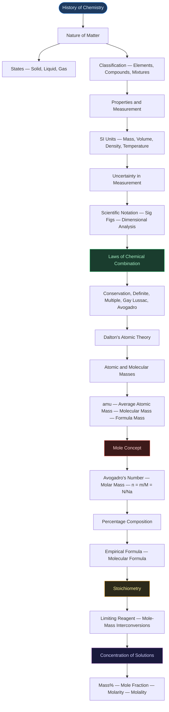
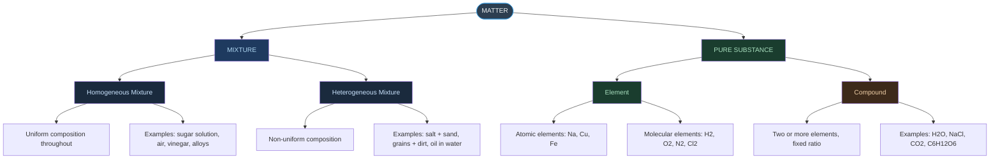
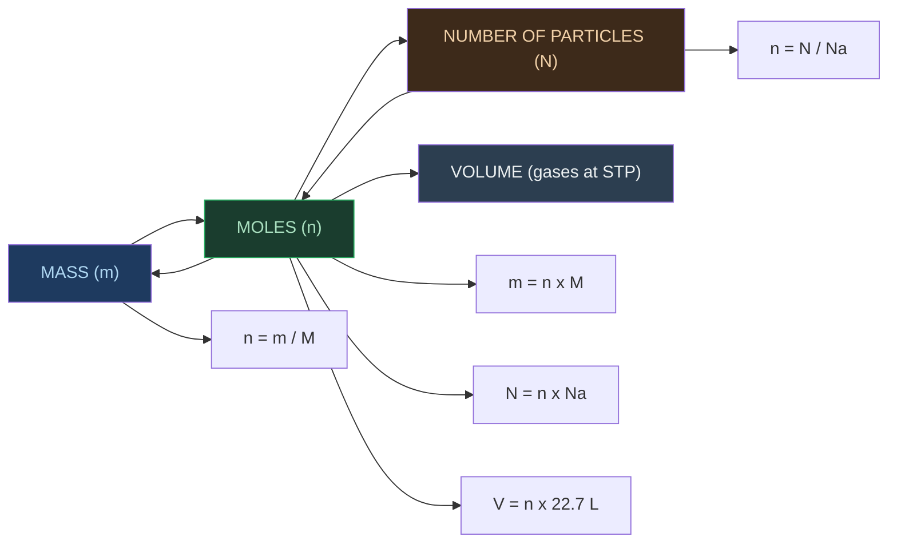
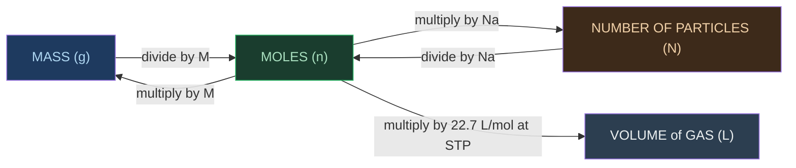

# ⚗️ CHAPTER 1 — SOME BASIC CONCEPTS OF CHEMISTRY
> **Complete Study Notes** | Board · NEET · JEE Layered

---

## 🗺️ CONCEPT ROADMAP

---

## SECTION 1 — DEVELOPMENT OF CHEMISTRY

### 1.1 Historical Origins

- Chemistry was originally sought for two purposes:
    - **Philosopher's Stone (Paras)** — to convert base metals (iron, copper) into gold
    - **Elixir of Life** — to grant immortality
- Developed mainly as **Alchemy** and **Iatrochemistry** (1300–1600 CE)
- Modern chemistry took shape in the **18th century Europe**, after alchemical traditions introduced by Arabs

### 1.2 Ancient Indian Contributions ⭐

> [!important] Frequently Tested — Board / NEET
> Acharya Kanda conceptualised the atomic theory **~2500 years before John Dalton** (1766–1844). His 'Paramānu' were described as eternal, indestructible, spherical, and in motion.

| Ancient Name / Text | Contribution |
|:---|:---|
| **Rasayan Shastra / Rasvidya** | Indian term for chemistry; included metallurgy, medicine, cosmetics, glass, dyes |
| **Mohenjodaro & Harappa** | Baked bricks, glazed pottery, Gypsum cement (lime + sand + CaCO₃), Faience (early glass) |
| **Harappans** | Worked with lead, silver, gold, copper; improved copper hardness with tin and arsenic |
| **Rigveda (1000–400 BCE)** | Tanning of leather and dyeing of cotton |
| **Kautilya's Arthashastra** | Production of salt from sea |
| **Charaka Samhita** | Oldest Ayurvedic text; preparation of H₂SO₄, HNO₃, metal oxides; bhasma (nanoparticles) |
| **Sushruta Samhita** | Importance of alkalies |
| **Rasopanishada** | Preparation of gunpowder |
| **Nagarjuna** | Mercury compounds (*Rasratnakar*); extraction of gold, silver, tin, copper |
| **Chakrapani** | Discovered mercury sulphide; credited with inventing soap |
| **Acharya Kanda (600 BCE)** | First proponent of atomic theory; named particles **'Paramānu'**; text: *Vaiseshika Sutras* |
| **Varāhmihir's Brihat Samhita** | Encyclopaedia (6th century CE); perfumes, cosmetics, hair dyes, wall preparations |

### 1.3 Glass and Ink in Ancient India

- Glass objects found at: **Maski, South India (1000–900 BCE)** and **Hastinapur & Taxila (1000–200 BCE)**
- Glass coloured using **metal oxides**
- Ink used in India since the **4th century** (evidenced at Taxila)
- Paper known in India in the **17th century** (account by Chinese traveller I-tsing)

---

## SECTION 2 — IMPORTANCE OF CHEMISTRY

> [!info] Definition
> Chemistry is the science that studies the **composition, structure, properties, and interactions of matter** at the level of atoms and molecules.

Chemistry is central to virtually every field of life:

- **Food & Agriculture**: Large-scale fertilisers, improved pesticides and insecticides
- **Healthcare**: Isolation and synthesis of life-saving drugs
    - **Cisplatin** and **Taxol** → cancer therapy
    - **AZT (Azidothymidine)** → AIDS treatment
- **Industry**: Acids, alkalis, dyes, polymers, metals, alloys
- **Advanced Materials**: Superconducting ceramics, conducting polymers, optical fibres
- **Environment**: Safer alternatives to **CFCs** (responsible for stratospheric ozone depletion); management of greenhouse gases (CH₄, CO₂)
- **Biochemistry**: Use of enzymes for large-scale production of chemicals

---

## SECTION 3 — NATURE OF MATTER

### 3.1 Definition of Matter

> [!info] Definition
> **Matter**: Anything that has **mass** and **occupies space** (has volume).

### 3.2 States of Matter

| Property | **Solid** | **Liquid** | **Gas** |
|:---|:---:|:---:|:---:|
| Shape | Definite | Takes container shape | Takes container shape |
| Volume | Definite | Definite | Not definite |
| Particle spacing | Very close, ordered | Close, mobile | Far apart |
| Particle movement | Vibrations only | Can move around | Easy and fast |
| Compressibility | Negligible | Negligible | High |
| Example | Ice, NaCl | Water, mercury | Steam, O₂ |

> [!warning] Board Trap
> Gases completely occupy the container; liquids take the container's shape but have definite volume.

### 3.3 Classification of Matter

**Key Distinctions:**

| Feature | Mixture | Compound |
|:---|:---|:---|
| Composition | Variable | Fixed |
| Separation | Physical methods | Chemical methods only |
| Properties | Similar to components | Different from components |
| Formation | No energy change necessarily | Energy absorbed or released |

> [!tip] Classic NEET Example
> H₂ + O₂ → both gases. But H₂O (compound) → liquid; hydrogen burns, oxygen supports combustion, but water extinguishes fire.

---

## SECTION 4 — PROPERTIES OF MATTER AND THEIR MEASUREMENT

### 4.1 Physical vs Chemical Properties

| Physical Properties | Chemical Properties |
|:---|:---|
| Observed/measured without changing substance | Require a chemical change to be observed |
| Colour, odour, melting/boiling point, density | Acidity, combustibility, reactivity with acids |
| Substance remains same after measurement | Substance is consumed or transformed |

### 4.2 The SI System of Units

Established in **1960** by the **11th General Conference on Weights and Measures (CGPM)** *(Conférence Générale des Poids et Mesures)*. Based on the **Metre Convention** signed in Paris, 1875. India's standard maintained by: **National Physical Laboratory (NPL), New Delhi**.

#### Seven Base SI Units

| Base Physical Quantity | Symbol | SI Unit | Unit Symbol |
|:---|:---:|:---:|:---:|
| Length | *l* | metre | m |
| Mass | *m* | kilogram | kg |
| Time | *t* | second | s |
| Electric current | *I* | ampere | A |
| Thermodynamic temperature | *T* | kelvin | K |
| Amount of substance | *n* | mole | mol |
| Luminous intensity | *Iᵥ* | candela | cd |

> [!warning] JEE Note
> These are the **only 7 base units**. All other units (speed, force, energy, etc.) are **derived** from these.

#### Key SI Prefix Table

| Multiple | Prefix | Symbol |
|:---:|:---:|:---:|
| $10^{-12}$ | pico | p |
| $10^{-9}$ | nano | n |
| $10^{-6}$ | micro | μ |
| $10^{-3}$ | milli | m |
| $10^{-2}$ | centi | c |
| $10^{-1}$ | deci | d |
| $10^{3}$ | kilo | k |
| $10^{6}$ | mega | M |
| $10^{9}$ | giga | G |
| $10^{12}$ | tera | T |

### 4.3 Mass and Weight

| | **Mass** | **Weight** |
|:---|:---:|:---:|
| Definition | Amount of matter | Force exerted by gravity |
| Nature | Constant everywhere | Varies with location |
| SI Unit | kilogram (kg) | newton (N) |
| Instrument | Analytical balance | Spring balance |

Lab unit of mass: **gram (g)** [1 kg = 1000 g]

### 4.4 Volume

- SI unit: **m³**
- Lab units: **cm³, dm³, mL, L**
- Conversions:
    - **1 L = 1000 mL = 1000 cm³ = 1 dm³**
    - **1 m³ = 10⁶ cm³ = 1000 dm³ = 1000 L**
- Lab instruments: graduated cylinder, burette, pipette, volumetric flask

### 4.5 Density

$$
\boxed{\text{Density} = \frac{\text{Mass}}{\text{Volume}}}
$$

- SI unit: **kg m⁻³**
- Common lab unit: **g cm⁻³** or **g mL⁻¹**
- Higher density → particles more closely packed

### 4.6 Temperature Scales

$$
\boxed{°F = \frac{9}{5}(°C) + 32}
$$

$$
\boxed{K = °C + 273.15}
$$

| Scale | Freezing point of water | Boiling point of water |
|:---|:---:|:---:|
| Celsius (°C) | 0 | 100 |
| Fahrenheit (°F) | 32 | 212 |
| Kelvin (K) | 273.15 | 373.15 |

> [!warning] Key Point
> Negative temperature is possible in Celsius, but **NOT in Kelvin**. K is always ≥ 0. Kelvin is the SI unit.

---

## SECTION 5 — UNCERTAINTY IN MEASUREMENT

### 5.1 Scientific Notation

Any number expressed as: **N × 10ⁿ** where **1.000… ≤ N ≤ 9.999…**

| Original Number | Scientific Notation | Move decimal |
|:---|:---:|:---|
| 232.508 | $2.32508 \times 10^{2}$ | 2 places left → positive exponent |
| 0.00016 | $1.6 \times 10^{-4}$ | 4 places right → negative exponent |
| 602,200,000,000,000,000,000,000 | $6.022 \times 10^{23}$ | 23 places left |

**Mathematical Operations:**

- **Multiplication**: $(a \times 10^x)(b \times 10^y) = (a \times b) \times 10^{(x+y)}$
- **Division**: $(a \times 10^x) \div (b \times 10^y) = (a/b) \times 10^{(x-y)}$
- **Addition/Subtraction**: First make exponents equal, then operate on coefficients

### 5.2 Significant Figures (Sig Figs)

> [!important] Definition
> All digits known with certainty **plus one uncertain (estimated) digit**.

#### Rules for Counting Significant Figures

| Rule | Example | Sig Figs |
|:---|:---:|:---:|
| All non-zero digits are significant | 285 cm | **3** |
| Leading zeros are NOT significant | 0.0052 | **2** |
| Zeros between non-zero digits ARE significant | 2.005 | **4** |
| Trailing zeros WITH decimal point ARE significant | 0.200 g | **3** |
| Trailing zeros WITHOUT decimal point are NOT significant | 100 | **1** |
| 100. (with decimal point) | 100. | **3** |
| All digits in scientific notation are significant | $4.01 \times 10^{2}$ | **3** |
| Exact/counted numbers | 2 eggs | **infinite** |

#### Rounding Rules

1. Digit to be removed **> 5** → preceding digit increases by 1 → 1.386 becomes **1.39**
2. Digit to be removed **< 5** → preceding digit unchanged → 4.334 becomes **4.33**
3. Digit to be removed **= 5** → preceding digit even → unchanged (6.25 → **6.2**); odd → increase by 1 (6.35 → **6.4**)

#### Sig Figs in Calculations

> [!tip] Calculation Rules
> - **Addition/Subtraction** → result has same **number of decimal places** as the least precise measurement
>     - Example: 12.11 + 18.0 + 1.012 = 31.122 → reported as **31.1**
> - **Multiplication/Division** → result has same **number of sig figs** as the measurement with fewest sig figs
>     - Example: 2.5 × 1.25 = 3.125 → reported as **3.1** (2.5 has only 2 sig figs)

### 5.3 Precision vs Accuracy

| | **Precision** | **Accuracy** |
|:---|:---|:---|
| Definition | Closeness of repeated measurements to each other | Closeness of a measurement to the true value |
| Analogy | Arrows clustered together (not necessarily at bullseye) | Arrows hitting the bullseye |
| Example | 1.95 g, 1.93 g (true value = 2.00 g) → Precise but NOT accurate | 2.01 g, 1.99 g → Both precise AND accurate |

### 5.4 Dimensional Analysis (Factor Label Method / Unit Factor Method)

Multiply by **unit factors** (fractions equal to 1) to convert between units.

> [!example] Example 1 — Convert 3 inches to cm (1 in = 2.54 cm)
>
> $$3 \text{ in} \times \frac{2.54 \text{ cm}}{1 \text{ in}} = 7.62 \text{ cm}$$

> [!example] Example 2 — Convert 2 L to m³
>
> $$2 \text{ L} \times \frac{1000 \text{ cm}^3}{1 \text{ L}} \times \left(\frac{1 \text{ m}}{100 \text{ cm}}\right)^3 = 2 \times 10^{-3} \text{ m}^3$$

> [!example] Example 3 — Convert 2 days to seconds
>
> $$2 \text{ days} \times \frac{24 \text{ h}}{1 \text{ day}} \times \frac{60 \text{ min}}{1 \text{ h}} \times \frac{60 \text{ s}}{1 \text{ min}} = 172{,}800 \text{ s}$$

---

## SECTION 6 — LAWS OF CHEMICAL COMBINATION

### Law 1: Law of Conservation of Mass

**Proposed by**: Antoine Lavoisier (1789)

> [!important] Statement
> "In all physical and chemical changes, there is no net change in mass. Matter can neither be created nor destroyed."

Total mass of reactants = Total mass of products

### Law 2: Law of Definite Proportions

**Proposed by**: Joseph Proust

> [!important] Statement
> "A given compound always contains the same elements combined together in the same fixed proportion by mass."

Also called: **Law of Definite Composition**

Example: Cupric carbonate (natural or synthetic) always has Cu : C : O = **51.35 : 9.74 : 38.91** (by mass)

### Law 3: Law of Multiple Proportions

**Proposed by**: John Dalton (1803)

> [!important] Statement
> "When two elements form more than one compound, the masses of one element that combine with a fixed mass of the other are in a ratio of small whole numbers."

Example:

- H₂ + O₂ → **H₂O**: 2 g H combines with **16 g O**
- H₂ + O₂ → **H₂O₂**: 2 g H combines with **32 g O**
- Ratio of O = 16 : 32 = **1 : 2** ← simple whole number ratio ✓

### Law 4: Gay Lussac's Law of Gaseous Volumes

**Proposed by**: Gay Lussac (1808)

> [!important] Statement
> "When gases combine or are produced in a chemical reaction, they do so in a simple ratio by volume, provided all gases are at the same temperature and pressure."

Example: H₂ : O₂ : H₂O (vapour) = 100 mL : 50 mL : 100 mL = **2 : 1 : 2**

### Law 5: Avogadro's Law

**Proposed by**: Amedeo Avogadro (1811)

> [!important] Statement
> "Equal volumes of all gases at the same temperature and pressure should contain equal number of molecules."

Key contribution: Distinguished between **atoms** and **molecules**; proposed H₂ and O₂ are **diatomic**. His proposal was published in *Journal de Physique* but was accepted only ~50 years later (Karlsruhe Conference, 1860).

> [!tip] JEE Note
> Gay Lussac's law is actually the Law of Definite Proportions by Volume. Avogadro's law explained it correctly.

---

## SECTION 7 — DALTON'S ATOMIC THEORY (1808)

Published in: **'A New System of Chemical Philosophy'**

### Postulates

1. Matter consists of **indivisible atoms**
2. All atoms of a given element have **identical properties, including identical mass**; atoms of different elements differ in mass
3. Compounds are formed when atoms of different elements combine in a **fixed ratio**
4. Chemical reactions involve **reorganisation of atoms** — atoms are neither created nor destroyed

### Successes

- Explained Law of Conservation of Mass (atoms rearrange, not created/destroyed)
- Explained Law of Definite Proportions (fixed atom ratios)
- Explained Law of Multiple Proportions (different fixed ratios)

### Limitations

- Could **NOT** explain Gay Lussac's Law of Gaseous Volumes
- Could NOT explain why/how atoms combine (valence concept came later)
- Did not account for **isotopes** (same element, different mass)
- Did not account for **isobars** (different elements, same mass)
- Atoms are NOT truly indivisible (protons, neutrons, electrons exist)

---

## SECTION 8 — ATOMIC AND MOLECULAR MASSES

### 8.1 Atomic Mass Unit (amu / u)

$$
\boxed{1 \text{ amu} = \frac{1}{12} \times \text{mass of one }^{12}\text{C atom}}
$$

- 1 amu = **1.66056 × 10⁻²⁴ g**
- Standard: ¹²C = exactly **12 u** (agreed 1961)
- Mass of H atom = 1.6736 × 10⁻²⁴ g = **1.008 u**
- Current symbol: **u** (unified mass) replaces 'amu'

> [!note] Calculation
> Mass of H atom in amu = (1.6736 × 10⁻²⁴ g) / (1.66056 × 10⁻²⁴ g) = **1.0078 u ≈ 1.008 u**

### 8.2 Average Atomic Mass

Because most elements exist as **isotopes** (same atomic number, different mass number), we use a weighted average:

$$
\boxed{\bar{A} = \sum_{i} \left(\text{fractional abundance}_i \times \text{atomic mass}_i\right)}
$$

**Example — Carbon:**

| Isotope | Abundance | Atomic Mass |
|:---:|:---:|:---:|
| ¹²C | 98.892% | 12 u |
| ¹³C | 1.108% | 13.00335 u |
| ¹⁴C | ~2 × 10⁻¹⁰% | 14.00317 u |

Average = (0.98892)(12) + (0.01108)(13.00335) + (≈0)(14.00317) = **12.011 u**

> [!tip] Key Point
> Periodic table values are **average atomic masses**, not masses of individual atoms.

### 8.3 Molecular Mass

$$
\text{Molecular mass} = \sum (\text{atomic mass} \times \text{number of atoms of that element})
$$

| Molecule | Calculation | Molecular Mass |
|:---|:---|:---:|
| CH₄ | 12.011 + 4(1.008) | **16.043 u** |
| H₂O | 2(1.008) + 16.00 | **18.02 u** |
| CO₂ | 12.011 + 2(16.00) | **44.011 u** |
| C₆H₁₂O₆ (glucose) | 6(12.011) + 12(1.008) + 6(16.00) | **180.162 u** |
| NH₃ | 14.01 + 3(1.008) | **17.034 u** |

### 8.4 Formula Mass

Used for **ionic compounds** that do NOT exist as discrete molecules (exist as 3D lattice structures):

**Example: NaCl** — Formula mass = 23.0 (Na) + 35.5 (Cl) = **58.5 u**

> [!note] Structure
> NaCl: each Na⁺ surrounded by 6 Cl⁻, and each Cl⁻ surrounded by 6 Na⁺

---

## SECTION 9 — MOLE CONCEPT AND MOLAR MASSES

### 9.1 The Mole — Definition

$$
\boxed{1 \text{ mole} = 6.02214076 \times 10^{23} \text{ elementary entities}}
$$

This number is **Avogadro's constant (Nₐ)** = **6.022 × 10²³ mol⁻¹**

In full: **602,213,670,000,000,000,000,000**

> [!important] Note
> "Elementary entity" can be an atom, molecule, ion, electron, formula unit — must be specified.

### 9.2 The Mole — Interconversions

| Conversion | Formula |
|:---|:---:|
| Moles from mass | $n = m / M$ |
| Mass from moles | $m = n \times M$ |
| Particles from moles | $N = n \times N_A$ |
| Moles from particles | $n = N / N_A$ |
| Volume of gas (STP) | $V = n \times 22.7 \text{ L}$ |

### 9.3 Molar Mass

> [!info] Definition
> **Molar mass** = Mass of **1 mole** of a substance in grams = numerically equal to atomic/molecular/formula mass in u.

| Substance | Molar Mass |
|:---:|:---:|
| H₂O | 18.02 g mol⁻¹ |
| NaCl | 58.5 g mol⁻¹ |
| C₆H₁₂O₆ | 180.162 g mol⁻¹ |
| NH₃ | 17.03 g mol⁻¹ |
| CO₂ | 44.01 g mol⁻¹ |

**Deriving Avogadro's Number:**

- 1 mole ¹²C = 12 g
- Mass of 1 ¹²C atom (by mass spectrometry) = 1.992648 × 10⁻²³ g
- $N_A = 12 \text{ g/mol} \div 1.992648 \times 10^{-23} \text{ g} = 6.0221367 \times 10^{23} \text{ mol}^{-1}$

---

## SECTION 10 — PERCENTAGE COMPOSITION

$$
\boxed{\text{Mass \% of element} = \frac{\text{Molar mass of element in 1 mol of compound}}{\text{Molar mass of compound}} \times 100}
$$

**Example: Ethanol (C₂H₅OH), Molar mass = 46.068 g mol⁻¹**

- %C = (24.02 / 46.068) × 100 = **52.14%**
- %H = (6.048 / 46.068) × 100 = **13.13%**
- %O = (16.00 / 46.068) × 100 = **34.73%**

Check: 52.14 + 13.13 + 34.73 = **100%** ✓

---

## SECTION 11 — EMPIRICAL AND MOLECULAR FORMULA

| | **Empirical Formula** | **Molecular Formula** |
|:---|:---|:---|
| Represents | Simplest whole number ratio of atoms | Actual number of atoms in a molecule |
| Obtained from | % composition data | Empirical formula + molar mass |
| May differ from molecular | Yes | No (it IS the actual formula) |
| Example | CH₂O | C₆H₁₂O₆ (glucose) |

### Steps to Find Empirical Formula from % Composition

**Step 1**: Assume 100 g of compound → % values become gram values directly.

**Step 2**: Convert grams to moles by dividing by atomic mass.

$$
\text{Moles} = \frac{\text{Mass (g)}}{\text{Atomic Mass (g mol}^{-1}\text{)}}
$$

**Step 3**: Divide all mole values by the **smallest** mole value → get molar ratios.

**Step 4**: If ratios are not whole numbers (e.g., 1.5, 2.5), multiply all by the smallest integer to make them whole (e.g., multiply by 2).

**Step 5**: Write empirical formula with these whole number ratios.

### Steps to Find Molecular Formula from Empirical Formula

$$
\boxed{n = \frac{\text{Molar Mass (given)}}{\text{Empirical Formula Mass (calculated)}}}
$$

$$
\text{Molecular Formula} = n \times \text{Empirical Formula}
$$

> [!example] Worked Example (NCERT Problem 1.2)
> Compound: 4.07% H, 24.27% C, 71.65% Cl; Molar mass = 98.96 g
>
> | Element | Mass (in 100 g) | Atomic Mass | Moles | Ratio (÷ 2.021) |
> |:---:|:---:|:---:|:---:|:---:|
> | H | 4.07 g | 1.008 | 4.04 | ≈ 2 |
> | C | 24.27 g | 12.01 | 2.021 | 1 |
> | Cl | 71.65 g | 35.453 | 2.021 | 1 |
>
> Empirical formula: **CH₂Cl**; EF mass = 12.01 + 2(1.008) + 35.453 = **49.48 g**
>
> $n = 98.96 / 49.48 = 2$
>
> Molecular formula: **C₂H₄Cl₂**

---

## SECTION 12 — STOICHIOMETRY AND STOICHIOMETRIC CALCULATIONS

### 12.1 What is Stoichiometry?

> [!info] Definition
> *(Greek: stoicheion = element, metron = measure)*
>
> Deals with the **quantitative relationships** between reactants and products in a balanced chemical equation.

### 12.2 Reading a Balanced Equation

**Example: CH₄(g) + 2O₂(g) → CO₂(g) + 2H₂O(g)**

| Interpretation | CH₄ | 2O₂ | CO₂ | 2H₂O |
|:---|:---:|:---:|:---:|:---:|
| Molecules | 1 | 2 | 1 | 2 |
| Moles | 1 mol | 2 mol | 1 mol | 2 mol |
| Mass | 16 g | 64 g | 44 g | 36 g |
| Volume at STP | 22.7 L | 45.4 L | 22.7 L | 45.4 L |

Stoichiometric coefficients (1, 2, 1, 2) represent both number of **molecules** and number of **moles**.

### 12.3 Balancing Chemical Equations

According to **Law of Conservation of Mass**, a balanced equation has the same number of each atom on both sides.

**Method — Trial and Error (propane combustion):**

> [!example] Balancing C₃H₈ + O₂ → CO₂ + H₂O
> 1. Balance C: C₃H₈ + O₂ → **3**CO₂ + H₂O
> 2. Balance H: C₃H₈ + O₂ → 3CO₂ + **4**H₂O
> 3. Balance O: C₃H₈ + **5**O₂ → 3CO₂ + 4H₂O
> 4. Verify: C(3=3) ✓, H(8=8) ✓, O(10=10) ✓
>
> $$\boxed{C_3H_8(g) + 5O_2(g) \rightarrow 3CO_2(g) + 4H_2O(l)}$$

> [!warning] Rule
> Only coefficients can be changed to balance; **subscripts cannot be changed**.

### 12.4 Limiting Reagent

> [!important] Definition
> **Limiting Reagent**: The reactant that is **completely consumed first** in a reaction, thereby limiting the amount of product formed.

**Method to Identify Limiting Reagent:**

1. Convert masses of all reactants to moles
2. Divide moles by their **stoichiometric coefficients**
3. The reactant with the **smallest quotient** is the limiting reagent

> [!example] NCERT Problem 1.5 — 50.0 kg N₂ + 10.0 kg H₂ → NH₃
> Reaction: N₂(g) + 3H₂(g) → 2NH₃(g)
>
> - Moles of N₂ = 50000/28 = **1786 mol**; quotient = 1786/1 = 1786
> - Moles of H₂ = 10000/2 = **4960 mol**; quotient = 4960/3 = **1653** ← smallest
>
> **H₂ is the limiting reagent.**
>
> NH₃ produced = 4960 mol H₂ × (2 mol NH₃ / 3 mol H₂) = **3307 mol NH₃ = 56.2 kg**

### 12.5 Mole-Mass-Volume Interconversions

---

## SECTION 13 — CONCENTRATION OF SOLUTIONS

### 13.1 Mass per cent (w/w %)

$$
\boxed{\text{Mass \%} = \frac{\text{Mass of solute}}{\text{Mass of solution}} \times 100}
$$

Mass of solution = Mass of solute + Mass of solvent

**Example**: 2 g substance A in 18 g water → Mass % = (2/20) × 100 = **10%**

### 13.2 Mole Fraction (χ)

$$
\boxed{\chi_A = \frac{n_A}{n_A + n_B}, \quad \chi_B = \frac{n_B}{n_A + n_B}}
$$

> [!note] Key Facts
> - **Always**: $\chi_A + \chi_B = 1$ (sum of all mole fractions = 1)
> - Mole fraction is **dimensionless**

### 13.3 Molarity (M)

$$
\boxed{M = \frac{\text{Number of moles of solute}}{\text{Volume of solution in litres}}}
$$

- Unit: **mol L⁻¹** (or **M**)
- **Changes with temperature** (because volume changes with temperature)
- **Dilution formula**: $M_1 V_1 = M_2 V_2$ (moles of solute conserved on dilution)

> [!example] NCERT 1.7 — 4 g NaOH in 250 mL solution
> $M = (4/40) / 0.250 = 0.1/0.250 =$ **0.4 M**

### 13.4 Molality (m)

$$
\boxed{m = \frac{\text{Number of moles of solute}}{\text{Mass of solvent in kg}}}
$$

- Unit: **mol kg⁻¹**
- **Does NOT change with temperature** (mass is temperature-independent)
- Used in colligative property calculations

### 13.5 Master Comparison Table

| Property | Molarity (M) | Molality (m) | Mole Fraction (χ) | Mass % |
|:---|:---:|:---:|:---:|:---:|
| Symbol | M | m | χ | w/w% |
| Solute unit | moles | moles | moles | mass |
| Denominator | Volume of **solution** (L) | Mass of **solvent** (kg) | Total moles | Mass of **solution** |
| Temperature dependent | **YES** ⚠️ | **NO** | NO | NO |
| Unit | mol L⁻¹ | mol kg⁻¹ | dimensionless | % |

> [!tip] JEE Tip
> Molality is preferred when temperature varies because it is temperature-independent. Molarity is the most commonly used for lab solutions.

---

## QUICK FORMULA REFERENCE

| Quantity | Formula |
|:---|:---|
| Moles from mass | $n = m / M$ |
| Mass from moles | $m = n \times M$ |
| Particles from moles | $N = n \times N_A$ |
| Moles from particles | $n = N / N_A$ |
| Mass % of element | (mass of element / molar mass of compound) × 100 |
| Empirical formula factor | $n = \text{Molar mass} / \text{EF mass}$ |
| Molecular formula | $n \times \text{Empirical Formula}$ |
| Limiting reagent check | (moles available / stoichiometric coeff.) → smallest |
| Density | $\rho = m / V$ |
| Temperature conversion | $K = °C + 273.15$ |
| °F from °C | $°F = (9/5)(°C) + 32$ |
| Molarity | $M = n(\text{solute}) / V(\text{solution in L})$ |
| Molality | $m = n(\text{solute}) / \text{mass(solvent in kg)}$ |
| Mole fraction A | $\chi_A = n_A / (n_A + n_B)$ |
| Dilution | $M_1 V_1 = M_2 V_2$ |
| Average atomic mass | $\Sigma(\text{fractional abundance} \times \text{atomic mass})$ |

---

*End of Core Notes — Ch. 1: Some Basic Concepts of Chemistry*