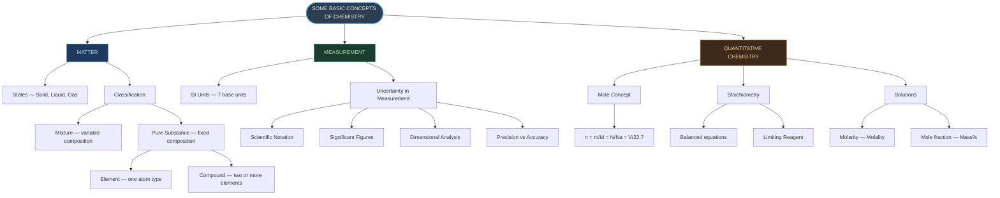
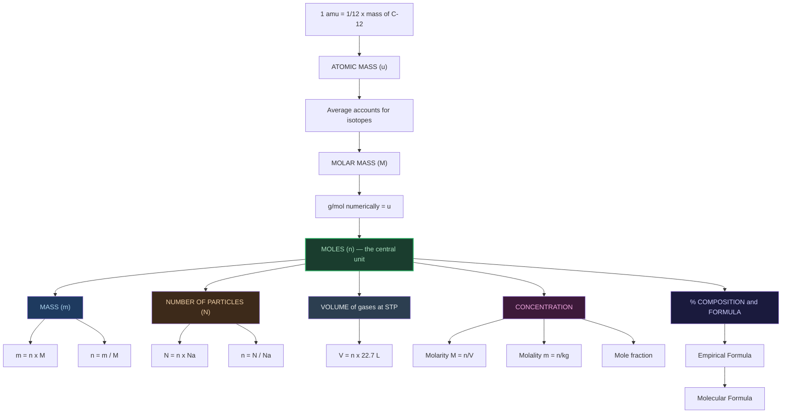
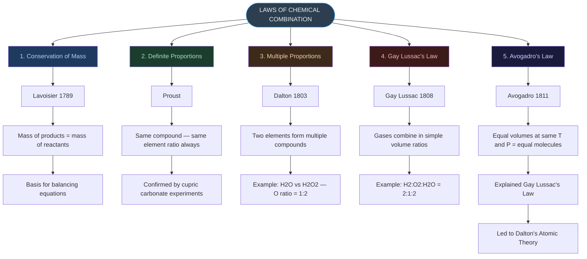
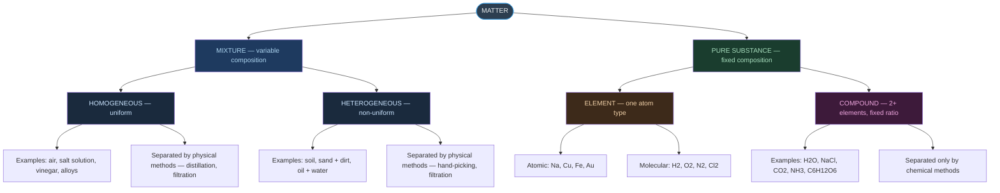
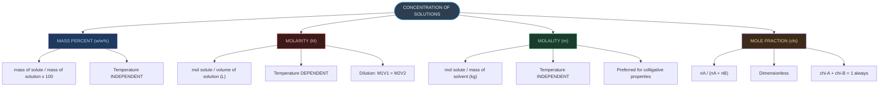
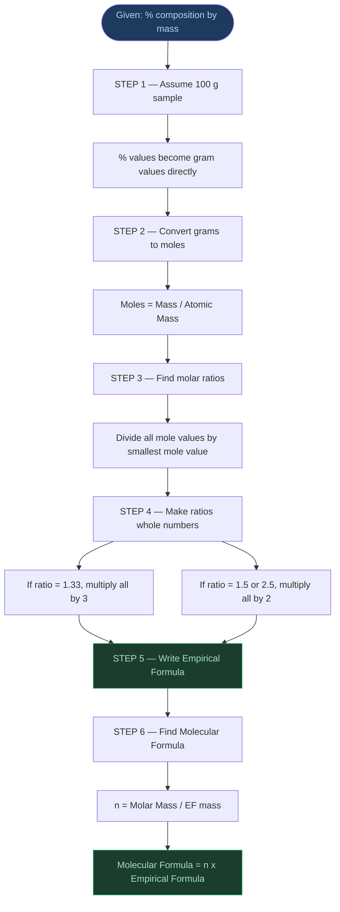
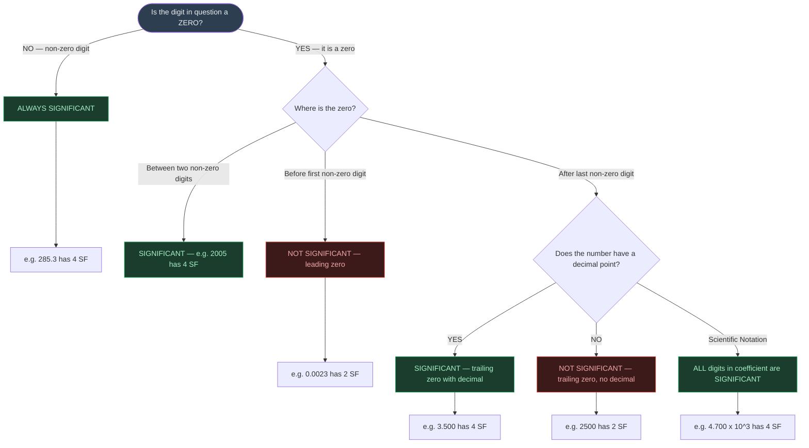

# ⚡ CHAPTER 1 — RAPID REVISION + MIND MAPS
> **Some Basic Concepts of Chemistry** | Board · NEET · JEE

---

## 🔬 Key Scientists & Their Contributions

| Scientist | Year | Contribution |
|:---|:---:|:---|
| Acharya Kanda | 600 BCE | Atomic theory (Paramānu) — 2500 yrs before Dalton |
| Antoine Lavoisier | 1789 | Law of Conservation of Mass |
| Joseph Proust | — | Law of Definite Proportions |
| John Dalton | 1803 | Law of Multiple Proportions + Atomic Theory |
| Gay Lussac | 1808 | Law of Gaseous Volumes |
| Amedeo Avogadro | 1811 | Avogadro's Law; atoms vs molecules distinction |
| Chakrapani | — | Mercury sulphide; first soap using mustard oil + alkali |
| Nagarjuna | — | Mercury compounds (Rasratnakar); metal extraction |

---

## ⚖️ Laws of Chemical Combination — At a Glance

| # | Law | Proposer | Key Statement |
|:---:|:---|:---|:---|
| 1 | Conservation of Mass | Lavoisier, 1789 | Reactant mass = Product mass. Matter never created or destroyed |
| 2 | Definite Proportions | Proust | A compound ALWAYS has same element ratio by mass |
| 3 | Multiple Proportions | Dalton, 1803 | Two elements → multiple compounds → O masses in ratio 16:32 = 1:2 |
| 4 | Gay Lussac's Law | Gay Lussac, 1808 | Gases combine in simple volume ratios at same T and P |
| 5 | Avogadro's Law | Avogadro, 1811 | Equal volumes of gases (same T and P) = equal number of molecules |

---

## ⚛️ Mole Concept — All Formulas

$$
n = \frac{m}{M} = \frac{N}{N_A} = \frac{V(\text{gas at STP})}{22.7 \text{ L}}
$$

- $N_A = 6.022 \times 10^{23} \text{ mol}^{-1}$ (Avogadro's constant)
- 1 amu = 1.66056 × 10⁻²⁴ g
- Molar mass (g mol⁻¹) = numerically equal to atomic/molecular mass in u

---

## 🧫 % Composition and Formula

$$
\text{Mass \% of element} = \frac{\text{Mass of element in 1 mol}}{\text{Molar mass of compound}} \times 100
$$

$$
n_{\text{(EF to MF)}} = \frac{\text{Molar Mass}}{\text{EF mass}} \quad \Rightarrow \quad \text{Molecular Formula} = n \times \text{EF}
$$

---

## 🔢 Significant Figures — Quick Rules

| Type of Digit | Significant? | Example | SF Count |
|:---|:---:|:---:|:---:|
| All non-zero digits | ✅ YES | 285 cm | 3 |
| Leading zeros | ❌ NO | 0.0052 | 2 |
| Zeros between non-zero digits | ✅ YES | 2005 | 4 |
| Trailing zeros WITH decimal | ✅ YES | 1.200 | 4 |
| Trailing zeros, no decimal | ❌ NO | 1200 | 2 |

> [!tip] Calculation Rules
> - **Add/Subtract** → match **decimal places** of least precise value
> - **Multiply/Divide** → match **SF count** of least precise value

---

## 💧 Solution Concentrations

| Type | Formula | Temp Dependent? |
|:---|:---|:---:|
| Molarity (M) | $n(\text{solute}) / V(L)$ | **YES** ⚠️ |
| Molality (m) | $n(\text{solute}) / \text{mass(kg of solvent)}$ | NO |
| Mole fraction (χ) | $n_A / (n_A + n_B)$ | NO |
| Mass % | mass(solute)/mass(solution) × 100 | NO |

**Dilution**: $M_1 V_1 = M_2 V_2$

---

---

# 🗺️ MIND MAP 1 — Big Picture of Chapter 1

---

# 🗺️ MIND MAP 2 — The Mole Concept (Central Hub)

---

# 🗺️ MIND MAP 3 — Laws of Chemical Combination

---

# 🗺️ MIND MAP 4 — Classification of Matter (Detailed)

---

# 🗺️ MIND MAP 5 — Dalton's Atomic Theory: Postulates, Successes and Failures

```mermaid
flowchart TD
    ROOT(["DALTON'S ATOMIC THEORY 1808"])

    ROOT --> POST["POSTULATES"]
    ROOT --> SUC["EXPLAINED"]
    ROOT --> FAIL["FAILED TO EXPLAIN"]

    POST --> P1["Atoms are indivisible"]
    POST --> P2["Same element = same mass"]
    POST --> P3["Fixed ratio of atoms forms compounds"]
    POST --> P4["Atoms rearrange in reactions — not created or destroyed"]

    SUC --> S1["Conservation of Mass"]
    SUC --> S2["Definite Proportions"]
    SUC --> S3["Multiple Proportions"]

    FAIL --> F1["Gay Lussac's Law of Gaseous Volumes"]
    FAIL --> F2["Isotopes — same element, different mass"]
    FAIL --> F3["Isobars — different elements, same mass"]
    FAIL --> F4["Why atoms combine — valence not explained"]
    FAIL --> F5["Atoms are NOT truly indivisible"]

    style ROOT fill:#2c3e50,color:#ecf0f1,stroke:#3498db
    style POST fill:#1e3a5f,color:#aed6f1
    style SUC fill:#1a3d2e,color:#a9dfbf,stroke:#27ae60
    style FAIL fill:#3d1a1a,color:#f5b7b1,stroke:#e74c3c
```

---

# 🗺️ MIND MAP 6 — Concentration of Solutions

> [!warning] Temperature Dependence Trap
> Only **Molarity** changes with temperature (because volume changes). Molality, mole fraction, and mass% are all temperature-independent.

---

# 🗺️ MIND MAP 7 — Empirical to Molecular Formula: Step by Step

---

# 🗺️ MIND MAP 8 — Significant Figures Decision Tree

---

*End of Rapid Revision + Mind Maps — Ch. 1: Some Basic Concepts of Chemistry*
*Exam Tags: Board · NEET · JEE Mains · JEE Advanced*