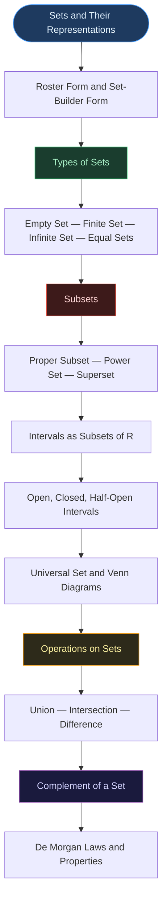

# 📐 CHAPTER 1 — SETS
> **Complete Study Notes** | Board · JEE Layered

---

## 🗺️ CONCEPT ROADMAP

---

## SECTION 1 — SETS AND THEIR REPRESENTATIONS

### 1.1 Definition of a Set

> [!info] Definition
> A **set** is a **well-defined collection of objects**. The objects in a set are called its **elements** or **members**.

The key word is **well-defined** — it must be possible to determine unambiguously whether any given object belongs to the collection or not.

**Well-defined (valid sets):**
- Collection of all months of a year beginning with J → {January, June, July}
- Collection of all prime numbers less than 10 → {2, 3, 5, 7}
- Collection of vowels in the English alphabet → {a, e, i, o, u}

**NOT well-defined (not sets):**
- "Ten most talented writers of India" — talent is subjective; different people choose differently
- "Five most dangerous animals" — 'most dangerous' is opinion-based

> [!note] Notation
> Sets are denoted by **capital letters** A, B, C, X, Y, Z, etc.
> Elements are denoted by **lowercase letters** a, b, c, x, y, z, etc.
>
> If $a$ is an element of set $A$: write $a \in A$ (read: "a belongs to A")
>
> If $b$ is not an element of set $A$: write $b \notin A$ (read: "b does not belong to A")

**Standard sets used throughout mathematics:**

| Symbol | Set |
|:---:|:---|
| $\mathbb{N}$ | Set of all natural numbers: $\{1, 2, 3, 4, \ldots\}$ |
| $\mathbb{Z}$ | Set of all integers: $\{\ldots, -2, -1, 0, 1, 2, \ldots\}$ |
| $\mathbb{Q}$ | Set of all rational numbers |
| $\mathbb{R}$ | Set of all real numbers |
| $\mathbb{Z}^+$ | Set of positive integers |
| $\mathbb{Q}^+$ | Set of positive rational numbers |
| $\mathbb{R}^+$ | Set of positive real numbers |

---

### 1.2 Two Methods of Representing a Set

#### Method 1 — Roster (Tabular) Form

All elements of the set are **listed**, separated by commas, inside **curly braces** $\{ \}$.

> [!important] Rules for Roster Form
> 1. Each element is listed **only once** (no repetition)
> 2. The **order of listing does not matter** — $\{1, 2, 3\} = \{3, 1, 2\}$
> 3. For infinite sets, use dots: $\{1, 3, 5, \ldots\}$

**Examples:**

| Set Description | Roster Form |
|:---|:---|
| Odd natural numbers less than 10 | $\{1, 3, 5, 7, 9\}$ |
| Vowels in English alphabet | $\{a, e, i, o, u\}$ |
| Letters in the word SCHOOL | $\{S, C, H, O, L\}$ (P and O not repeated) |
| Positive even integers | $\{2, 4, 6, 8, \ldots\}$ |
| Natural numbers dividing 42 | $\{1, 2, 3, 6, 7, 14, 21, 42\}$ |

---

#### Method 2 — Set-Builder Form

All elements of a set possess a **common property** that no element outside the set possesses. The form is:

$$A = \{x : P(x)\}$$

Read as: "A is the set of all x such that x satisfies property P."

> [!note] Notation Breakdown
> - The letter before the colon `:` is the **variable** (any letter works — x, y, z, n, etc.)
> - The colon `:` means "**such that**"
> - After the colon: write the **defining property**
> - Enclose everything in **curly braces**

**Examples:**

| Roster Form | Set-Builder Form |
|:---|:---|
| $\{1, 2, 3, 4, 5, 6\}$ | $\{x : x \in \mathbb{N},\ x \leq 6\}$ |
| $\{a, e, i, o, u\}$ | $\{x : x \text{ is a vowel in English alphabet}\}$ |
| $\{1, 4, 9, 16, 25, \ldots\}$ | $\{x : x = n^2, n \in \mathbb{N}\}$ |
| $\{2, 4, 6, 8, \ldots\}$ | $\{x : x \text{ is a positive even integer}\}$ |
| $\{\frac{1}{2}, \frac{2}{3}, \frac{3}{4}, \frac{4}{5}, \frac{5}{6}, \frac{6}{7}\}$ | $\{x : x = \frac{n}{n+1},\ n \in \mathbb{N},\ 1 \leq n \leq 6\}$ |

> [!tip] Exam Tip
> Both representations describe the same set. Conversion between them is a frequently tested skill. Always check: does the set-builder condition generate **exactly** the listed elements in roster form?

---

## SECTION 2 — TYPES OF SETS

### 2.1 The Empty Set

> [!important] Definition
> A set which contains **no elements** is called the **empty set** (also: null set or void set).
>
> **Denoted by:** $\phi$ or $\{\}$

**Examples of empty sets:**
- $A = \{x : 1 < x < 2,\ x \in \mathbb{N}\}$ — no natural number exists between 1 and 2
- $B = \{x : x^2 - 2 = 0,\ x \in \mathbb{Q}\}$ — $\sqrt{2}$ is irrational, not rational
- $C = \{x : x \text{ is an even prime greater than 2}\}$ — 2 is the only even prime
- $D = \{x : x^2 = 4,\ x \text{ is odd}\}$ — $x = \pm 2$, neither is odd

> [!warning] Common Error
> $\{0\}$ is **NOT** the empty set — it has one element (zero). The empty set has **no** elements at all.

---

### 2.2 Finite and Infinite Sets

> [!info] Definition
> - A set which is **empty** or contains a **definite (countable) number of elements** is called a **finite set**.
> - A set which is **not finite** (elements continue indefinitely) is called an **infinite set**.

The **number of elements** in a finite set $S$ is denoted $n(S)$ (also called the **cardinal number** of $S$).

**Examples:**

| Set | Finite or Infinite? | $n(S)$ |
|:---|:---:|:---:|
| $\{a, e, i, o, u\}$ | Finite | 5 |
| $\{x : x \in \mathbb{N},\ x \leq 100\}$ | Finite | 100 |
| $\mathbb{N}$ | Infinite | — |
| $\{x : x \in \mathbb{N},\ x \text{ is prime}\}$ | Infinite | — |
| $\phi$ | Finite | 0 |

> [!note] Note
> Not all infinite sets can be written in roster form. For example, $\mathbb{R}$ (real numbers) cannot be listed because its elements do not follow a pattern that can be continued with dots.

---

### 2.3 Equal Sets

> [!important] Definition
> Two sets $A$ and $B$ are said to be **equal** if they have **exactly the same elements**.
>
> Written as: $A = B$
>
> Equivalent condition: $A \subseteq B$ **and** $B \subseteq A \Leftrightarrow A = B$

> [!note] Key Facts
> - A set does not change if elements are repeated in description: $\{1, 2, 3\} = \{1, 1, 2, 3, 3\}$
> - Order does not matter: $\{1, 2, 3\} = \{3, 2, 1\}$

**Classic Example:**
- $C = \{x : x - 5 = 0\} = \{5\}$
- $E = \{x : x$ is a positive integral root of $x^2 - 2x - 15 = 0\} = \{5\}$
- Therefore $C = E$

---

## SECTION 3 — SUBSETS AND POWER SETS

### 3.1 Subsets

> [!important] Definition
> Set $A$ is a **subset** of set $B$ if **every element of $A$ is also an element of $B$**.
>
> Written as: $A \subseteq B$, read "A is a subset of B" or "A is contained in B"
>
> Formally: $A \subseteq B \iff (a \in A \Rightarrow a \in B)$
>
> If $A$ is not a subset of $B$: write $A \not\subseteq B$

**Key Properties of Subsets:**
- Every set is a subset of itself: $A \subseteq A$ *(reflexive)*
- The empty set is a subset of every set: $\phi \subseteq A$ for any set $A$
- If $A \subseteq B$ and $B \subseteq A$, then $A = B$

---

### 3.2 Proper Subsets and Supersets

> [!info] Definition
> - $A$ is a **proper subset** of $B$ if $A \subseteq B$ and $A \neq B$. Written: $A \subset B$
> - $B$ is a **superset** of $A$ if $A \subseteq B$. Written: $B \supseteq A$
> - A set with only one element is called a **singleton set**: $\{a\}$

**Examples:**
- $\{1, 2\} \subset \{1, 2, 3\}$ (proper subset)
- $\mathbb{N} \subset \mathbb{Z} \subset \mathbb{Q} \subset \mathbb{R}$
- $\mathbb{Q} \subset \mathbb{R}$, $\mathbb{T} \subset \mathbb{R}$ (where $\mathbb{T}$ = irrationals)
- $\mathbb{N} \not\subset \mathbb{T}$ (natural numbers are rational, not irrational)

> [!warning] Important Distinction — $\in$ vs $\subseteq$
> - $a \in A$ means $a$ is an **element** of $A$
> - $\{a\} \subseteq A$ means the **set** $\{a\}$ is a subset of $A$
> - An element of a set can **never** be a subset of itself
>
> Example: If $A = \{1, 2, \{3, 4\}, 5\}$:
> - $\{3, 4\} \in A$ ✅ (the set $\{3,4\}$ is an element)
> - $\{3, 4\} \subseteq A$ ❌ (because $3 \notin A$ and $4 \notin A$)
> - $\{\{3, 4\}\} \subseteq A$ ✅ (the set whose only element is $\{3,4\}$ is a subset)

---

### 3.3 Power Set ⭐ (JEE Important)

> [!important] Definition
> The **power set** of a set $A$ is the set of **all possible subsets** of $A$, including $\phi$ and $A$ itself.
>
> Written as: $P(A)$ or $2^A$
>
> **Key formula:** If $n(A) = m$, then $n(P(A)) = 2^m$

**Examples:**

For $A = \{a\}$: $P(A) = \{\phi, \{a\}\}$ → $n(P(A)) = 2^1 = 2$

For $A = \{a, b\}$: $P(A) = \{\phi, \{a\}, \{b\}, \{a, b\}\}$ → $n(P(A)) = 2^2 = 4$

For $A = \{-1, 0, 1\}$:

$$P(A) = \{\phi,\ \{-1\},\ \{0\},\ \{1\},\ \{-1, 0\},\ \{-1, 1\},\ \{0, 1\},\ \{-1, 0, 1\}\}$$

$n(P(A)) = 2^3 = 8$

> [!tip] JEE Tip
> Number of proper subsets of a set with $n$ elements $= 2^n - 1$
> (Excludes the set itself but includes $\phi$)
>
> Number of non-empty subsets $= 2^n - 1$
> (Excludes $\phi$ but includes the set itself)
>
> Number of non-empty proper subsets $= 2^n - 2$

---

## SECTION 4 — INTERVALS AS SUBSETS OF $\mathbb{R}$

Let $a, b \in \mathbb{R}$ with $a < b$. The **length** of any interval $(a, b)$ is $b - a$.

| Notation | Set Description | Type | Includes Endpoints? |
|:---:|:---|:---:|:---:|
| $(a, b)$ | $\{x \in \mathbb{R} : a < x < b\}$ | Open | Neither |
| $[a, b]$ | $\{x \in \mathbb{R} : a \leq x \leq b\}$ | Closed | Both |
| $[a, b)$ | $\{x \in \mathbb{R} : a \leq x < b\}$ | Half-open | Only $a$ |
| $(a, b]$ | $\{x \in \mathbb{R} : a < x \leq b\}$ | Half-open | Only $b$ |
| $[0, \infty)$ | $\{x \in \mathbb{R} : x \geq 0\}$ | Non-negative reals | 0 included |
| $(-\infty, 0)$ | $\{x \in \mathbb{R} : x < 0\}$ | Negative reals | Neither |
| $(-\infty, \infty)$ | All of $\mathbb{R}$ | Entire real line | — |

> [!important] Key Facts
> - Every interval contains **infinitely many** real numbers
> - On the number line: **open endpoint** = hollow circle; **closed endpoint** = filled circle
> - $\infty$ is **never** included in any interval — always use round brackets at $\pm\infty$

**Conversions to practise:**
- $\{x : x \in \mathbb{R},\ -5 < x \leq 7\}$ = $(-5, 7]$
- $[-3, 5)$ = $\{x : -3 \leq x < 5\}$
- $\{x : x \in \mathbb{R},\ 0 \leq x < 7\}$ = $[0, 7)$

---

## SECTION 5 — UNIVERSAL SET AND VENN DIAGRAMS

### 5.1 Universal Set

> [!info] Definition
> The **universal set** $U$ is the basic reference set for a given context — all sets under discussion are subsets of $U$.

**Examples:**
- Studying integers: $U = \mathbb{Q}$ or $U = \mathbb{R}$
- Studying triangles: $U$ = set of all geometric figures in a plane
- Human population studies: $U$ = set of all people in the world

---

### 5.2 Venn Diagrams

> [!note] About Venn Diagrams
> Named after English logician **John Venn (1834–1883)**. They represent sets visually using:
> - **Rectangle** → Universal set $U$
> - **Circles** (or closed curves) → Subsets of $U$
> - Elements may be written inside the regions

Venn diagrams are especially useful for visualising union, intersection, difference, and complement of sets.

---

## SECTION 6 — OPERATIONS ON SETS

### 6.1 Union of Sets

> [!important] Definition
> The **union** of sets $A$ and $B$ is the set of **all elements that are in $A$ or in $B$ (or both)**.
>
> $$A \cup B = \{x : x \in A \text{ or } x \in B\}$$
>
> Symbol: $\cup$ (cup)

**Example:** $A = \{2, 4, 6, 8\}$, $B = \{6, 8, 10, 12\}$

$$A \cup B = \{2, 4, 6, 8, 10, 12\}$$

(Common elements 6 and 8 appear **only once**)

**Properties of Union:**

| Property | Statement |
|:---|:---|
| Commutative | $A \cup B = B \cup A$ |
| Associative | $(A \cup B) \cup C = A \cup (B \cup C)$ |
| Identity element | $A \cup \phi = A$ |
| Idempotent | $A \cup A = A$ |
| Universal bound | $U \cup A = U$ |
| Subset relation | $A \subseteq B \Rightarrow A \cup B = B$ |

---

### 6.2 Intersection of Sets

> [!important] Definition
> The **intersection** of sets $A$ and $B$ is the set of **all elements common to both $A$ and $B$**.
>
> $$A \cap B = \{x : x \in A \text{ and } x \in B\}$$
>
> Symbol: $\cap$ (cap)

**Example:** $A = \{2, 4, 6, 8\}$, $B = \{6, 8, 10, 12\}$

$$A \cap B = \{6, 8\}$$

**Disjoint Sets:** If $A \cap B = \phi$, then $A$ and $B$ are called **disjoint sets**.

**Properties of Intersection:**

| Property | Statement |
|:---|:---|
| Commutative | $A \cap B = B \cap A$ |
| Associative | $(A \cap B) \cap C = A \cap (B \cap C)$ |
| Identity element | $U \cap A = A$ |
| Null element | $\phi \cap A = \phi$ |
| Idempotent | $A \cap A = A$ |
| Distributive | $A \cap (B \cup C) = (A \cap B) \cup (A \cap C)$ |

> [!tip] Also true: Union distributes over Intersection
> $$A \cup (B \cap C) = (A \cup B) \cap (A \cup C)$$

---

### 6.3 Difference of Sets

> [!important] Definition
> The **difference** of sets $A$ and $B$ (in this order) is the set of elements that belong to $A$ but **not** to $B$.
>
> $$A - B = \{x : x \in A \text{ and } x \notin B\}$$
>
> Also written: $A \setminus B$. Read as "A minus B."

> [!warning] Difference is NOT commutative
> $A - B \neq B - A$ in general.

**Example:** $A = \{1, 2, 3, 4, 5, 6\}$, $B = \{2, 4, 6, 8\}$

$$A - B = \{1, 3, 5\} \qquad B - A = \{8\}$$

> [!important] Partition Result
> For any two sets $A$ and $B$:
> The three sets $A - B$, $A \cap B$, and $B - A$ are **mutually disjoint** and together their union equals $A \cup B$.
>
> Also: $A = (A \cap B) \cup (A - B)$

---

## SECTION 7 — COMPLEMENT OF A SET AND DE MORGAN'S LAWS

### 7.1 Complement of a Set

> [!important] Definition
> Let $U$ be the universal set and $A \subseteq U$. The **complement** of $A$ with respect to $U$ is the set of all elements of $U$ that are **not in $A$**.
>
> $$A' = U - A = \{x : x \in U \text{ and } x \notin A\}$$

**Example:** $U = \{1, 2, 3, \ldots, 10\}$, $A = \{1, 3, 5, 7, 9\}$

$$A' = \{2, 4, 6, 8, 10\}$$

**Properties of Complement:**

| Property | Statement |
|:---|:---|
| Complement law 1 | $A \cup A' = U$ |
| Complement law 2 | $A \cap A' = \phi$ |
| Double complement | $(A')' = A$ |
| Universal set complement | $U' = \phi$ |
| Empty set complement | $\phi' = U$ |

---

### 7.2 De Morgan's Laws ⭐

> [!important] De Morgan's Laws — Must Memorise
> Named after British mathematician **Augustus De Morgan (1806–1871)**.
>
> **Law 1:** $(A \cup B)' = A' \cap B'$
>
> *"The complement of the union is the intersection of the complements."*
>
> **Law 2:** $(A \cap B)' = A' \cup B'$
>
> *"The complement of the intersection is the union of the complements."*

**Verification (Example):** $U = \{1,2,3,4,5,6\}$, $A = \{2,3\}$, $B = \{3,4,5\}$

- $A' = \{1,4,5,6\}$, $B' = \{1,2,6\}$
- $A \cup B = \{2,3,4,5\}$, so $(A \cup B)' = \{1,6\}$
- $A' \cap B' = \{1,6\}$ ✅ De Morgan Law 1 confirmed.

---

### 7.3 Useful Identities (JEE Level)

> [!note] Additional Set Identities
>
> $$A \cup (A \cap B) = A \quad \text{(Absorption Law)}$$
>
> $$A \cap (A \cup B) = A \quad \text{(Absorption Law)}$$
>
> $$A = (A \cap B) \cup (A - B)$$
>
> $$A \cup (B - A) = A \cup B$$
>
> $$n(A \cup B) = n(A) + n(B) - n(A \cap B)$$
>
> $$n(A \cup B \cup C) = n(A) + n(B) + n(C) - n(A \cap B) - n(B \cap C) - n(A \cap C) + n(A \cap B \cap C)$$

> [!important] Inclusion-Exclusion Principle
> The formula $n(A \cup B) = n(A) + n(B) - n(A \cap B)$ is used extensively in counting problems at Board and JEE level.

---

## SECTION 8 — COMPLETE PROPERTIES SUMMARY

### 8.1 Subset Relations

| If... | Then... |
|:---|:---|
| $A \subseteq B$ | $A \cup B = B$ |
| $A \subseteq B$ | $A \cap B = A$ |
| $A \subseteq B$ | $C - B \subseteq C - A$ |
| $A \subseteq B$ and $B \subseteq C$ | $A \subseteq C$ (transitivity) |
| $A \cup B = A \cap B$ | $A = B$ |

### 8.2 Conditions Equivalent to $A \subseteq B$

All four statements below are equivalent:

$$A \subseteq B \iff A - B = \phi \iff A \cup B = B \iff A \cap B = A$$

---

## SECTION 9 — BOARD AND JEE TIPS

> [!tip] Board Exam Focus
> - Know how to convert between roster and set-builder form
> - Empty set, finite/infinite classification
> - Subset vs proper subset (use correct symbols $\subseteq$ vs $\subset$)
> - Venn diagram questions on union, intersection, complement
> - Simple proofs using definitions (show $A \subseteq B$ by taking arbitrary element)
> - Inclusion-exclusion for word problems: $n(A \cup B) = n(A) + n(B) - n(A \cap B)$

> [!warning] JEE Additional Topics
> - Power set and counting subsets ($2^n$ formula)
> - Proving set identities (De Morgan, absorption, distributive)
> - Problems using all three set laws together
> - $A \cap B = A \cap C$ does NOT imply $B = C$ (needs counterexample)
> - $A \cup B = A \cup C$ does NOT imply $B = C$
> - But: $A \cup B = A \cup C$ AND $A \cap B = A \cap C$ together DO imply $B = C$

---

*End of Notes — Ch. 1: Sets*
*Exam Tags: Board · JEE Mains · JEE Advanced*