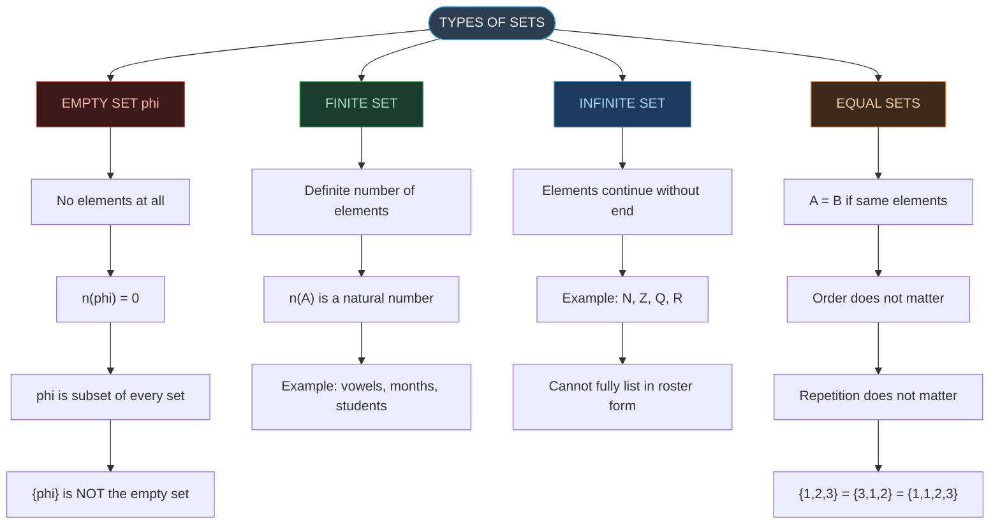
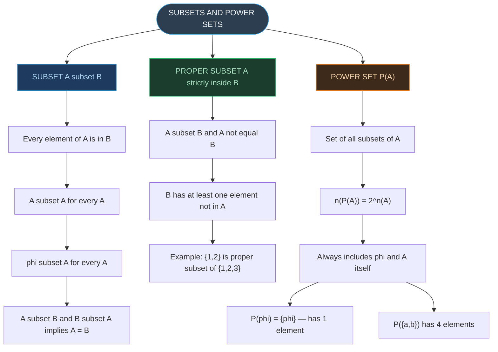
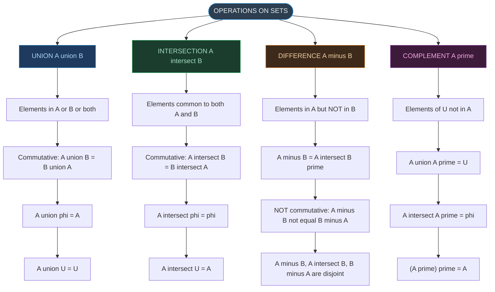
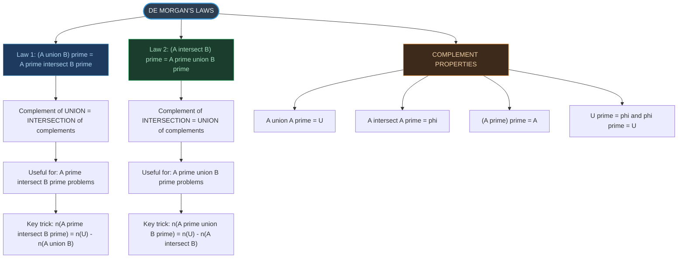
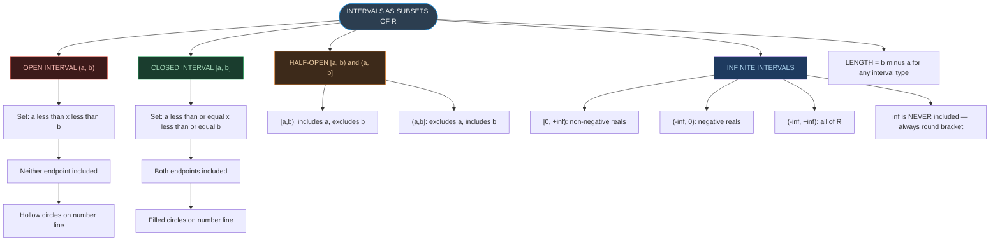
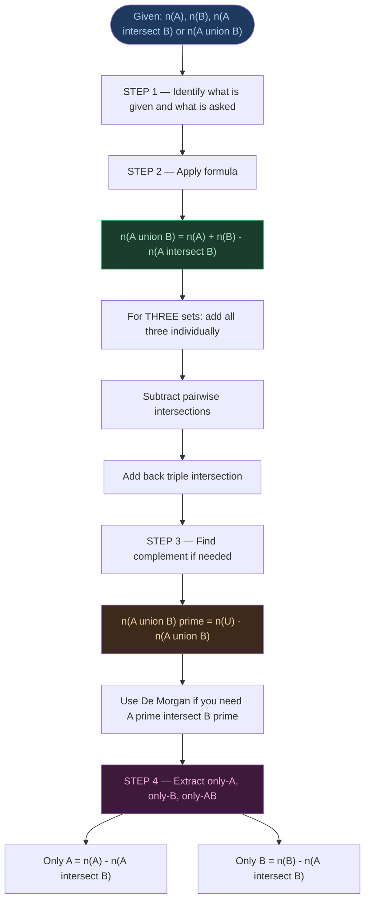
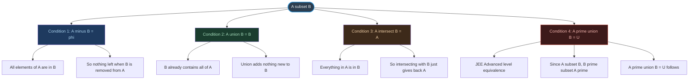

# ⚡ CHAPTER 1 — RAPID REVISION + MIND MAPS
> **Sets** | Board · JEE

---

## 🔬 Key Mathematicians & Their Contributions

| Mathematician | Period | Contribution |
|:---|:---:|:---|
| Georg Cantor | 1845–1918 | Founder of modern set theory; papers 1874–1897; showed reals cannot be listed 1-to-1 with integers |
| Richard Dedekind | 1831–1916 | Received and extended Cantor's work |
| Gottlob Frege | ~1900 | Presented set theory as principles of logic |
| Bertrand Russell | 1872–1970 | Showed (1902) that "set of all sets" leads to contradiction — Russell's Paradox |
| Ernst Zermelo | 1871–1953 | First axiomatisation of set theory (1908) |
| John Venn | 1834–1883 | Introduced Venn diagrams for visual representation of sets |

---

## ⚖️ Types of Sets — At a Glance

| Type | Defining Property | Example |
|:---|:---|:---|
| Empty Set $\phi$ | No elements | $\{x \in \mathbb{N} : 1 < x < 2\}$ |
| Singleton Set | Exactly one element | $\{0\}$, $\{5\}$ |
| Finite Set | Countable number of elements | $\{a, e, i, o, u\}$, $n = 5$ |
| Infinite Set | Unlimited elements | $\mathbb{N}$, $\mathbb{Z}$, $\mathbb{R}$ |
| Equal Sets | Exactly the same elements | $\{1,2,3\} = \{3,2,1\}$ |
| Disjoint Sets | No common elements; $A \cap B = \phi$ | Even and odd integers |
| Universal Set $U$ | Contains all sets in context | Shown as rectangle in Venn |

---

## 🔢 Subsets and Power Sets — Quick Rules

$$n(A) = m \implies n(P(A)) = 2^m$$

| Count | Formula |
|:---|:---:|
| Total subsets | $2^n$ |
| Proper subsets | $2^n - 1$ |
| Non-empty subsets | $2^n - 1$ |
| Non-empty proper subsets | $2^n - 2$ |

---

## 🧮 Set Operations — All Formulas

$$n(A \cup B) = n(A) + n(B) - n(A \cap B)$$

$$n(A \cup B \cup C) = n(A) + n(B) + n(C) - n(A \cap B) - n(B \cap C) - n(A \cap C) + n(A \cap B \cap C)$$

$$A - B = A \cap B'$$

$$A = (A \cap B) \cup (A - B)$$

$$A \cup (B - A) = A \cup B$$

---

## 📏 Intervals — Quick Reference

| Notation | Type | Endpoints Included? |
|:---:|:---:|:---:|
| $(a, b)$ | Open | Neither |
| $[a, b]$ | Closed | Both |
| $[a, b)$ | Half-open | Only $a$ |
| $(a, b]$ | Half-open | Only $b$ |
| $[0, \infty)$ | Non-negative reals | 0 only |
| $(-\infty, \infty)$ | All of $\mathbb{R}$ | — |

> [!tip] Number Line Convention
> **Hollow circle** = open endpoint (not included)
> **Filled circle** = closed endpoint (included)
> $\infty$ is **never** included — always use round bracket at $\pm\infty$

---

## 🧩 De Morgan's Laws + Properties Summary

| Property | Formula |
|:---|:---|
| De Morgan 1 | $(A \cup B)' = A' \cap B'$ |
| De Morgan 2 | $(A \cap B)' = A' \cup B'$ |
| Double complement | $(A')' = A$ |
| Complement of $U$ | $U' = \phi$ |
| Complement of $\phi$ | $\phi' = U$ |
| Complement law 1 | $A \cup A' = U$ |
| Complement law 2 | $A \cap A' = \phi$ |
| Absorption 1 | $A \cup (A \cap B) = A$ |
| Absorption 2 | $A \cap (A \cup B) = A$ |

> [!warning] Most Common Error in Exams
> Students often write $(A \cup B)' = A' \cup B'$ — this is **WRONG**.
> The complement of a **union** is an **intersection**: $(A \cup B)' = A' \cap B'$

---

---

# 🗺️ MIND MAP 1 — Big Picture of Chapter 1

```mermaid
flowchart TD
    ROOT(["SETS"])

    ROOT --> DEF["DEFINITION"]
    ROOT --> REP["REPRESENTATION"]
    ROOT --> TYPES["TYPES OF SETS"]
    ROOT --> REL["RELATIONS BETWEEN SETS"]
    ROOT --> OPS["OPERATIONS ON SETS"]

    DEF --> D1["Well-defined collection of objects"]
    DEF --> D2["Elements denoted by lowercase letters"]

    REP --> R1["Roster Form — list all elements"]
    REP --> R2["Set-Builder Form — describe property"]

    TYPES --> T1["Empty Set — phi"]
    TYPES --> T2["Finite Set — countable elements"]
    TYPES --> T3["Infinite Set — uncountable"]
    TYPES --> T4["Equal Sets — same elements"]
    TYPES --> T5["Singleton Set — one element"]

    REL --> RL1["Subset — A subset B"]
    REL --> RL2["Proper Subset — A strictly inside B"]
    REL --> RL3["Power Set — all subsets of A"]
    REL --> RL4["Universal Set — reference set U"]

    OPS --> O1["Union — A union B"]
    OPS --> O2["Intersection — A intersect B"]
    OPS --> O3["Difference — A minus B"]
    OPS --> O4["Complement — A prime"]

    style ROOT fill:#2c3e50,color:#ecf0f1,stroke:#3498db,stroke-width:2px
    style DEF fill:#1e3a5f,color:#aed6f1,stroke:#2980b9
    style TYPES fill:#1a3d2e,color:#a9dfbf,stroke:#27ae60
    style OPS fill:#3d2a1a,color:#f0d0a8,stroke:#e67e22
    style REL fill:#3d1a3a,color:#f0a8e0,stroke:#8e44ad
```

---

# 🗺️ MIND MAP 2 — Types of Sets (Detailed)

---

# 🗺️ MIND MAP 3 — Subsets and Power Sets

---

# 🗺️ MIND MAP 4 — Operations on Sets

---

# 🗺️ MIND MAP 5 — De Morgan's Laws and Complement Properties

---

# 🗺️ MIND MAP 6 — Intervals as Subsets of R

---

# 🗺️ MIND MAP 7 — Inclusion-Exclusion Principle (Step by Step)

---

# 🗺️ MIND MAP 8 — Subset Conditions Equivalence

---

*End of Rapid Revision + Mind Maps — Ch. 1: Sets*
*Exam Tags: Board · JEE Mains · JEE Advanced*