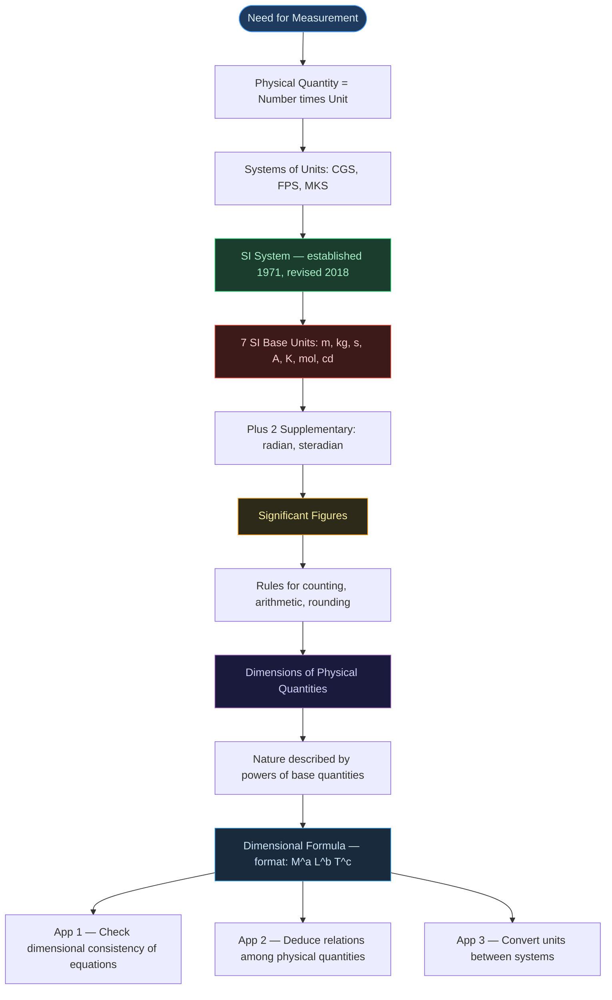
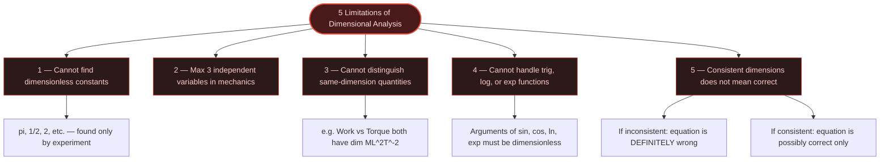

# ⚛️ CHAPTER 1 — UNITS AND MEASUREMENT
> **Complete Study Notes** | Board · NEET · JEE Layered

---

## 🗺️ CONCEPT ROADMAP

---

## SECTION 1 — INTRODUCTION TO MEASUREMENT & SI UNITS

### 1.1 Why Measurement?

> [!info] Definition
> **Physical Quantity** = A quantity that can be measured. Its measurement involves comparison with a chosen reference standard called a **unit**.
> 
> $$\text{Result of Measurement} = \text{Numerical Value} \times \text{Unit}$$

- Example: Length of a rod = 5.2 m → numerical value = 5.2, unit = metre
- Only a **limited number of units** are needed because quantities are interrelated
- **Fundamental (Base) Quantities** → independent units = **Fundamental / Base Units**
- **Derived Quantities** → combinations of base quantities = **Derived Units**
- Complete set (base + derived) = a **System of Units**

---

### 1.2 Historical Systems of Units

| System | Length | Mass | Time |
|:---:|:---:|:---:|:---:|
| **CGS** | centimetre | gram | second |
| **FPS** *(British)* | foot | pound | second |
| **MKS** | metre | kilogram | second |

> [!note] The Modern Standard
> The internationally accepted system is **SI** (*Système Internationale d'Unités*). Developed by **BIPM** (Bureau International des Poids et Mesures), established in **1971** by the 14th CGPM, and comprehensively revised in **November 2018** — all base units now defined using fundamental constants of nature.

---

### 1.3 The Seven SI Base Units ⭐

| Base Physical Quantity        | SI Unit  | Symbol  | Defined Using                                                                    |
| :---------------------------- | :------: | :-----: | :------------------------------------------------------------------------------- |
| **Length**                    |  metre   |  **m**  | Speed of light in vacuum $c = 299{,}792{,}458 \text{ m s}^{-1}$                  |
| **Mass**                      | kilogram | **kg**  | Planck constant $h = 6.62607015 \times 10^{-34} \text{ J·s}$                     |
| **Time**                      |  second  |  **s**  | Caesium-133 hyperfine transition frequency $= 9{,}192{,}631{,}770 \text{ Hz}$    |
| **Electric current**          |  ampere  |  **A**  | Elementary charge $e = 1.602176634 \times 10^{-19} \text{ C}$                    |
| **Thermodynamic temperature** |  kelvin  |  **K**  | Boltzmann constant $k = 1.380649 \times 10^{-23} \text{ J K}^{-1}$               |
| **Amount of substance**       |   mole   | **mol** | Avogadro constant $N_A = 6.02214076 \times 10^{23} \text{ mol}^{-1}$             |
| **Luminous intensity**        | candela  | **cd**  | Luminous efficacy of $540 \times 10^{12}$ Hz radiation $= 683 \text{ lm W}^{-1}$ |

> [!warning] Board Trap — Capitalisation Rules
> Unit **names** are always lowercase (metre, kelvin, ampere). Unit **symbols** are capitalised **only** when named after a person:
> - Named after person → **A** (Ampere), **K** (Kelvin), **N** (Newton)
> - Not named after person → **m** (metre), **kg** (kilogram), **s** (second)

---

### 1.4 Two Supplementary Units (Dimensionless)

| Quantity | Unit | Symbol | Definition |
|:---|:---:|:---:|:---|
| **Plane angle** | radian | rad | $d\theta = \dfrac{\text{arc length } ds}{\text{radius } r}$ |
| **Solid angle** | steradian | sr | $d\Omega = \dfrac{\text{intercepted area } dA}{r^2}$ |

Both are **dimensionless** — $[M^0 L^0 T^0]$. Full circle $= 2\pi$ rad; full sphere $= 4\pi$ sr.

---

### 1.5 Some Units Retained for General Use *(Outside SI)*

| Name | Symbol | SI Equivalent |
|:---|:---:|:---|
| Minute | min | 60 s |
| Hour | h | 3600 s |
| Day | d | 86400 s |
| Year | y | $3.156 \times 10^7$ s |
| Degree | ° | $(\pi/180)$ rad |
| Litre | L | $10^{-3}$ m³ |
| Tonne | t | $10^3$ kg |
| Bar | bar | $0.1 \text{ MPa} = 10^5 \text{ Pa}$ |
| Barn | b | $10^{-28}$ m² *(nuclear cross-section)* |
| Hectare | ha | $1 \text{ hm}^2 = 10^4 \text{ m}^2$ |
| Standard atm. pressure | atm | $101325 \text{ Pa} = 1.013 \times 10^5 \text{ Pa}$ |
| Ångström | Å | $10^{-10}$ m |

---

### 1.6 SI Prefixes ⭐

| Prefix | Symbol | Power | | Prefix | Symbol | Power |
|:---:|:---:|:---:|:---:|:---:|:---:|:---:|
| tera | T | $10^{12}$ | | deci | d | $10^{-1}$ |
| giga | G | $10^9$ | | centi | c | $10^{-2}$ |
| mega | M | $10^6$ | | milli | m | $10^{-3}$ |
| kilo | k | $10^3$ | | micro | μ | $10^{-6}$ |
| hecto | h | $10^2$ | | nano | n | $10^{-9}$ |
| deka | da | $10^1$ | | pico | p | $10^{-12}$ |
| — | — | — | | femto | f | $10^{-15}$ |
| — | — | — | | atto | a | $10^{-18}$ |

> [!tip] JEE/NEET — Squared/Cubed Prefix Trap
> Squaring or cubing a unit squares/cubes the prefix factor too:
> $$1 \text{ km}^2 = (10^3 \text{ m})^2 = 10^6 \text{ m}^2 \qquad 1 \text{ cm}^3 = (10^{-2} \text{ m})^3 = 10^{-6} \text{ m}^3$$

---

## SECTION 2 — SIGNIFICANT FIGURES

### 2.1 What are Significant Figures?

> [!info] Definition
> **Significant Figures (SF)** = All digits in a measurement that are **known with certainty PLUS the first uncertain (estimated) digit**.
> 
> They indicate the **precision** of measurement, which depends on the **least count** of the instrument.

> [!important] Key Principle
> A change in **units** does **NOT** change the number of significant figures.
> $$2.308 \text{ cm} = 0.02308 \text{ m} = 23.08 \text{ mm} \longrightarrow \text{ALL have 4 SF}$$

---

### 2.2 Rules for Counting Significant Figures ⭐

| Rule | Guideline | Examples | SF Count |
|:---:|:---|:---:|:---:|
| **1** | All **non-zero digits** are significant | 285.3 | 4 |
| **2** | Zeros **between** two non-zero digits are significant | 2005 / 80.04 | 4 / 4 |
| **3** | **Leading zeros** (before first non-zero digit) are **NOT** significant | 0.00230 / 0.007 | 3 / 1 |
| **4** | Trailing zeros **without decimal point** are **NOT** significant | 12300 / 400 | 3 / 1 |
| **5** | Trailing zeros **with decimal point** ARE significant | 3.500 / 0.0600 | 4 / 3 |
| **6** | Exact numbers & formula constants have **infinite** SF | $2$ in $2\pi r$, $n$ in $T = t/n$ | ∞ |

> [!warning] Trailing Zero Ambiguity → Use Scientific Notation
> $4700$ m (2 SF? or 4 SF?) is ambiguous. In scientific notation:
> - $4.7 \times 10^3$ m → **2 SF** ✅
> - $4.700 \times 10^3$ m → **4 SF** ✅
> 
> *All zeros in the coefficient of scientific notation ARE significant.*

---

### 2.3 Scientific Notation and Order of Magnitude

Every number expressed as $N \times 10^n$ where $1 \leq N < 10$

**Order of Magnitude** = $n$, where:

$$\text{If } N \leq 5 \Rightarrow \text{round to } 1 \quad;\quad \text{If } N > 5 \Rightarrow \text{round to } 10$$

| Quantity | Value | Order of Magnitude |
|:---|:---:|:---:|
| Diameter of Earth | $1.28 \times 10^7$ m | **7** |
| Diameter of H atom | $1.06 \times 10^{-10}$ m | **−10** |
| Difference | — | **17 orders** |

---

### 2.4 Rules for Arithmetic Operations with SF ⭐

> [!example] Addition / Subtraction
> **Final result retains as many decimal places as the number with the LEAST decimal places.**
> 
> $$436.32 \text{ g} \;+\; 227.2 \text{ g} \;+\; 0.301 \text{ g} = 663.821 \text{ g} \xrightarrow{\text{round}} \boxed{663.8 \text{ g}}$$
> *(Limited by 227.2 which has only 1 decimal place)*

> [!example] Multiplication / Division
> **Final result retains as many SF as the number with the LEAST significant figures.**
> 
> $$\text{Density} = \frac{4.237 \text{ g}}{2.51 \text{ cm}^3} = 1.68804\ldots \xrightarrow{3 \text{ SF}} \boxed{1.69 \text{ g cm}^{-3}}$$
> *(Limited by 2.51 cm³ which has 3 SF)*

> [!danger] Never Mix the Rules
> Addition/subtraction → decimal places. Multiplication/division → SF count. These rules are NOT interchangeable.

---

### 2.5 Rules for Rounding Off ⭐

| Digit to be Dropped | Action on Preceding Digit | Example |
|:---:|:---:|:---:|
| $> 5$ | Raise by 1 | $2.746 \rightarrow 2.75$ |
| $< 5$ | Leave unchanged | $1.743 \rightarrow 1.74$ |
| $= 5$ (preceding digit is **even**) | Drop (leave unchanged) | $2.745 \rightarrow 2.74$ |
| $= 5$ (preceding digit is **odd**) | Raise by 1 | $2.735 \rightarrow 2.74$ |

> [!tip] JEE Multi-Step Calculations
> Retain **one extra digit** in intermediate steps to avoid cumulative rounding errors. Round only the **final answer**.

---

### 2.6 Relative Error & Uncertainty

For measured quantities $l = 16.2 \pm 0.1$ cm and $b = 10.1 \pm 0.1$ cm:

$$l = 16.2 \text{ cm} \pm 0.6\% \qquad b = 10.1 \text{ cm} \pm 1\%$$

$$\text{Area} = lb = 163.62 \text{ cm}^2 \pm 1.6\% = 163.62 \pm 2.6 \text{ cm}^2 \approx \boxed{164 \pm 3 \text{ cm}^2}$$

**Relative Error** formula:
$$\text{Relative Error} = \frac{\Delta A}{\bar{A}} \times 100\%$$

| Measurement | Absolute Error | Relative Error |
|:---:|:---:|:---:|
| 1.02 g | ±0.01 g | **±1%** |
| 9.89 g | ±0.01 g | **±0.1%** |

---

## SECTION 3 — DIMENSIONS OF PHYSICAL QUANTITIES

### 3.1 What are Dimensions?

> [!info] Definition
> **Dimensions** = the **powers (exponents)** to which base quantities are raised to represent a physical quantity. Written with **square brackets [ ]**.

| Base Quantity | Dimension Symbol |
|:---|:---:|
| Length | **$[L]$** |
| Mass | **$[M]$** |
| Time | **$[T]$** |
| Electric current | **$[A]$** |
| Thermodynamic temperature | **$[K]$** |
| Luminous intensity | **$[cd]$** |
| Amount of substance | **$[mol]$** |

> [!note] In **mechanics**, all quantities are expressible using only **$[M]$, $[L]$, $[T]$**.

---

### 3.2 Dimensional Formulae of Common Physical Quantities ⭐

| Quantity | Derivation | Dimensional Formula |
|:---|:---|:---:|
| Velocity / Speed | Length / Time | $[M^0 L T^{-1}]$ |
| Acceleration | Velocity / Time | $[M^0 L T^{-2}]$ |
| Force | $F = ma$ | $[M L T^{-2}]$ |
| Work / Energy | Force × Length | $[M L^2 T^{-2}]$ |
| Power | Work / Time | $[M L^2 T^{-3}]$ |
| Momentum | $p = mv$ | $[M L T^{-1}]$ |
| Impulse | Force × Time | $[M L T^{-1}]$ |
| Density | Mass / Volume | $[M L^{-3} T^0]$ |
| Pressure | Force / Area | $[M L^{-1} T^{-2}]$ |
| Torque | Force × Arm | $[M L^2 T^{-2}]$ |
| Frequency | $1/\text{Time}$ | $[M^0 L^0 T^{-1}]$ |
| Angular velocity | Angle / Time | $[M^0 L^0 T^{-1}]$ |
| Gravitational constant G | $Fr^2 / m_1 m_2$ | $[M^{-1} L^3 T^{-2}]$ |
| Planck's constant h | $E / f$ | $[M L^2 T^{-1}]$ |
| Boltzmann constant k | $E / T$ | $[M L^2 T^{-2} K^{-1}]$ |
| Surface tension | Force / Length | $[M T^{-2}]$ |
| Coefficient of viscosity | F / (A × vel. gradient) | $[M L^{-1} T^{-1}]$ |

> [!tip] JEE/NEET Shortcut
> Work, Energy, Torque, and Heat all share the formula $[ML^2T^{-2}]$ but are fundamentally different. Dimensions alone **cannot distinguish** between them.

---

### 3.3 Dimension Twins ⭐ *(Same formula, different quantities — frequently tested)*

| Dimensional Formula | Physical Quantities |
|:---:|:---|
| $[M L T^{-1}]$ | Momentum, Impulse |
| $[M L^2 T^{-2}]$ | Work, Energy, Torque, Heat |
| $[T^{-1}]$ | Frequency, Angular velocity, Radioactive decay constant |
| $[M L^{-1} T^{-2}]$ | Pressure, Stress, Modulus of Elasticity, Energy density |
| $[M L^2 T^{-3}]$ | Power, Intensity of sound |
| $[M^0 L^0 T^0]$ | Angle, Strain, Refractive index *(all dimensionless)* |

---

### 3.4 Dimensionless Quantities

Quantities with $[M^0 L^0 T^0]$:

- Plane angle $(L/L)$
- Refractive index (speed/speed)
- Relative density
- Strain $(\Delta L / L)$
- All pure numbers, ratios, trigonometric values

> [!important] Arguments of special functions — $\sin$, $\cos$, $\log$, $\exp$ — **must always be dimensionless**.

---

## SECTION 4 — DIMENSIONAL FORMULA & DIMENSIONAL EQUATION

### 4.1 Dimensional Formula

Format: $[M^a \; L^b \; T^c \; A^d \; K^e \; \ldots]$

| Physical Quantity | Dimensional Formula |
|:---|:---:|
| Volume | $[M^0 L^3 T^0]$ |
| Speed / Velocity | $[M^0 L T^{-1}]$ |
| Force | $[M L T^{-2}]$ |
| Mass density | $[M L^{-3} T^0]$ |

### 4.2 Dimensional Equation

Equating a physical quantity to its dimensional formula:

$$[V] = [M^0 L^3 T^0]$$
$$[v] = [M^0 L T^{-1}]$$
$$[F] = [M L T^{-2}]$$
$$[\rho] = [M L^{-3} T^0]$$

---

## SECTION 5 — DIMENSIONAL ANALYSIS AND ITS APPLICATIONS

### 5.1 Principle of Homogeneity of Dimensions

> [!important] Principle
> Only physical quantities with **identical dimensions** can be added, subtracted, or equated. An equation is dimensionally valid only if **every term on both sides has the same dimensions**.

$$\underbrace{v}_{\scriptscriptstyle [LT^{-1}]} = \underbrace{u}_{\scriptscriptstyle [LT^{-1}]} + \underbrace{at}_{\scriptscriptstyle [LT^{-2}][T] = [LT^{-1}]} \quad \checkmark$$

$$\underbrace{F}_{\scriptscriptstyle [MLT^{-2}]} + \underbrace{m}_{\scriptscriptstyle [M]} = \; ? \quad \text{INVALID} \; \times$$

---

### 5.2 Application 1 — Checking Dimensional Consistency ⭐

**Steps:**
1. Write dimensional formula for every term
2. Check if ALL terms have identical dimensions
3. Different dimensions → equation is **definitely wrong**

> [!example] NCERT — Checking $\dfrac{1}{2}mv^2 = mgh$
> 
> **LHS:** $\frac{1}{2}mv^2 = [M][LT^{-1}]^2 = [ML^2T^{-2}]$
> 
> **RHS:** $mgh = [M][LT^{-2}][L] = [ML^2T^{-2}]$
> 
> LHS = RHS → **Dimensionally correct** ✅

> [!example] NCERT — Ruling out kinetic energy formulae
> 
> | Formula | Dimensions of RHS | Valid? |
> |:---|:---:|:---:|
> | $K = m^2 v^3$ | $[M^2 L^3 T^{-3}]$ | ❌ |
> | $K = \frac{1}{2}mv^2$ | $[ML^2T^{-2}]$ | ✅ |
> | $K = ma$ | $[MLT^{-2}]$ | ❌ |
> | $K = \frac{3}{16}mv^2$ | $[ML^2T^{-2}]$ | ✅ (can't distinguish from $\frac{1}{2}mv^2$) |
> | $K = \frac{1}{2}mv^2 + ma$ | Two different dimensions added | ❌ |

> [!warning] Critical Limitation
> Dimensional consistency does **NOT** guarantee physical correctness. E.g., $s = 5ut + at^2$ is dimensionally correct but physically wrong (correct is $s = ut + \tfrac{1}{2}at^2$).

---

### 5.3 Application 2 — Deducing Relations ⭐

Assume $Q = k \cdot x^a \cdot y^b \cdot z^c$ where $k$ is a dimensionless constant.

**Steps:** Write dim. formula → equate powers of $[M]$, $[L]$, $[T]$ → solve for $a, b, c$

> [!example] NCERT — Period of a Simple Pendulum
> Assume $T = k \cdot l^x \cdot g^y \cdot m^z$
>
> $$[M^0 L^0 T^1] = [L]^x \cdot [LT^{-2}]^y \cdot [M]^z = M^z \cdot L^{x+y} \cdot T^{-2y}$$
> 
> Equating powers:
> 
> | Dimension | Equation | Solution |
> |:---:|:---:|:---:|
> | $[M]$ | $z = 0$ | $z = 0$ ← **period is mass-independent!** |
> | $[L]$ | $x + y = 0$ | $x = \tfrac{1}{2}$ |
> | $[T]$ | $-2y = 1$ | $y = -\tfrac{1}{2}$ |
> 
> $$\therefore T = k\sqrt{\frac{l}{g}} \quad \Bigl(k = 2\pi \text{ found experimentally}\Bigr)$$

---

### 5.4 Application 3 — Unit Conversion ⭐

$$n_2 = n_1 \times \left[\frac{M_1}{M_2}\right]^a \times \left[\frac{L_1}{L_2}\right]^b \times \left[\frac{T_1}{T_2}\right]^c$$

> [!example] Convert 1 km h⁻¹ to m s⁻¹
> $$1 \text{ km h}^{-1} = 1 \times \frac{1000 \text{ m}}{3600 \text{ s}} = \frac{5}{18} \text{ m s}^{-1} \approx 0.278 \text{ m s}^{-1}$$

> [!example] NCERT — 1 calorie in new units (α kg, β m, γ s)
> $[E] = [ML^2T^{-2}]$, so $a=1, b=2, c=-2$:
> $$n_2 = 4.2 \times \frac{1}{\alpha} \times \frac{1}{\beta^2} \times \gamma^2 = 4.2 \; \alpha^{-1} \beta^{-2} \gamma^2$$

---

### 5.5 Limitations of Dimensional Analysis

---

## SECTION 6 — IMPORTANT PHYSICAL CONSTANTS

| Constant | Symbol | Value |
|:---|:---:|:---|
| Speed of light in vacuum | $c$ | $3.00 \times 10^8 \text{ m s}^{-1}$ |
| Avogadro's number | $N_A$ | $6.022 \times 10^{23} \text{ mol}^{-1}$ |
| Planck's constant | $h$ | $6.626 \times 10^{-34} \text{ J s}$ |
| Boltzmann constant | $k$ | $1.381 \times 10^{-23} \text{ J K}^{-1}$ |
| Charge of electron | $e$ | $1.602 \times 10^{-19} \text{ C}$ |
| Mass of electron | $m_e$ | $9.109 \times 10^{-31} \text{ kg}$ |
| Mass of proton | $m_p$ | $1.673 \times 10^{-27} \text{ kg}$ |
| Universal gravitational constant | $G$ | $6.674 \times 10^{-11} \text{ N m}^2 \text{ kg}^{-2}$ |
| 1 Ångström | Å | $10^{-10}$ m |
| 1 fermi / femtometre | fm | $10^{-15}$ m |
| 1 light year | ly | $9.46 \times 10^{15}$ m |

---

## SECTION 7 — WORKED EXAMPLES (NCERT)

> [!example] Example 7.1 — Surface Area and Volume (NCERT 1.1)
> Side of cube = 7.203 m → **4 SF**
> 
> $$\text{Surface area} = 6 \times (7.203)^2 = 311.299\ldots \text{ m}^2 \xrightarrow{4 \text{ SF}} \boxed{311.3 \text{ m}^2}$$
> 
> $$\text{Volume} = (7.203)^3 = 373.714\ldots \text{ m}^3 \xrightarrow{4 \text{ SF}} \boxed{373.7 \text{ m}^3}$$

> [!example] Example 7.2 — Density (NCERT 1.2)
> Mass = 5.74 g (3 SF) | Volume = 1.2 cm³ (2 SF)
> 
> $$\text{Density} = \frac{5.74}{1.2} = 4.783\ldots \text{ g cm}^{-3} \xrightarrow{2 \text{ SF}} \boxed{4.8 \text{ g cm}^{-3}}$$

> [!example] Example 7.3 — Unit Conversion (NCERT 1.3)
> 1 calorie = 4.2 J = 4.2 kg m² s⁻². New system: mass unit = α kg, length = β m, time = γ s.
> 
> $[E] = [M^1 L^2 T^{-2}]$
> 
> $$n_2 = 4.2 \times \left(\frac{1}{\alpha}\right)^1 \times \left(\frac{1}{\beta}\right)^2 \times \left(\frac{1}{\gamma}\right)^{-2} = \boxed{4.2 \; \alpha^{-1} \beta^{-2} \gamma^2}$$

---

## QUICK FORMULA REFERENCE

| Topic | Formula / Rule |
|:---|:---|
| SF — Addition/Subtraction | Match **decimal places** of least precise number |
| SF — Multiplication/Division | Match **SF count** of least precise number |
| Rounding (digit = 5) | Round to **even** preceding digit (banker's rounding) |
| Scientific notation | $N \times 10^n$ where $1 \leq N < 10$ |
| Order of magnitude | $n$ (round $N$: $\leq 5 \to 1$, $>5 \to 10$) |
| $[F]$ | $[MLT^{-2}]$ |
| $[E]$ or $[W]$ | $[ML^2T^{-2}]$ |
| $[P]$ | $[ML^2T^{-3}]$ |
| $[\text{Pressure}]$ | $[ML^{-1}T^{-2}]$ |
| $[G]$ | $[M^{-1}L^3T^{-2}]$ |
| $[h]$ | $[ML^2T^{-1}]$ |
| Unit conversion | $n_2 = n_1 \times (u_1/u_2)$ in each dimension |
| Pendulum period | $T \propto \sqrt{l/g}$ |
| Relative error | $\dfrac{\Delta A}{\bar{A}} \times 100\%$ |
| 1 km h⁻¹ | $= \dfrac{5}{18}$ m s⁻¹ $\approx 0.278$ m s⁻¹ |
| 1 m s⁻¹ | $= \dfrac{18}{5} = 3.6$ km h⁻¹ |

---

*End of Core Notes — Ch. 1: Units and Measurement*
*Exam Tags: Board · NEET · JEE Mains · JEE Advanced*