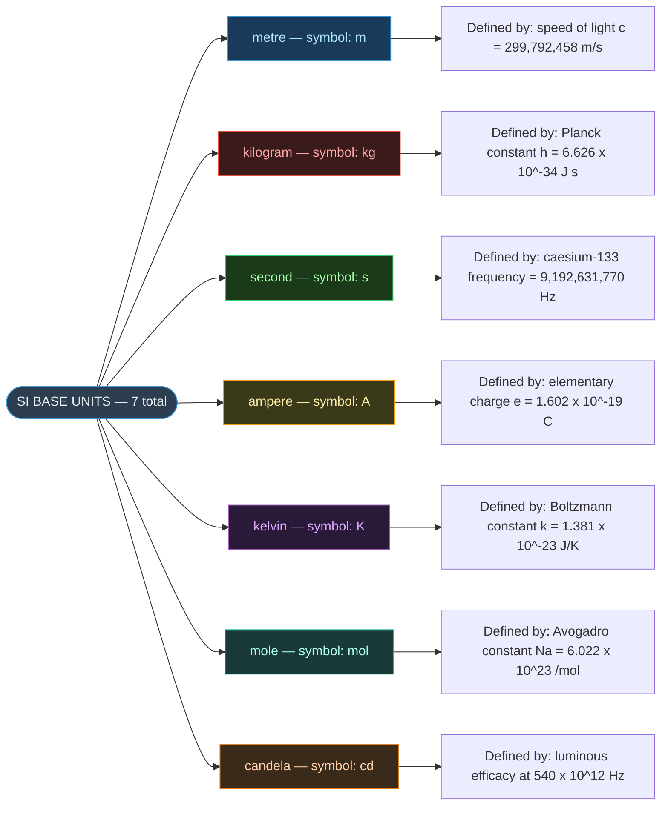
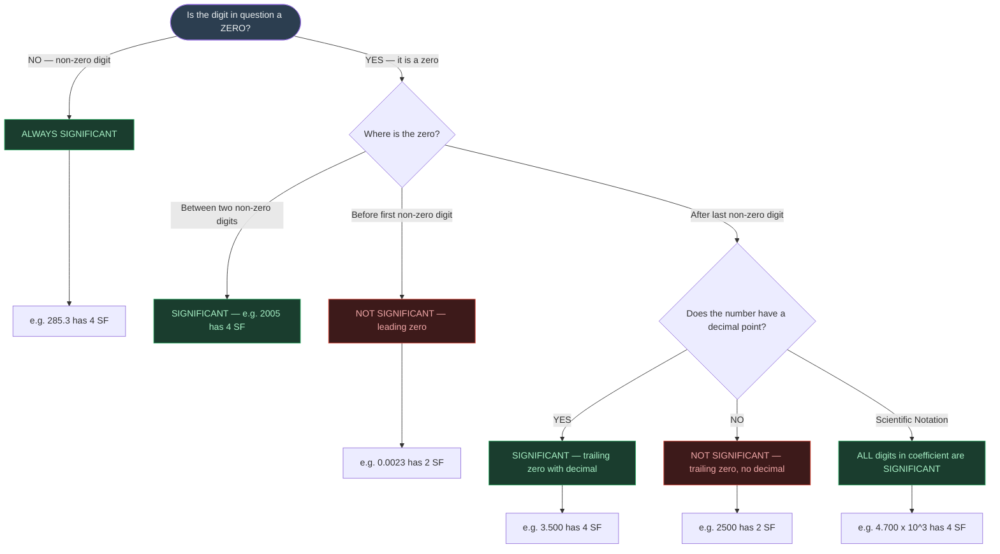
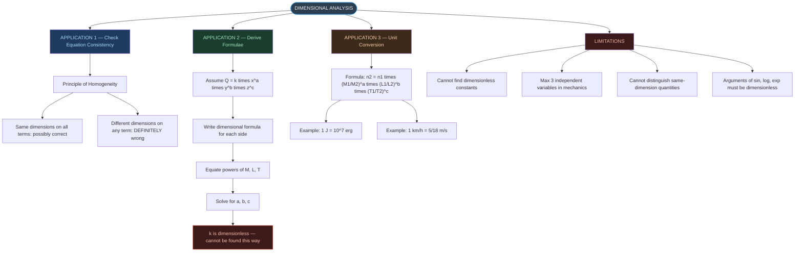
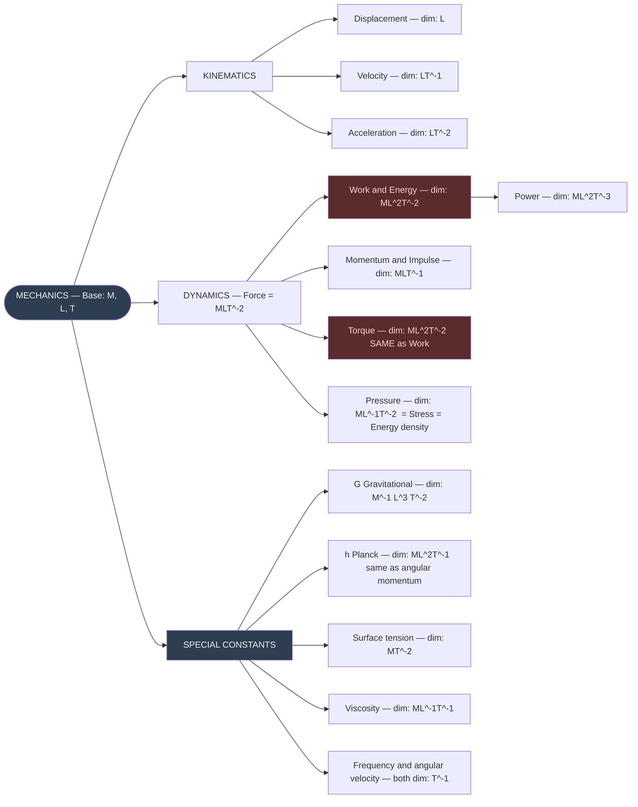
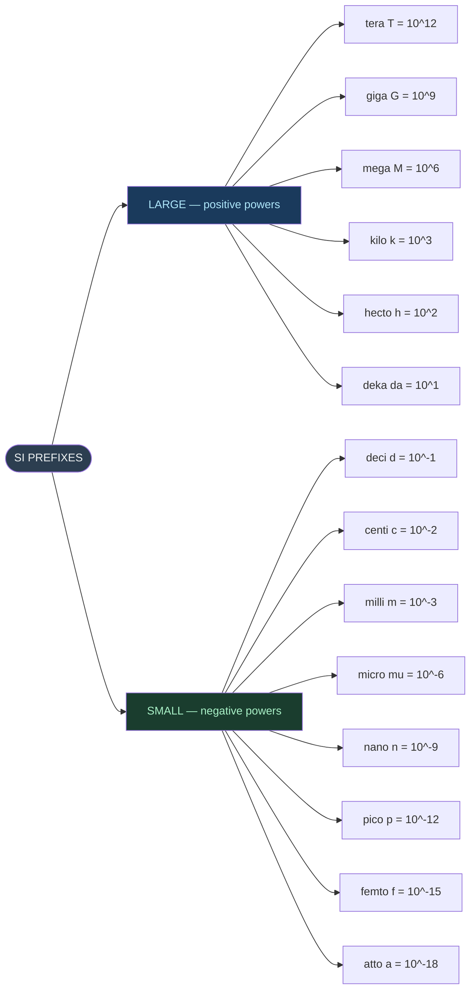
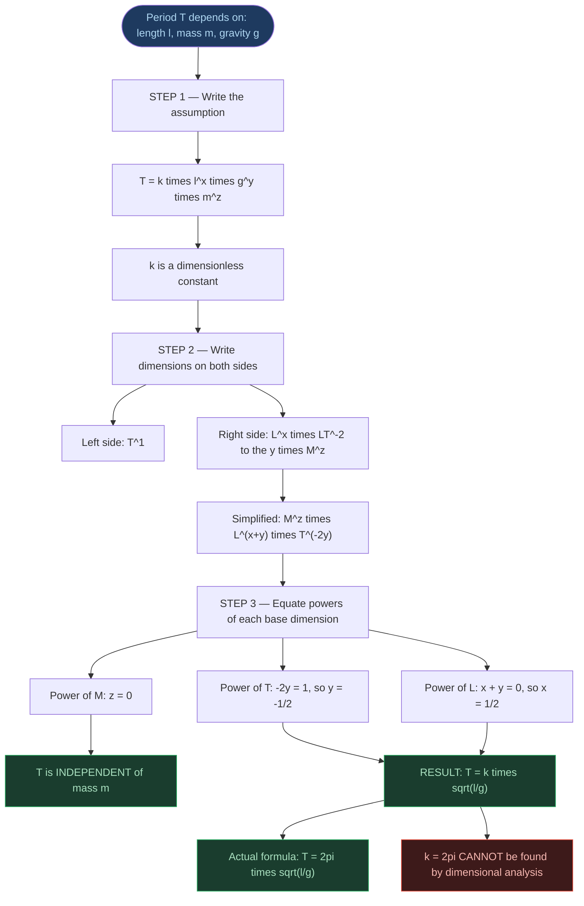

# ⚡ CHAPTER 1 — RAPID REVISION + MIND MAPS
> **Units and Measurement** | Board · NEET · JEE

---

## 📏 The 7 SI Base Units — Absolute Must-Memorise

| Quantity | Unit | Symbol | Memory Hook |
|:---|:---:|:---:|:---|
| Length | metre | **m** | "*Measure a **m**arathon*" |
| Mass | kilogram | **kg** | "*Kilo**g**rams of groceries*" |
| Time | second | **s** | "*Every **s**econd counts*" |
| Electric current | ampere | **A** | "***A**mpère — **A**ndré Marie*" |
| Temperature | kelvin | **K** | "***K**elvin — **K**-scale, no negatives*" |
| Amount of substance | mole | **mol** | "***Mol**ecular counting*" |
| Luminous intensity | candela | **cd** | "*Can**d**ela = can**d**le*" |

> [!info] **+ 2 Supplementary (Dimensionless)**
> **radian** (rad) for plane angle · **steradian** (sr) for solid angle

---

## 🔢 Significant Figures — Quick Rules

| Type of Digit | Significant? | Example | SF Count |
|:---|:---:|:---:|:---:|
| All non-zero digits | ✅ YES | 285.7 | 4 |
| Zeros between non-zero digits | ✅ YES | 1005 | 4 |
| Leading zeros | ❌ NO | 0.0023 | 2 |
| Trailing zeros, **no decimal** | ❌ NO | 2500 | 2 |
| Trailing zeros, **with decimal** | ✅ YES | 2.500 | 4 |
| Scientific notation coefficient | ✅ ALL | $4.700 \times 10^3$ | 4 |

> [!tip] Calculation Rules
> - **Add / Subtract** → match **DECIMAL PLACES** of least precise value
> - **Multiply / Divide** → match **SF COUNT** of least precise value
> - **Rounding when digit = 5** → round to **EVEN** preceding digit

---

## 📐 Key Dimensional Formulae — Know Cold ⭐

| Quantity | Dimensional Formula |
|:---|:---:|
| Velocity | $[M^0 L T^{-1}]$ |
| Acceleration | $[M^0 L T^{-2}]$ |
| Force | $[M L T^{-2}]$ |
| Work / Energy | $[M L^2 T^{-2}]$ |
| Power | $[M L^2 T^{-3}]$ |
| Momentum / Impulse | $[M L T^{-1}]$ |
| Pressure / Stress | $[M L^{-1} T^{-2}]$ |
| Density | $[M L^{-3} T^0]$ |
| Frequency | $[M^0 L^0 T^{-1}]$ |
| Gravitational constant $G$ | $[M^{-1} L^3 T^{-2}]$ |
| Planck's constant $h$ | $[M L^2 T^{-1}]$ |
| Surface tension | $[M T^{-2}]$ |
| Viscosity coefficient | $[M L^{-1} T^{-1}]$ |

---

## ⚠️ Dimension Twins

| Dimensional Formula | Physical Quantities |
|:---:|:---|
| $[M L^2 T^{-2}]$ | Work, Energy, Torque, Heat |
| $[M L T^{-1}]$ | Linear momentum, Impulse |
| $[T^{-1}]$ | Frequency, Angular velocity, Radioactive decay constant |
| $[M L^{-1} T^{-2}]$ | Pressure, Stress, Modulus of Elasticity, Energy density |

> [!warning] Dimensional analysis **CANNOT** distinguish between quantities with identical dimensions.

---

## 🔑 Critical Conversion Facts

| Conversion | Value |
|:---|:---|
| $1 \text{ km h}^{-1}$ | $= \dfrac{5}{18} \text{ m s}^{-1} \approx 0.278 \text{ m s}^{-1}$ |
| $1 \text{ m s}^{-1}$ | $= \dfrac{18}{5} \text{ km h}^{-1} = 3.6 \text{ km h}^{-1}$ |
| 1 light year | $= 9.46 \times 10^{15}$ m |
| 1 Ångström (Å) | $= 10^{-10}$ m |
| 1 fermi (fm) | $= 10^{-15}$ m |
| 1 atm | $= 1.013 \times 10^5$ Pa |
| 1 year | $\approx \pi \times 10^7$ s *(useful approximation)* |
| 1 calorie | $= 4.2$ J |

---

## ⚡ Limitations of Dimensional Analysis

> [!danger] 5 Hard Limits
> 1. Cannot find dimensionless constants ($\pi$, $\tfrac{1}{2}$, $2$, etc.)
> 2. Cannot work with more than **3 independent variables** (in mechanics)
> 3. Cannot distinguish between **same-dimension quantities** (work vs. torque)
> 4. Cannot handle $\sin$, $\log$, $\exp$ functions (arguments must be dimensionless)
> 5. Dimensional correctness does **not** guarantee physical correctness

---
---

# 🗺️ MIND MAP 1 — Chapter Overview

```mermaid
flowchart TD
    ROOT(["UNITS AND MEASUREMENT"])

    ROOT --> SI["MEASUREMENT AND SI UNITS"]
    ROOT --> SF["SIGNIFICANT FIGURES"]
    ROOT --> DA["DIMENSIONAL ANALYSIS"]

    SI --> SI1["7 Base Units: m, kg, s, A, K, mol, cd"]
    SI --> SI2["Derived Units — from base units"]
    SI --> SI3["Supplementary: radian, steradian"]
    SI --> SI4["Historical Systems: CGS, FPS, MKS"]

    SF --> SF1["Rules for Counting: non-zero, leading, trailing"]
    SF --> SF2["Add/Sub: match decimal places"]
    SF --> SF3["Mul/Div: match SF count"]
    SF --> SF4["Scientific Notation: all coefficient digits are SF"]
    SF --> SF5["Order of Magnitude: power of 10"]

    DA --> DA1["Dimensional Formula: powers of base quantities"]
    DA --> DA2["App 1: Check equation consistency"]
    DA --> DA3["App 2: Derive relations between quantities"]
    DA --> DA4["App 3: Convert units between systems"]
    DA --> DA5["Limit: cannot find dimensionless constants"]
    DA --> DA6["Limit: max 3 variables in mechanics"]

    style ROOT fill:#2c3e50,color:#ecf0f1,stroke:#3498db,stroke-width:2px
    style SI fill:#1e3a5f,color:#aed6f1,stroke:#2980b9
    style SF fill:#1a3d2e,color:#a9dfbf,stroke:#27ae60
    style DA fill:#3d2a1a,color:#f0d0a8,stroke:#e67e22
```

---

# 🗺️ MIND MAP 2 — SI Base Units

---

# 🗺️ MIND MAP 3 — Significant Figures Decision Tree

### Arithmetic Operations Quick Reference

| Operation | Rule | Example | Answer |
|:---:|:---|:---|:---:|
| **Add/Subtract** | Match decimal places of least precise | $436.32 + 227.2 + 0.301$ | $663.8$ g |
| **Multiply/Divide** | Match SF count of least precise | $4.237 \div 2.51$ | $1.69$ g/cm³ |

---

# 🗺️ MIND MAP 4 — Dimensional Analysis Applications Tree

---

# 🗺️ MIND MAP 5 — Physical Quantities and Dimensions

---

# 🗺️ MIND MAP 6 — SI Prefixes (Powers of 10)

> [!warning] Squared/Cubed Prefix Trap
> $$1 \text{ km} = 10^3 \text{ m} \implies 1 \text{ km}^2 = 10^6 \text{ m}^2 \implies 1 \text{ km}^3 = 10^9 \text{ m}^3$$
> $$1 \text{ cm} = 10^{-2} \text{ m} \implies 1 \text{ cm}^2 = 10^{-4} \text{ m}^2 \implies 1 \text{ cm}^3 = 10^{-6} \text{ m}^3$$

---

# 🗺️ MIND MAP 7 — Pendulum Derivation: Step by Step

---

*End of Rapid Revision + Mind Maps — Ch. 1: Units and Measurement*
*Exam Tags: Board · NEET · JEE Mains · JEE Advanced*