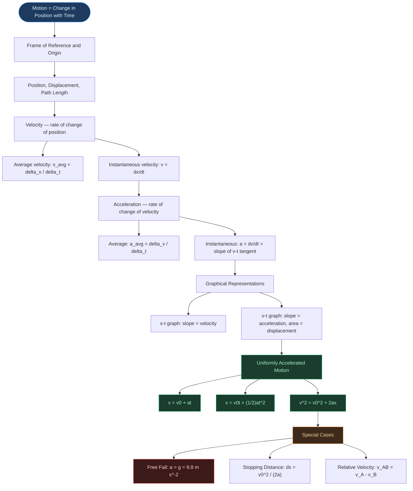

# ⚡ CHAPTER 2 — MOTION IN A STRAIGHT LINE
> **Complete Study Notes** | Board · NEET · JEE Layered

---

## 🗺️ CONCEPT ROADMAP

---

## SECTION 1 — INTRODUCTION: DESCRIBING MOTION

### 1.1 What is Motion?

> [!info] Definition
> **Motion** is the **change in position** of an object with respect to **time**. The description of motion without going into its causes is **Kinematics**.

- Kinematics = the study of **how** objects move, without reference to the causes (forces, mass, etc.). Causes are studied in Chapter 4 (Newton's Laws).
- This chapter restricts to **rectilinear motion** — motion along a **straight line**.
- Objects are treated as **point objects** (valid when object size is much smaller than the distance it moves).

### 1.2 Frame of Reference and Origin

- A **reference frame** is a coordinate system with respect to which motion is described.
- For straight-line motion, a single **x-axis** is sufficient.
- Position to the **right** of origin → **positive (+)**
- Position to the **left** of origin → **negative (−)**

> [!warning] Board Reminder
> The choice of origin and positive direction is **arbitrary**. Always state your chosen convention before solving any problem involving signs.

---

## SECTION 2 — POSITION, DISPLACEMENT, AND PATH LENGTH

### 2.1 Position

The **position** of an object at any instant is its coordinate measured from the origin along the axis. Symbol: $x$. SI unit: **m**.

### 2.2 Displacement ⭐

> [!important] Definition
> **Displacement** = Change in position:
>
> $$\Delta x = x_2 - x_1$$
>
> - It is a **vector** quantity (has both magnitude and direction).
> - SI unit: metre (m). Dimensional formula: $[L]$
> - Can be **positive, negative, or zero**.

### 2.3 Path Length (Distance)

> [!note] Definition
> **Path length** = Total length of the actual path traversed.
>
> - It is a **scalar** quantity (always $\geq 0$).
> - SI unit: metre (m). Dimensional formula: $[L]$

### 2.4 Key Distinction ⭐

| Feature | Displacement | Path Length |
|:---|:---:|:---:|
| Type | Vector | Scalar |
| Value | Can be +, −, or 0 | Always ≥ 0 |
| Formula | $x_2 - x_1$ | Sum of all path segments |
| Relation | $\leq$ Path Length | $\geq$ \|Displacement\| |

> [!important] Critical Rule
> **Path Length ≥ \|Displacement\|.** Equality holds **only** when motion is in one direction without any reversal.

**Example:** A person walks 4 m east, then 3 m west.

- Path length = 4 + 3 = **7 m**
- Displacement = 4 − 3 = **+1 m** (east)

---

## SECTION 3 — VELOCITY AND SPEED

### 3.1 Average Velocity ⭐

> [!info] Definition
> **Average velocity** = Total displacement ÷ Total time taken

$$\bar{v} = \frac{\Delta x}{\Delta t} = \frac{x_2 - x_1}{t_2 - t_1}$$

- **Vector** quantity. SI unit: m s⁻¹. Dimensional formula: $[M^0 L T^{-1}]$
- Can be positive, negative, or zero.

### 3.2 Average Speed

- **Average speed** = Total path length ÷ Total time taken
- **Scalar** quantity. Always $\geq |\text{average velocity}|$
- Equality holds only when motion is unidirectional.

> [!warning] NEET Trap
> **Average speed ≠ |Average velocity|** when the object reverses direction. A person who walks 2.5 km to market (30 min) and returns home (20 min) has **zero average velocity** over the entire trip but a non-zero average speed!

### 3.3 Instantaneous Velocity ⭐⭐

> [!important] Definition — Most Important for JEE
> **Instantaneous velocity** is the velocity at a specific **instant**, defined as the limit of average velocity as $\Delta t \to 0$:
>
> $$v = \lim_{\Delta t \to 0} \frac{\Delta x}{\Delta t} = \frac{dx}{dt}$$

- It is the **derivative of position with respect to time**.
- On an x–t graph: instantaneous velocity = **slope of the tangent** at that point.
- For **uniform motion** (constant velocity): instantaneous velocity = average velocity at all instants.

> [!example] NCERT Numerical — For $x = 0.08t^3$, find instantaneous velocity at $t = 4$ s
> $v = dx/dt = 0.24t^2$
>
> At $t = 4$ s: $v = 0.24 \times 16 = \mathbf{3.84}$ **m s⁻¹**
>
> Confirmed by NCERT Table 2.1 — as $\Delta t \to 0$, $\Delta x / \Delta t \to 3.84$ m s⁻¹.

### 3.4 Instantaneous Speed

- **Instantaneous speed** = magnitude of instantaneous velocity = $|v|$
- **Always equal** to $|$instantaneous velocity$|$ (unlike average speed vs. average velocity)
- **Why?** At a single instant, path length and displacement are infinitesimally equal (no reversal possible at a point).

---

## SECTION 4 — ACCELERATION

### 4.1 Average Acceleration

> [!info] Definition
> **Average acceleration** = Change in velocity ÷ Time interval

$$\bar{a} = \frac{\Delta v}{\Delta t} = \frac{v_2 - v_1}{t_2 - t_1}$$

- **Vector** quantity. SI unit: m s⁻². Dimensional formula: $[M^0 L T^{-2}]$
- On a v–t graph: average acceleration = **slope of chord** connecting two points.

### 4.2 Instantaneous Acceleration ⭐

$$a = \lim_{\Delta t \to 0} \frac{\Delta v}{\Delta t} = \frac{dv}{dt}$$

- On a v–t graph: instantaneous acceleration = **slope of the tangent** at that point.
- Can be positive, negative, or zero.

### 4.3 Positive vs. Negative Acceleration — CRITICAL DISTINCTION ⭐⭐

> [!warning] The sign of acceleration does NOT tell you whether speed is increasing or decreasing. It depends on both the sign of acceleration AND the sign of velocity.

| Velocity | Acceleration | Effect on Speed |
|:---:|:---:|:---|
| Positive (+) | Positive (+) | Speed **increases** |
| Positive (+) | Negative (−) | Speed **decreases** (deceleration) |
| Negative (−) | Negative (−) | Speed **increases** (in negative direction) |
| Negative (−) | Positive (+) | Speed **decreases** |

**Rule:** If v and a have the **same sign** → speed increases. If **opposite signs** → speed decreases.

**Classic Example — Ball thrown upward (taking upward as positive):**

- Going up: $v > 0$, $a = -g < 0$ → speed decreases
- Coming down: $v < 0$, $a = -g < 0$ → speed increases
- At topmost point: $v = 0$, but $a = -g \neq 0$

> [!tip] Key Fact
> **Zero velocity at an instant does not imply zero acceleration at that instant.** A particle may be momentarily at rest yet have non-zero acceleration (e.g., ball at its highest point).

### 4.4 x–t, v–t, and a–t Graph Shapes

| Type of Motion | x–t graph | v–t graph |
|:---|:---|:---|
| Uniform ($a = 0$) | Straight line, inclined | Horizontal line (constant height) |
| Uniformly accelerated ($a > 0$) | Upward parabola | Straight line, positive slope |
| Uniformly decelerated ($a < 0$) | Downward parabola | Straight line, negative slope |

> [!tip] JEE Note
> In realistic graphs, x–t, v–t, a–t curves are **smooth** (no sharp kinks). Sharp kinks imply non-differentiable functions — physically impossible since velocity and acceleration cannot change instantaneously.

---

## SECTION 5 — AREA UNDER v–t GRAPH ⭐⭐

> [!important]
> **The area under the v–t curve between $t_1$ and $t_2$ equals the displacement of the object in that time interval.**

**Proof (for uniform velocity $u$):**
- v–t curve is a horizontal straight line at height $u$.
- Area under curve from 0 to $T$ = $u \times T$ = displacement ✓

**Check dimensions:** $v \text{ (m s}^{-1}) \times t \text{ (s)} = \text{m}$ = displacement ✓

For **changing velocity**, use calculus:

$$x = \int_{t_1}^{t_2} v \, dt$$

> [!warning] Board Note
> Students often confuse "area under v–t curve" (= displacement) with "area under a–t curve" (= change in velocity, $\Delta v$). Know **both**!

---

## SECTION 6 — KINEMATIC EQUATIONS FOR UNIFORM ACCELERATION ⭐⭐⭐

### 6.1 The Three Equations of Motion

For an object with **constant acceleration $a$**, initial velocity $v_0$ at $t = 0$:

| Equation | Form | Quantities Linked |
|:---|:---:|:---|
| First equation | $v = v_0 + at$ | $v, v_0, a, t$ — no displacement |
| Second equation | $x = v_0 t + \frac{1}{2}at^2$ | $x, v_0, a, t$ — no final velocity |
| Third equation | $v^2 = v_0^2 + 2ax$ | $v, v_0, a, x$ — no time |
| Average velocity form | $x = \frac{1}{2}(v + v_0)t$ | $x, v, v_0, t$ — no acceleration |

> [!note]
> If initial position is $x_0$ (not zero), replace $x$ with $(x - x_0)$ in all equations.

### 6.2 Derivation Summary (Calculus Method — NCERT Example 2.2)

**Equation 1:**

> [!example] Derivation of $v = v_0 + at$
> $a = dv/dt \Rightarrow dv = a\, dt$
>
> Integrating both sides: $v - v_0 = at \Rightarrow \boxed{v = v_0 + at}$

**Equation 2:**

> [!example] Derivation of $x = v_0 t + \frac{1}{2}at^2$
> $v = dx/dt \Rightarrow dx = (v_0 + at)\, dt$
>
> Integrating: $x - x_0 = v_0 t + \tfrac{1}{2}at^2 \Rightarrow \boxed{x = v_0 t + \tfrac{1}{2}at^2}$ (with $x_0 = 0$)

**Equation 3:**

> [!example] Derivation of $v^2 = v_0^2 + 2ax$
> $a = v(dv/dx) \Rightarrow v\, dv = a\, dx$
>
> Integrating: $\tfrac{v^2 - v_0^2}{2} = ax \Rightarrow \boxed{v^2 = v_0^2 + 2ax}$

> [!warning] JEE Note
> Kinematic equations are valid **only for constant acceleration** (both magnitude and direction constant). For variable acceleration, use calculus directly — integrate $a$ to get $v$, integrate $v$ to get $x$.

### 6.3 Average Velocity Under Constant Acceleration

$$\bar{v} = \frac{v + v_0}{2}$$

This is the **arithmetic mean** of initial and final velocities — valid **only for constant acceleration**.

### 6.4 Distance in the nth Second

$$s_n = v_0 + a\!\left(n - \frac{1}{2}\right)$$

This gives the distance covered in the **nth second specifically** — NOT total distance in $n$ seconds.

### 6.5 Worked NCERT Examples

**Example 2.1 — Position as function of time:** $x = a + bt^2$ where $a = 8.5$ m, $b = 2.5$ m s⁻²

> [!example] Solution
> $v = dx/dt = 2bt = 5.0t$ m s⁻¹
>
> At $t = 0$: $v = 0$ m s⁻¹ | At $t = 2.0$ s: $v = 10$ m s⁻¹
>
> Average velocity from $t = 2$ to $t = 4$ s:
>
> $\bar{v} = \dfrac{x(4) - x(2)}{4 - 2} = \dfrac{48.5 - 18.5}{2} = \mathbf{15}$ **m s⁻¹**

**Example 2.3 — Ball thrown upward from 25 m height at 20 m s⁻¹:** (Take $g = 10$ m s⁻²)

> [!example] Solution
> **(a) Maximum height above launch point:**
>
> $v^2 = v_0^2 + 2a(y - y_0) \Rightarrow 0 = 400 + 2(-10)(y - y_0) \Rightarrow \mathbf{(y - y_0) = 20}$ **m**
>
> **(b) Time to hit ground (Method 2 — full displacement):**
>
> $y_0 = 25$ m, $y = 0$, $v_0 = 20$ m s⁻¹, $a = -10$ m s⁻²
>
> $0 = 25 + 20t - 5t^2 \Rightarrow 5t^2 - 20t - 25 = 0 \Rightarrow \mathbf{t = 5}$ **s**

---

## SECTION 7 — FREE FALL ⭐⭐

> [!important] Definition
> **Free fall** = motion of an object under **gravity alone**, with no air resistance.

- Acceleration = $g = 9.8$ m s⁻² (downward), constant near Earth's surface.
- Special case of uniformly accelerated motion.
- **Galileo's discovery:** All objects fall with the same acceleration regardless of mass (in absence of air resistance).

### 7.1 Galileo's Law of Odd Numbers

> [!info] Galileo's Law of Odd Numbers *(Board/NEET)*
> Distances covered in the 1st, 2nd, 3rd, ... equal time intervals $\tau$ (from rest) are in the ratio:
>
> $$1 : 3 : 5 : 7 : 9 \ldots$$
>
> Total distance after $n$ intervals $\propto n^2$ (i.e., $1 : 4 : 9 : 16 \ldots$)

### 7.2 Free Fall Equations (upward = positive)

**Example 2.4 (NCERT) — Free fall from rest:**

> [!example] Free Fall Equations (taking upward as positive, $v_0 = 0$)
> $a = -g = -9.8$ m s⁻²
>
> $v = -gt = -9.8t$ m s⁻¹
>
> $y = -\tfrac{1}{2}gt^2 = -4.9t^2$ m
>
> $v^2 = -2gy = -19.6y$ m² s⁻²

**Stopping Distance (Example 2.6):**

$$d_s = \frac{v_0^2}{2a}$$

Stopping distance $\propto v_0^2$ — doubling initial speed **quadruples** stopping distance.

**Reaction Time (Example 2.7):** A ruler dropped under free fall.

$$t_r = \sqrt{\frac{2d}{g}}$$

For $d = 21.0$ cm: $t_r = \sqrt{2 \times 0.21 / 9.8} \approx 0.2$ s

---

## SECTION 8 — RELATIVE VELOCITY ⭐⭐

### 8.1 Concept

> [!important] Definition
> **Relative velocity** of object A with respect to B:
>
> $$v_{AB} = v_A - v_B$$
>
> where $v_A$ and $v_B$ are velocities measured with respect to the ground frame.

### 8.2 Cases

**Case 1: Same direction**

$$v_{AB} = v_A - v_B$$

- $v_A = v_B$: relative velocity = 0 (appear stationary to each other)
- $v_A > v_B$: A moves away from B

**Case 2: Opposite directions** (A at $+v_A$, B at $-v_B$):

$$v_{AB} = v_A - (-v_B) = v_A + v_B$$

> [!tip] Classic NCERT Example (Q2.14)
> Police van at +30 km h⁻¹ fires bullet at +150 m s⁻¹. Thief's car at +192 km h⁻¹ = +53.33 m s⁻¹.
>
> - Bullet speed (ground frame) = 150 + 8.33 = 158.33 m s⁻¹
> - Relative speed of bullet w.r.t. thief's car = 158.33 − 53.33 = **105 m s⁻¹**

### 8.3 Meeting Problems

For two objects moving from the same start:

- Positions at time $t$: $x_A(t) = x_{A0} + v_A \cdot t$ and $x_B(t) = x_{B0} + v_B \cdot t$
- If $v_A = v_B$: separation remains constant → they never meet or separate further.
- To find meeting time: set $x_A(t) = x_B(t)$ and solve for $t$.

---

## SECTION 9 — GRAPHICAL INTERPRETATION SUMMARY ⭐⭐⭐

### x–t Graph

| Feature | Physical Meaning |
|:---|:---|
| Slope ($dx/dt$) | Instantaneous velocity |
| Positive slope | Moving in positive direction |
| Negative slope | Moving in negative direction |
| Zero slope (horizontal) | Object at rest |
| Curve bending upward | Positive acceleration |
| Curve bending downward | Negative acceleration |
| Straight line | Uniform velocity ($a = 0$) |

### v–t Graph

| Feature | Physical Meaning |
|:---|:---|
| Slope ($dv/dt$) | Instantaneous acceleration |
| Area under curve | Displacement |
| Horizontal line | Uniform velocity ($a = 0$) |
| Straight line, positive slope | Uniform positive acceleration |
| Straight line, negative slope | Uniform deceleration |
| Crossing the time axis ($v = 0$) | Object momentarily at rest / reverses direction |

> [!warning] Board Trap
> A v–t graph **crossing** the x-axis means the object **reverses direction**, NOT that it stops permanently. Area **below** the x-axis represents displacement in the negative direction.

### a–t Graph

| Feature | Physical Meaning |
|:---|:---|
| Area under curve | Change in velocity ($\Delta v$) |
| Horizontal line | Uniformly accelerated motion |

---

## SECTION 10 — POINTS TO PONDER (NCERT) ⭐

1. Origin and positive direction are a **choice** — specify them first.
2. If speed is **increasing** → $a$ is in the **same direction** as $v$. If speed is **decreasing** → $a$ is **opposite** to $v$.
3. Sign of acceleration depends on choice of positive direction — **not** inherently linked to speeding up/down.
4. Zero velocity at an instant **≠** zero acceleration (e.g., ball at topmost point: $v = 0$ but $a = g$).
5. Kinematic quantities are **algebraic** — always substitute with correct signs.
6. Kinematic equations hold **only for constant acceleration** (magnitude AND direction both constant).

---

## SECTION 11 — DIMENSIONAL FORMULAE

| Physical Quantity | Symbol | Dimensional Formula | SI Unit |
|:---|:---:|:---:|:---:|
| Displacement | $\Delta x$ | $[M^0 L T^0]$ | m |
| Velocity (avg and inst.) | $v$ | $[M^0 L T^{-1}]$ | m s⁻¹ |
| Speed | — | $[M^0 L T^{-1}]$ | m s⁻¹ |
| Acceleration (avg and inst.) | $a$ | $[M^0 L T^{-2}]$ | m s⁻² |
| Time | $t$ | $[M^0 L^0 T^1]$ | s |

---

## SECTION 12 — QUICK FORMULA REFERENCE ⭐⭐⭐

| Formula | Name | Condition |
|:---|:---|:---|
| $v = v_0 + at$ | 1st equation of motion | Constant $a$; $x_0 = 0$ |
| $x = v_0 t + \frac{1}{2}at^2$ | 2nd equation of motion | Constant $a$; $x_0 = 0$ |
| $v^2 = v_0^2 + 2ax$ | 3rd equation of motion | Constant $a$; $x_0 = 0$ |
| $x = \frac{1}{2}(v + v_0)t$ | Average velocity form | Constant $a$ |
| $s_n = v_0 + a(n - \frac{1}{2})$ | Distance in nth second | Constant $a$ |
| $\bar{v} = \Delta x / \Delta t$ | Average velocity (general) | Any motion |
| $v = dx/dt$ | Instantaneous velocity | Any motion |
| $a = dv/dt = v(dv/dx)$ | Instantaneous acceleration | Any motion |
| $v_{AB} = v_A - v_B$ | Relative velocity | Any 1D motion |
| $d_s = v_0^2 / (2a)$ | Stopping distance | Uniform deceleration |
| $t_r = \sqrt{2d/g}$ | Reaction time | Ruler drop experiment |
| $1 : 3 : 5 : 7 \ldots$ | Galileo's odd numbers | Free fall from rest |

---

## SECTION 13 — COMMON EXAM TRAPS ⭐⭐⭐

> [!danger] High-Yield Mistakes to Avoid

1. **Sign of $a$ ≠ direction of motion:** Negative $a$ doesn't mean moving backward — it depends on initial velocity direction.
2. **$v = 0$ does NOT mean $a = 0$:** At the highest point of a throw, $v = 0$ but $a = g$ downward.
3. **Average speed ≠ |Average velocity|** when the object reverses direction.
4. **Instantaneous speed = |Instantaneous velocity|** always (unlike the averages).
5. **Kinematic equations require constant acceleration** — don't use them for variable $a$.
6. **Area under v–t = displacement** (not distance). For total distance when direction changes, split and add magnitudes separately.
7. **Relative velocity:** same direction → $v_{AB} = v_A - v_B$; opposite direction → $v_{AB} = v_A + v_B$.
8. **Stopping distance $\propto v_0^2$:** Doubling speed → **4× stopping distance**.
9. **Galileo's odd numbers:** Only valid for free fall from **REST** ($v_0 = 0$).
10. **Sharp kinks in graphs** → non-physical (functions not differentiable).

---

*End of Core Notes — Ch. 2: Motion in a Straight Line*
*Exam Tags: Board · NEET · JEE Mains · JEE Advanced*