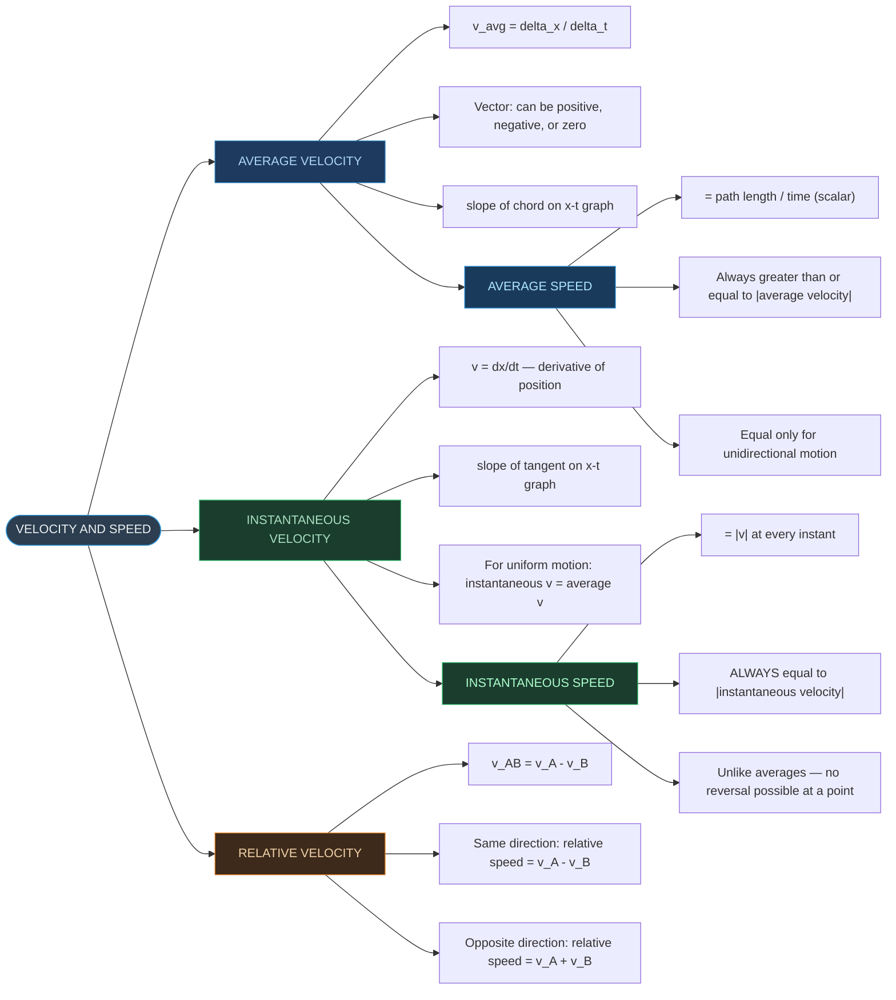
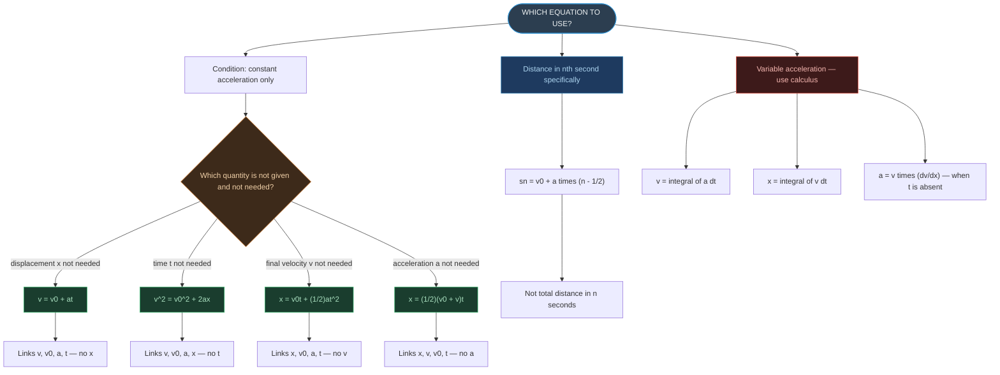
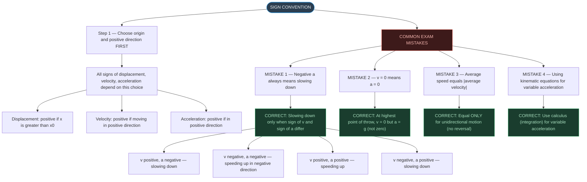
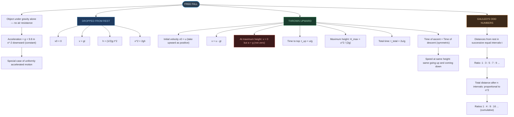
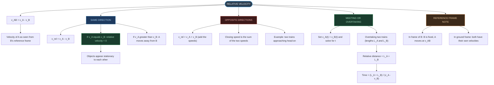
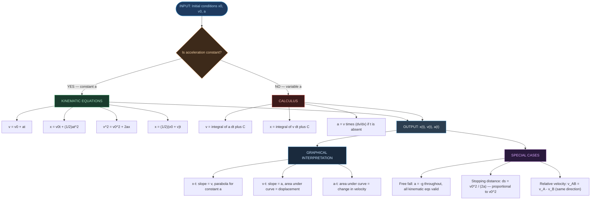

# ⚡ CHAPTER 2 — RAPID REVISION + MIND MAPS
> **Motion in a Straight Line** | Board · NEET · JEE

---

## 🔢 Key Definitions — Absolute Must-Memorise

| Quantity | Definition | Formula | SI Unit |
|:---|:---|:---:|:---:|
| **Displacement** | Change in position (vector) | $\Delta x = x_2 - x_1$ | m |
| **Distance** | Total path length (scalar) | Sum of all segments | m |
| **Average velocity** | Displacement divided by time | $\bar{v} = \Delta x / \Delta t$ | m s⁻¹ |
| **Average speed** | Path length divided by time | path / $t$ | m s⁻¹ |
| **Instantaneous velocity** | Limit of avg velocity as $\Delta t \to 0$ | $v = dx/dt$ | m s⁻¹ |
| **Instantaneous speed** | Magnitude of instantaneous velocity | $\lvert v \rvert$ | m s⁻¹ |
| **Average acceleration** | Change in velocity divided by time | $\bar{a} = \Delta v / \Delta t$ | m s⁻² |
| **Instantaneous acceleration** | Limit of avg acceleration as $\Delta t \to 0$ | $a = dv/dt$ | m s⁻² |

---

## 📐 Three Kinematic Equations — Must Know Cold

| # | Equation | Missing Quantity |
|:---:|:---|:---:|
| 1 | $v = v_0 + at$ | displacement $x$ |
| 2 | $x = v_0 t + \frac{1}{2}at^2$ | final velocity $v$ |
| 3 | $v^2 = v_0^2 + 2ax$ | time $t$ |
| — | $x = \frac{1}{2}(v_0 + v)t$ | acceleration $a$ |
| — | $s_n = v_0 + a(n - \frac{1}{2})$ | distance in nth second |

> [!warning] Condition
> All three kinematic equations are valid **only when acceleration is constant** (both magnitude and direction). For variable acceleration, use calculus — integrate $a$ to get $v$, integrate $v$ to get $x$.

---

## 📊 Graph Interpretation — Instant Recall

| Graph | Slope of line/tangent | Area under curve |
|:---|:---|:---|
| **x–t graph** | Instantaneous velocity | — |
| **v–t graph** | Instantaneous acceleration | Displacement |
| **a–t graph** | — | Change in velocity ($\Delta v$) |

| x–t Shape | Meaning |
|:---|:---|
| Straight line (inclined) | Uniform velocity ($a = 0$) |
| Horizontal line | Object at rest ($v = 0$) |
| Upward-curving parabola | Positive constant acceleration |
| Downward-curving parabola | Negative constant acceleration |
| Vertical line | Physically **impossible** |

---

## ⚠️ Critical Distinctions — High-Yield Traps

> [!important] Path Length vs Displacement
> **Path length $\geq$ |Displacement|**
> Equality holds **only** when motion is one-directional (no reversal at any point).

> [!important] Average Speed vs |Average Velocity|
> **Average speed $\geq$ |average velocity|**
> Equality holds only for unidirectional motion.

> [!tip] Instantaneous Speed vs |Instantaneous Velocity|
> **ALWAYS EQUAL at every instant** — because at a single instant, no reversal is possible.

> [!warning] Negative Acceleration vs Slowing Down
> - Negative $a$ does NOT necessarily mean slowing down.
> - **Slowing down occurs when $v$ and $a$ have opposite signs.**
> - $v < 0$ and $a < 0$ → object is **speeding up** in the negative direction.

---

## 🔑 Special Results and Important Values

| Result | Formula or Value |
|:---|:---|
| Free fall acceleration | $g = 9.8$ m s⁻² $\approx 10$ m s⁻² |
| Stopping distance | $d_s = v_0^2 / (2a) \propto v_0^2$ |
| Reaction time (ruler drop) | $t_r = \sqrt{2d/g}$ |
| Galileo's odd numbers | $1 : 3 : 5 : 7 : 9 \ldots$ (from rest, equal time intervals) |
| Same-direction relative velocity | $v_{AB} = v_A - v_B$ |
| Opposite-direction relative velocity | $v_{AB} = v_A + v_B$ |
| Average velocity (constant $a$) | $\bar{v} = (v + v_0)/2$ (arithmetic mean) |
| Distance in nth second | $s_n = v_0 + a(n - \tfrac{1}{2})$ |
| Objects meet | Set $x_A(t) = x_B(t)$ and solve |

---

## ⚡ Dimensional Formulae

| Quantity | Dimensional Formula | SI Unit |
|:---|:---:|:---:|
| Displacement | $[M^0 L T^0]$ | m |
| Velocity | $[M^0 L T^{-1}]$ | m s⁻¹ |
| Acceleration | $[M^0 L T^{-2}]$ | m s⁻² |
| Time | $[M^0 L^0 T^1]$ | s |

---

## 🔁 Free Fall Summary

> [!info] Free Fall (taking upward as positive)
> - $a = -g = -9.8$ m s⁻²
>
> **From rest ($v_0 = 0$, $y_0 = 0$):**
> - $v = -gt$
> - $y = -\frac{1}{2}gt^2$
> - $v^2 = -2gy$
>
> **At highest point of any throw:** $v = 0$ but $a = -g \neq 0$
>
> **Galileo's Law:** Distances in successive equal intervals $\tau$ are in ratio $1 : 3 : 5 : 7 \ldots$

---
---

# 🗺️ MIND MAP 1 — Chapter Overview

```mermaid
flowchart TD
    ROOT(["MOTION IN A STRAIGHT LINE"])

    ROOT --> BC["BASIC CONCEPTS"]
    ROOT --> KIN["KINEMATICS"]
    ROOT --> GEQ["GRAPHS AND EQUATIONS"]
    ROOT --> SPC["SPECIAL TOPICS"]

    BC --> BC1["Motion = change in position with time"]
    BC --> BC2["Rectilinear motion — along a straight line"]
    BC --> BC3["Frame of reference — origin is arbitrary choice"]
    BC --> BC4["Displacement vs Path Length"]
    BC4 --> BC5["Path length is greater than or equal to |displacement|"]

    KIN --> KIN1["Average velocity: v_avg = delta_x / delta_t"]
    KIN --> KIN2["Instantaneous velocity: v = dx/dt"]
    KIN2 --> KIN3["Slope of tangent on x-t graph"]
    KIN --> KIN4["Speed = magnitude of velocity (scalar)"]
    KIN --> KIN5["Average acceleration: a_avg = delta_v / delta_t"]
    KIN --> KIN6["Instantaneous acceleration: a = dv/dt"]
    KIN6 --> KIN7["Slope of tangent on v-t graph"]

    GEQ --> GEQ1["x-t graph: slope = velocity"]
    GEQ --> GEQ2["v-t graph: slope = acceleration"]
    GEQ --> GEQ3["v-t area = displacement"]
    GEQ --> EQ["KINEMATIC EQUATIONS — constant a only"]
    EQ --> EQ1["v = v0 + at"]
    EQ --> EQ2["x = v0t + (1/2)at^2"]
    EQ --> EQ3["v^2 = v0^2 + 2ax"]

    SPC --> SPC1["Free Fall: a = g = 9.8 m s^-2 downward"]
    SPC --> SPC2["Stopping distance: ds = v0^2 / (2a)"]
    SPC --> SPC3["Reaction time: tr = sqrt(2d/g)"]
    SPC --> SPC4["Relative velocity: v_AB = v_A - v_B"]

    style ROOT fill:#2c3e50,color:#ecf0f1,stroke:#3498db,stroke-width:2px
    style BC fill:#1e3a5f,color:#aed6f1,stroke:#2980b9
    style KIN fill:#1a3d2e,color:#a9dfbf,stroke:#27ae60
    style GEQ fill:#3d2a1a,color:#f0d0a8,stroke:#e67e22
    style SPC fill:#3d1a1a,color:#f5b7b1,stroke:#e74c3c
    style EQ fill:#1a3d2e,color:#a9dfbf,stroke:#27ae60
```

---

# 🗺️ MIND MAP 2 — Types of Velocity and Speed

---

# 🗺️ MIND MAP 3 — Kinematic Equations Decision Tree

---

# 🗺️ MIND MAP 4 — Graph Shapes for Different Motions

| Type of Motion | x–t Graph Shape | v–t Graph Shape | a–t Graph Shape |
|:---|:---|:---|:---|
| At rest | Horizontal line | Point on time axis | Line at zero |
| Uniform velocity ($a = 0$) | Straight inclined line | Horizontal line at height $v$ | Line at zero |
| Uniform positive acceleration | Upward parabola from origin | Straight line from origin (positive slope) | Horizontal line at $+a$ |
| Uniform negative acceleration (decelerating) | Downward parabola | Straight line, negative slope | Horizontal line at $-a$ |
| Reversing motion | Curve with turning point | Line crossing time axis | Horizontal line (same sign throughout) |
| Free fall from rest | Downward parabola | Straight line from origin (downward) | Horizontal at $-g = -9.8$ m s⁻² |

> [!tip] Memory Hook for x–t Shapes
> - Curve **bending upward** → positive acceleration
> - Curve **bending downward** → negative acceleration
> - **Straight line** → zero acceleration (uniform motion)
> - **Vertical line** → physically **impossible** (object at two positions simultaneously)

---

# 🗺️ MIND MAP 5 — Sign Convention and Common Mistakes

---

# 🗺️ MIND MAP 6 — Free Fall and Galileo's Laws

---

# 🗺️ MIND MAP 7 — Relative Velocity

---

# 🗺️ MIND MAP 8 — Chapter Summary (Big Picture)

---

*End of Rapid Revision + Mind Maps — Ch. 2: Motion in a Straight Line*
*Exam Tags: Board · NEET · JEE Mains · JEE Advanced*