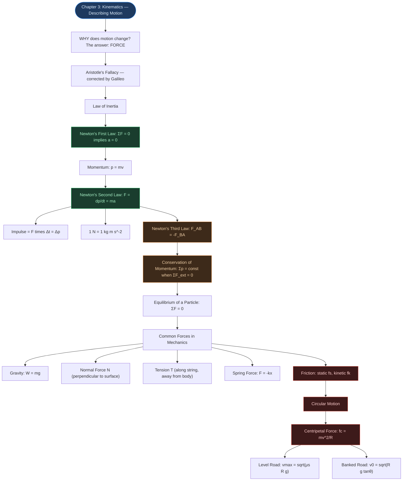

# ⚡ CHAPTER 4 — LAWS OF MOTION
> **Complete Study Notes** | Board · NEET · JEE Layered

---

## 🗺️ CONCEPT ROADMAP

---

## SECTION 1 — ARISTOTLE'S FALLACY AND THE LAW OF INERTIA

### 1.1 Aristotle's (Wrong) View

> **Aristotelian Law of Motion:** An external force is required to keep a body in motion.

**Why it seems right:** A toy car comes to rest once you stop pushing it. A ball rolling on the floor slows down.

**Why it is wrong:** The car and ball slow down because of **friction and air resistance** — opposing forces. If these were absent, no force would be needed to sustain motion.

> [!tip] Aristotle's Error
> He confused the applied force needed to overcome friction with the force needed to sustain motion. He did not account for friction as a separate opposing force.

### 1.2 Galileo's Correction — The Law of Inertia

Galileo studied motion on inclined planes and a double-inclined plane:

* A ball rolling **down** an incline: **accelerates**
* A ball rolling **up** an incline: **decelerates**
* Motion on a **horizontal** frictionless plane: **constant velocity** (neither accelerates nor decelerates)

**Double inclined plane experiment:** A ball released from one incline rises to the same height on the other, regardless of the slope angle. As slope → 0 (horizontal), the ball travels an infinite distance — it never stops.

> [!important] Galileo's Conclusion — The Law of Inertia
> The natural state of a body (rest OR uniform motion) does NOT require a net force to sustain it. A body resists any change in its state — this property is called **INERTIA**.
>
> **Inertia** = the inherent tendency of a body to **resist any change** in its state of rest or of uniform motion.

---

## SECTION 2 — NEWTON'S FIRST LAW OF MOTION ⭐

### 2.1 Statement

> **Every body continues to be in its state of rest or of uniform motion in a straight line unless compelled by some external force to act otherwise.**

**Equivalent simple form:**

$$\sum \mathbf{F} = 0 \implies \mathbf{a} = 0$$

### 2.2 Implications

* State of rest (v = 0) and state of uniform motion (v = constant ≠ 0) are **physically equivalent** — both have zero acceleration, both require zero net force.
* A body at rest is NOT in a "more natural" state than a body in uniform motion.
* **First Law defines Force:** Force is that external cause which changes (or tends to change) the state of rest or uniform motion of a body.
* **First Law defines Inertial Frame:** A reference frame in which the First Law holds is called an **inertial frame of reference**.

### 2.3 Examples of First Law in Daily Life

| Situation | Explanation |
|:---|:---|
| Passenger thrown backward when bus starts | Passenger's body tends to remain at rest (inertia of rest) while floor moves forward |
| Passenger thrown forward when bus brakes | Body tends to continue moving forward (inertia of motion) |
| Tablecloth pulled away from dishes | Dishes tend to remain at rest (inertia) if pulled fast enough |
| Coin falls into glass when card is flicked | Coin's inertia of rest keeps it stationary; card moves away |
| Astronaut in deep space, rockets off | Continues with constant velocity (no net force) |

> [!warning] Exam Note
> The First Law is NOT merely a special case of the Second Law. It independently defines the concept of force and the concept of an inertial frame of reference.

---

## SECTION 3 — MOMENTUM AND NEWTON'S SECOND LAW ⭐⭐

### 3.1 Momentum

> [!info] Definition
> **Momentum (p)** of a body is the product of its **mass** and **velocity**.

$$\mathbf{p} = m\mathbf{v} \quad \text{...(4.1)}$$

* **Vector quantity** — same direction as velocity
* SI unit: **kg m s⁻¹** = **N s**
* Dimensional formula: **[MLT⁻¹]**

**Why momentum matters — Common Experiences:**

| Observation | What it shows |
|:---|:---|
| Truck harder to stop than bicycle at same speed | Mass matters |
| Bullet easily pierces tissue at high speed; barely at low speed | Speed matters |
| Cricketer pulls hands back to catch | Slower deceleration → less force |
| Same force applied to heavy and light bodies for same time → same Δp | Momentum is the key quantity |

### 3.2 Newton's Second Law — Statement

> [!important] Newton's Second Law
> The rate of change of momentum of a body is directly proportional to the applied force and takes place in the direction in which the force acts.

$$\mathbf{F} \propto \frac{\Delta \mathbf{p}}{\Delta t} \implies \mathbf{F} = k\frac{d\mathbf{p}}{dt}$$

Taking k = 1 (defines the SI unit of force):

$$\boxed{\mathbf{F} = \frac{d\mathbf{p}}{dt} = m\mathbf{a}} \quad \text{...(4.5)}$$

(for a body of fixed mass m)

**SI Unit of Force:** 1 Newton (N) = force that produces an acceleration of 1 m s⁻² in a body of mass 1 kg.

$$1 \text{ N} = 1 \text{ kg m s}^{-2} \quad \text{Dimensional formula: [MLT}^{-2}\text{]}$$

### 3.3 Key Points About the Second Law

**1. Consistency with First Law:** $F = 0 \implies dp/dt = 0 \implies p = \text{const} \implies a = 0$. Fully consistent. ✓

**2. It is a Vector Law:** Equivalent to three scalar equations:

$$F_x = ma_x \qquad F_y = ma_y \qquad F_z = ma_z \quad \text{...(4.6)}$$

A force along x changes only the x-component of velocity; y and z components remain unchanged. This is why horizontal velocity of a projectile stays constant under vertical gravity.

**3. It is a Local Relation:** Force F at a point **at a certain instant** determines acceleration a at that **same point at the same instant**. No "memory" of past motion.

> [!tip] Classic Example
> The moment a stone is released from an accelerated train, it has no horizontal force (if air resistance neglected). Its past horizontal acceleration is irrelevant.

**4. F is the Net External Force:** F = vector sum of ALL external forces on the body. Internal forces do not count.

**5. Applicable to systems:** Law applies to a particle AND to a rigid body or system of particles, where F = total external force and a = acceleration of centre of mass.

### 3.4 Impulse ⭐

When a **large force** acts for a **very short time** (bat hitting ball, hammer striking nail):

$$\text{Impulse} = \mathbf{F} \times \Delta t = \Delta \mathbf{p} \quad \text{...(4.7)}$$

* SI unit: **N s** = **kg m s⁻¹**
* Dimensional formula: **[MLT⁻¹]** (same as momentum)
* **Impulse = Change in momentum** — measurable even when F and Δt are individually unknown

> [!tip] Why a cricketer draws hands back while catching
> By increasing Δt of contact, the same Δp (impulse) is achieved with a **smaller force** F. This prevents injury.

> [!warning] Impulsive Force
> Impulsive force is NOT a new type of force. It is simply a large force acting for a short time. Newtonian mechanics treats it exactly like any other force.

### 3.5 Solved Examples

> [!example] NCERT Example 4.2 — Bullet stopped in barrel
> Bullet: $m = 0.04$ kg, $u = 90$ m s⁻¹, stopped in $d = 0.6$ m.
>
> $$a = \frac{-u^2}{2s} = \frac{-(90)^2}{2 \times 0.6} = -6750 \text{ m s}^{-2}$$
>
> $$F = ma = 0.04 \times 6750 = \mathbf{270 \text{ N}} \text{ (average resistive force)}$$

> [!example] NCERT Example 4.4 — Batsman hits ball
> Ball: $m = 0.15$ kg, velocity reversed from $-12$ m s⁻¹ to $+12$ m s⁻¹.
>
> $$\text{Impulse} = \Delta p = m(v - u) = 0.15 \times (12 - (-12)) = \mathbf{3.6 \text{ N s}}$$

---

## SECTION 4 — NEWTON'S THIRD LAW OF MOTION ⭐⭐

### 4.1 Statement

> [!important] Newton's Third Law
> To every action, there is always an equal and opposite reaction.
>
> More precisely: **Forces always occur in pairs. The force on body A by body B is equal and opposite to the force on body B by A.**
>
> $$\mathbf{F}_{AB} = -\mathbf{F}_{BA} \quad \text{...(4.8)}$$

### 4.2 Critical Features of the Third Law

**1. "Action" and "Reaction" are forces:** The words are misleading — neither precedes the other. Both forces act **simultaneously**. No cause-effect relation is implied. Either force can be labelled action.

**2. Action and Reaction act on DIFFERENT bodies:** They act on different bodies, so they **never cancel each other**. When considering the motion of body A, only $F_{BA}$ (force ON A by B) is relevant. Adding $F_{AB}$ to it is a conceptual error.

**3. Holds for all types of forces:** Contact forces (normal, friction, tension) AND non-contact forces (gravity, magnetic) all obey the Third Law.

**4. Internal forces cancel in pairs:** Within a system of particles, all action-reaction pairs between particles within the system sum to zero. The Second Law for the system uses only external forces.

### 4.3 Examples of Third Law

| Action | Reaction |
|:---|:---|
| Earth pulls stone downward (gravity) | Stone pulls Earth upward (same magnitude, Earth barely moves) |
| Horse pulls cart forward | Cart pulls horse backward |
| Foot pushes ground backward | Ground pushes foot forward (friction → walking is possible) |
| Rocket expels gas backward | Gas pushes rocket forward |
| Compressed spring pushes hand | Hand pushes spring |
| Gun exerts forward force on bullet | Bullet exerts backward force on gun (recoil) |

> [!warning] Classic Misconception
> "Action and reaction cancel → nothing can move." WRONG — they act on DIFFERENT bodies. For motion of any one body, only the force ON THAT BODY matters.

### 4.4 Solved: Billiard Balls (NCERT Example 4.5)

> [!example] NCERT Example 4.5 — Billiard balls hitting a wall
> Two identical balls strike a rigid wall at different angles but same speed $u$, rebound without speed change.
>
> **Case (a): Normal incidence**
> $x$-impulse on ball $= -2mu$; $y$-impulse $= 0$. Force on wall: normal to wall, in $+x$ direction.
>
> **Case (b): Incidence at 30° to normal**
> $x$-impulse on ball $= -2mu\cos 30°$; $y$-impulse $= 0$ ($p_y$ unchanged).
> Force on wall: still **normal to wall** in $+x$ direction (NOT at 30°!)
>
> **Ratio of impulses (a):(b):**
>
> $$\frac{2mu}{2mu\cos 30°} = \frac{1}{\cos 30°} = \frac{2}{\sqrt{3}} \approx 1.15$$

---

## SECTION 5 — CONSERVATION OF MOMENTUM ⭐⭐⭐

### 5.1 Derivation from 2nd and 3rd Laws

Two bodies A and B interact for time $\Delta t$:
* By 3rd Law: $\mathbf{F}_{AB} = -\mathbf{F}_{BA}$
* By 2nd Law: $\mathbf{F}_{AB} \cdot \Delta t = \Delta\mathbf{p}_A$ and $\mathbf{F}_{BA} \cdot \Delta t = \Delta\mathbf{p}_B$

Adding: $\Delta\mathbf{p}_A + \Delta\mathbf{p}_B = 0$

$$\therefore \quad \mathbf{p}_A' + \mathbf{p}_B' = \mathbf{p}_A + \mathbf{p}_B \quad \text{...(4.9)}$$

### 5.2 Statement

> [!important] Conservation of Momentum
> The total momentum of an isolated system of interacting particles is conserved.
>
> $$\sum \mathbf{p}_i = \text{constant} \quad \text{when } \sum \mathbf{F}_{ext} = 0$$
>
> **Isolated system:** Net external force on the system is zero. This holds whether the collision is **elastic or inelastic**. In elastic collisions, kinetic energy is additionally conserved.

### 5.3 Applications

**Gun recoil:**

$$\text{Initial: } \mathbf{p}_{total} = 0$$

$$\therefore \; m_{gun} \cdot v_{gun} + m_{bullet} \cdot v_{bullet} = 0 \implies v_{gun} = -\frac{m_{bullet}}{m_{gun}} \cdot v_{bullet}$$

**Explosion:** Total momentum before = total momentum after. If at rest initially, all fragment momenta sum to zero.

**Collision:**

$$m_A \mathbf{v}_A + m_B \mathbf{v}_B = m_A \mathbf{v}_A' + m_B \mathbf{v}_B'$$

---

## SECTION 6 — EQUILIBRIUM OF A PARTICLE ⭐

### 6.1 Definition

> [!info] Definition
> A particle is in **mechanical equilibrium** when the **net external force** on it is **zero**.

$$\sum \mathbf{F} = 0 \iff \mathbf{a} = 0$$

The particle is either **at rest** (static equilibrium) or in **uniform linear motion** (dynamic equilibrium).

### 6.2 Conditions

For **two forces**: $F_1 = -F_2$ (equal and opposite)

For **three concurrent forces**: $\mathbf{F}_1 + \mathbf{F}_2 + \mathbf{F}_3 = 0$, which gives:

$$F_{1x} + F_{2x} + F_{3x} = 0 \quad \text{and} \quad F_{1y} + F_{2y} + F_{3y} = 0 \quad \text{...(4.12)}$$

**Graphical:** Forces (as vectors) form a **closed triangle** (or closed polygon for n forces), all arrows in the same sense.

### 6.3 Free-Body Diagram (FBD) — The Essential Tool ⭐

A **free-body diagram** shows:
* The isolated body (system) of interest
* ALL external forces acting ON it from outside the system
* Forces the body exerts on others are NOT shown

**Steps:**
1. Isolate the body of interest (draw it separately)
2. Show all external forces: gravity ($mg$ ↓), normal ($N$ ⊥ surface), tension ($T$ along rope, away from body), friction ($f$ along surface, opposing impending/actual motion), applied forces
3. Label knowns; leave unknowns as variables
4. Apply $\Sigma F_x = ma_x$ and $\Sigma F_y = ma_y$

### 6.4 Solved: Rope with Horizontal Force (NCERT Example 4.6)

> [!example] NCERT Example 4.6 — Rope with horizontal force at midpoint
> 6 kg mass suspended from ceiling by 2 m rope; 50 N horizontal force at midpoint P.
>
> **FBD of weight:** $T_2 = 6 \times 10 = 60$ N
>
> **FBD at P** (three forces: $T_1$ upward-left, $T_2$ downward, 50 N rightward):
>
> $$T_1 \cos\theta = 60 \text{ N} \qquad T_1 \sin\theta = 50 \text{ N}$$
>
> $$\tan\theta = \frac{50}{60} = \frac{5}{6} \implies \theta = \tan^{-1}\!\left(\frac{5}{6}\right) \approx 40°$$

---

## SECTION 7 — COMMON FORCES IN MECHANICS ⭐⭐

### 7.1 Gravitational Force (Weight)

$$\mathbf{W} = m\mathbf{g}$$

* Acts **vertically downward** on every body near Earth's surface
* **Non-contact force** — acts through empty space
* $g \approx 9.8$ m s⁻² (use $g = 10$ m s⁻² in numericals unless stated)
* Dimensional formula of weight: $[\text{MLT}^{-2}]$

### 7.2 Normal Force (N or R) ⭐

* **Component of contact force perpendicular** to the surfaces in contact
* Acts **away from the surface** onto the body (always a push, never a pull)
* **Self-adjusting force** — adjusts to maintain equilibrium (up to breaking point of surface)
* NOT always equal to $mg$

| Situation | Normal Force |
|:---|:---|
| Body at rest on horizontal floor | $N = mg$ |
| Body on incline at angle $\theta$ | $N = mg\cos\theta$ |
| Body in lift accelerating up ($+a$) | $N = m(g + a)$ |
| Body in lift accelerating down ($+a$) | $N = m(g - a)$ |
| Free fall | $N = 0$ |

> [!warning] Common Mistake
> $mg$ and $N$ are NOT an action-reaction pair. They act on the SAME body. The true action-reaction pair is: N on body by floor ↔ N on floor by body.

### 7.3 Tension (T) ⭐

* Force transmitted through a string, rope, chain, or cable under stretch
* Acts along the string, **directed away from the body** toward the string (pull)
* For a **massless, inextensible string** over a **smooth (frictionless) pulley**: T is the same throughout the string
* For a string with mass: tension varies with position

### 7.4 Spring Force (Hooke's Law)

$$F = -kx$$

* **$k$** = spring constant, unit: N m⁻¹, Dimensional formula: **$[\text{MT}^{-2}]$**
* **$x$** = extension (+) or compression (−) from natural length
* Negative sign: force is a **restoring force** (opposes displacement)
* Valid only for small displacements (elastic limit not exceeded)

### 7.5 Microscopic Origin of Contact Forces

> [!note] Key Fact
> All contact forces ultimately arise from **electrical forces** between charged constituents (nuclei and electrons) of matter at the molecular level. At the macroscopic scale, we treat them empirically as normal force, friction, etc.

---

## SECTION 8 — FRICTION ⭐⭐⭐

### 8.1 What is Friction?

> [!info] Definition
> **Friction** is the **component of the contact force parallel to the surfaces in contact** that opposes relative motion (actual or impending) between them.

> [!tip] Key Insight
> Friction opposes **relative motion** between surfaces — not absolute motion. A box accelerating with a train has no relative motion with the train floor, so static friction accelerates it along with the train.

**Microscopic origin:** Surface irregularities interlock. Electrical forces between molecules at contact patches resist sliding. Rolling friction arises from deformation at the contact point.

### 8.2 Static Friction (fs) ⭐⭐

**Static friction** opposes **impending** relative motion.

* Exists only when there is an applied force
* Is **self-adjusting**: magnitude equals applied force, direction opposes impending motion
* Has a **maximum value** beyond which body starts sliding

$$f_s \leq \mu_s N \quad \text{...(4.14)}$$

$$(f_s)_\text{max} = \mu_s N \quad \text{...(4.13)}$$

$\mu_s$ = coefficient of static friction (dimensionless, depends only on surface pair)

### 8.3 Kinetic (Sliding) Friction (fk) ⭐⭐

**Kinetic friction** opposes **actual** relative sliding motion.

$$f_k = \mu_k N \quad \text{...(4.15)}$$

$\mu_k$ = coefficient of kinetic friction

**Properties (empirical laws):**
* $\mu_k < \mu_s$ (kinetic friction < maximum static friction)
* Independent of area of contact
* Nearly independent of velocity of sliding
* These are **empirical relations** (approximate, but practically useful)

### 8.4 Comparison: Static vs Kinetic Friction

| Feature | Static Friction ($f_s$) | Kinetic Friction ($f_k$) |
|:---|:---|:---|
| Acts when | No relative sliding | Surfaces sliding |
| Opposes | Impending motion | Actual motion |
| Magnitude | $0$ to $(f_s)_\text{max} = \mu_s N$ | Fixed $= \mu_k N$ |
| Nature | Self-adjusting | Constant for given N |
| Value vs other | $(f_s)_\text{max} > f_k$ | $f_k < (f_s)_\text{max}$ |
| Coefficient | $\mu_s$ | $\mu_k < \mu_s$ |

### 8.5 Angle of Friction and Angle of Repose

**Angle of friction ($\lambda$):** Angle between the resultant contact force and the normal to the surface.

$$\tan\lambda = \frac{f_s}{N} = \mu_s$$

**Angle of repose ($\theta_r$):** The steepest angle of an incline on which a body rests without sliding.

$$\mu_s = \tan\theta_r$$

> [!important] Key Result
> $\theta_r$ and $\lambda$ are equal: angle of repose = angle of friction.
> If incline angle $\theta > \theta_r$, the body slides. $\theta_r$ is independent of the mass of the body.

### 8.6 Rolling Friction

* Theoretically, a sphere/ring rolling without slipping has one point of contact — no relative sliding → no friction
* In practice: small contact area due to deformation → small rolling friction exists
* Rolling friction $\ll$ kinetic friction (2–3 orders of magnitude smaller)
* **This is why wheels were invented.** Ball bearings and air cushions further reduce friction.

### 8.7 Advantages and Disadvantages of Friction

**Friction is harmful (in machines):** Dissipates energy as heat; wears out parts. Reduction methods: lubricants; ball bearings (rolling replaces sliding); air cushions.

**Friction is essential:** Walking (foot pushes backward → friction pushes forward); car acceleration and braking; holding/gripping objects; brakes in vehicles and machines.

### 8.8 Solved Examples

> [!example] NCERT 4.7 — Box in Accelerating Train
> Maximum acceleration of train so box doesn't slide ($\mu_s = 0.15$):
>
> $$ma = f_s \leq \mu_s N = \mu_s mg \implies a \leq \mu_s g$$
>
> $$a_\text{max} = 0.15 \times 10 = \mathbf{1.5 \text{ m s}^{-2}}$$

> [!example] NCERT 4.8 — Block on Incline
> Incline gradually tilted; block just slides at $\theta = 15°$.
>
> $$\mu_s = \tan 15° \approx \mathbf{0.27}$$

---

## SECTION 9 — CIRCULAR MOTION ⭐⭐⭐

### 9.1 Centripetal Force

In UCM, centripetal acceleration $= v^2/R$ (toward centre). Applying Second Law:

$$\boxed{f_c = \frac{mv^2}{R}} \quad \text{...(4.16)}$$

> [!warning] Critical — Centripetal Force is NOT a New Force
> Centripetal force is simply a name for the **net radially inward force** in circular motion, which is ALWAYS provided by some real physical force. Never add "centripetal force" as a separate entity in a free-body diagram.

| Circular motion situation | Real force acting as centripetal force |
|:---|:---|
| Stone on string, horizontal circle | Tension in string |
| Planet orbiting Sun | Gravitational pull of Sun |
| Car turning on level road | Static friction |
| Car on banked road | Component of N + component of friction |
| Electron around nucleus (Bohr model) | Electrostatic attraction |
| Roller coaster at top of loop | Normal force + weight |

### 9.2 Motion of Car on a Level Road ⭐⭐

Three forces: $mg$ (down), $N$ (up), friction $f$ (inward, horizontal centripetal).

Vertical: $N = mg$ ...(4.17)

Centripetal: $f = mv^2/R \leq \mu_s N = \mu_s mg$

$$\boxed{v_\text{max} = \sqrt{\mu_s Rg}} \quad \text{...(4.18)}$$

> [!tip] Key Result
> $v_\text{max}$ on a level circular road is **independent of the mass** of the vehicle.

### 9.3 Motion of Car on a Banked Road ⭐⭐⭐

Road banked at angle $\theta$. Forces: $mg$ (down), $N$ (perpendicular to banked surface), friction $f$ (along banked surface).

**At optimum speed $v_0$** (friction not needed, $f = 0$):

$$N\cos\theta = mg \qquad N\sin\theta = \frac{mv_0^2}{R}$$

$$\boxed{v_0 = \sqrt{Rg\tan\theta}} \quad \text{...(4.22)}$$

At $v_0$: no friction needed → no tyre wear, optimal for fuel economy.

**At maximum speed** (friction acts DOWN the slope, $f = \mu_s N$):

$$\boxed{v_\text{max} = \sqrt{Rg \cdot \frac{\tan\theta + \mu_s}{1 - \mu_s\tan\theta}}} \quad \text{...(4.21)}$$

**At minimum speed** (friction acts UP the slope, $f = \mu_s N$):

$$v_\text{min} = \sqrt{Rg \cdot \frac{\tan\theta - \mu_s}{1 + \mu_s\tan\theta}}$$

> [!important] Key Results — Banked Roads
> $v_\text{max}$ (banked) $>$ $v_\text{max}$ (level road) for same $R$ and $\mu_s$. Banking is always beneficial.
> For $\mu_s = 0$: car must travel at exactly $v_0$. Below or above, it slides.

### 9.4 Solved Examples

> [!example] NCERT Example 4.10 — Cyclist on circular turn
> Cyclist at 18 km/h ($= 5$ m s⁻¹) on circular turn, $R = 3$ m, $\mu_s = 0.1$.
>
> Check: $\mu_s Rg = 0.1 \times 3 \times 10 = 3$ m² s⁻², but $v^2 = 25$ m² s⁻²
>
> Since $v^2 > \mu_s Rg$, **the cyclist will slip.**

> [!example] NCERT Example 4.11 — Racetrack banking
> Racetrack: $R = 300$ m, $\theta = 15°$, $\mu_s = 0.2$.
>
> $$v_0 = \sqrt{300 \times 9.8 \times \tan 15°} = \mathbf{28.1 \text{ m s}^{-1}}$$
>
> $$v_\text{max} = \mathbf{38.1 \text{ m s}^{-1}}$$

---

## SECTION 10 — SOLVING PROBLEMS IN MECHANICS ⭐⭐

### 10.1 Systematic Approach

1. **Draw schematic** of the entire assembly (bodies, strings, pulleys, inclines, etc.)
2. **Choose your system** — the body or set of bodies whose motion you analyse
3. **Draw Free-Body Diagram (FBD)** — isolate the system and show ALL external forces
4. **Identify knowns and unknowns** — mark given magnitudes and directions
5. **Apply Newton's Laws** — write $\Sigma F = ma$ along each axis
6. **Use Third Law** — if force on A by B is known, force on B by A = equal magnitude, opposite direction
7. **Solve simultaneous equations**

### 10.2 Lift Problems (Standard Board/NEET Application)

Person of mass $m$ in a lift (weighing scale reads Normal force $N$):

| Lift condition | Equation | Apparent weight $N$ | Sensation |
|:---|:---|:---|:---|
| Rest or constant velocity | $N = mg$ | $mg$ | Normal |
| Accelerating upward ($a$) | $N - mg = ma$ | $m(g+a)$ | Heavier |
| Accelerating downward ($a$) | $mg - N = ma$ | $m(g-a)$ | Lighter |
| Free fall ($a = g$ down) | $mg - N = mg$ | $0$ | Weightless |

### 10.3 Connected Bodies — Atwood Machine

Two masses $m_1 > m_2$ over frictionless pulley, inextensible string:

For $m_1$ (going down): $m_1 g - T = m_1 a$

For $m_2$ (going up): $T - m_2 g = m_2 a$

Adding: $(m_1 - m_2)g = (m_1 + m_2)a$

$$\boxed{a = \frac{(m_1 - m_2)g}{m_1 + m_2}} \qquad \boxed{T = \frac{2m_1 m_2 g}{m_1 + m_2}}$$

### 10.4 Solved: Block on Floor + Iron Cylinder (NCERT Example 4.12)

> [!example] NCERT Example 4.12 — Block and iron cylinder system
> Block (2 kg) on floor; iron cylinder (25 kg) placed on block; both accelerate down at 0.1 m s⁻².
>
> **(a) Before (equilibrium):** $R = 20$ N; action of block on floor $= 20$ N downward.
>
> **(b) After:** System (27 kg) accelerating at 0.1 m s⁻² downward.
>
> $$\Sigma F: \quad 270 - R' = 27 \times 0.1 = 2.7 \text{ N}$$
>
> $$R' = \mathbf{267.3 \text{ N}} \text{ (action of system on floor, downward)}$$

---

## 📋 QUICK REFERENCE — All Laws and Formulas

> [!important] Newton's Laws
>
> **First Law:** $\displaystyle\sum \mathbf{F} = 0 \iff \mathbf{a} = 0$ (defines inertia; defines inertial frames)
>
> **Second Law:** $\displaystyle\mathbf{F} = \frac{d\mathbf{p}}{dt} = m\mathbf{a}$ where $1\text{ N} = 1\text{ kg m s}^{-2}$
>
> **Third Law:** $\mathbf{F}_{AB} = -\mathbf{F}_{BA}$ (forces in pairs; act on different bodies)

> [!important] Momentum and Impulse
>
> $$\mathbf{p} = m\mathbf{v} \quad [\text{MLT}^{-1}] \quad \text{SI: kg m s}^{-1}$$
>
> $$\text{Impulse} = \mathbf{F}\Delta t = \Delta\mathbf{p} \quad [\text{MLT}^{-1}] \quad \text{SI: N s}$$
>
> Conservation: $\mathbf{p}_\text{total} = \text{const}$ when $\Sigma\mathbf{F}_\text{ext} = 0$

> [!important] Friction
>
> Static: $f_s \leq \mu_s N$; at limit: $(f_s)_\text{max} = \mu_s N$
>
> Kinetic: $f_k = \mu_k N$; always $\mu_k < \mu_s$
>
> Angle of repose: $\tan\theta_r = \mu_s$

> [!important] Circular Motion
>
> Centripetal force: $f_c = mv^2/R$
>
> Level road: $v_\text{max} = \sqrt{\mu_s Rg}$
>
> Banked road (optimum): $v_0 = \sqrt{Rg\tan\theta}$
>
> $$v_\text{max}\text{ (banked)} = \sqrt{Rg \cdot \frac{\tan\theta + \mu_s}{1 - \mu_s\tan\theta}}$$

---

## ⚡ POINTS TO PONDER (High-Yield for Exams)

1. **Force ≠ direction of motion.** Force (and acceleration) are parallel to each other, but need not be parallel to velocity.

2. **v = 0 does NOT imply F = 0.** Ball at maximum height of throw: $v = 0$ but $F = mg$, $a = g$.

3. **ma is NOT a force.** In $F = ma$, "$ma$" is the effect of force $F$, not another force.

4. **Centripetal force is not a new kind of force.** Always identify the real force (tension, gravity, friction) acting as centripetal force.

5. **$f_s = \mu_s N$ is WRONG in general.** Static friction equals the applied force up to a maximum of $\mu_s N$. Write $f_s = \mu_s N$ only at the limiting condition.

6. **$mg = N$ only in equilibrium on a horizontal surface.** In a lift, on an incline, or during acceleration, they differ.

7. **Third law forces act on different bodies.** They never cancel each other for motion of any single body.

8. **Aristotle was wrong** — friction (not inertia) makes bodies come to rest. In the absence of friction, a body in motion remains in motion forever.