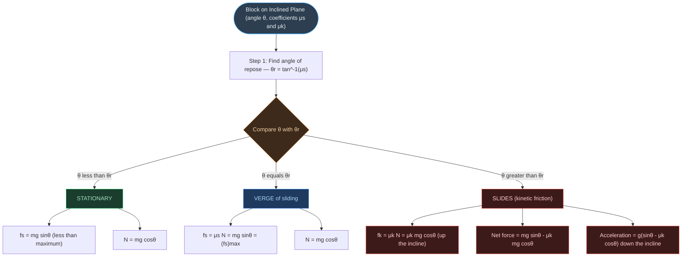
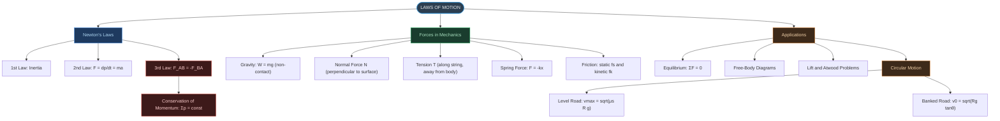
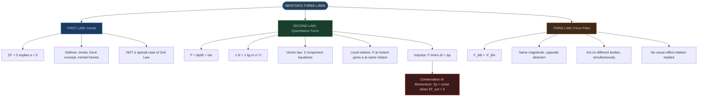
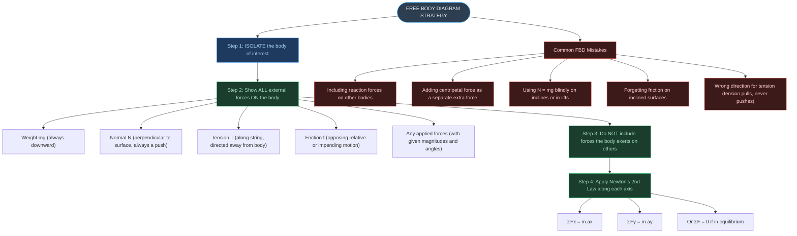

# ⚡ CHAPTER 4 — RAPID REVISION + MIND MAPS
> **Laws of Motion** | Board · NEET · JEE

---

# ONE-PAGE RAPID REVISION SHEET

## 🔢 Key Definitions — Absolute Must-Memorise

| Quantity | Definition | Formula | SI Unit |
|:---|:---|:---|:---|
| **Inertia** | Resistance to change in state of rest/motion | — | measured by mass |
| **Momentum** | Product of mass and velocity | $p = mv$ | kg m s⁻¹ = N s |
| **Force** | Cause that changes or tends to change state of motion | $F = dp/dt = ma$ | N = kg m s⁻² |
| **Impulse** | Large force × short time = change in momentum | $J = F\Delta t = \Delta p$ | N s |
| **Normal Force** | Contact force perpendicular to surfaces in contact | $N = mg$ (equilibrium, horiz.) | N |
| **Static Friction** | Friction opposing impending relative motion | $f_s \leq \mu_s N$ | N |
| **Kinetic Friction** | Friction opposing actual relative motion | $f_k = \mu_k N$ | N |
| **Centripetal Force** | Net inward force in circular motion | $f_c = mv^2/R$ | N |
| **Optimum Speed** | Speed on banked road needing zero friction | $v_0 = \sqrt{Rg\tan\theta}$ | m s⁻¹ |

---

## 📐 Essential Formulae — Must Know Cold

> [!important] Newton's Laws
>
> $$\text{1st Law:} \quad \Sigma\mathbf{F} = 0 \iff \mathbf{a} = 0 \quad \text{(defines inertia and inertial frames)}$$
>
> $$\text{2nd Law:} \quad \mathbf{F} = \frac{d\mathbf{p}}{dt} = m\mathbf{a} \quad \text{where } 1\text{ N} = 1\text{ kg m s}^{-2}$$
>
> $$\text{3rd Law:} \quad \mathbf{F}_{AB} = -\mathbf{F}_{BA} \quad \text{(pairs; different bodies; simultaneous)}$$

> [!important] Momentum and Impulse
>
> $$\mathbf{p} = m\mathbf{v} \quad [\text{MLT}^{-1}]$$
>
> $$\text{Impulse} = \mathbf{F}\Delta t = \Delta\mathbf{p} \quad [\text{MLT}^{-1}]$$
>
> $$\text{Conservation: } \sum\mathbf{p} = \text{const} \quad \text{when } \sum\mathbf{F}_{ext} = 0$$
>
> $$\text{Gun recoil: } m_b v_b + m_g v_g = 0$$

> [!important] Friction
>
> $$f_s \leq \mu_s N \quad \text{(static; self-adjusting up to } \mu_s N\text{)}$$
>
> $$f_k = \mu_k N \quad \text{(kinetic; constant for given } N\text{)}$$
>
> $$\mu_k < \mu_s \quad \text{ALWAYS}$$
>
> $$\text{Angle of repose: } \mu_s = \tan\theta_r$$
>
> $$\text{Slides when: } \theta > \theta_r = \tan^{-1}(\mu_s)$$

> [!important] Circular Motion
>
> $$f_c = \frac{mv^2}{R}$$
>
> $$v_\text{max}\text{ (level road)} = \sqrt{\mu_s Rg} \quad \text{(independent of mass)}$$
>
> $$v_0\text{ (banked, }f=0\text{)} = \sqrt{Rg\tan\theta}$$
>
> $$v_\text{max}\text{ (banked)} = \sqrt{Rg\cdot\frac{\tan\theta + \mu_s}{1 - \mu_s\tan\theta}}$$
>
> $$v_\text{min}\text{ (banked)} = \sqrt{Rg\cdot\frac{\tan\theta - \mu_s}{1 + \mu_s\tan\theta}}$$

> [!important] Lift (Elevator)
>
> Rest or uniform velocity: $N = mg$
>
> Accelerating upward ($+a$): $N = m(g+a)$ — feels heavier
>
> Accelerating downward ($+a$): $N = m(g-a)$ — feels lighter
>
> Free fall: $N = 0$ — weightless

---

## 📊 Important Comparisons — Instant Recall

> [!note] Static vs Kinetic Friction
> **Static:** Opposes IMPENDING motion; self-adjusting from 0 to $(f_s)_\text{max} = \mu_s N$
>
> **Kinetic:** Opposes ACTUAL sliding motion; constant $= \mu_k N$
>
> $\mu_k < \mu_s$ ALWAYS. Both are independent of area of contact and approximately independent of normal force.

> [!note] 1st Law vs 2nd Law
> **1st Law:** Defines inertia AND inertial frames; special case when $F = 0$
>
> **2nd Law:** Quantifies force-acceleration relation; assumes inertial frame already established by 1st Law
>
> They are NOT equivalent — 1st Law has extra conceptual content.

> [!note] Action-Reaction (3rd Law) vs Equilibrium (1st Law)
> **Action-Reaction:** Different bodies; simultaneous; NEVER cancel each other
>
> **Equilibrium:** Net force on the SAME body = 0; different forces may cancel
>
> $mg$ and $N$ on a book: NOT action-reaction (both act on the same body)
>
> $N$ on book by table AND $N$ on table by book: IS an action-reaction pair

---

## ⚠️ Critical Distinctions — High-Yield Traps

> [!warning] Momentum and Impulse Traps
> - Impulse $= \Delta p = F\Delta t$ (large $F$, small $t$)
> - Momentum is a vector; change in direction means change in momentum
> - Ball bouncing off wall: $|\Delta p| = 2mv$ (NOT zero; direction reverses)
> - $[\text{Impulse}] = [\text{Momentum}] = [\text{MLT}^{-1}] \neq [\text{Force}] = [\text{MLT}^{-2}]$

> [!warning] Friction Traps
> - $f_s \neq \mu_s N$ in general; $f_s = \mu_s N$ ONLY at the limiting condition
> - Friction opposes RELATIVE MOTION, not absolute motion
> - Static friction CAN accelerate a body (e.g., box in accelerating train)
> - Rolling friction $\ll$ kinetic friction (orders of magnitude smaller)
> - Friction laws are empirical (approximate), not fundamental

> [!warning] Circular Motion Traps
> - Centripetal force is NOT a new force — it is the name for the net inward force
> - NEVER add "centripetal force" as a separate entity in a free-body diagram
> - $v_\text{max}$ on level road is independent of vehicle mass
> - On banked road at $v_0$: friction $= 0$ (not maximum)
> - Below $v_\text{min}$ (banked): car slides INWARD and down
> - Above $v_\text{max}$ (banked): car slides OUTWARD and up

> [!warning] Newton's Third Law Traps
> - Action and reaction are SIMULTANEOUS (no cause-effect ordering)
> - They act on DIFFERENT bodies — never cancel each other
> - Internal forces ($A \to B$ and $B \to A$ within the system) cancel in pairs
> - $mg$ and $N$ on a body are NOT an action-reaction pair
> - Horse can move forward despite reaction from cart — net external force (ground friction on horse's hooves) is unbalanced

---

## 🔑 Special Results

| Result | Formula |
|:---|:---|
| Maximum speed on level circular road | $v_\text{max} = \sqrt{\mu_s Rg}$ — independent of mass |
| Optimum speed on banked road | $v_0 = \sqrt{Rg\tan\theta}$ |
| Angle of repose | $\theta_r = \tan^{-1}(\mu_s)$ |
| Atwood machine acceleration | $a = \dfrac{(m_1-m_2)g}{m_1+m_2}$ |
| Atwood machine tension | $T = \dfrac{2m_1 m_2 g}{m_1+m_2}$ |
| Apparent weight in lift (up, $a$) | $W' = m(g+a)$ |
| Apparent weight in lift (down, $a$) | $W' = m(g-a)$ |
| Gun recoil speed | $v_\text{gun} = \dfrac{m_\text{bullet} \times v_\text{bullet}}{m_\text{gun}}$ |
| Ball bouncing off wall: $|\Delta p|$ | $2mv$ (speed unchanged, direction reversed) |

---

## ⚡ Dimensional Formulae

| Quantity | Dimensional Formula |
|:---|:---|
| Force | $[\text{MLT}^{-2}]$ |
| Momentum | $[\text{MLT}^{-1}]$ |
| Impulse | $[\text{MLT}^{-1}]$ (same as momentum) |
| Spring constant | $[\text{MT}^{-2}]$ |
| Coefficient of friction $\mu$ | Dimensionless |

---

## 🔁 Friction on an Incline — Decision Flowchart

---

# 🗺️ MIND MAP 1 — Chapter Overview

---

# 🗺️ MIND MAP 2 — Newton's Three Laws Compared

---

# 🗺️ MIND MAP 3 — Friction: Complete Picture

```mermaid
flowchart TD
    ROOT(["FRICTION"])
    ROOT --> S["Static Friction"]
    ROOT --> K["Kinetic Friction"]
    ROOT --> R["Rolling Friction"]
    ROOT --> RED["Reducing Friction"]
    ROOT --> USE["Friction is Essential For"]
    S --> S1["Opposes IMPENDING motion"]
    S --> S2["Self-adjusting: 0 to (fs)max"]
    S --> S3["(fs)max = μs N"]
    S --> S4["Angle of repose: μs = tanθr"]
    K --> K1["Opposes ACTUAL sliding motion"]
    K --> K2["fk = μk N (constant for given N)"]
    K --> K3["μk is always less than μs"]
    K --> K4["Approximately independent of speed"]
    R --> R1["2 to 3 orders of magnitude less than sliding friction"]
    R --> R2["Due to deformation at contact point"]
    R --> R3["Reason wheels and ball bearings are used"]
    RED --> RED1["Lubricants: reduce μk"]
    RED --> RED2["Ball bearings: rolling replaces sliding"]
    RED --> RED3["Air cushions: surfaces separated"]
    USE --> USE1["Walking and running"]
    USE --> USE2["Vehicle braking and acceleration"]
    USE --> USE3["Gripping and holding objects"]

    style ROOT fill:#2c3e50,color:#ecf0f1,stroke:#3498db
    style S fill:#1a3d2e,color:#a9dfbf,stroke:#2ecc71
    style K fill:#3d2a1a,color:#f0d0a8,stroke:#e67e22
    style R fill:#1e3a5f,color:#aed6f1,stroke:#4a9eff
    style K3 fill:#3d1a1a,color:#ffd0d0,stroke:#e74c3c
```

---

# 🗺️ MIND MAP 4 — Circular Motion and Centripetal Force

```mermaid
flowchart TD
    ROOT(["CIRCULAR MOTION"])
    ROOT --> CF["Centripetal Force: fc = mv^2/R"]
    CF --> WARN["NOT a new type of force"]
    WARN --> WARN1["It is the NET radially inward force from real sources"]
    WARN --> WARN2["Never add it as extra force in FBD"]
    CF --> LV["Level Road"]
    CF --> BR["Banked Road"]
    CF --> SRC["Sources of Centripetal Force"]
    LV --> LV1["N = mg (vertical equilibrium)"]
    LV --> LV2["Friction provides centripetal force"]
    LV --> LV3["vmax = sqrt(μs R g)"]
    LV --> LV4["Independent of vehicle mass"]
    BR --> BR1["Optimum v0 = sqrt(Rg tanθ): friction = 0"]
    BR --> BR2["vmax = sqrt(Rg times (tanθ + μs) / (1 - μs tanθ))"]
    BR --> BR3["vmin = sqrt(Rg times (tanθ - μs) / (1 + μs tanθ))"]
    BR --> BR4["Banking always safer than level road for same R and μs"]
    SRC --> SRC1["Stone on string: Tension"]
    SRC --> SRC2["Planet orbiting Sun: Gravity"]
    SRC --> SRC3["Car on road: Static Friction"]
    SRC --> SRC4["Electron in atom: Electrostatic Force"]

    style ROOT fill:#2c3e50,color:#ecf0f1,stroke:#3498db
    style CF fill:#1a3d2e,color:#a9dfbf,stroke:#2ecc71
    style WARN fill:#3d1a1a,color:#ffd0d0,stroke:#e74c3c
    style WARN1 fill:#3d1a1a,color:#ffd0d0,stroke:#e74c3c
    style WARN2 fill:#3d1a1a,color:#ffd0d0,stroke:#e74c3c
    style LV fill:#1e3a5f,color:#aed6f1,stroke:#4a9eff
    style BR fill:#3d2a1a,color:#f0d0a8,stroke:#e67e22
```

---

# 🗺️ MIND MAP 5 — Free Body Diagram Strategy

---

## 🏆 Last-Minute Exam Checklist

> [!success] Before answering any problem in Laws of Motion:
> - [ ] Have I drawn a free-body diagram?
> - [ ] Is the friction direction correct (opposing relative or impending motion)?
> - [ ] On an incline: is $N = mg\cos\theta$ (NOT $mg$)?
> - [ ] In a lift: is $N \neq mg$ when accelerating?
> - [ ] For circular motion: have I identified the REAL force acting as centripetal?
> - [ ] Is friction in circular motion STATIC (not kinetic, unless stated)?
> - [ ] Have I checked $\mu_k < \mu_s$ — have I used the right coefficient?
> - [ ] For momentum conservation: is the system truly isolated ($\Sigma F_{ext} = 0$)?
> - [ ] Is the impulse $= \Delta p = 2mv$ (for direction reversal) or $mv$ (for coming to rest)?
> - [ ] Are action-reaction forces on DIFFERENT bodies — not same body?

---

*End of Rapid Revision + Mind Maps — Physics Ch. 4: Laws of Motion*