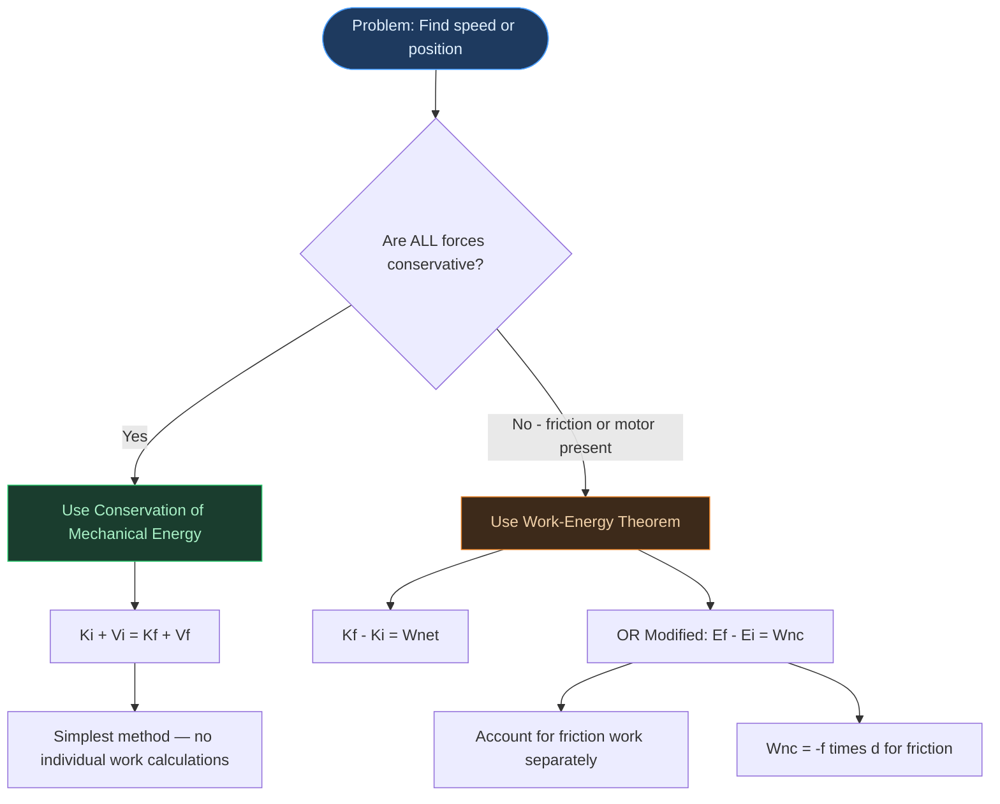
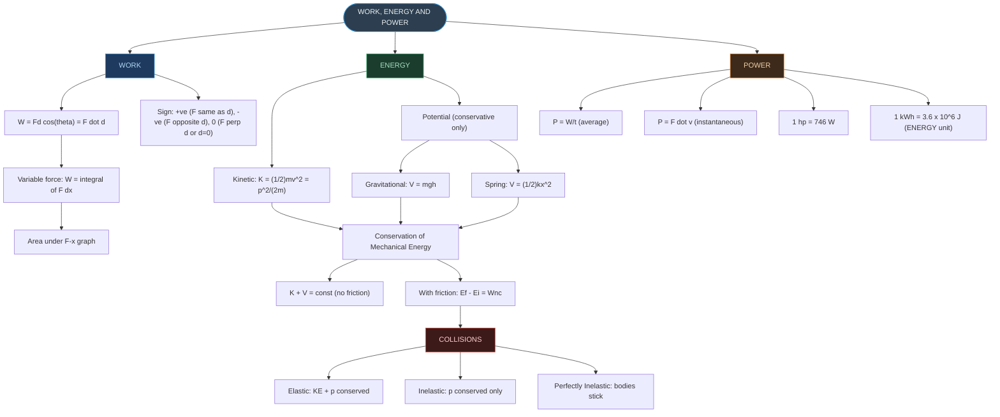
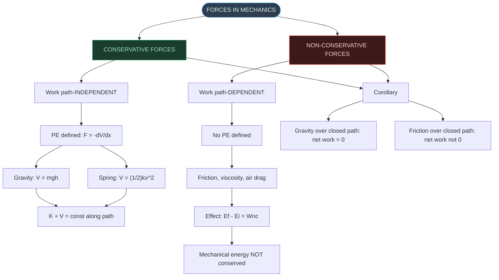
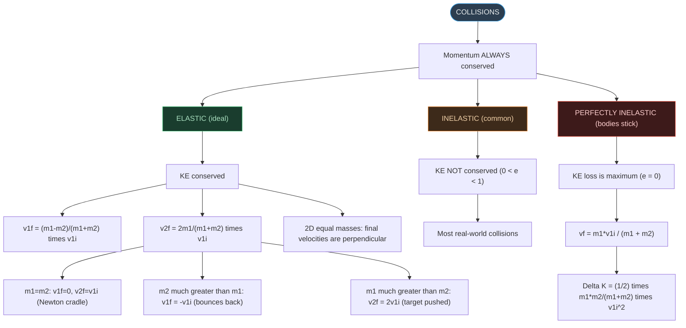
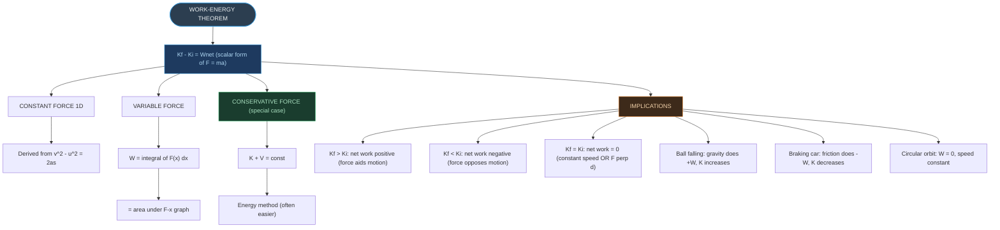
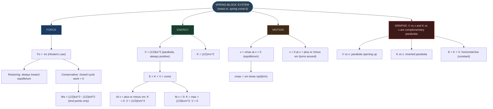

# ⚡ CHAPTER 5 — RAPID REVISION + MIND MAPS
> **Work, Energy and Power** | Board · NEET · JEE

---

# ONE-PAGE RAPID REVISION SHEET

## 🔢 Key Definitions — Absolute Must-Memorise

| Quantity | Definition | Formula | SI Unit |
|:---|:---|:---|:---|
| **Work** | Product of force and displacement in direction of force | $W = \mathbf{F}\cdot\mathbf{d} = Fd\cos\theta$ | J (Joule) |
| **Kinetic Energy** | Energy due to motion | $K = \tfrac{1}{2}mv^2 = p^2/2m$ | J |
| **Gravitational PE** | Energy stored due to position at height h | $V = mgh$ | J |
| **Spring PE** | Energy stored in a deformed spring | $V = \tfrac{1}{2}kx^2$ | J |
| **Mechanical Energy** | Sum of KE and PE | $E = K + V$ | J |
| **Power** | Rate of doing work | $P = dW/dt = \mathbf{F}\cdot\mathbf{v}$ | W (Watt) |
| **Spring Constant** | Stiffness of spring; $F = -kx$ | $k = F/x$ | N m⁻¹ |

---

## 📐 Essential Formulae — Must Know Cold

> [!important] Work and Kinetic Energy
>
> $$W = Fd\cos\theta = \mathbf{F}\cdot\mathbf{d} \qquad [ML^2T^{-2}] = \text{J}$$
>
> $$K = \frac{1}{2}mv^2 \qquad K = \frac{p^2}{2m}$$
>
> $$\text{Work-Energy Theorem: } K_f - K_i = W_{net}$$
>
> $$\text{Variable force: } W = \int F(x)\,dx = \text{area under F-x graph}$$

> [!important] Potential Energy and Conservation
>
> $$\text{Gravitational PE: } V = mgh \quad (V=0 \text{ at ground})$$
>
> $$\text{Spring PE: } V = \tfrac{1}{2}kx^2 \quad (V=0 \text{ at equilibrium})$$
>
> $$\text{Conservative force: } F = -\frac{dV}{dx}$$
>
> $$\text{Conservation of Mechanical Energy: } K + V = \text{const} \quad \text{(conservative forces only)}$$
>
> $$\text{With friction: } E_f - E_i = W_{nc} \quad (W_{nc} < 0 \text{ for friction})$$

> [!important] Circular Loop (String — Minimum Condition)
>
> $$\text{Min speed at top C: } v_C = \sqrt{gL}$$
>
> $$\text{Min speed at bottom A: } v_0 = \sqrt{5gL}$$
>
> $$\text{Speed at side B (height } L\text{): } v_B = \sqrt{3gL}$$
>
> $$T_C = 0 \text{ at top for minimum condition}$$

> [!important] Spring
>
> $$\text{Hooke's Law: } F_s = -kx \qquad [MT^{-2}] = \text{N m}^{-1}$$
>
> $$V(x) = \tfrac{1}{2}kx^2$$
>
> $$\text{Max speed in oscillation: } v_m = x_m\sqrt{k/m}$$
>
> $$\oint F_s\,dx = 0 \quad \text{(spring is conservative)}$$

> [!important] Power
>
> $$P_{av} = \frac{W}{t} \qquad P_{inst} = \frac{dW}{dt} = \mathbf{F}\cdot\mathbf{v} \qquad [ML^2T^{-3}] = \text{W}$$
>
> $$1 \text{ hp} = 746 \text{ W}$$
>
> $$1 \text{ kWh} = 3.6 \times 10^6 \text{ J} \quad \textbf{(unit of ENERGY, not power!)}$$

> [!important] Collisions
>
> $$\text{ALL collisions: linear momentum conserved}$$
>
> $$\text{Elastic only: KE also conserved}$$
>
> $$v_{1f} = \frac{m_1 - m_2}{m_1+m_2}\,v_{1i} \quad \text{(elastic, } m_2 \text{ at rest)}$$
>
> $$v_{2f} = \frac{2m_1}{m_1+m_2}\,v_{1i} \quad \text{(elastic, } m_2 \text{ at rest)}$$
>
> $$v_f = \frac{m_1}{m_1+m_2}\,v_{1i} \quad \text{(perfectly inelastic)}$$
>
> $$\text{Equal mass elastic: } v_{1f}=0;\; v_{2f}=v_{1i} \text{ (perfect transfer)}$$

---

## 📊 Important Comparisons — Instant Recall

> [!note] Conservative vs Non-Conservative Forces
> **Conservative:** Work path-independent; $\Delta V = -W$; PE defined
>
> Examples: Gravity, spring, electrostatic force
>
> **Non-conservative:** Work path-dependent; PE NOT defined
>
> Examples: Friction, viscosity, air drag
>
> With friction: $E_f - E_i = W_{nc} < 0$

> [!note] Elastic vs Inelastic Collision
> **Both:** Momentum conserved (always)
>
> **Elastic:** KE conserved; $e = 1$; no permanent deformation
>
> **Inelastic:** KE not conserved; $e < 1$
>
> **Perfectly Inelastic:** Maximum KE lost; bodies stick together; $e = 0$
>
> $$\Delta K_{\text{lost}} = \frac{1}{2}\frac{m_1 m_2}{m_1+m_2}v_{1i}^2$$

> [!note] Work vs Power vs Energy
> **Work:** Force × displacement (scalar, can be negative)
>
> **Energy:** Capacity to do work (scalar, can be potential or kinetic)
>
> **Power:** Rate of doing work (scalar, always > 0 for positive work direction)
>
> 1 kWh = energy (power × time) — NOT a unit of power

---

## ⚠️ Critical Distinctions — High-Yield Traps

> [!warning] Work Traps
> - Work by gravity on upward motion = $-mgh$ (negative)
> - Work by normal force on horizontal motion = 0 (perpendicular)
> - Porter walking with load on head: W by porter on load = 0
> - $W_{12} + W_{21} \neq 0$ in general (unlike force pairs which cancel)
> - Work done depends on **displacement**, NOT distance (vectors matter)
> - For circular motion: W by centripetal force = 0 always

> [!warning] Energy Traps
> - KE is always non-negative ($\tfrac{1}{2}mv^2 \geq 0$)
> - PE can be negative (if reference is not at lowest point)
> - Satellite speeds up as it spirals inward despite losing total mechanical energy: PE decreases more than KE increases; speed increases because orbital radius decreases
> - $V = \tfrac{1}{2}kx^2$: symmetric — same PE for compression and extension

> [!warning] Collision Traps
> - Momentum: ALWAYS conserved in every collision
> - KE: conserved ONLY in elastic collisions
> - Equal mass elastic collision: first body stops, second gets all the velocity
> - During a collision, even in elastic case: KE is NOT conserved (deformation occurs)
> - Coefficient of restitution: $e = 1$ (elastic); $e = 0$ (perfectly inelastic)
> - 2D elastic collision of equal masses: final velocities are perpendicular to each other

> [!warning] Power Traps
> - kWh is a unit of energy, not power
> - 1 hp = 746 W (not 550 W — that is the ft·lb/s definition)
> - $P = \mathbf{F}\cdot\mathbf{v}$ uses **instantaneous** velocity
> - At maximum speed (terminal): $P = \text{resistive force} \times v_{\max}$

---

## 🔑 Special Results — High-Yield

| Result | Formula / Value |
|:---|:---|
| Speed at bottom of loop (just completes) | $v_0 = \sqrt{5gL}$ |
| Speed at top of loop (just completes) | $v_C = \sqrt{gL}$ |
| Maximum speed of spring-block | $v_m = x_m\sqrt{k/m}$ |
| Fraction of KE transferred in elastic collision | $\dfrac{4m_1 m_2}{(m_1+m_2)^2}$ |
| KE lost in perfectly inelastic collision | $\dfrac{1}{2}\dfrac{m_1 m_2}{m_1+m_2}v_{1i}^2$ |
| Max speed under constant power P, resistance f | $v_{\max} = P/f$ |
| KE in terms of momentum | $K = p^2/(2m)$ |
| Equal momenta → KE ratio | $K_1 : K_2 = m_2 : m_1$ |
| Equal KE → momentum ratio | $p_1 : p_2 = \sqrt{m_1} : \sqrt{m_2}$ |
| 1 kWh in Joules | $3.6 \times 10^6 \text{ J}$ |

---

## ⚡ Dimensional Formulae

| Quantity | Dimensional Formula |
|:---|:---|
| Work / Energy / PE / KE | $[ML^2T^{-2}]$ |
| Power | $[ML^2T^{-3}]$ |
| Spring constant k | $[MT^{-2}]$ |
| Momentum p | $[MLT^{-1}]$ |
| Force | $[MLT^{-2}]$ |

---

## 🔁 Energy Method vs WE Theorem — Decision Chart

**Examples:**
- Ball rolling down frictionless ramp → K + V = const
- Car skidding to stop → KE lost = friction force × distance
- Car colliding with spring (with friction) → WE theorem
- Pendulum bob (no friction) → K + V = const

---

# 🗺️ MIND MAP 1 — Chapter Overview

---

# 🗺️ MIND MAP 2 — Types of Forces and Energy

---

# 🗺️ MIND MAP 3 — Collision Types

---

# 🗺️ MIND MAP 4 — Work-Energy Theorem: The Big Picture

---

# 🗺️ MIND MAP 5 — Spring-Block System

---

## 🏆 Last-Minute Exam Checklist

- [ ] Is displacement zero? (If yes, W = 0 regardless of force)
- [ ] What is the angle θ between F and d? (0°, 90°, or 180°?)
- [ ] Can I use K + V = const? (Only if no friction / non-conservative forces)
- [ ] If friction present: use WE theorem; $W_{nc} = -f \times \text{displacement}$
- [ ] For spring problems: $V = \tfrac{1}{2}kx^2$ (always +ve); $F = -kx$ (restoring)
- [ ] For collision: identify elastic or inelastic **first**
- [ ] Perfectly inelastic: use $v_f = m_1 v_1 / (m_1 + m_2)$; NEVER use KE conservation
- [ ] Equal mass elastic: first body STOPS; complete transfer
- [ ] Is power asked? $P = W/t$ or $P = Fv$ (use instantaneous velocity)
- [ ] kWh = energy unit = $3.6 \times 10^6$ J (not power!)
- [ ] For loop-the-loop: $v_0 = \sqrt{5gL}$ at bottom; $v_C = \sqrt{gL}$ at top
- [ ] Potential energy zero is arbitrary — choose convenient reference
- [ ] Check sign of work: negative work → energy taken from body

---

*End of Revision Notes + Mind Maps — Physics Ch. 5*