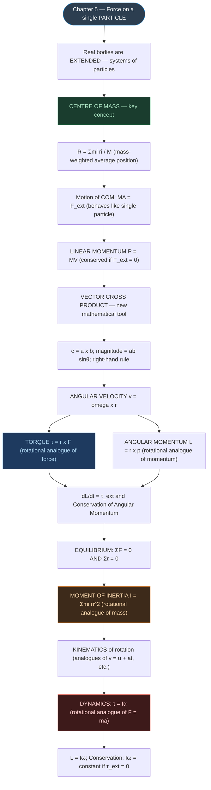

# CHAPTER 6: SYSTEMS OF PARTICLES AND ROTATIONAL MOTION

### Complete Study Notes | Board · NEET · JEE Layered

---

## 🗺️ CONCEPT ROADMAP

---

## SECTION 1 — INTRODUCTION: RIGID BODIES AND TYPES OF MOTION ⭐

### 1.1 What is a Rigid Body?

> [!note] Definition
> A **rigid body** is a body with a perfectly definite and unchanging shape. The distances between all pairs of particles remain constant, regardless of the forces acting.

No real body is truly rigid; deformations exist but are often negligible (e.g., a steel beam, a flywheel, a wheel of a vehicle).

### 1.2 Types of Motion of a Rigid Body

| Type | Description | Example |
|:---|:---|:---|
| **Pure Translation** | All particles have the same velocity at every instant | Block sliding down inclined plane |
| **Pure Rotation** | Body rotates about a fixed axis; particles move in circles | Ceiling fan, Potter's wheel |
| **Rolling Motion** | Translation + Rotation combined | Cylinder rolling down an incline |

> [!important] Key Principle
> In **pure translation**, every particle has the same velocity. In **pure rotation** about a fixed axis, every particle has the **same angular velocity** ω.

### 1.3 Rotation About a Fixed Axis

- Every particle moves in a **circle** lying in a plane **perpendicular** to the fixed axis, with its centre on the axis.
- A particle at perpendicular distance r from the axis traces a circle of radius r.
- Particles **on the axis** have r = 0, so v = ωr = 0 → they remain **stationary**.
- The axis of a spinning top is **not fixed** (it precesses) — our chapter mainly deals with fixed-axis rotation.

---

## SECTION 2 — CENTRE OF MASS (COM) ⭐⭐⭐

### 2.1 Definition (Two-Particle System)

For two particles of masses $m_1$ and $m_2$ at positions $x_1$ and $x_2$ along the x-axis:

$$\boxed{X = \frac{m_1x_1 + m_2x_2}{m_1 + m_2}} \qquad \text{...(6.1)}$$

- If $m_1 = m_2$: $X = (x_1 + x_2)/2$ — COM lies exactly **midway** between equal masses.
- X is the **mass-weighted mean** of $x_1$ and $x_2$.

### 2.2 General Case — n Particles

$$\boxed{X = \frac{\sum m_i x_i}{M}, \quad Y = \frac{\sum m_i y_i}{M}, \quad Z = \frac{\sum m_i z_i}{M}} \qquad \text{...(6.4a–c)}$$

where $M = \sum m_i$ is the **total mass**.

**In vector form:**

$$\boxed{\mathbf{R} = \frac{\sum m_i \mathbf{r}_i}{M}} \qquad \text{...(6.4d)}$$

> [!note] Origin Choice
> If the origin is chosen **at the COM**, then $\sum m_i \mathbf{r}_i = \mathbf{0}$.

### 2.3 Continuous Mass Distribution

$$X = \frac{1}{M}\int x\,dm, \quad Y = \frac{1}{M}\int y\,dm, \quad Z = \frac{1}{M}\int z\,dm \qquad \text{...(6.5a)}$$

**For uniform, symmetric bodies:** The COM coincides with the **geometric centre** — by symmetry, for every element $dm$ at $\mathbf{r}$, there is an element $dm$ at $-\mathbf{r}$, so the integrals vanish.

### 2.4 COM of Regular Shapes

| Body | COM Location |
|:---|:---|
| Uniform thin rod | Midpoint (geometric centre) |
| Uniform ring of radius R | Centre of the ring |
| Uniform disc of radius R | Centre of the disc |
| Uniform sphere of radius R | Centre of the sphere |
| Uniform triangular lamina | Centroid (intersection of medians) |
| L-shaped lamina (uniform) | Use mass-weighted average of sub-shapes |

### 2.5 Solved Examples from NCERT

> [!example] Example 6.1 — Three unequal masses at vertices of equilateral triangle (side 0.5 m)
>
> Masses: $m_1 = 100$ g at O(0,0), $m_2 = 150$ g at A(0.5, 0), $m_3 = 200$ g at B(0.25, 0.25√3)
>
> $$X = \frac{100(0) + 150(0.5) + 200(0.25)}{450} = \frac{125}{450} = \frac{5}{18} \text{ m}$$
>
> $$Y = \frac{100(0) + 150(0) + 200(0.25\sqrt{3})}{450} = \frac{1}{3\sqrt{3}} \text{ m}$$
>
> Note: COM is NOT the geometric centre of the triangle (unequal masses).

> [!example] Example 6.3 — L-shaped uniform lamina (3 kg, three unit squares)
>
> COM of each unit square is at its geometric centre: $C_1 = (1/2, 1/2)$, $C_2 = (3/2, 1/2)$, $C_3 = (1/2, 3/2)$; each of mass 1 kg.
>
> $$X = \frac{1(1/2) + 1(3/2) + 1(1/2)}{3} = \frac{5}{6} \text{ m}$$
>
> $$Y = \frac{1(1/2) + 1(1/2) + 1(3/2)}{3} = \frac{5}{6} \text{ m}$$
>
> COM lies on the line of symmetry at (5/6, 5/6).

---

## SECTION 3 — MOTION OF THE CENTRE OF MASS ⭐⭐⭐

### 3.1 Derivation

Differentiating $\mathbf{R} = \frac{\sum m_i \mathbf{r}_i}{M}$ twice with respect to time:

First derivative: $M\mathbf{V} = \sum m_i \mathbf{v}_i = \mathbf{P}$ (total linear momentum) ...(6.8)

Second derivative: $M\mathbf{A} = \sum m_i \mathbf{a}_i = \sum \mathbf{F}_i$

Since internal forces cancel in pairs (Newton's 3rd law):

$$\boxed{M\mathbf{A} = \mathbf{F}_{ext}} \qquad \text{...(6.11)}$$

> [!important] Critical Statement
> The centre of mass of a system of particles moves **as if all the mass of the system were concentrated at the COM and all external forces were applied at that point.**

### 3.2 Implications

- To find the translational motion of a system, we need only the **external forces** — no knowledge of internal forces required.
- **Projectile explosion:** A projectile follows a parabolic path. If it explodes mid-air, the COM continues on the **same parabola** — gravity (external) is unchanged.

### 3.3 Total Linear Momentum

$$\mathbf{P} = M\mathbf{V} \qquad \text{...(6.15)}$$

$$\frac{d\mathbf{P}}{dt} = \mathbf{F}_{ext} \qquad \text{...(6.17)}$$

**Conservation of Linear Momentum:** If $\mathbf{F}_{ext} = \mathbf{0}$, then $\mathbf{P} =$ constant ...(6.18a)

This means: when total external force = 0, the **velocity of the COM remains constant** (uniform straight-line motion).

> [!note] Applications
> Binary stars, radioactive decay, explosions — the COM continues uniformly; individual fragments deviate, but their COM tracks the original trajectory.

---

## SECTION 4 — VECTOR (CROSS) PRODUCT OF TWO VECTORS ⭐⭐

### 4.1 Definition

The **vector product** (cross product) of **a** and **b** is a vector **c** = **a** × **b** such that:

1. **Magnitude:** $|\mathbf{c}| = ab\sin\theta$ (θ is the angle between **a** and **b**)
2. **Direction:** Perpendicular to the plane of **a** and **b** (right-hand screw rule)

> [!note] Right-Hand Rule
> Curl the fingers of the right hand from **a** toward **b** (through the smaller angle); the stretched thumb points in the direction of **a** × **b**.

### 4.2 Key Properties

| Property | Expression |
|:---|:---|
| **Not commutative** | $\mathbf{a} \times \mathbf{b} = -(\mathbf{b} \times \mathbf{a})$ |
| **Distributive** | $\mathbf{a} \times (\mathbf{b} + \mathbf{c}) = \mathbf{a} \times \mathbf{b} + \mathbf{a} \times \mathbf{c}$ |
| **Anti-parallel / same direction** | $\mathbf{a} \times \mathbf{a} = \mathbf{0}$ |
| **Perpendicular vectors** | $|\mathbf{a} \times \mathbf{b}| = ab$ (maximum; $\sin\theta = 1$ at $\theta = 90°$) |

**For unit vectors î, ĵ, k̂ (cyclic order is positive):**

$$\hat{i}\times\hat{i} = \hat{j}\times\hat{j} = \hat{k}\times\hat{k} = \mathbf{0}$$

$$\hat{i}\times\hat{j} = \hat{k}, \quad \hat{j}\times\hat{k} = \hat{i}, \quad \hat{k}\times\hat{i} = \hat{j}$$

$$\hat{j}\times\hat{i} = -\hat{k}, \quad \hat{k}\times\hat{j} = -\hat{i}, \quad \hat{i}\times\hat{k} = -\hat{j}$$

> [!tip] Memory Device
> î → ĵ → k̂ → î (cyclic) gives **positive** cross products. Reverse order gives **negative**.

### 4.3 Component Form (Determinant)

$$\mathbf{a}\times\mathbf{b} = \begin{vmatrix} \hat{i} & \hat{j} & \hat{k} \\ a_x & a_y & a_z \\ b_x & b_y & b_z \end{vmatrix} = (a_yb_z - a_zb_y)\hat{i} - (a_xb_z - a_zb_x)\hat{j} + (a_xb_y - a_yb_x)\hat{k}$$

### 4.4 Contrast: Dot Product vs Cross Product

| Feature | Scalar (Dot) Product | Vector (Cross) Product |
|:---|:---|:---|
| Result | Scalar | Vector |
| Formula | $\mathbf{A}\cdot\mathbf{B} = AB\cos\theta$ | $|\mathbf{A}\times\mathbf{B}| = AB\sin\theta$ |
| Commutative? | Yes: $\mathbf{A}\cdot\mathbf{B} = \mathbf{B}\cdot\mathbf{A}$ | **No**: $\mathbf{A}\times\mathbf{B} = -(\mathbf{B}\times\mathbf{A})$ |
| Zero when | $\mathbf{A} \perp \mathbf{B}$ (θ = 90°) | $\mathbf{A} \parallel \mathbf{B}$ (θ = 0° or 180°) |
| Max when | $\mathbf{A} \parallel \mathbf{B}$ (θ = 0°) | $\mathbf{A} \perp \mathbf{B}$ (θ = 90°) |
| Physical use | Work, Power | Torque, Angular Momentum |

### 4.5 Solved Example (NCERT 6.4)

> [!example] Example 6.4
>
> $\mathbf{a} = (3\hat{i} - 4\hat{j} + 5\hat{k})$, $\mathbf{b} = (-2\hat{i} + \hat{j} - 3\hat{k})$
>
> $\mathbf{a}\cdot\mathbf{b} = (3)(-2) + (-4)(1) + (5)(-3) = -6 - 4 - 15 = \mathbf{-25}$
>
> $$\mathbf{a}\times\mathbf{b} = \begin{vmatrix}\hat{i}&\hat{j}&\hat{k}\\3&-4&5\\-2&1&-3\end{vmatrix} = \mathbf{7\hat{i} - \hat{j} - 5\hat{k}}$$
>
> Note: $\mathbf{b}\times\mathbf{a} = -7\hat{i} + \hat{j} + 5\hat{k}$ (opposite sign) ✓

---

## SECTION 5 — ANGULAR VELOCITY AND ITS RELATION TO LINEAR VELOCITY ⭐⭐⭐

### 5.1 Angular Velocity ω

For a particle executing circular motion, the **instantaneous angular velocity** is:

$$\omega = \frac{d\theta}{dt}$$

- It is a **vector** directed along the fixed axis of rotation (right-hand screw rule).
- SI unit: **rad s⁻¹**; Dimensional formula: **[T⁻¹]**
- All particles of a rigid body rotating about a fixed axis share the **same ω** at any instant.

### 5.2 Linear Velocity from Angular Velocity

$$\boxed{\mathbf{v} = \boldsymbol{\omega}\times\mathbf{r}} \qquad \text{...(6.20)}$$

where **r** is the position vector of the particle from an origin on the axis.

For a particle at perpendicular distance $r_\perp$ from the axis:

$$v = \omega r_\perp \qquad \text{...(6.19)}$$

> [!note]
> The velocity **v** is **tangential** to the circular path — always perpendicular to both **ω** and **r**.

### 5.3 Angular Acceleration α

$$\boldsymbol{\alpha} = \frac{d\boldsymbol{\omega}}{dt} \qquad \text{...(6.21)}$$

For fixed-axis rotation: $\alpha = d\omega/dt$ (scalar) ...(6.22)

| Linear | Rotational |
|:---|:---|
| Displacement $x$ | Angular displacement $\theta$ |
| Velocity $v = dx/dt$ | Angular velocity $\omega = d\theta/dt$ |
| Acceleration $a = dv/dt$ | Angular acceleration $\alpha = d\omega/dt$ |

---

## SECTION 6 — TORQUE AND ANGULAR MOMENTUM ⭐⭐⭐

### 6.1 Torque (Moment of Force) τ = r × F

> [!note] Definition
> **Torque** is the **rotational analogue of force** — it produces angular acceleration in a body.

For a force **F** acting at position **r** from origin O:

$$\boxed{\boldsymbol{\tau} = \mathbf{r}\times\mathbf{F}} \qquad \text{...(6.23)}$$

**Magnitude:**

$$\tau = rF\sin\theta = r_\perp F = rF_\perp \qquad \text{...(6.24)}$$

where $r_\perp = r\sin\theta$ is the **perpendicular distance** (moment arm / lever arm).

- **SI unit:** N m; **Dimensional formula:** [ML²T⁻²]
- τ = 0 when r = 0, F = 0, or θ = 0° or 180°

> [!warning] Exam Trap
> Torque and work have the **same dimensions** [ML²T⁻²] = N m, but torque is a **vector** (cross product) and work is a **scalar** (dot product). They are completely different physical quantities.

### 6.2 Angular Momentum L = r × p

> [!note] Definition
> **Angular momentum** is the **rotational analogue of linear momentum**.

For a particle of mass m with momentum **p** at position **r** from origin O:

$$\boxed{\mathbf{l} = \mathbf{r}\times\mathbf{p}} \qquad \text{...(6.25a)}$$

**Magnitude:**

$$l = rp\sin\theta = r_\perp p = rp_\perp \qquad \text{...(6.26)}$$

- **SI unit:** kg m² s⁻¹ = J s; **Dimensional formula:** [ML²T⁻¹]
- l = 0 when p = 0 (at rest), r = 0 (at origin), or θ = 0°/180°

### 6.3 Relation Between Torque and Angular Momentum

Differentiating $\mathbf{l} = \mathbf{r}\times\mathbf{p}$ with respect to time:

$$\frac{d\mathbf{l}}{dt} = \frac{d\mathbf{r}}{dt}\times\mathbf{p} + \mathbf{r}\times\frac{d\mathbf{p}}{dt} = \mathbf{v}\times m\mathbf{v} + \mathbf{r}\times\mathbf{F} = 0 + \boldsymbol{\tau}$$

$$\boxed{\frac{d\mathbf{l}}{dt} = \boldsymbol{\tau}} \qquad \text{...(6.27)}$$

> [!important]
> This is the rotational analogue of Newton's 2nd Law: just as $\mathbf{F} = d\mathbf{p}/dt$, we have $\boldsymbol{\tau} = d\mathbf{l}/dt$.

### 6.4 For a System of Particles

$$\mathbf{L} = \sum_i \mathbf{l}_i = \sum_i \mathbf{r}_i \times \mathbf{p}_i \qquad \text{...(6.25b)}$$

$$\frac{d\mathbf{L}}{dt} = \boldsymbol{\tau}_{ext} \qquad \text{...(6.28b)}$$

The time rate of total angular momentum = sum of external torques (internal torques cancel by Newton's 3rd law).

### 6.5 Conservation of Angular Momentum ⭐⭐⭐

If $\boldsymbol{\tau}_{ext} = \mathbf{0}$:

$$\boxed{\mathbf{L} = \text{constant}} \qquad \text{...(6.29a)}$$

> [!important] Conservation Law
> If the total external torque on a system is zero, the total angular momentum is conserved.

Examples: skater pulling in arms (I decreases → ω increases, Iω = const), diver tucking mid-air, girl on swivel chair, Earth's orbit around Sun.

### 6.6 Solved Examples

> [!example] Example 6.5 — Torque calculation
>
> $\mathbf{r} = \hat{i} - \hat{j} + \hat{k}$, $\mathbf{F} = 7\hat{i} + 3\hat{j} - 5\hat{k}$
>
> $$\boldsymbol{\tau} = \begin{vmatrix}\hat{i}&\hat{j}&\hat{k}\\1&-1&1\\7&3&-5\end{vmatrix} = \mathbf{2\hat{i} + 12\hat{j} + 10\hat{k}} \text{ N m}$$

> [!example] Example 6.6 — Constant angular momentum
>
> A particle moving with constant velocity **v** has $\mathbf{l} = \mathbf{r}\times m\mathbf{v}$ with magnitude $mvr\sin\theta = mv(OM)$ where $OM = r\sin\theta$ = constant (perpendicular distance from O to the line of motion). Since direction is also fixed, **l is constant**. External torque = 0 → consistent with $\tau = dl/dt = 0$. ✓

---

## SECTION 7 — EQUILIBRIUM OF A RIGID BODY ⭐⭐

### 7.1 Conditions for Mechanical Equilibrium

A rigid body is in **mechanical equilibrium** when it has neither linear nor angular acceleration:

$$\boxed{\sum \mathbf{F}_i = \mathbf{0}} \qquad \text{(Translational equilibrium) ...(6.30a)}$$

$$\boxed{\sum \boldsymbol{\tau}_i = \mathbf{0}} \qquad \text{(Rotational equilibrium) ...(6.30b)}$$

> [!note]
> The rotational equilibrium condition is **independent of the choice of origin** (provided translational equilibrium also holds).

### 7.2 Partial Equilibrium

- **Translational only, NOT rotational:** A rod with a couple applied (equal and opposite forces at the two ends) — net force = 0 but net torque ≠ 0.
- **Rotational only, NOT translational:** Two equal parallel forces in the same direction at ends of a rod — no net torque about midpoint, but net force ≠ 0.

### 7.3 Couple

> [!note] Definition
> A **couple** is a pair of forces of **equal magnitude** acting in **opposite directions** with **different lines of action**. A couple produces rotation without translation.

Torque of a couple = **AB × F** (independent of origin).

Examples: turning a bottle cap, compass needle in Earth's magnetic field.

### 7.4 Principle of Moments (Lever) ⭐⭐

For a lever (light rod) pivoted at the **fulcrum**:

| Term | Definition |
|:---|:---|
| **Load** $F_1$ | Force to be lifted; at load arm $d_1$ from fulcrum |
| **Effort** $F_2$ | Force applied; at effort arm $d_2$ from fulcrum |
| **Fulcrum** | Pivot point of the lever |

$$\boxed{d_1 F_1 = d_2 F_2} \qquad \text{...(6.32a)}$$

$$\text{Mechanical Advantage} = \frac{F_1}{F_2} = \frac{d_2}{d_1} \qquad \text{...(6.32b)}$$

If $d_2 > d_1$: M.A. > 1 → small effort lifts a large load.

Examples of levers: seesaw, beam balance, scissors, human forearm, pliers.

### 7.5 Centre of Gravity (CG)

> [!note] Definition
> The **Centre of Gravity (CG)** is the point where the total gravitational torque on the body is **zero**.

$$\sum \boldsymbol{\tau}_g = \sum \mathbf{r}_i \times m_i\mathbf{g} = \mathbf{0} \qquad \text{...(6.33)}$$

Since **g** is uniform (same for all particles), the CG **coincides with the COM** for bodies small enough that g is uniform. For very large bodies in a non-uniform gravitational field, CG ≠ COM.

**Finding CG of an irregular body:** Suspend the body from different points successively; the vertical lines through each suspension point intersect at the CG.

### 7.6 Solved Examples from NCERT

> [!example] Example 6.8 — Metal bar (70 cm, 4 kg) on two knife edges; 6 kg load
>
> Bar AB (70 cm), knife edges at K₁ (10 cm from A) and K₂ (10 cm from B). Load $W_1 = 6g$ N at 30 cm from A. $W = 4g$ N at G (35 cm from A).
>
> Translational: $R_1 + R_2 = 10g = 98$ N ...(i)
>
> Rotational (moments about G): $-R_1(0.25) + 6g(0.05) + R_2(0.25) = 0$
>
> $\Rightarrow R_1 - R_2 = 1.2g = 11.76$ N ...(ii)
>
> From (i) and (ii): $R_1 \approx 54.88$ N; $R_2 \approx 43.12$ N

> [!example] Example 6.9 — Ladder (3 m, 20 kg) against frictionless wall, foot 1 m from wall
>
> Vertical equilibrium: $N = W = 20g = 196$ N
>
> Rotational equilibrium (moments about A): $2\sqrt{2}\,F_1 - \tfrac{1}{2}W = 0 \Rightarrow F_1 = \frac{W}{4\sqrt{2}} = 34.6$ N
>
> $F = F_1 = 34.6$ N (friction); $F_2 = \sqrt{F^2 + N^2} = 199.0$ N at $\alpha \approx 80°$ with horizontal.

---

## SECTION 8 — MOMENT OF INERTIA ⭐⭐⭐

### 8.1 Definition

The **moment of inertia** (MI) of a rigid body about an axis:

$$\boxed{I = \sum_i m_i r_i^2} \qquad \text{...(6.34)}$$

where $r_i$ is the **perpendicular distance** of the iᵗʰ particle from the axis.

- **SI unit:** kg m²; **Dimensional formula:** [ML²]
- Depends on: mass, distribution of mass about the axis, and position/orientation of axis.
- Unlike mass, I is **NOT a fixed property** — it changes with the axis chosen.

### 8.2 Kinetic Energy of Rotation

$$\boxed{K_{rot} = \frac{1}{2}I\omega^2} \qquad \text{...(6.35)}$$

Compare with translational KE $K = \tfrac{1}{2}mv^2$ → **I is the rotational analogue of mass m**.

### 8.3 Standard Results — Moments of Inertia (Table 6.1) ⭐⭐

| Body | Axis | $I$ |
|:---|:---|:---|
| Thin circular ring, radius R | Perpendicular to plane, at centre | $MR^2$ |
| Thin circular ring, radius R | Diameter | $MR^2/2$ |
| Thin rod, length L | Perpendicular to rod, at midpoint | $ML^2/12$ |
| Circular disc, radius R | Perpendicular to disc, at centre | $MR^2/2$ |
| Circular disc, radius R | Diameter | $MR^2/4$ |
| Hollow cylinder, radius R | Axis of cylinder | $MR^2$ |
| Solid cylinder, radius R | Axis of cylinder | $MR^2/2$ |
| Solid sphere, radius R | Diameter | $2MR^2/5$ |

> [!warning] Exam Trap
> Hollow cylinder = Ring ($MR^2$). Solid cylinder = Disc ($MR^2/2$). Solid sphere = $2MR^2/5$. Always specify the axis.

### 8.4 Radius of Gyration k

$$I = Mk^2 \quad \Rightarrow \quad k = \sqrt{I/M}$$

k is the **radius of gyration**: the distance from the axis at which the whole mass M, if concentrated, would give the same I.

| Body | Axis | $k$ |
|:---|:---|:---|
| Thin rod (length L) | Midpoint, perpendicular | $L/\sqrt{12}$ |
| Circular disc (radius R) | Diameter | $R/2$ |

### 8.5 Two Special Cases (NCERT derivations)

> [!example] (a) Thin ring (radius R, mass M)
>
> All mass at distance R from axis: $K = \frac{1}{2}Mv^2 = \frac{1}{2}M(R\omega)^2 = \frac{1}{2}(MR^2)\omega^2$
>
> Therefore $I_{ring} = MR^2$

> [!example] (b) Rod of negligible mass, length l, with masses M/2 at each end, rotating about perpendicular axis through centre
>
> $I = \frac{M}{2}\left(\frac{l}{2}\right)^2 + \frac{M}{2}\left(\frac{l}{2}\right)^2 = \frac{Ml^2}{4}$

### 8.6 Flywheel — Practical Application

A **flywheel** is a disc with large I used in steam engines and automobiles. Because of large I, it **resists sudden changes** in angular speed → smooth, jerk-free motion.

---

## SECTION 9 — KINEMATICS OF ROTATIONAL MOTION ABOUT A FIXED AXIS ⭐⭐

### 9.1 Equations of Motion (Uniform Angular Acceleration)

Exact analogues of the linear kinematic equations:

| Linear | Rotational |
|:---|:---|
| $v = v_0 + at$ | $\omega = \omega_0 + \alpha t$ ...(6.36) |
| $x = x_0 + v_0 t + \tfrac{1}{2}at^2$ | $\theta = \theta_0 + \omega_0 t + \tfrac{1}{2}\alpha t^2$ ...(6.37) |
| $v^2 = v_0^2 + 2a(x - x_0)$ | $\omega^2 = \omega_0^2 + 2\alpha(\theta - \theta_0)$ ...(6.38) |

These apply only when angular acceleration α is **constant** (uniform).

### 9.2 Derivation of Eq. (6.36)

Since $\alpha = d\omega/dt =$ constant, integrating: $\omega = \alpha t + c$. At $t = 0$, $\omega = \omega_0 \Rightarrow c = \omega_0$.

Therefore $\omega = \omega_0 + \alpha t$ ✓

Integrating again: $\theta = \theta_0 + \omega_0 t + \tfrac{1}{2}\alpha t^2$ ✓

### 9.3 Solved Example (NCERT 6.11) — Motor Wheel ⭐

> [!example] Angular speed increases from 1200 rpm to 3120 rpm in 16 s
>
> $\omega_0 = 2\pi \times 1200/60 = 40\pi$ rad s⁻¹; $\omega = 2\pi \times 3120/60 = 104\pi$ rad s⁻¹
>
> **(i)** $\alpha = (\omega - \omega_0)/t = (104\pi - 40\pi)/16 = \mathbf{4\pi}$ rad s⁻²
>
> **(ii)** $\theta = \omega_0 t + \tfrac{1}{2}\alpha t^2 = 40\pi(16) + \tfrac{1}{2}(4\pi)(256) = 1152\pi$ rad
>
> Number of revolutions $= 1152\pi/(2\pi) = \mathbf{576}$ revolutions

---

## SECTION 10 — DYNAMICS OF ROTATIONAL MOTION ABOUT A FIXED AXIS ⭐⭐⭐

### 10.1 Torque and Angular Acceleration

From the work-energy route (or directly from Newton's 2nd Law applied to rotation):

$$\boxed{\tau = I\alpha} \qquad \text{...(6.41)}$$

This is the **rotational analogue of Newton's 2nd Law** ($F = ma$): torque produces angular acceleration, which is directly proportional to torque and inversely proportional to I.

### 10.2 Work Done by a Torque

$$dW = \tau\,d\theta \qquad \text{...(6.39)}$$

Comparing with $dW = F\,ds$ (translational): $dx \to d\theta$, $F \to \tau$.

**Power in rotational motion:**

$$\boxed{P = \tau\omega} \qquad \text{...(6.40)}$$

Compare with $P = Fv$ for translation.

### 10.3 Complete Analogy Table (Table 6.2)

| Linear Motion | Rotational Motion |
|:---|:---|
| Displacement $x$ | Angular displacement $\theta$ |
| Velocity $v = dx/dt$ | Angular velocity $\omega = d\theta/dt$ |
| Acceleration $a = dv/dt$ | Angular acceleration $\alpha = d\omega/dt$ |
| Mass $M$ | **Moment of inertia $I$** |
| Force $F = Ma$ | **Torque $\tau = I\alpha$** |
| Work $dW = F\,ds$ | **Work $W = \tau\,d\theta$** |
| KE $= Mv^2/2$ | **KE $= I\omega^2/2$** |
| Power $P = Fv$ | **Power $P = \tau\omega$** |
| Linear momentum $p = Mv$ | **Angular momentum $L = I\omega$** |

### 10.4 Solved Example (NCERT 6.12) — Flywheel ⭐⭐

> [!example] Flywheel: M = 20 kg, R = 20 cm; steady pull F = 25 N; starts from rest
>
> $I = MR^2/2 = 20\times 0.04/2 = 0.4$ kg m²
>
> $\tau = FR = 25\times 0.20 = 5.0$ N m
>
> **(a)** $\alpha = \tau/I = 5.0/0.4 = \mathbf{12.5}$ rad s⁻²
>
> **(b)** 2 m of cord unwound → $\theta = 2/0.2 = 10$ rad; $W = F\cdot ds = 25\times 2 = \mathbf{50}$ J
>
> **(c)** $\omega^2 = 2\alpha\theta = 2\times 12.5\times 10 = 250$; $K = \tfrac{1}{2}I\omega^2 = \tfrac{1}{2}\times 0.4\times 250 = \mathbf{50}$ J ✓
>
> **(d)** Work done = KE gained → **no energy dissipated** (no friction, rigid body).

---

## SECTION 11 — ANGULAR MOMENTUM IN ROTATION ABOUT A FIXED AXIS ⭐⭐⭐

### 11.1 Angular Momentum Component Along Axis

For a rigid body rotating about the z-axis:

$$\mathbf{L}_z = I\omega\hat{k} \qquad \text{...(6.42b)}$$

For **symmetric bodies** (axis is a symmetry axis): $L_\perp = 0$, so:

$$\mathbf{L} = I\omega\hat{k} \qquad \text{...(6.42d)}$$

### 11.2 Newton's 2nd Law for Rotation

$$\frac{d}{dt}(I\omega) = \tau_{ext} \qquad \text{...(6.43c)}$$

For constant I: $\tau = I\alpha$ (as derived before).

### 11.3 Conservation of Angular Momentum ⭐⭐⭐

If $\tau_{ext} = 0$ (about the axis):

$$\boxed{L_z = I\omega = \text{constant}} \qquad \text{...(6.44)}$$

> [!important] Key Consequence
> If I changes (by changing mass distribution), ω changes inversely to keep $I\omega$ constant.

| Situation | I changes | ω response |
|:---|:---|:---|
| Skater pulls arms in | Decreases | Increases (spins faster) |
| Skater extends arms | Increases | Decreases (spins slower) |
| Diver tucks into ball | Decreases | Increases (faster rotation) |
| Diver opens out | Increases | Decreases (slower rotation) |
| Acrobat on tightrope | Adjusts distribution | Adjusts ω for balance |

> [!note] Exam Analogy
> Just as $p = mv$ and $F = dp/dt$ in translation, **$L = I\omega$** and $\tau = dL/dt$ in rotation. Conservation of L is the rotational analogue of conservation of linear momentum.

---

## 📋 QUICK REFERENCE — All Laws, Formulas, and Dimensional Formulae

> [!important] Centre of Mass
>
> $\mathbf{R} = \sum m_i \mathbf{r}_i / M$ (discrete)
>
> $\mathbf{R} = \frac{1}{M}\int \mathbf{r}\,dm$ (continuous)
>
> COM of symmetric homogeneous body = geometric centre
>
> If $F_{ext} = 0$: COM moves with constant velocity

> [!important] Cross Product
>
> $|\mathbf{a}\times\mathbf{b}| = ab\sin\theta$
>
> $\mathbf{a}\times\mathbf{b} = -(\mathbf{b}\times\mathbf{a})$ (NOT commutative)
>
> $\hat{i}\times\hat{j} = \hat{k};\;\hat{j}\times\hat{k} = \hat{i};\;\hat{k}\times\hat{i} = \hat{j}$ (cyclic → positive)
>
> $\mathbf{a}\times\mathbf{a} = \mathbf{0}$

> [!important] Torque and Angular Momentum
>
> $\boldsymbol{\tau} = \mathbf{r}\times\mathbf{F}$; $|\tau| = rF\sin\theta = r_\perp F = rF_\perp$; $[ML^2T^{-2}]$; N m
>
> $\mathbf{l} = \mathbf{r}\times\mathbf{p}$; $|l| = rp\sin\theta = r_\perp p = rp_\perp$; $[ML^2T^{-1}]$
>
> $d\mathbf{l}/dt = \boldsymbol{\tau}$ (single particle)
>
> $d\mathbf{L}/dt = \boldsymbol{\tau}_{ext}$ (system)
>
> If $\tau_{ext} = 0$: $\mathbf{L} =$ constant

> [!important] Equilibrium
>
> $\sum\mathbf{F} = \mathbf{0}$ (translational)
>
> $\sum\boldsymbol{\tau} = \mathbf{0}$ (rotational) — origin-independent if $\sum\mathbf{F} = \mathbf{0}$
>
> Lever: $d_1F_1 = d_2F_2$; M.A. $= F_1/F_2 = d_2/d_1$

> [!important] Moment of Inertia
>
> $I = \sum m_i r_i^2$; $[ML^2]$; kg m²
>
> $K_{rot} = \tfrac{1}{2}I\omega^2$
>
> $I = Mk^2$ (k = radius of gyration)
>
> Ring: $MR^2$; Disc: $MR^2/2$; Sphere: $2MR^2/5$
>
> Solid cylinder: $MR^2/2$; Hollow cylinder: $MR^2$; Thin rod (midpoint): $ML^2/12$

> [!important] Rotational Kinematics (uniform α)
>
> $\omega = \omega_0 + \alpha t$
>
> $\theta = \theta_0 + \omega_0 t + \tfrac{1}{2}\alpha t^2$
>
> $\omega^2 = \omega_0^2 + 2\alpha(\theta - \theta_0)$

> [!important] Rotational Dynamics
>
> $\tau = I\alpha$ (rotational Newton's 2nd law)
>
> $P = \tau\omega$ (power in rotation)
>
> $W = \tau\,d\theta$ (work done by torque)
>
> $L = I\omega$ (for rotation about symmetry axis)
>
> If $\tau_{ext} = 0$: $I\omega =$ constant (conservation of L)

---

## ⚡ POINTS TO PONDER (High-Yield for Exams)

1. **COM ≠ geometric centre for non-uniform bodies.** The COM is the mass-weighted average position; it coincides with the geometric centre only for uniform symmetric bodies.

2. **COM can lie outside the body.** For a ring, the COM is at the centre — in empty space. Similarly for a hollow sphere, L-shaped body, etc.

3. **Internal forces don't affect COM motion.** An explosion in mid-air doesn't change the path of the COM — only external forces (gravity) determine COM motion.

4. **Torque and work: same dimensions, different quantities.** Both [ML²T⁻²] = N m, but torque is a vector (cross product) and work is a scalar (dot product).

5. **A couple has zero net force but non-zero torque.** You can have translational equilibrium without rotational equilibrium.

6. **Moment of inertia depends on axis.** The same cylinder has $I = MR^2/2$ for its own axis but a different I for a diameter. **Always specify the axis.**

7. **Skater analogy:** $L = I\omega =$ constant. Pulling arms in reduces I → ω increases. The kinetic energy **increases** ($K = L^2/2I$) — the extra energy comes from muscular work while pulling in the arms.

8. **Rolling (for reference):** Total KE $= \tfrac{1}{2}Mv^2 + \tfrac{1}{2}I\omega^2$. For rolling without slipping: $v = R\omega$.

9. **Perpendicular distance in torque:** $\tau = r_\perp \times F = r\times F_\perp$. Both interpretations give the same result — use whichever is convenient.

10. **Angular momentum of a linearly moving particle:** A particle moving in a straight line has angular momentum about any point NOT on its line of motion. This angular momentum is constant (no external torque).

---

## 🔑 Key Historical Persons (Chapter 6)

| Person | Contribution |
|:---|:---|
| **Isaac Newton** (1643–1727) | Laws of motion — foundation for all rotational mechanics |
| **Leonhard Euler** (1707–1783) | Developed rotational dynamics; Euler's equations of motion |
| **Christiaan Huygens** (1629–1695) | First to correctly derive moment of inertia of a pendulum |
| **James Watt** (1736–1819) | Flywheel concept for steam engines (practical application of I) |

---

*End of Notes — Physics Chapter 6 | Total Sections: 11*