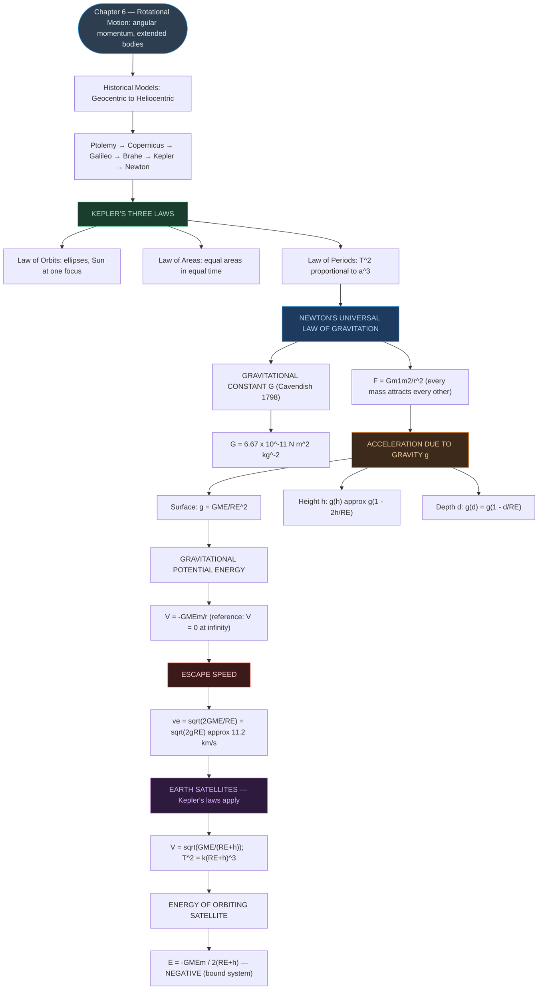
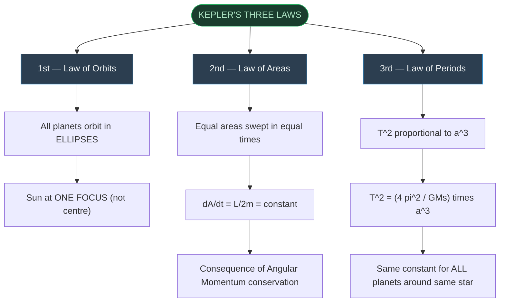
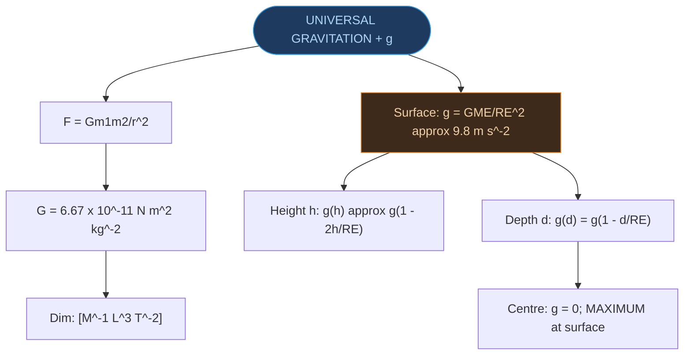
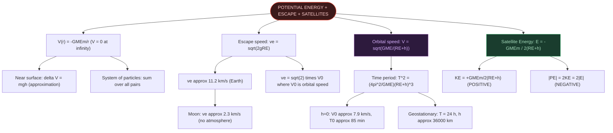

# CHAPTER 7: GRAVITATION

### Complete Study Notes | Board · NEET · JEE Layered

---

## 🗺️ CONCEPT ROADMAP

---

## SECTION 1 — INTRODUCTION & HISTORICAL BACKGROUND ⭐

### 1.1 Early Observations

- **Galileo (1564–1642):** Recognised that all bodies fall toward Earth with the **same constant acceleration**, irrespective of mass. Made public demonstrations; rolled bodies on inclined planes.
- **Ptolemy (~150 AD):** Proposed **geocentric model** — Earth at centre, all celestial objects revolve around it. Only circular motion was considered possible; required complex circular-within-circular schemes.
- **Indian astronomers (~550 AD):** Similar geocentric schemes were also advanced 400 years after Ptolemy.
- **Aryabhatta (5th century AD):** Already mentioned a heliocentric model in his treatise — the Sun at the centre.
- **Nicolas Copernicus (1473–1543):** Proposed a definitive **heliocentric model** — planets move in circles around a fixed central Sun. Discredited by the church; supported by Galileo (who faced prosecution).
- **Tycho Brahe (1546–1601):** Danish nobleman. Spent his lifetime recording **naked-eye observations** of planetary positions with extraordinary precision.
- **Johannes Kepler (1571–1640):** Brahe's assistant. Analysed Brahe's compiled data and extracted **three elegant laws** — Kepler's Laws — that described planetary motion.
- **Isaac Newton (1643–1727):** Used Kepler's laws to make the leap to the **Universal Law of Gravitation**, linking terrestrial (apple falling) and celestial (moon orbiting) phenomena.

---

## SECTION 2 — KEPLER'S LAWS ⭐⭐⭐

### 2.1 Law of Orbits (First Law)

> [!important] First Law — Law of Orbits
> **All planets move in elliptical orbits with the Sun situated at one of the foci of the ellipse.**

**Key features of an ellipse:**
- Two fixed points F₁ and F₂ are the **foci** (sing. focus).
- For any point T on the ellipse: TF₁ + TF₂ = constant.
- **Semi-major axis (a):** Half the longest diameter (= PO = AO where P is perihelion, A is aphelion).
- **Perihelion (P):** Closest point of the orbit to the Sun.
- **Aphelion (A):** Farthest point of the orbit from the Sun.
- A **circle** is a special case of an ellipse (both foci merge into one; semi-major axis = radius).
- This was a departure from the Copernican model, which allowed only **circular** orbits.

> [!tip] For Earth: ratio of semi-minor to semi-major axis b/a = 0.99986 — nearly circular!

### 2.2 Law of Areas (Second Law)

> [!important] Second Law — Law of Areas
> **The line that joins any planet to the Sun sweeps out equal areas in equal intervals of time.**

> [!note] Physical Picture
> Planet moves **faster** near perihelion (closer to Sun).
>
> Planet moves **slower** near aphelion (farther from Sun).
>
> Area swept per unit time = $\Delta A / \Delta t =$ constant.

**Physical basis — Conservation of Angular Momentum:**

$$\Delta A = \frac{1}{2}(\mathbf{r} \times \mathbf{v}\,\Delta t)$$

$$\frac{\Delta A}{\Delta t} = \frac{|\mathbf{r} \times \mathbf{p}|}{2m} = \frac{L}{2m} = \text{constant}$$

- For a **central force** (force along the line joining Sun and planet), the torque about the Sun is **zero** → Angular momentum **L = r × p is conserved**.
- Gravitation is a central force → Law of Areas is a direct consequence of **conservation of angular momentum**.
- This law is not special to the inverse-square law; it holds for **any central force**.

**From the perihelion–aphelion relationship:**

Since L is conserved: $m \cdot r_p \cdot v_p = m \cdot r_A \cdot v_A$

$$\boxed{\frac{v_p}{v_A} = \frac{r_A}{r_p}}$$

Since $r_A > r_p \Rightarrow v_p > v_A$ (faster at perihelion, slower at aphelion).

### 2.3 Law of Periods (Third Law)

> [!important] Third Law — Law of Periods
> **The square of the time period of revolution of a planet is proportional to the cube of the semi-major axis of its elliptical orbit.**

$$\boxed{T^2 \propto a^3} \qquad \text{or} \qquad \frac{T^2}{a^3} = \text{constant} \qquad \text{...(7.1)}$$

**Data confirmation (Table 7.1 from NCERT):**

| Planet | a (×10¹⁰ m) | T (years) | T²/a³ (×10⁻³⁴ y² m⁻³) |
|:---|:---:|:---:|:---:|
| Mercury | 5.79 | 0.24 | 2.95 |
| Venus | 10.8 | 0.615 | 3.00 |
| Earth | 15.0 | 1 | 2.96 |
| Mars | 22.8 | 1.88 | 2.98 |
| Jupiter | 77.8 | 11.9 | 3.01 |
| Saturn | 143 | 29.5 | 2.98 |
| Uranus | 287 | 84 | 2.98 |
| Neptune | 450 | 165 | 2.99 |

> [!tip] The constant $T^2/a^3$ is **the same for all planets** — confirming the law. This equals $K_S = 4\pi^2/GM_S$ (derived in Section 8 for satellites).

### 2.4 Solved Example 7.1 — Perihelion and Aphelion

> [!example] Example 7.1
> **Q:** At perihelion P, speed = $v_p$, distance = $r_p$. Compare with aphelion A (speed $v_A$, distance $r_A$). Does the planet take equal times to traverse arc BAC and arc CPB?
>
> **A:** From angular momentum conservation: $r_p v_p = r_A v_A \Rightarrow v_p/v_A = r_A/r_p$. Since $r_A > r_p$, $v_p > v_A$.
>
> Area SBAC > Area SBPC (larger arc). By Law of Areas (equal areas in equal times): the planet takes **longer to traverse BAC than CPB**.

---

## SECTION 3 — UNIVERSAL LAW OF GRAVITATION ⭐⭐⭐

### 3.1 Newton's Reasoning (The Moon Test)

Newton compared the centripetal acceleration of the Moon with g at Earth's surface:

$$a_m = \frac{V^2}{R_m} = \frac{4\pi^2 R_m}{T^2} \qquad \text{...(7.3)}$$

Using T ≈ 27.3 days, $R_m \approx 3.84 \times 10^8$ m → $a_m \ll g$.

He assumed gravitational force $\propto r^{-2}$, so:

$$\frac{g}{a_m} = \frac{R_m^2}{R_E^2} \approx 3600 \qquad \text{...(7.4)}$$

This matched perfectly with the known ratio ($R_m/R_E \approx 60$). This confirmed the **inverse-square** nature.

### 3.2 The Universal Law (Statement)

> [!important] Newton's Universal Law of Gravitation
> **Every body in the universe attracts every other body with a force which is directly proportional to the product of their masses and inversely proportional to the square of the distance between them.**

**Mathematical form:**

$$\boxed{|\mathbf{F}| = G\frac{m_1 m_2}{r^2}} \qquad \text{...(7.5)}$$

**Vector form:**

$$\mathbf{F} = -G\frac{m_1 m_2}{r^2}\hat{r} = -G\frac{m_1 m_2}{|\mathbf{r}|^3}\mathbf{r}$$

where $\hat{r}$ is the unit vector from $m_1$ to $m_2$ and the force on $m_2$ due to $m_1$ is **attractive** (along $-\hat{r}$).

- $\mathbf{F}_{12} = -\mathbf{F}_{21}$ (Newton's third law satisfied).
- G is the **Universal Gravitational Constant** — same for all pairs of masses everywhere in the universe.

### 3.3 Principle of Superposition

For a collection of point masses, the total gravitational force on mass $m_1$ is the **vector sum** of forces from all other masses:

$$\mathbf{F}_1 = \frac{Gm_2 m_1}{r_{21}^2}\hat{r}_{21} + \frac{Gm_3 m_1}{r_{31}^2}\hat{r}_{31} + \frac{Gm_4 m_1}{r_{41}^2}\hat{r}_{41} + \ldots$$

### 3.4 Extended Bodies — Two Important Shell Theorems

| Point Mass Location | Gravitational Force |
|:---|:---|
| **Outside** a uniform spherical shell | As if entire mass concentrated at **centre** of shell |
| **Inside** a uniform spherical shell | **Zero** (forces from all parts of shell cancel completely) |

> [!tip] These results allow us to treat the Earth as a point mass for any object outside it.

### 3.5 Solved Example 7.2 — Three Masses at Triangle Vertices

> [!example] Example 7.2
> Three equal masses m at vertices of equilateral triangle ABC; mass 2m at centroid G; AG = BG = CG = 1 m.
>
> **(a)** The three force vectors are equal in magnitude ($Gm \cdot 2m/1^2 = 2Gm^2$) and separated by 120° → they **sum to zero** by symmetry.
>
> $\mathbf{F}_R = \mathbf{0}$ — the net gravitational force on the mass at the centroid is zero.
>
> **(b)** If mass at A is doubled to 2m: $F'_{GA} = 4Gm^2\hat{j}$; forces from B and C still cancel in x; net:
>
> $\mathbf{F}'_R = 2Gm^2\hat{j}$ (directed toward the doubled mass at A)

---

## SECTION 4 — THE GRAVITATIONAL CONSTANT G ⭐⭐

### 4.1 Cavendish Experiment (1798)

**Apparatus:** A torsion balance — a light rigid bar AB with two small lead spheres at its ends, suspended by a fine wire from a rigid support. Two large lead spheres are brought close to the small ones, on opposite sides.

**Principle:**
- Large spheres attract small ones with equal and opposite forces → a **torque** on bar AB = F × L.
- Wire twists by angle θ until **restoring torque = gravitational torque**:

$$G\frac{Mm}{d^2}L = \tau\theta \qquad \text{...(7.7)}$$

where τ = restoring couple per unit angle of twist (measured independently), M = large sphere mass, m = small sphere mass, d = separation of centres.

**Accepted value:**

$$\boxed{G = 6.67 \times 10^{-11} \text{ N m}^2 \text{ kg}^{-2}} \qquad \text{...(7.8)}$$

> [!tip] "Cavendish weighed the Earth" — knowing G, g, and $R_E$, one can calculate $M_E$ from $g = GM_E/R_E^2$.

**Dimensional formula of G:** From $F = Gm_1m_2/r^2 \Rightarrow G = Fr^2/(m_1m_2) \Rightarrow \mathbf{[M^{-1}L^3T^{-2}]}$

---

## SECTION 5 — ACCELERATION DUE TO GRAVITY ⭐⭐⭐

### 5.1 At the Surface of Earth

Treating Earth as a sphere of uniform density with mass $M_E$ and radius $R_E$. For a mass m on the surface, gravitational force $F = GM_Em/R_E^2$. Since $F = mg$:

$$\boxed{g = \frac{GM_E}{R_E^2}} \qquad \text{...(7.12)}$$

**Numerical values:** $g \approx 9.8$ m s⁻², $M_E \approx 5.97 \times 10^{24}$ kg, $R_E \approx 6.4 \times 10^6$ m.

### 5.2 At Height h Above Surface

Distance from centre = $R_E + h$:

$$g(h) = \frac{GM_E}{(R_E+h)^2} \qquad \text{...(7.14)}$$

For $h \ll R_E$ (using binomial expansion):

$$\boxed{g(h) \approx g\left(1 - \frac{2h}{R_E}\right)} \qquad \text{...(7.15)}$$

- g **decreases** with height.
- Rate of decrease is faster than with depth (factor of 2).

### 5.3 At Depth d Below Surface

Earth is modelled as concentric shells. For a point at depth d (distance from centre = $R_E - d$):
- The shell of thickness d exerts **zero** force (point is inside it).
- Only the inner sphere of radius $(R_E - d)$ contributes.

Mass ratio: $M_s/M_E = (R_E - d)^3/R_E^3$

$$\boxed{g(d) = g\left(1 - \frac{d}{R_E}\right)} \qquad \text{...(7.19)}$$

- g **decreases linearly** with depth.
- At the centre ($d = R_E$): g = 0 (forces from all sides cancel).

### 5.4 Summary — Variation of g

> [!important] Variation of g — Critical Summary
> **Above surface (height h):** $g(h) \approx g\!\left(1 - \dfrac{2h}{R_E}\right)$ — decreases faster than below.
>
> **Below surface (depth d):** $g(d) = g\!\left(1 - \dfrac{d}{R_E}\right)$ — decreases linearly; $g = 0$ at Earth's centre.
>
> **g is MAXIMUM at the surface of Earth — it decreases whether you go up or down.**

> [!warning] Exam Trap
> $g$ decreases going **both** up (above surface) and going down (below surface). Maximum $g$ is at the surface. The rate of decrease above is twice the rate below (for small displacements).

---

## SECTION 6 — GRAVITATIONAL POTENTIAL ENERGY ⭐⭐⭐

### 6.1 Near the Surface (Approximation)

For small heights $h \ll R_E$, gravity ≈ constant = mg:

$$W(h) = mgh + W_0$$

where $W_0$ = potential energy at surface. The difference $W(h_2) - W(h_1) = mg(h_2 - h_1)$ gives the familiar mgh formula.

### 6.2 General Expression (Any Distance r from Centre)

For points far from Earth, gravity is not constant. The work done moving mass m from $r_1$ to $r_2$:

$$W_{12} = -GM_E m\left(\frac{1}{r_2} - \frac{1}{r_1}\right) \qquad \text{...(7.24)}$$

The gravitational potential energy at distance r from Earth's centre (taking V = 0 at $r \to \infty$):

$$\boxed{V(r) = -\frac{GM_E m}{r}} \qquad \text{...(7.25), valid for } r > R_E$$

> [!note] Why Negative?
> We set $V = 0$ at infinity. Moving a mass from infinity toward Earth, gravity does positive work — so PE decreases from 0, becoming negative. A negative PE means the mass is in a **bound state** (must supply energy to escape to infinity).

### 6.3 Gravitational Potential (Field Concept)

The **gravitational potential** is defined as the PE of a **unit mass** at that point:

$$U(r) = -\frac{GM_E}{r} \qquad \text{(per unit mass, J kg⁻¹)}$$

**For two particles:**

$$V = -\frac{Gm_1 m_2}{r}$$

For a system of n particles, total PE = sum over all pairs (superposition principle).

### 6.4 Solved Example 7.3 — Four Masses at Corners of a Square

> [!example] Example 7.3 — Four masses m at corners of a square of side l
>
> - 4 side pairs at distance l → each contributes $-Gm^2/l$
> - 2 diagonal pairs at distance $\sqrt{2}\,l$ → each contributes $-Gm^2/\sqrt{2}\,l$
>
> $$W = -4\frac{Gm^2}{l} - 2\frac{Gm^2}{\sqrt{2}\,l} = -\frac{2Gm^2}{l}\!\left(2 + \frac{1}{\sqrt{2}}\right) = -5.41\frac{Gm^2}{l}$$
>
> Gravitational potential at centre (distance $r = l\sqrt{2}/2$ from each corner):
>
> $$U(r) = -4\sqrt{2}\,\frac{Gm}{l}$$

---

## SECTION 7 — ESCAPE SPEED ⭐⭐⭐

### 7.1 Derivation

Using conservation of energy. An object of mass m launched from Earth's surface with speed $V_i$:

- Initial energy: $E_i = \tfrac{1}{2}mV_i^2 - GM_Em/R_E$
- Minimum case: object just reaches infinity with final speed $V_f = 0 \Rightarrow E_f = 0$

Setting $E_i = E_f$:

$$\frac{1}{2}mV_i^2 - \frac{GM_E m}{R_E} = 0$$

$$\boxed{v_e = \sqrt{\frac{2GM_E}{R_E}} = \sqrt{2gR_E}} \qquad \text{...(7.31, 7.32)}$$

### 7.2 Numerical Value

$$v_e = \sqrt{2 \times 9.8 \times 6.4 \times 10^6} \approx \boxed{11.2 \text{ km s}^{-1}}$$

### 7.3 Key Properties of Escape Speed

| Property | Details |
|:---|:---|
| Depends on mass of Earth? | **Yes** ($\propto \sqrt{M_E}$) |
| Depends on mass of escaping body? | **No** (m cancels out) |
| Depends on direction of launch? | **No** (only magnitude matters) |
| Depends on height of launch? | **Yes** — from height h: $v_e = \sqrt{2GM_E/(R_E+h)}$ |

> [!tip] Escape speed for the Moon ≈ 2.3 km s⁻¹ (about 5× smaller than Earth). This is why the Moon has **no atmosphere** — gas molecules with thermal speeds exceeding 2.3 km s⁻¹ escape permanently.

### 7.4 Solved Example 7.4 — Neutral Point Between Two Spheres

> [!example] Example 7.4 — Two spheres of mass M and 4M, radii R, separated by 6R centre-to-centre
>
> At neutral point N, forces cancel. Let ON = r from M:
>
> $$\frac{GMm}{r^2} = \frac{G(4M)m}{(6R-r)^2} \Rightarrow (6R-r)^2 = 4r^2 \Rightarrow r = 2R$$
>
> At N, speed = 0. Using energy conservation from surface of M to N:
>
> $$v = \sqrt{\frac{3GM}{5R}}$$

---

## SECTION 8 — EARTH SATELLITES ⭐⭐⭐

### 8.1 Orbital Speed

A satellite in circular orbit at height h (distance $R_E + h$ from centre). Centripetal force = gravitational force:

$$\frac{mV^2}{R_E+h} = \frac{GM_E m}{(R_E+h)^2}$$

$$\boxed{V = \sqrt{\frac{GM_E}{R_E+h}}} \qquad \text{...(7.35)}$$

- For $h = 0$: $V = \sqrt{GM_E/R_E} = \sqrt{gR_E} \approx$ **7.9 km s⁻¹** (first cosmic velocity)
- V **decreases** as h increases (higher orbits → slower satellites).

### 8.2 Time Period

$$T = \frac{2\pi(R_E+h)}{V} = \frac{2\pi(R_E+h)^{3/2}}{\sqrt{GM_E}} \qquad \text{...(7.37)}$$

$$\boxed{T^2 = \left(\frac{4\pi^2}{GM_E}\right)(R_E+h)^3} \qquad \text{...(7.38)}$$

This is **Kepler's Third Law applied to Earth satellites** — $T^2 \propto (R_E + h)^3$.

**For a satellite very close to surface ($h \ll R_E$):**

$$T_0 = 2\pi\sqrt{\frac{R_E}{g}} \approx 85 \text{ minutes}$$

### 8.3 Geostationary Satellite

A special case where T = 24 hours (same as Earth's rotation) and orbit is equatorial:
- Height above surface ≈ 35,800 km (≈ 36,000 km)
- Appears stationary relative to Earth's surface
- Used for telecommunications, weather satellites

### 8.4 Solved Example 7.5 — Mars and its Moons

> [!example] Example 7.5
> **(i)** Mass of Mars from Phobos data (T = 7h 39min = 459 min, R = 9.4×10³ km):
>
> $$M_m = \frac{4\pi^2 R^3}{GT^2} = 6.48 \times 10^{23} \text{ kg}$$
>
> **(ii)** Length of Martian year ($R_{MS} = 1.52 \times R_{ES}$):
>
> $$T_M = T_E \times (1.52)^{3/2} = 365 \times 1.874 \approx 684 \text{ days}$$

---

## SECTION 9 — ENERGY OF AN ORBITING SATELLITE ⭐⭐⭐

### 9.1 Kinetic Energy

$$KE = \frac{1}{2}mV^2 = \frac{GM_E m}{2(R_E+h)} \qquad \text{...(7.40)}$$

### 9.2 Potential Energy

$$PE = -\frac{GM_E m}{R_E+h} \qquad \text{...(7.41)}$$

### 9.3 Total Mechanical Energy

$$\boxed{E = KE + PE = -\frac{GM_E m}{2(R_E+h)}} \qquad \text{...(7.42)}$$

> [!important] Satellite Energy Relationships
> $KE = +\dfrac{GM_Em}{2(R_E+h)}$ — **POSITIVE**
>
> $PE = -\dfrac{GM_Em}{R_E+h}$ — **NEGATIVE**; $|PE| = 2 \times KE$
>
> $E = -\dfrac{GM_Em}{2(R_E+h)}$ — **NEGATIVE** (bound system)
>
> **Chain:** $|KE| = |E|$ ; $|PE| = 2|E|$ ; $PE = 2E$

> [!tip] Virial Theorem in action: For a bound gravitational system, $KE = -\tfrac{1}{2} \times PE = -E$. Total energy is always **negative** for a bound (closed-orbit) system. If $E \geq 0$, the object escapes.

### 9.4 Binding Energy

The energy required to remove a satellite from its orbit to infinity $= |E| = GM_Em / [2(R_E+h)]$.

### 9.5 Solved Example 7.8 — Changing Orbital Radius

> [!example] Example 7.8 — 400 kg satellite moved from orbit of radius 2RE to 4RE
>
> $$E_i = -\frac{GM_E m}{4R_E}, \qquad E_f = -\frac{GM_E m}{8R_E}$$
>
> $$\Delta E = E_f - E_i = \frac{GM_E m}{8R_E} = \frac{mgR_E}{8} = \frac{9.81 \times 400 \times 6.37 \times 10^6}{8} \approx 3.13 \times 10^9 \text{ J}$$
>
> $\Delta KE = -3.13 \times 10^9$ J — kinetic energy **decreases** (higher orbit = slower satellite)
>
> $\Delta PE = -6.25 \times 10^9$ J — potential energy decreases by twice $|\Delta E|$

> [!warning] Counterintuitive Result
> To move to a higher orbit, you supply energy. But the satellite **slows down** (KE decreases). The energy goes into increasing PE (by $2|\Delta E|$), with half coming back as reduced KE.

---

## SECTION 10 — "WEIGHING THE EARTH" ⭐⭐

### Solved Example 7.6

> [!example] Example 7.6 — Given: g = 9.81 m s⁻², RE = 6.37×10⁶ m, moon distance R = 3.84×10⁸ m, T_moon = 27.3 days
>
> **Method 1 (from g and RE):**
>
> $$M_E = \frac{gR_E^2}{G} = \frac{9.81 \times (6.37 \times 10^6)^2}{6.67 \times 10^{-11}} = 5.97 \times 10^{24} \text{ kg}$$
>
> **Method 2 (from moon's orbit — Kepler's 3rd law):**
>
> $$M_E = \frac{4\pi^2 R^3}{GT^2} = 6.02 \times 10^{24} \text{ kg}$$
>
> Both methods agree to within 1%.

---

## 📋 QUICK REFERENCE — All Laws, Formulas, and Dimensional Formulae

### Kepler's Laws

### Gravitation and g

### Potential Energy, Escape Speed, and Satellites

---

## ⚡ POINTS TO PONDER (High-Yield for Exams)

1. **g is maximum at Earth's surface.** It decreases both going up ($\propto 1/r^2$) and going down ($\propto r$). The formula is different above and below the surface.

2. **Kepler's 2nd Law ↔ Conservation of Angular Momentum.** This holds for ANY central force (not just gravity) — the result is much more general.

3. **Gravitational PE is negative** (with V = 0 at infinity). This is convention-based but very important. A satellite at any finite orbit has negative total energy.

4. **Weightlessness in satellites** is NOT because gravity is absent there. Both the astronaut and the satellite are in **free fall** toward Earth — hence no normal force between them.

5. **KE of satellite decreases when moved to higher orbit** — counterintuitive but true. Total energy is more negative at lower orbits. Higher orbit → less negative total energy → you added energy → but the satellite slows down (lower KE).

6. **Escape speed vs. orbital speed:** $v_e = \sqrt{2gR_E}$, $V_0 = \sqrt{gR_E}$ → $v_e = \sqrt{2} \times V_0 \approx 1.414 \times 7.9 = 11.2$ km s⁻¹.

7. **Gravitational shielding is NOT possible** (unlike electrical shielding by a conductor). A spherical shell exerts zero force inside, but cannot prevent external masses from exerting force on a particle inside it.

8. **The tidal effect** depends on the gradient of gravity (how rapidly g changes with distance), not just g itself. Although the Sun's gravitational pull on Earth is stronger than the Moon's, the Moon's tidal effect is greater because the Moon is much closer — the gradient is steeper.

9. **For elliptical orbits**, the semi-major axis a replaces $(R_E + h)$ in all satellite energy formulas: $E = -GM_Em/2a$.

10. **Linear momentum is NOT conserved** for a planet in orbit (direction of p changes). But angular momentum L IS conserved (central force → $\tau = 0$ about Sun).

---

## 🔑 Key Historical Persons (Chapter 7)

| Person | Dates | Key Contribution |
|:---|:---:|:---|
| **Ptolemy** | ~100–170 AD | Geocentric model; celestial objects orbit Earth in circles |
| **Aryabhatta** | 476–550 AD | Early heliocentric mention in Indian astronomy |
| **Nicolas Copernicus** | 1473–1543 | Definitive heliocentric model; planets orbit Sun in circles |
| **Galileo Galilei** | 1564–1642 | All bodies fall with equal acceleration; supported Copernicus |
| **Tycho Brahe** | 1546–1601 | Precise naked-eye planetary observations; compiled lifetime data |
| **Johannes Kepler** | 1571–1640 | Three laws of planetary motion (from Brahe's data) |
| **Henry Cavendish** | 1731–1810 | First measured G experimentally (1798); "weighed the Earth" |
| **Isaac Newton** | 1643–1727 | Universal Law of Gravitation; explained Kepler's laws |

---

## Dimensional Formulae Summary

| Quantity | Symbol | Dimensional Formula | SI Unit |
|:---|:---:|:---:|:---|
| Gravitational Constant | G | [M⁻¹L³T⁻²] | N m² kg⁻² |
| Acceleration due to gravity | g | [LT⁻²] | m s⁻² |
| Gravitational Potential Energy | V(r) | [ML²T⁻²] | J |
| Gravitational Potential | U(r) | [L²T⁻²] | J kg⁻¹ |
| Gravitational Intensity (field) | E or g | [LT⁻²] | m s⁻² |
| Escape speed | $v_e$ | [LT⁻¹] | m s⁻¹ or km s⁻¹ |

---

*End of Notes — Physics Chapter 7 | Total Sections: 10*