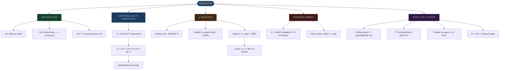
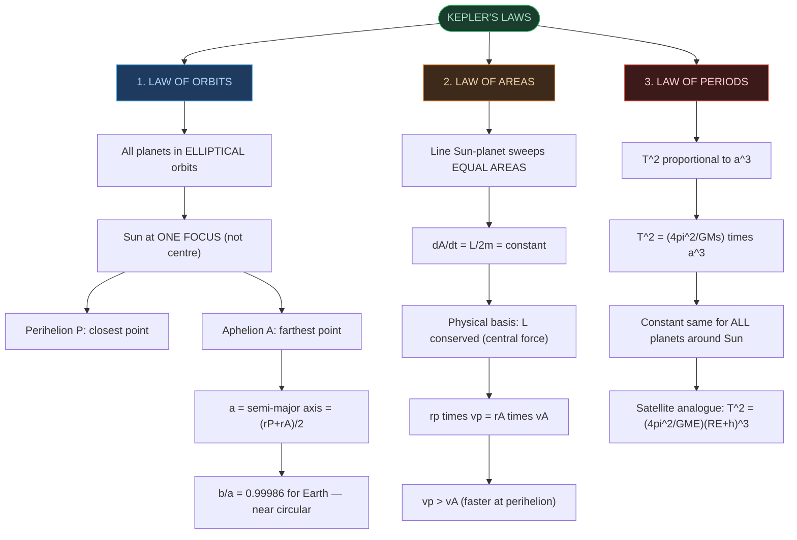
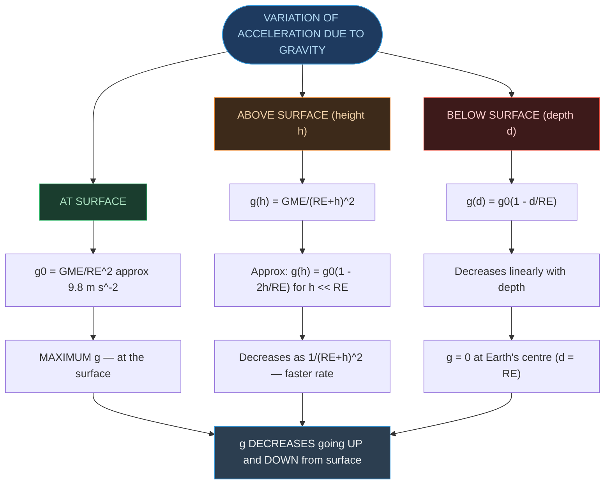
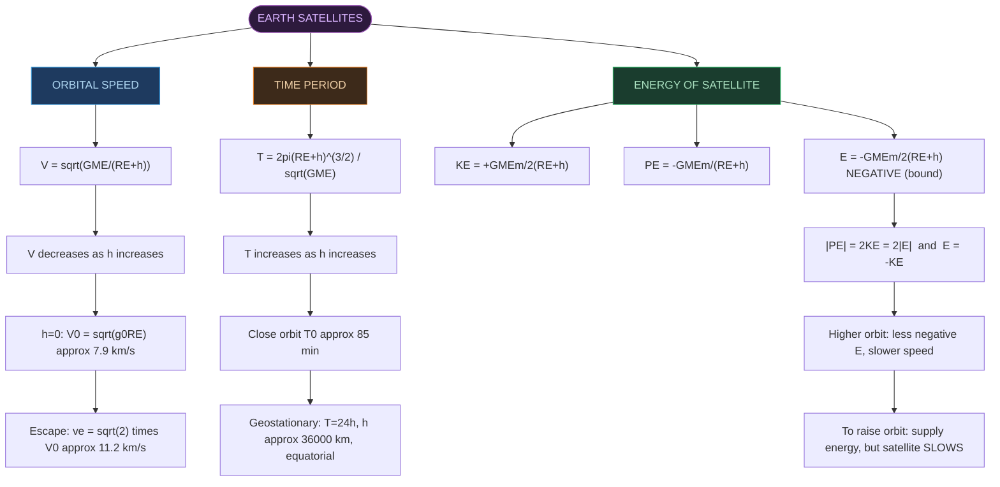
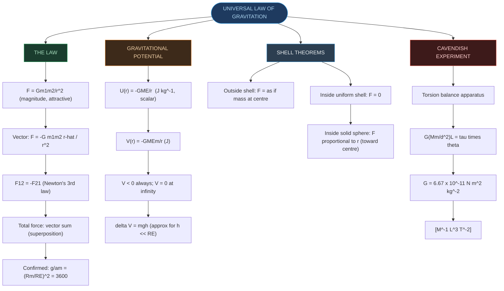

# CHAPTER 7 — RAPID REVISION + MIND MAPS

### Gravitation

---

# ⚡ ONE-PAGE RAPID REVISION SHEET

## 🔢 Key Definitions — Absolute Must-Memorise

| Quantity | Definition | Formula | SI Unit |
|:---|:---|:---|:---|
| **Gravitational Constant** | Universal constant in Newton's law | $F = Gm_1m_2/r^2$ | N m² kg⁻² |
| **Acceleration due to gravity** | Gravitational accel. at surface | $g = GM_E/R_E^2$ | m s⁻² |
| **Gravitational PE** | PE of mass m at distance r from Earth (V = 0 at ∞) | $V = -GM_Em/r$ | J |
| **Gravitational Potential** | PE per unit mass at a point | $U = -GM_E/r$ | J kg⁻¹ |
| **Escape Speed** | Min. speed to escape gravitational field | $v_e = \sqrt{2GM_E/R_E}$ | m s⁻¹ |
| **Orbital Speed** | Speed of satellite in circular orbit | $V = \sqrt{GM_E/(R_E+h)}$ | m s⁻¹ |
| **Perihelion** | Closest point of orbit to Sun | $r_p$ (speed = max) | m |
| **Aphelion** | Farthest point of orbit from Sun | $r_A$ (speed = min) | m |
| **Semi-major axis** | Half the major axis of ellipse; $a = (r_p + r_A)/2$ | $a$ | m |

---

## 📐 Essential Formulae — Must Know Cold

> [!important] Kepler's Laws
> **1st:** All planets orbit in **ELLIPSES** — Sun at one focus (not centre).
>
> **2nd:** $\Delta A/\Delta t = L/2m =$ constant (equal areas) — consequence of L conservation (central force).
>
> **3rd:** $T^2 \propto a^3$; specifically $T^2 = \dfrac{4\pi^2}{GM_S} \cdot a^3$ — same constant for **ALL** planets around same star.

> [!important] Newton's Law of Gravitation
> $F = \dfrac{Gm_1m_2}{r^2}$ (magnitude, attractive)
>
> $G = 6.67 \times 10^{-11}$ N m² kg⁻², dimensional formula $[\text{M}^{-1}\text{L}^3\text{T}^{-2}]$
>
> Obeys **superposition principle** — forces from multiple masses add as vectors.

> [!important] Acceleration Due to Gravity
> Surface: $g_0 = GM_E/R_E^2 \approx 9.8$ m s⁻²
>
> Height h: $g(h) \approx g_0\!\left(1 - \dfrac{2h}{R_E}\right)$ for $h \ll R_E$
>
> Depth d: $g(d) = g_0\!\left(1 - \dfrac{d}{R_E}\right)$
>
> Centre: $g = 0$ | **Maximum g is AT the surface — decreases both up and down.**

> [!important] Gravitational Potential Energy
> $V(r) = -\dfrac{GM_Em}{r}$ (reference: $V = 0$ at infinity)
>
> Near surface: $\Delta V = mgh$ (approximation, valid for $h \ll R_E$)
>
> For a system of particles: $V = -\sum\dfrac{Gm_im_j}{r_{ij}}$ (sum over all pairs)

> [!important] Escape Speed
> $v_e = \sqrt{\dfrac{2GM_E}{R_E}} = \sqrt{2g_0R_E} \approx 11.2$ km s⁻¹
>
> Independent of **mass** of projectile and **direction** of launch.
>
> Moon's $v_e \approx 2.3$ km s⁻¹ (no atmosphere — gas molecules escape).

> [!important] Satellites (Circular Orbit at Height h)
> Orbital speed: $V = \sqrt{GM_E/(R_E+h)}$
>
> Surface ($h \approx 0$): $V_0 = \sqrt{g_0R_E} \approx 7.9$ km s⁻¹
>
> Time period: $T = 2\pi(R_E+h)^{3/2}/\sqrt{GM_E}$
>
> Close orbit: $T_0 = 2\pi\sqrt{R_E/g_0} \approx 85$ min
>
> Geostationary: $T = 24$ h; $h \approx 36{,}000$ km; equatorial orbit.

> [!important] Satellite Energy
> $KE = +\dfrac{GM_Em}{2(R_E+h)}$ → **POSITIVE**
>
> $PE = -\dfrac{GM_Em}{R_E+h}$ → **NEGATIVE**
>
> $E = -\dfrac{GM_Em}{2(R_E+h)}$ → **NEGATIVE** (bound)
>
> Key chain: $|PE| = 2KE$; $E = -KE$; $E = PE/2$

---

## 📊 Speed Comparison — Important Values

| Quantity | Formula | Value |
|:---|:---|:---|
| Orbital speed (low Earth orbit) | $V_0 = \sqrt{gR_E}$ | ≈ 7.9 km s⁻¹ |
| Escape speed (from surface) | $v_e = \sqrt{2gR_E}$ | ≈ 11.2 km s⁻¹ |
| Ratio | $v_e / V_0$ | $\sqrt{2} \approx 1.414$ |
| Moon's escape speed | — | ≈ 2.3 km s⁻¹ |
| Mars' escape speed | — | ≈ 5.0 km s⁻¹ |
| Jupiter's escape speed | — | ≈ 59.5 km s⁻¹ |

---

## ⚠️ Critical Distinctions — High-Yield Exam Traps

> [!warning] Kepler's Laws Traps
> - Law of areas holds for **ANY central force**, not just gravity.
> - $T^2 \propto a^3$: the constant $(4\pi^2/GM_S)$ is the **SAME for all planets** around the SAME star; different for different stars.
> - Orbits are **ELLIPSES**, not circles (circle is the special case $a = b$).
> - Sun is at **ONE FOCUS** — not the centre — of the ellipse.
> - Planet is **FASTER at perihelion**, SLOWER at aphelion.

> [!warning] Gravitational Potential Energy Traps
> - $V = -GMm/r$ is **NEGATIVE** for all finite r (attractive force convention).
> - V increases (becomes less negative) as r increases.
> - Near surface: $mgh$ is only an **APPROXIMATION** (valid for $h \ll R_E$).
> - For a system: V = sum over all **PAIRS** (not all particles individually).
> - $V = 0$ is the **REFERENCE** at infinity — a convention, not a physical fact.

> [!warning] Satellite Energy Traps
> - Total energy E is **ALWAYS NEGATIVE** for a bound (orbiting) satellite.
> - Higher orbit → less negative E → satellite moves **SLOWER** (not faster!).
> - To increase orbit height: you ADD energy (positive work done), but the satellite **SLOWS DOWN** (KE decreases).
> - $|PE| = 2KE$ (virial theorem for gravity).
> - $E = -KE = PE/2$ — remember this chain.

> [!warning] g Variation Traps
> - $g$ is **MAXIMUM at Earth's surface** — decreases both up and down.
> - Rate of decrease is **DIFFERENT** above vs. below: above: $\approx 2h/R_E$; below: $\approx d/R_E$ (factor of 2 difference).
> - At centre: $g = 0$ (all forces cancel).
> - $g$ does **NOT** depend on mass of the falling object.

> [!warning] Escape Speed Traps
> - Escape speed does **NOT** depend on mass of the escaping body.
> - Escape speed does **NOT** depend on direction of launch.
> - Escape speed **DOES** depend on height of launch: from height h, $v_e = \sqrt{2GM_E/(R_E+h)}$ (smaller!).
> - "Escape" means reaching infinity with **ZERO speed** (minimum case). If launched with $v > v_e$, it reaches infinity with leftover KE.

> [!warning] Weightlessness Trap
> - Astronaut feels weightless **NOT** because gravity is absent.
> - Gravity at orbital height (~400 km) is ≈ 8.9 m s⁻² (nearly $g_0$).
> - Weightlessness = **FREE FALL** — both astronaut and ship fall toward Earth at same rate → no normal force between them.

---

# 🗺️ MIND MAP 1 — Chapter Overview

---

# 🗺️ MIND MAP 2 — Kepler's Laws (Detail)

---

# 🗺️ MIND MAP 3 — Variation of g

---

# 🗺️ MIND MAP 4 — Satellite Mechanics and Energy

---

# 🗺️ MIND MAP 5 — Newton's Law and Gravitational Potential

---

## 🏆 Last-Minute Exam Checklist

> [!tip] Before answering any Gravitation problem, run through this list
>
> - **Kepler's 3rd law?** → Use $T^2/a^3 =$ constant; keep units consistent.
> - **Orbital speed/period?** → $V = \sqrt{GM/(R+h)}$; $T^2 \propto (R+h)^3$.
> - **g at height h?** → $g(h) = g_0/(1+h/R_E)^2 \approx g_0(1-2h/R_E)$ for $h \ll R_E$.
> - **g at depth d?** → $g(d) = g_0(1-d/R_E)$; at centre $g = 0$.
> - **Escape speed?** → $v_e = \sqrt{2gR_E} = \sqrt{2} \times V_0$; check if launched from height.
> - **Gravitational PE?** → $V = -GMm/r$; always negative; $V = 0$ at $\infty$.
> - **Satellite energy?** → $E = -KE$; $|PE| = 2KE$; $E = PE/2$ — all equivalent.
> - **Binding energy?** → $= |E| = GM_Em/[2(R_E+h)]$; energy to remove satellite to $\infty$.
> - **Change in orbit?** → Always ADD energy to raise orbit, but satellite **SLOWS DOWN**.
> - **Shell theorem?** → Outside: treat as point mass at centre; Inside uniform shell: $F = 0$.
> - **Weightlessness?** → Free fall, NOT zero gravity; $g \approx 8.9$ m s⁻² at ISS orbit.
> - **Dimensions:** $G \to [\text{M}^{-1}\text{L}^3\text{T}^{-2}]$; $g \to [\text{LT}^{-2}]$; GPE $\to [\text{ML}^2\text{T}^{-2}]$; potential $\to [\text{L}^2\text{T}^{-2}]$.
> - **Historical chain:** Tycho Brahe (data) → Kepler (laws) → Newton (explanation); Cavendish (measured G) → "weighed the Earth".

---

## 📌 Common Formula Errors to Avoid

| Wrong Formula | Correct Formula | Situation |
|:---|:---|:---|
| $g(h) = g(1 - h/R_E)$ | $g(h) = g\!\left(1 - \mathbf{2}h/R_E\right)$ | Height above surface (binomial approx) — factor of **2** |
| $V = -Gm/r$ | $V = -G\mathbf{M_E}m/r$ | Satellite PE (needs both masses) |
| $v_e = \sqrt{GM/R}$ | $v_e = \sqrt{\mathbf{2}GM/R}$ | Factor of **2** from energy conservation |
| $E = KE + PE = 0$ | $E = -GM_Em/[2(R_E+h)] \neq 0$ | Total energy is **NOT zero** — it is negative |
| $T_0 = 2\pi\sqrt{g/R_E}$ | $T_0 = 2\pi\sqrt{\mathbf{R_E}/g}$ | Close-orbit time period — $R_E$ is under the root |
| $g = GM_E/r^2$ everywhere | $g(d) = g(1-d/R_E)$ for $r < R_E$ | Different formula **inside** Earth |

---

*End of Revision Notes + Mind Maps — Physics Ch. 7*