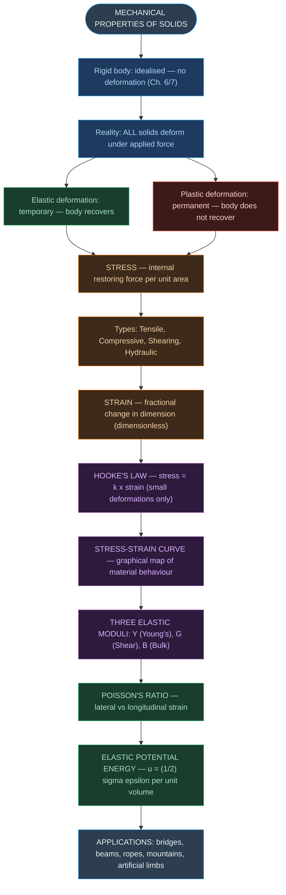
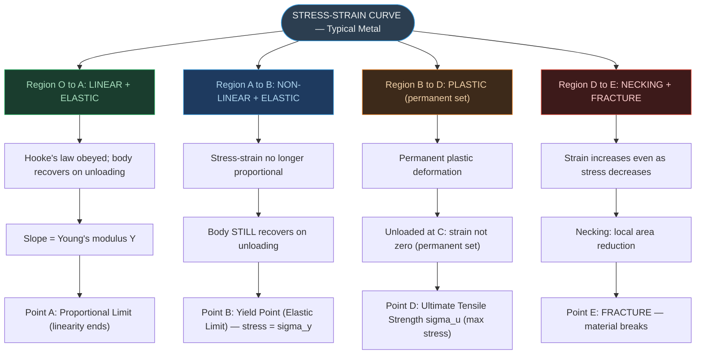

# CHAPTER 8: MECHANICAL PROPERTIES OF SOLIDS

### Complete Study Notes | Board · NEET · JEE Layered

---

## 🗺️ CONCEPT ROADMAP

---

## SECTION 1 — INTRODUCTION: ELASTIC AND PLASTIC BEHAVIOUR ⭐

### 1.1 Deformable Bodies vs Rigid Bodies

A **rigid body** is an idealisation — in reality, every solid deforms when subjected to a force. Even a steel bar deforms under a sufficiently large load; the deformation is just too small to see without instruments.

- **Deformation** = any change in shape or size of a body under applied force.
- Two categories of response:

| Property | Description | Example |
|:---|:---|:---|
| **Elasticity** | Tendency to regain original shape/size when force is removed | Helical spring, rubber band |
| **Plasticity** | No tendency to regain shape; permanently deformed | Putty, clay, mud |

> [!note] Key Distinction
> **Elastic deformation** = temporary change; shape is recovered on removing load.
> **Plastic deformation** = permanent change; shape is not recovered.
>
> - **Ideal elastic solid:** perfectly recovers original shape (no such material exists exactly).
> - **Ideal plastic solid:** no recovery at all (putty/mud approximate this).
> - **Real materials** exhibit both, depending on the magnitude of the applied force.

### 1.2 Why Elastic Properties Matter

Elastic behaviour of materials is critical in engineering design: buildings (steel, concrete, beams, columns), bridges (load-bearing beams), ropeways and cranes (steel ropes; minimum cross-section), artificial limbs (light yet strong), aeroplanes (lightweight but structurally strong), and railway tracks — the I-shaped cross-section has a specific engineering reason (see §9).

---

## SECTION 2 — STRESS ⭐⭐⭐

### 2.1 Definition

When a deforming force is applied to a body in static equilibrium, an internal **restoring force** develops in the body — equal in magnitude and opposite in direction to the applied force.

> [!important] Definition of Stress
> $$\text{Stress} = \frac{F}{A} \quad \text{...(8.1)}$$
>
> - **SI unit:** N m⁻² = Pascal (Pa)
> - **Dimensional formula:** $[\text{ML}^{-1}\text{T}^{-2}]$
> - Stress is **NOT a vector** — it has magnitude and a direction associated with the surface, but it cannot be assigned a single direction like a force.

### 2.2 Types of Stress

#### (a) Tensile Stress (Longitudinal — Stretching)

Two equal and opposite forces **perpendicular** to the cross-section, **pulling** the body apart. Result: body elongates.

#### (b) Compressive Stress (Longitudinal — Compression)

Two equal and opposite forces **perpendicular** to the cross-section, **pushing** inward. Result: body compresses (shortens).

> [!note]
> Both tensile and compressive are called **longitudinal stress**. In both, there is a change in **length** but not in the cross-sectional shape (for uniform cylindrical bodies).

#### (c) Shearing Stress (Tangential Stress)

Two equal and opposite forces applied **parallel** to the cross-sectional area. One face slides relative to the other. Result: change in **shape** (not volume); angular deformation.

> [!warning]
> Shearing stress is **only possible in solids**. Liquids and gases cannot sustain shearing stress — they flow instead.

#### (d) Hydraulic Stress (Bulk/Volume Stress)

Force applied **perpendicular to every point** of the surface — uniform pressure from all sides (e.g., a body submerged in fluid under high pressure). Result: change in **volume** (no change in shape for isotropic materials). Applicable to **solids, liquids and gases**.

---

## SECTION 3 — STRAIN ⭐⭐⭐

Strain = ratio of change in dimension to original dimension → **dimensionless** (no units, no dimensional formula).

### 3.1 Longitudinal Strain

$$\text{Longitudinal strain} = \frac{\Delta L}{L} \quad \text{...(8.2)}$$

Produced by tensile or compressive stress. $\Delta L$ = change in length; $L$ = original length.

### 3.2 Shearing Strain

$$\text{Shearing strain} = \frac{\Delta x}{L} = \tan\theta \approx \theta \quad \text{...(8.3), (8.4)}$$

$\Delta x$ = relative lateral displacement of faces; $L$ = perpendicular distance between faces. $\theta$ = angular displacement from the original vertical position. For small $\theta$: $\tan\theta \approx \theta$ (in radians). At $\theta = 10°$, difference between $\theta$ and $\tan\theta$ is only ~1%.

> [!note]
> Shearing strain is also called **pure shear** — it represents angular deformation with no change in volume.

### 3.3 Volume Strain (Hydraulic Strain)

$$\text{Volume strain} = \frac{\Delta V}{V} \quad \text{...(8.5)}$$

$\Delta V$ = change in volume; $V$ = original volume. Produced by hydraulic (bulk) stress. No change in shape; only change in volume.

### Summary Table — Stress and Strain Types

| Type | Force Direction | Strain | Shape Change? | Volume Change? | Applicable to |
|:---|:---|:---|:---|:---|:---|
| Tensile/Compressive | ⊥ to cross-section | $\Delta L/L$ | Yes | No | Solids |
| Shearing | ‖ to surface | $\Delta x/L = \theta$ | Yes | No | Solids |
| Hydraulic | ⊥ everywhere (pressure) | $\Delta V/V$ | No | Yes | Solids, liquids, gases |

---

## SECTION 4 — HOOKE'S LAW ⭐⭐⭐

> [!important] Hooke's Law
> **For small deformations, stress is directly proportional to strain.**
>
> $$\text{stress} \propto \text{strain}$$
>
> $$\text{stress} = k \times \text{strain} \quad \text{...(8.6)}$$
>
> - **$k$** = **modulus of elasticity** (the proportionality constant)
> - Hooke's law is an **empirical law** (based on experimental observation, not derived from theory).
> - Valid for most materials within their **elastic limit**.
> - **NOT valid for:** elastomers (rubber, biological tissue of aorta) — these stretch a lot but stress is not proportional to strain.

> [!note]
> **Elastic limit** = the maximum stress up to which the material obeys Hooke's law and still recovers. Beyond this, permanent deformation begins.

---

## SECTION 5 — STRESS–STRAIN CURVE ⭐⭐⭐

The stress-strain curve is obtained experimentally by gradually increasing the tensile force on a test cylinder/wire and plotting stress (y-axis) vs strain (x-axis).

### 5.1 Key Regions on the Curve (for a typical metal)

| Region / Point | Description |
|:---|:---|
| **O → A** (Proportional limit) | Linear region; Hooke's law obeyed; elastic behaviour. Slope = Young's modulus. |
| **A → B** | Stress-strain NOT proportional, but still elastic (body recovers on unloading). |
| **Point B** — Yield point / Elastic limit | Maximum stress for elastic behaviour. Stress at B = **yield strength ($\sigma_y$)**. |
| **B → D** | Plastic region: permanent deformation. If unloaded at C, strain ≠ 0 (permanent set). |
| **Point D** — Ultimate tensile strength | Maximum stress the material can sustain = **$\sigma_u$**. |
| **D → E** | Strain increases even with reducing stress; necking occurs. |
| **Point E** — Fracture point | Material breaks. |

### 5.2 Brittle vs Ductile Materials

| Material Type | D and E positions | Example |
|:---|:---|:---|
| **Ductile** | D and E are far apart (large plastic region) | Copper, mild steel, gold |
| **Brittle** | D and E are close (fractures suddenly near ultimate strength) | Glass, cast iron, ceramics |

### 5.3 Elastomers

Materials that **do not obey Hooke's law** but have a very large elastic region. No well-defined plastic region; return to original shape even after very large strains. Examples: **rubber, aortic tissue** (elastic tissue of the heart's large artery).

> [!note]
> Rubber can be stretched to several times its original length and still recover — this makes it an **elastomer**, not an elastic material in the strict Hookean sense.

---

## SECTION 6 — ELASTIC MODULI ⭐⭐⭐

The **modulus of elasticity** (ratio of stress to strain) in the proportional region (O to A) is a **material property** — it does not depend on the shape or size of the sample.

### 6.1 Young's Modulus (Y)

> [!important] Young's Modulus
> Ratio of longitudinal (tensile or compressive) stress to longitudinal strain.
>
> $$Y = \frac{\sigma}{\varepsilon} = \frac{F/A}{\Delta L/L} = \frac{F \cdot L}{A \cdot \Delta L} \quad \text{...(8.7), (8.8)}$$
>
> - **SI unit:** N m⁻² = Pa (same as stress; strain is dimensionless)
> - Applies to **solids only** (only solids have a definite shape and length).
> - Large $Y$ → material requires large force for small deformation → **more elastic** (stiffer).

> [!warning]
> Common misconception: "material that stretches more is more elastic." **WRONG.** A material with LARGER Young's modulus is MORE elastic (requires more force per unit strain). Steel is more elastic than rubber.

**Key values of Young's Modulus (NCERT Table 8.1):**

| Material | Y ($\times 10^9$ N m⁻²) | Yield Strength ($\times 10^6$ N m⁻²) | Ultimate Strength ($\times 10^6$ N m⁻²) |
|:---|:---:|:---:|:---:|
| Steel | 200 | 250 | 400 |
| Iron (wrought) | 190 | 170 | 330 |
| Copper | 110 | 200 | 400 |
| Aluminium | 70 | 95 | 110 |
| Glass | 65 | — | 50 |
| Concrete | 30 | — | 40 |
| Wood | 13 | — | 50 |
| Bone | 9.4 | — | 170 |
| Polystyrene | 3 | — | 48 |

> [!note]
> **Steel is more elastic than copper, brass and aluminium** — same load produces less deformation in steel. Hence steel is preferred in heavy-duty machines and structural designs.

---

### 6.2 Shear Modulus (G) — Modulus of Rigidity

> [!important] Shear Modulus
> Ratio of shearing stress to shearing strain.
>
> $$G = \frac{\sigma_s}{\theta} = \frac{F/A}{\Delta x/L} = \frac{F \cdot L}{A \cdot \Delta x} \quad \text{...(8.10), (8.11)}$$
>
> Also written as: $\sigma_s = G \times \theta$ ...(8.12)
>
> - **SI unit:** N m⁻² = Pa
> - Applies to **solids only** (only solids resist shearing).
> - Also called **modulus of rigidity**.
> - For most materials: $G \approx Y/3$

**Key values of Shear Modulus (NCERT Table 8.2):**

| Material | G (GPa) |
|:---|:---:|
| Tungsten | 150 |
| Steel | 84 |
| Nickel | 77 |
| Iron | 70 |
| Copper | 42 |
| Brass | 36 |
| Aluminium | 25 |
| Glass | 23 |
| Wood | 10 |
| Lead | 5.6 |

---

### 6.3 Bulk Modulus (B)

> [!important] Bulk Modulus
> Ratio of hydraulic stress (pressure) to volume strain (magnitude).
>
> $$B = -\frac{p}{\Delta V/V} \quad \text{...(8.12)}$$
>
> The negative sign: increase in pressure (positive $p$) causes decrease in volume (negative $\Delta V$). $B$ is always **positive**.
>
> - **SI unit:** N m⁻² = Pa
> - Applies to **solids, liquids, and gases**.

**Compressibility ($k$):**

$$k = \frac{1}{B} = -\frac{1}{\Delta p} \times \frac{\Delta V}{V} \quad \text{...(8.13)}$$

Compressibility = fractional change in volume per unit increase in pressure. **Gases have the highest compressibility** (lowest $B$); solids have the lowest. Gases are about **a million times more compressible than solids**.

**Key values of Bulk Modulus (NCERT Table 8.3):**

| Material | B (GPa) |
|:---|:---:|
| **Solids** | |
| Nickel | 260 |
| Steel | 160 |
| Copper | 140 |
| Iron | 100 |
| Aluminium | 72 |
| Brass | 61 |
| Glass | 37 |
| **Liquids** | |
| Mercury | 25 |
| Glycerine | 4.76 |
| Water | 2.2 |
| Carbon disulphide | 1.56 |
| Ethanol | 0.9 |
| **Gases** | |
| Air (at STP) | $1.0 \times 10^{-4}$ |

> [!note]
> The **incompressibility of solids** is due to **tight coupling between neighbouring atoms**. In liquids, coupling is weaker; in gases, almost negligible.

### 6.4 Elastic Moduli — Master Summary Table

| Type of Stress | Stress Expression | Strain | Shape Change | Volume Change | Modulus | State of Matter |
|:---|:---|:---|:---|:---|:---|:---|
| Tensile/Compressive | $\sigma = F/A$ (⊥ to face) | $\Delta L/L$ | Yes | No | $Y = FL/(A\Delta L)$ | Solid |
| Shearing | $\sigma_s = F/A$ (‖ to face) | $\theta = \Delta x/L$ | Yes | No | $G = F/(A\theta)$ | Solid |
| Hydraulic | $p$ (uniform pressure) | $\Delta V/V$ | No | Yes | $B = -p/(\Delta V/V)$ | Solid, Liquid, Gas |

---

## SECTION 7 — POISSON'S RATIO ⭐⭐

### 7.1 Lateral Strain

When a wire is stretched longitudinally, its cross-sectional dimensions (diameter, radius) **decrease** slightly. This strain perpendicular to the applied force is called **lateral strain** ($\Delta d/d$).

### 7.2 Poisson's Ratio ($\nu$)

> [!important] Poisson's Ratio
> Ratio of lateral strain to longitudinal strain (in magnitude).
>
> $$\nu = \frac{\text{lateral strain}}{\text{longitudinal strain}} = \frac{\Delta d/d}{\Delta L/L} = \frac{\Delta d}{\Delta L} \times \frac{L}{d}$$
>
> - **Dimensionless** (ratio of two strains) — no units.
> - Value depends only on the **nature of the material**.
> - For steels: $\nu \approx 0.28$ to $0.30$
> - For aluminium alloys: $\nu \approx 0.33$
> - Theoretical limits: $-1 \leq \nu \leq 0.5$ (most materials: 0 to 0.5)

> [!note]
> When a wire is stretched, its diameter decreases. The negative sign is implicit — Poisson's ratio is defined using magnitudes of strains and is therefore positive.

---

## SECTION 8 — ELASTIC POTENTIAL ENERGY IN A STRETCHED WIRE ⭐⭐⭐

### 8.1 Derivation

When a wire of length $L$ and cross-section $A$ is stretched by force $F$, the wire elongates by a small amount $dl$. Work done $= F\,dl = \frac{YAl}{L}\,dl$.

Total work done in stretching from 0 to $l$:

$$W = \int_0^l \frac{YAl}{L}\,dl = \frac{YA}{L} \cdot \frac{l^2}{2} = \frac{1}{2} \times Y \times \left(\frac{l}{L}\right)^2 \times AL$$

$$W = \frac{1}{2} \times \text{stress} \times \text{strain} \times \text{volume}$$

### 8.2 Elastic Potential Energy Per Unit Volume

> [!important] Elastic PE Density
> $$u = \frac{1}{2}\sigma\varepsilon \quad \text{...(8.14)}$$
>
> where $\sigma$ = stress, $\varepsilon$ = strain, $u$ = elastic PE per unit volume (energy density).
>
> - SI unit: J m⁻³ = N m⁻² (same as Pa)
> - This energy is **stored in the deformed body** and **released** when the force is removed.
> - Analogous to $\frac{1}{2}kx^2$ for a spring, but expressed per unit volume.
>
> Also written as: $u = \frac{1}{2}Y\varepsilon^2$ | Total PE in wire $= \frac{1}{2}F\cdot\Delta L$

---

## SECTION 9 — APPLICATIONS OF ELASTIC BEHAVIOUR ⭐⭐

### 9.1 Steel Ropes for Cranes

A crane must lift 10 tonnes ($10^4$ kg) without the rope deforming permanently. The cross-section $A$ must satisfy:

$$A \geq \frac{W}{\sigma_y} = \frac{Mg}{\sigma_y} = \frac{10^4 \times 9.8}{300 \times 10^6} \approx 3.3 \times 10^{-4} \text{ m}^2$$

Minimum radius $\approx 1$ cm. With a safety margin of $\times 10$: rope of radius $\approx 3$ cm.

A single wire of 3 cm radius would be rigid. Hence **crane ropes are made of many thin wires braided together** — for flexibility and ease of manufacture while maintaining strength.

### 9.2 I-Shaped Beams in Construction

A beam of length $l$, breadth $b$, depth $d$, supported at ends and loaded at centre, sags by:

> [!important] Beam Sag Formula
> $$\delta = \frac{Wl^3}{4bd^3Y} \quad \text{...(8.16)}$$
>
> To reduce sag $\delta$: use material with large $Y$; **increase depth $d$** (most effective: $\delta \propto d^{-3}$) over increasing breadth $b$ ($\delta \propto b^{-1}$); keep span $l$ small ($\delta \propto l^3$).

> [!warning]
> Increasing $d$ alone in a thin bar causes **buckling** under off-centre loads. The **I-shaped cross-section** solves this: large depth (resists bending) + flanges at top/bottom (resists buckling). Provides maximum load-bearing with minimum material — economical.

### 9.3 Pillars/Columns in Buildings

**Rounded-end pillar:** less load-bearing capacity. **Distributed-end pillar (wider at base):** more stable and load-bearing.

### 9.4 Maximum Height of Mountains

The elastic limit for rock $\approx 30 \times 10^7$ N m⁻². At the base of a mountain of height $h$, shearing stress $\approx h\rho g$.

$$h = \frac{30 \times 10^7}{3 \times 10^3 \times 10} = 10 \text{ km}$$

This explains why the maximum height of mountains on Earth is ~10 km (Mt. Everest ≈ 8.85 km). Above this height, rock at the base flows under its own weight!

---

## SECTION 10 — SOLVED EXAMPLES (NCERT) ⭐⭐⭐

### Example 8.1 — Young's Modulus: Stress, Strain, Elongation

**Problem:** Steel rod, radius = 10 mm, length = 1.0 m. Force = 100 kN along length. $Y = 2.0 \times 10^{11}$ N m⁻².

> [!example] Solution
> Cross-sectional area: $A = \pi r^2 = \pi \times (10^{-2})^2 = 3.14 \times 10^{-4}$ m²
>
> Stress: $\sigma = F/A = 10^5/(3.14 \times 10^{-4}) = \mathbf{3.18 \times 10^8 \text{ N m}^{-2}}$
>
> Elongation: $\Delta L = \dfrac{\sigma L}{Y} = \dfrac{3.18 \times 10^8 \times 1}{2 \times 10^{11}} = \mathbf{1.59 \times 10^{-3} \text{ m} = 1.59 \text{ mm}}$
>
> Strain: $\varepsilon = \Delta L/L = 1.59 \times 10^{-3}/1 = \mathbf{1.59 \times 10^{-3} = 0.16\%}$

---

### Example 8.2 — Two Wires in Series

**Problem:** Copper wire ($L = 2.2$ m) + steel wire ($L = 1.6$ m), both $d = 3$ mm, connected in series. Total elongation = 0.70 mm. Find load.

> [!example] Solution
> Both wires have the same tension $W$ and the same cross-section $A = \pi(1.5 \times 10^{-3})^2$ m².
>
> $$\frac{\Delta L_c}{\Delta L_s} = \frac{Y_s}{Y_c} \times \frac{L_c}{L_s} = \frac{2.0}{1.1} \times \frac{2.2}{1.6} = 2.5$$
>
> $\Delta L_c + \Delta L_s = 0.70$ mm $\Rightarrow$ $\Delta L_c = 0.50$ mm; $\Delta L_s = 0.20$ mm
>
> $$W = \frac{A \cdot Y_c \cdot \Delta L_c}{L_c} = \pi(1.5 \times 10^{-3})^2 \times \frac{1.1 \times 10^{11} \times 5 \times 10^{-4}}{2.2} = \mathbf{1.8 \times 10^2 \text{ N} = 180 \text{ N}}$$

---

### Example 8.3 — Compression of Thighbone

**Problem:** Human pyramid, total supported mass = 220 kg. Each thighbone: $L = 0.5$ m, $r = 2$ cm. $Y_\text{bone} = 9.4 \times 10^9$ N m⁻².

> [!example] Solution
> Force per thighbone: $F = \tfrac{1}{2} \times 220 \times 9.8 = 1078$ N
>
> Area: $A = \pi \times (0.02)^2 = 1.26 \times 10^{-3}$ m²
>
> $$\Delta L = \frac{FL}{YA} = \frac{1078 \times 0.5}{9.4 \times 10^9 \times 1.26 \times 10^{-3}} = \mathbf{4.55 \times 10^{-5} \text{ m} \approx 0.0455 \text{ mm}}$$
>
> Fractional compression: $\Delta L/L = 0.0091\%$ — **extremely small!** Bones are very stiff.

---

### Example 8.4 — Shear Modulus: Lead Slab

**Problem:** Lead slab $50 \text{ cm} \times 10$ cm face; shear force $9.0 \times 10^4$ N on narrow face. $G_\text{lead} = 5.6 \times 10^9$ N m⁻².

> [!example] Solution
> Area of shear face: $A = 0.5 \times 0.1 = 0.05$ m²
>
> Shearing stress: $\sigma_s = F/A = 9 \times 10^4/0.05 = 1.8 \times 10^6$ N m⁻²
>
> Shearing strain: $\theta = \sigma_s/G = 1.8 \times 10^6/5.6 \times 10^9 = 3.2 \times 10^{-4}$
>
> $$\Delta x = \theta \times L = 3.2 \times 10^{-4} \times 0.5 = \mathbf{1.6 \times 10^{-4} \text{ m} = 0.16 \text{ mm}}$$

---

### Example 8.5 — Bulk Modulus: Ocean Compression

**Problem:** Average depth of Indian Ocean = 3000 m. $B_\text{water} = 2.2 \times 10^9$ N m⁻². Find $\Delta V/V$.

> [!example] Solution
> Pressure at bottom: $p = h\rho g = 3000 \times 1000 \times 10 = 3 \times 10^7$ N m⁻²
>
> $$\frac{\Delta V}{V} = \frac{p}{B} = \frac{3 \times 10^7}{2.2 \times 10^9} = \mathbf{1.36 \times 10^{-2} = 1.36\%}$$

---

## 📋 QUICK REFERENCE — All Laws, Formulas, and Dimensional Formulae

> [!important] Stress and Strain
> Stress $= F/A$ (restoring force per unit area); unit: Pa = N m⁻²; dim: $[\text{ML}^{-1}\text{T}^{-2}]$
>
> Types: **Tensile** | **Compressive** | **Shearing** | **Hydraulic**
>
> Longitudinal strain $= \Delta L/L$ | Shearing strain $= \Delta x/L = \theta$ | Volume strain $= \Delta V/V$
>
> All strains are **DIMENSIONLESS**.

> [!important] Three Elastic Moduli
> Young's: $Y = (F \cdot L)/(A \cdot \Delta L)$ — solids only — Steel: 200 GPa, Cu: 110 GPa, Al: 70 GPa
>
> Shear: $G = (F \cdot L)/(A \cdot \Delta x) = F/(A \cdot \theta)$ — solids only — $G \approx Y/3$; Steel: 84 GPa
>
> Bulk: $B = -p/(\Delta V/V)$; compressibility $k = 1/B$ — **all states of matter** — Steel: 160 GPa, Water: 2.2 GPa, Air: $10^{-4}$ GPa
>
> All moduli have dim: $[\text{ML}^{-1}\text{T}^{-2}]$; unit: Pa.

> [!important] Poisson's Ratio and Elastic PE
> $\nu = (\Delta d/d)/(\Delta L/L)$ — dimensionless — Steel: 0.28–0.30; Al: 0.33
>
> Elastic PE per unit volume: $u = \tfrac{1}{2}\sigma\varepsilon = \tfrac{1}{2}Y\varepsilon^2$; unit: J m⁻³ = Pa
>
> Total PE in wire: $U = \tfrac{1}{2}F \cdot \Delta L$

> [!important] Beam Sag Formula
> $\delta = Wl^3/(4bd^3Y)$; $\delta \propto l^3$; $\delta \propto 1/d^3$; $\delta \propto 1/b$; $\delta \propto 1/Y$
>
> Increasing depth $d$ is most effective to reduce sag.

---

## ⚡ POINTS TO PONDER (High-Yield for Exams)

> [!tip] High-Yield Conceptual Points
>
> 1. **Stress is NOT a vector.** Unlike force, stress cannot be assigned a single direction — it acts across a surface and involves both magnitude and the orientation of the surface.
>
> 2. **More elastic ≠ more stretchy.** Steel ($Y = 200$ GPa) is MORE elastic than rubber — it deforms LESS for the same stress, meaning it obeys Hooke's law far better. Rubber undergoes large deformations without being "elastic" in the physics sense.
>
> 3. **Hooke's law is valid ONLY in the linear portion** (O to A) of the stress-strain curve. Beyond point A, even though the material may still be elastic (A to B), Hooke's law no longer holds.
>
> 4. **Shear stress applies to solids only.** Fluids (liquids and gases) cannot sustain shear stress — they flow instead. Only bulk modulus applies to fluids.
>
> 5. **Young's modulus and Shear modulus apply to SOLIDS ONLY.** Bulk modulus applies to ALL states of matter.
>
> 6. **Tension at any cross-section of a hanging wire = F (the load), not 2F.** The ceiling exerts an equal and opposite force on the whole wire, but the tension at any interior cross-section is only due to the weight of material below it.
>
> 7. **For most metals, $G \approx Y/3$.** This relationship is useful for quick estimation.
>
> 8. **Gases are ~$10^6$ times more compressible than solids.** This is due to the very weak intermolecular forces in gases.
>
> 9. **Elastic limit vs Proportional limit:** The proportional limit (A) is where Hooke's law stops. The elastic limit (B) is where elastic recovery stops. Point B $\geq$ Point A (elastic limit $\geq$ proportional limit).
>
> 10. **Railway tracks are I-shaped** because this provides maximum depth (resistance to bending, $\delta \propto d^{-3}$) without excess material, and the flanges prevent buckling.

---

## 📊 Dimensional Formulae Summary

| Quantity | Symbol | Dimensional Formula | SI Unit |
|:---|:---|:---|:---|
| Stress | $\sigma$ | $[\text{ML}^{-1}\text{T}^{-2}]$ | Pa = N m⁻² |
| Strain | $\varepsilon$ | Dimensionless | — |
| Young's Modulus | $Y$ | $[\text{ML}^{-1}\text{T}^{-2}]$ | Pa |
| Shear Modulus | $G$ | $[\text{ML}^{-1}\text{T}^{-2}]$ | Pa |
| Bulk Modulus | $B$ | $[\text{ML}^{-1}\text{T}^{-2}]$ | Pa |
| Compressibility | $k$ | $[\text{M}^{-1}\text{LT}^{2}]$ | Pa⁻¹ |
| Poisson's Ratio | $\nu$ | Dimensionless | — |
| Elastic PE per unit vol | $u$ | $[\text{ML}^{-1}\text{T}^{-2}]$ | J m⁻³ = Pa |

---

*End of Notes — Physics Chapter 8 | Total Sections: 10*