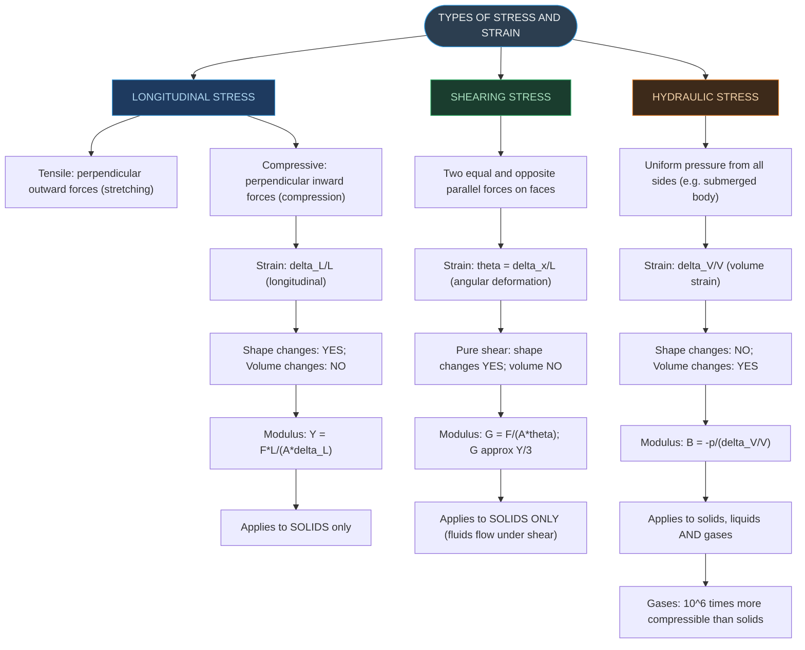
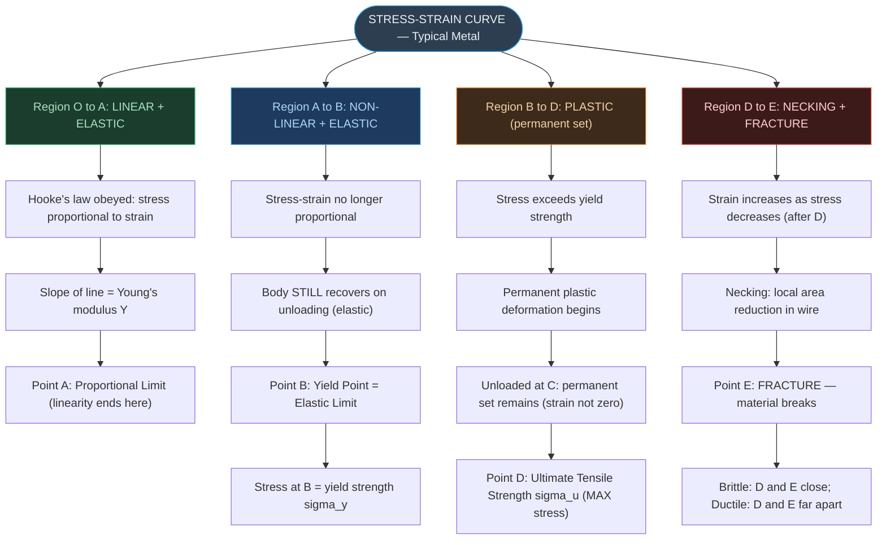
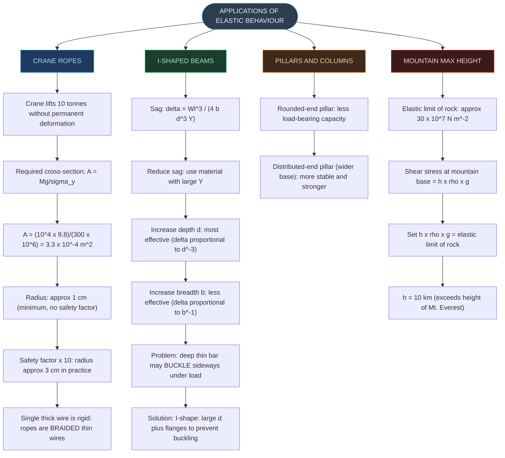
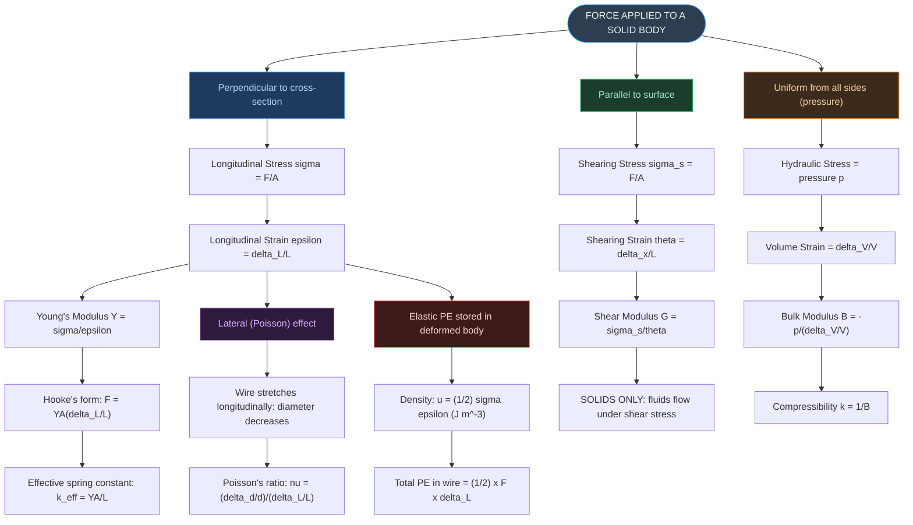

# CHAPTER 8 — RAPID REVISION + MIND MAPS

### Mechanical Properties of Solids

---

# ⚡ ONE-PAGE RAPID REVISION SHEET

## 🔢 Key Definitions — Absolute Must-Memorise

| Quantity | Definition | Formula | SI Unit |
|:---|:---|:---|:---|
| **Stress** | Restoring force per unit area | $\sigma = F/A$ | Pa = N m⁻² |
| **Longitudinal Strain** | Fractional change in length | $\varepsilon = \Delta L/L$ | Dimensionless |
| **Shearing Strain** | Angular deformation of body | $\theta = \Delta x/L \approx \tan\theta$ | Dimensionless |
| **Volume Strain** | Fractional change in volume | $\Delta V/V$ | Dimensionless |
| **Young's Modulus** | Longitudinal stress / Longitudinal strain (solids) | $Y = FL/(A\Delta L)$ | Pa |
| **Shear Modulus** | Shearing stress / Shearing strain (solids) | $G = F/(A\theta)$ | Pa |
| **Bulk Modulus** | Hydraulic stress / Volume strain (all matter) | $B = -p/(\Delta V/V)$ | Pa |
| **Compressibility** | Reciprocal of bulk modulus | $k = 1/B$ | Pa⁻¹ |
| **Poisson's Ratio** | Lateral strain / Longitudinal strain | $\nu = (\Delta d/d)/(\Delta L/L)$ | Dimensionless |
| **Elastic PE density** | Energy stored per unit volume | $u = \tfrac{1}{2}\sigma\varepsilon$ | J m⁻³ |

---

## 📐 Essential Formulae — Must Know Cold

> [!important] Hooke's Law
> For small deformations, **stress is directly proportional to strain**:
>
> $$\text{Stress} = k \times \text{Strain}$$
>
> where $k$ is the **modulus of elasticity**. Valid **only in the linear (proportional) region O to A** of the stress-strain curve.
>
> Elastomers (rubber, aortic tissue) do **NOT** obey Hooke's law.

> [!important] Young's Modulus — Solids Only
> $$Y = \frac{\sigma}{\varepsilon} = \frac{F/A}{\Delta L/L} = \frac{F \cdot L}{A \cdot \Delta L}$$
>
> Hooke's form: $F = Y \cdot A \cdot \dfrac{\Delta L}{L}$ (wire acts like a spring with $k_\text{eff} = YA/L$)
>
> Steel: 200 GPa | Copper: 110 GPa | Al: 70 GPa | **Large $Y$ = more elastic (stiffer)**

> [!important] Shear Modulus — Solids Only
> $$G = \frac{\sigma_s}{\theta} = \frac{F/A}{\Delta x/L} = \frac{F \cdot L}{A \cdot \Delta x}$$
>
> Hooke's form: $\sigma_s = G \times \theta$
>
> Steel: 84 GPa | Cu: 42 GPa | Al: 25 GPa | For most materials: $G \approx Y/3$

> [!important] Bulk Modulus — Solids + Liquids + Gases
> $$B = -\frac{p}{\Delta V/V} \quad \Longrightarrow \quad p = B \cdot \frac{\Delta V}{V}$$
>
> Compressibility: $k = \dfrac{1}{B} = -\dfrac{1}{\Delta p} \times \dfrac{\Delta V}{V}$
>
> Steel: 160 GPa | Water: 2.2 GPa | Air (STP): $1.0 \times 10^{-4}$ GPa
>
> Gases are approximately **$10^6$ times more compressible** than solids.

> [!important] Poisson's Ratio
> $$\nu = \frac{\text{lateral strain}}{\text{longitudinal strain}} = \frac{\Delta d/d}{\Delta L/L}$$
>
> Pure number (dimensionless). Theoretical range: $-1$ to $0.5$. For steels: $\nu \approx 0.28$–$0.30$; Al alloys: $\nu \approx 0.33$.

> [!important] Elastic Potential Energy
> Energy per unit volume stored in a deformed body:
>
> $$u = \frac{1}{2}\sigma\varepsilon = \frac{1}{2}Y\varepsilon^2$$
>
> Total PE in wire: $U = u \times \text{volume} = \dfrac{1}{2} F \cdot \Delta L$

> [!important] Beam Sag Formula
> A beam of length $l$, breadth $b$, depth $d$, Young's modulus $Y$, loaded at centre by $W$:
>
> $$\delta = \frac{Wl^3}{4bd^3Y}$$
>
> $\delta \propto l^3$ | $\delta \propto d^{-3}$ | $\delta \propto b^{-1}$ | $\delta \propto Y^{-1}$
>
> **Increasing depth $d$ is most effective** — cubic relationship ($d^{-3}$) vs linear ($b^{-1}$) for breadth.

---

## 📊 Comparative Values — Important for MCQs

**Young's Modulus Y:**

| Material | Steel | Iron | Copper | Al | Glass | Concrete | Wood | Bone |
|:---|:---:|:---:|:---:|:---:|:---:|:---:|:---:|:---:|
| Y (GPa) | 200 | 190 | 110 | 70 | 65 | 30 | 13 | 9.4 |

**Shear Modulus G:**

| Material | Tungsten | Steel | Nickel | Iron | Copper | Brass | Al | Lead |
|:---|:---:|:---:|:---:|:---:|:---:|:---:|:---:|:---:|
| G (GPa) | 150 | 84 | 77 | 70 | 42 | 36 | 25 | 5.6 |

**Bulk Modulus B:**

| Material | Nickel | Steel | Copper | Iron | Al | Water | Air (STP) |
|:---|:---:|:---:|:---:|:---:|:---:|:---:|:---:|
| B (GPa) | 260 | 160 | 140 | 100 | 72 | 2.2 | $10^{-4}$ |

> [!note] Key relation: $G \approx Y/3$ for most metallic materials (from the tables above: e.g. Steel Y = 200, G = 84 ≈ 200/3).

---

## ⚠️ Critical Distinctions — High-Yield Exam Traps

> [!warning] Stress-Strain Curve Traps
> - O → A: Linear + Elastic — Hooke's law valid; **slope = Young's modulus $Y$**.
> - A → B: **Non-linear but still elastic** — body recovers on unloading; Hooke's law fails.
> - Beyond B (yield point): **Plastic deformation** — permanent set; no recovery.
> - Point D = **Ultimate tensile strength** (maximum stress point) — **NOT** the fracture point.
> - Point E = **Fracture point** (where material actually breaks).
> - **Brittle:** D and E are close (sudden fracture) | **Ductile:** D and E are far apart (necking).
> - Elastomers (rubber): very large elastic region; non-linear; **no clear plastic region**.

> [!warning] Elastic Moduli Traps
> - $Y$ and $G$ apply to **SOLIDS ONLY** (fluids have no fixed shape).
> - $B$ applies to **solids, liquids and gases** (all change volume under pressure).
> - For any material: $G < Y$; specifically $G \approx Y/3$.
> - **Large $Y$ = MORE elastic (stiffer)** — NOT less elastic!
> - Steel ($Y = 200$ GPa) is **more elastic** than rubber (very low $Y$), even though rubber stretches far more. "Stretches more" ≠ "more elastic" in physics.

> [!warning] Stress Traps
> - Stress = F/A is the **restoring** force per unit area — equal in magnitude to the applied force, but conceptually different.
> - Stress is **NOT a vector** — it cannot be assigned a single direction like a force.
> - For a wire hanging with load $W$: tension at **any cross-section = $W$** (not $2W$). The ceiling reaction acts on the whole wire; tension at an interior section equals only the weight below it.

> [!warning] Strain and Hooke's Law Traps
> - Shearing strain = $\tan\theta \approx \theta$ — valid **only for small $\theta$**.
> - All strains are **dimensionless** (no units, no dimensional formula).
> - Hooke's law is valid **only in the linear region O to A**; the elastic region A to B is still recoverable but does NOT obey Hooke's law.
> - **Proportional limit (A) $\neq$ elastic limit (B)**. Proportional limit ends linearity; elastic limit (yield point) ends recovery. $B \geq A$ always.

> [!warning] Applications Traps
> - $\delta \propto d^{-3}$ but $\delta \propto b^{-1}$ — increasing depth is **far more effective** than breadth.
> - I-beam: large depth resists bending; flanges at top/bottom prevent **buckling**.
> - Maximum mountain height $\approx 10$ km — derived from the **elastic limit of rock**, not the atmosphere.
> - Crane rope radius in practice $\approx 3$ cm, NOT 1 cm — a factor-of-10 safety margin is always applied.

> [!warning] Elastic PE Traps
> - $u = \dfrac{1}{2}\sigma\varepsilon$ per unit volume — **do NOT drop the $\tfrac{1}{2}$**.
> - Total PE $= \dfrac{1}{2} F \cdot \Delta L$ — same factor as for a spring ($\tfrac{1}{2}kx^2$).
> - $B = -p/(\Delta V/V)$ — **negative sign is essential**; pressure increase → volume decrease.

---

# 🗺️ MIND MAP 1 — Chapter Overview

```mermaid
flowchart TD
    ROOT(["MECHANICAL PROPERTIES OF SOLIDS"])
    ROOT --> EL["ELASTIC vs PLASTIC"]
    ROOT --> ST["STRESS"]
    ROOT --> SR["STRAIN"]
    ROOT --> HL["HOOKE'S LAW"]
    ROOT --> EM["ELASTIC MODULI"]
    ROOT --> AP["APPLICATIONS"]

    EL --> EL1["Elastic: body recovers original shape on unloading"]
    EL --> EL2["Plastic: body permanently deformed"]
    EL2 --> EL3["Putty and clay: close to ideal plastics"]

    ST --> ST1["Tensile: perpendicular outward forces"]
    ST --> ST2["Compressive: perpendicular inward forces"]
    ST --> ST3["Shearing: parallel forces on opposite faces"]
    ST --> ST4["Hydraulic: uniform pressure from all sides"]
    ST4 --> ST5["Stress = F/A; unit Pa; NOT a vector"]

    SR --> SR1["Longitudinal: delta_L/L"]
    SR --> SR2["Shearing: theta = delta_x/L"]
    SR --> SR3["Volume: delta_V/V"]
    SR3 --> SR4["All strains: DIMENSIONLESS"]

    HL --> HL1["Stress = k x Strain (small deformations)"]
    HL1 --> HL2["Valid only in LINEAR region O to A"]
    HL2 --> HL3["Elastomers do NOT obey Hooke's law"]

    EM --> EM1["Young's Y: longitudinal; solids only"]
    EM --> EM2["Shear G: tangential; solids only"]
    EM --> EM3["Bulk B: hydraulic; solids + liquids + gases"]
    EM3 --> EM4["G approx Y/3 for most materials"]

    AP --> AP1["Crane ropes: A = Mg/sigma_y"]
    AP --> AP2["I-beams: delta = Wl^3/(4bd^3 Y)"]
    AP --> AP3["Mountains: max height approx 10 km"]

    style ROOT fill:#2c3e50,color:#ecf0f1,stroke:#3498db
    style EL fill:#1a3d2e,color:#a9dfbf,stroke:#27ae60
    style ST fill:#1e3a5f,color:#aed6f1,stroke:#3498db
    style SR fill:#3d2a1a,color:#f0d0a8,stroke:#e67e22
    style HL fill:#3d1a1a,color:#ffd0d0,stroke:#e74c3c
    style EM fill:#2d1a3d,color:#d9b3ff,stroke:#9b59b6
    style AP fill:#1a3d2e,color:#a9dfbf,stroke:#27ae60
```

---

# 🗺️ MIND MAP 2 — Types of Stress and Strain

---

# 🗺️ MIND MAP 3 — Stress-Strain Curve

---

# 🗺️ MIND MAP 4 — Applications of Elastic Behaviour

---

# 🗺️ MIND MAP 5 — Connecting Stress, Strain and Moduli

---

## 🏆 Last-Minute Exam Checklist

> [!tip] Before answering any Mechanical Properties problem, run through this list
>
> - **Which modulus?** → Tensile/Compressive → $Y$; Shearing → $G$; Hydraulic → $B$
> - **Young's modulus formula?** → $Y = FL/(A\Delta L)$; units = Pa; strain is dimensionless.
> - **Beam sag formula?** → $\delta = Wl^3/(4bd^3Y)$; identify which variable to increase.
> - **Modulus for fluids?** → **ONLY** bulk modulus $B$; neither $Y$ nor $G$ applies to fluids.
> - **Hooke's law valid?** → Only in the **linear region O to A** on the stress-strain curve.
> - **More elastic = ?** → Larger $Y$; steel is MORE elastic than rubber (not less!).
> - **Stress a vector?** → **NO** — stress is not a vector quantity.
> - **Tension in hanging wire?** → $F$ (the load below that cross-section), **NOT $2F$**.
> - **G vs Y?** → $G \approx Y/3$ for most materials; $G < Y$ always.
> - **Gases vs solids compressibility?** → Gases $\approx 10^6$ times more compressible than solids.
> - **Yield point vs proportional limit?** → Proportional limit (A) ends linearity; yield point B ends recovery. $B \geq A$ always.
> - **Fracture vs UTS?** → D = Ultimate Tensile Strength (max stress point); E = Fracture.
> - **Brittle vs ductile?** → Brittle: D and E **close**; Ductile: D and E **far apart**.
> - **Elastomers?** → Large elastic region; do NOT obey Hooke's law; no defined plastic region.
> - **Elastic PE?** → $u = \tfrac{1}{2}\sigma\varepsilon$ per unit volume; total = $\tfrac{1}{2}F\cdot\Delta L$.
> - **Mountain max height?** → $h\rho g \leq$ elastic limit of rock $\Rightarrow h \approx 10$ km.
> - **I-beam shape reason?** → Depth $d$ resists bending ($\delta \propto d^{-3}$); flanges prevent buckling.
> - **Poisson's ratio?** → Lateral strain / longitudinal strain; dimensionless; range $-1$ to $0.5$.
> - **Dim. formula for all elastic moduli?** → $[\text{ML}^{-1}\text{T}^{-2}]$ (same as stress and pressure).

---

## 📌 Common Formula Errors to Avoid

| Wrong Formula | Correct Formula | Situation |
|:---|:---|:---|
| $Y = (\Delta L/L) \div (F/A)$ | $Y = \mathbf{(F/A) \div (\Delta L/L)}$ | Stress over strain — NOT the reciprocal |
| $u = \sigma\varepsilon$ | $u = \mathbf{\frac{1}{2}}\sigma\varepsilon$ | Elastic PE per unit volume — never drop the $\frac{1}{2}$ |
| $B = p/(\Delta V/V)$ | $B = \mathbf{-}p/(\Delta V/V)$ | Negative sign essential; pressure up → volume **down** |
| $G = Y$ | $G \approx \mathbf{Y/3}$ | Shear modulus is roughly one-third of Young's modulus |
| Total PE $= F \times \Delta L$ | Total PE $= \mathbf{\frac{1}{2}} F \times \Delta L$ | Same $\frac{1}{2}$ factor as for a spring ($\frac{1}{2}kx^2$) |
| $\delta \propto 1/d$ | $\delta \propto \mathbf{1/d^3}$ | Sag depends on **cube** of depth, not linearly |
| Shearing stress applies to all matter | Shearing stress: **SOLIDS ONLY** | Fluids cannot sustain shearing stress |
| Elastic limit = Proportional limit | They are **different** points on the curve | Proportional limit (A) $\leq$ elastic limit (B) |

---

*End of Revision Notes + Mind Maps — Physics Ch. 8*