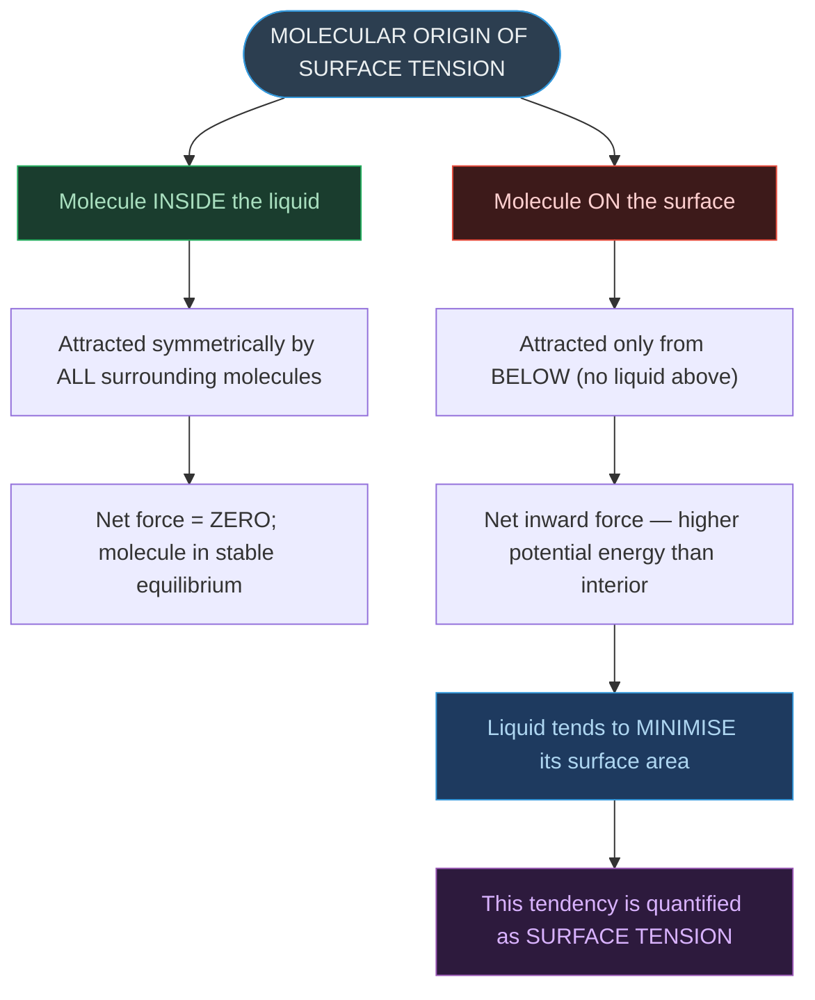

# CHAPTER 9: MECHANICAL PROPERTIES OF FLUIDS
### Complete Study Notes | Board · NEET · JEE Layered

---

## 🗺️ CONCEPT ROADMAP

```mermaid
flowchart TD
    A(["MECHANICAL PROPERTIES OF FLUIDS"])
    A --> B["Ch. 8 — Solids: definite shape, resist deformation"]
    B --> C["Fluids = Liquids + Gases — NO definite shape; can FLOW"]
    C --> D["Key property: cannot sustain shearing stress (flows instead)"]
    D --> E["PRESSURE — normal force per unit area; scalar; Pa"]
    E --> F["Variation with depth | Pascal's Law | Gauge vs Absolute"]
    F --> G["PASCAL'S LAW — pressure transmitted undiminished in all directions"]
    G --> H["Hydraulic Lift | Hydraulic Brakes"]
    H --> I["FLUID DYNAMICS — study of fluids in motion"]
    I --> J["Streamline flow | Equation of Continuity (mass conservation)"]
    J --> K["BERNOULLI'S PRINCIPLE — energy conservation in fluid flow"]
    K --> L["P + half*rho*v^2 + rho*g*h = constant"]
    L --> M["Torricelli's Law | Dynamic Lift | Magnus Effect | Aerofoil"]
    M --> N["VISCOSITY — internal friction in flowing fluids"]
    N --> O["Coefficient eta | Stokes' Law | Terminal Velocity"]
    O --> P["SURFACE TENSION — extra energy at liquid surfaces"]
    P --> Q["Surface Energy | Angle of Contact | Drops and Bubbles | Capillary Rise"]

    style A fill:#2c3e50,color:#ecf0f1,stroke:#3498db
    style E fill:#1e3a5f,color:#aed6f1,stroke:#3498db
    style G fill:#1e3a5f,color:#aed6f1,stroke:#3498db
    style K fill:#2d1a3d,color:#d9b3ff,stroke:#9b59b6
    style N fill:#3d2a1a,color:#f0d0a8,stroke:#e67e22
    style P fill:#1a3d2e,color:#a9dfbf,stroke:#27ae60
```



---

## SECTION 1 — INTRODUCTION: WHAT ARE FLUIDS? ⭐

### 1.1 Fluids vs Solids

|Property|Solids|Liquids|Gases|
|:--|:-:|:-:|:-:|
|Definite Shape|✓|✗|✗|
|Definite Volume|✓|✓|✗|
|Can Flow|✗|✓|✓|
|Compressibility|Very low|Low|High|
|Resistance to shear|High|~Zero|~Zero|

- **Fluids** = any substance that can flow = liquids + gases.
- The key distinction: **fluids cannot sustain shearing stress**. When a shear force is applied, they flow rather than deform elastically.
- The shearing stress of fluids is about **10⁶ times smaller** than that of solids.

### 1.2 Hydrostatics vs Fluid Dynamics

- **Hydrostatics** = study of fluids at rest (Section 9.2)
- **Fluid Dynamics / Hydrodynamics** = study of fluids in motion (Sections 9.3–9.4)

---

## SECTION 2 — PRESSURE ⭐⭐⭐

### 2.1 Definition of Pressure

When a fluid exerts force on a surface, the force is always **perpendicular (normal)** to the surface (for fluids at rest). If there were a component parallel to the surface, the fluid would flow — since fluids at rest cannot sustain a shear, the force must be purely normal.

> [!important] Definition of Pressure $$\boxed{P_{av} = \frac{F}{A}} \quad \text{...(9.1)}$$
> 
> In the limiting sense (for a point): $$P = \lim_{\Delta A \to 0} \frac{\Delta F}{\Delta A} \quad \text{...(9.2)}$$
> 
> - **SI unit:** N m⁻² = **Pascal (Pa)** (named after Blaise Pascal, 1623–1662)
> - **Dimensional formula:** $[\text{ML}^{-1}\text{T}^{-2}]$
> - **Pressure is a scalar quantity.** The force in the numerator is the normal component only; no single direction can be assigned to pressure.

**Other common units:**

- 1 atm = 1.013 × 10⁵ Pa (sea-level atmospheric pressure)
- 1 bar = 10⁵ Pa
- 1 torr = 133 Pa = 1 mm of Hg (named after Torricelli)

### 2.2 Density

$$\boxed{\rho = \frac{m}{V}} \quad \text{...(9.3)}$$

- **SI unit:** kg m⁻³ | **Dimensional formula:** [ML⁻³] | Positive scalar.
- Liquids: nearly incompressible → density essentially constant with pressure.
- Gases: large variation in density with pressure and temperature.
- Density of water at 4°C = 1.0 × 10³ kg m⁻³

**Relative density** = density of substance / density of water at 4°C → dimensionless positive scalar.

**Important density values (at STP):**

|Fluid|ρ (kg m⁻³)|
|:--|:--|
|Water|1.00 × 10³|
|Sea water|1.03 × 10³|
|Mercury|13.6 × 10³|
|Whole blood|1.06 × 10³|
|Ethyl alcohol|0.806 × 10³|
|Air|1.29|
|Oxygen|1.43|
|Hydrogen|9.0 × 10⁻²|

---

## SECTION 3 — PASCAL'S LAW ⭐⭐⭐

### 3.1 Pressure is the Same at All Points at the Same Height

Consider a prismatic fluid element ABC-DEF inside a fluid at rest. By equilibrium analysis (resolving forces along all three faces):

$$P_a = P_b = P_c \quad \text{...(9.4)}$$

> [!important] Pascal's Law (Form 1) **Pressure exerted by a fluid at rest is the same in all directions at any given point.**
> 
> This confirms pressure is NOT a vector — it has no preferred direction. The force against any area within a fluid at rest is **normal** to the area, regardless of the area's orientation.

> [!important] Pascal's Law (Form 2) **The pressure in a fluid at rest is the same at all points at the same horizontal level.**

### 3.2 Variation of Pressure with Depth

Consider a cylindrical fluid element of base area A and height h:

Equilibrium: $(P_2 - P_1)A = mg = \rho h A g$

$$\boxed{P_2 - P_1 = \rho g h} \quad \text{...(9.6)}$$

If point 1 is the open surface (pressure = Pₐ) and point 2 is at depth h:

$$\boxed{P = P_a + \rho g h} \quad \text{...(9.7)}$$

> [!note] Key Observations
> 
> - Pressure at depth h **increases** with depth.
> - Excess pressure P − Pₐ = ρgh is called **gauge pressure**.
> - Pressure depends on **vertical height only** — NOT on shape or cross-sectional area of container.
> - **Hydrostatic paradox:** Three vessels of different shapes connected at the bottom show the same liquid level even though they hold different volumes.

### 3.3 Atmospheric Pressure and Its Measurement

**Mercury Barometer (Torricelli, 1608–1647):**

- Inverted mercury-filled tube in a trough; space above ≈ vacuum.
- At sea level: Pₐ = ρgh, where h ≈ **76 cm of mercury** = 760 mm Hg.

$$P_a = \rho g h \quad \text{...(9.8)}$$

**1 torr** (= 1 mm Hg = 133 Pa) is used in medicine. **1 bar** = 10⁵ Pa in meteorology.

**Open Tube Manometer:** U-tube measuring **gauge pressure**: Pg = P − Pₐ = ρgh.

### 3.4 Pascal's Law — Hydraulic Machines ⭐⭐

> [!important] Pascal's Law (Form 3) **When pressure is applied to an enclosed fluid, it is transmitted undiminished and equally in all directions** to every part of the fluid and the walls of the container.

**Hydraulic Lift:**

$$\boxed{F_2 = \frac{F_1 A_2}{A_1}}$$

- **Mechanical advantage** = A₂/A₁
- Volume displaced conserved: A₁L₁ = A₂L₂

**Hydraulic Brakes:** Foot pedal → master piston (small) → pressure transmitted through brake oil → larger pistons at all four wheels → equal braking force on all wheels.

> [!note] Key Insight — Energy Conservation Force is amplified, but **work done is the same** (larger force × smaller displacement = smaller force × larger displacement). The hydraulic machine is a **force multiplier**, not an energy creator.

---

## SECTION 4 — STREAMLINE FLOW ⭐⭐

### 4.1 Steady Flow and Streamlines

**Steady flow** = at any given point in the fluid, the velocity of every fluid particle passing through that point remains constant in time.

**Streamline** = a curve whose tangent at any point is in the direction of the fluid velocity at that point.

> [!note] Properties of Streamlines
> 
> - No two streamlines can cross — if they did, a particle would have two velocities at one point, contradicting steady flow.
> - In steady flow, the map of streamlines is stationary in time.
> - Closely spaced streamlines → higher velocity; widely spaced → lower velocity.

### 4.2 Laminar vs Turbulent Flow

|Type|Description|Condition|
|:--|:--|:--|
|**Laminar (Streamline)**|Smooth; layers glide over each other; parallel streamlines|Speed < critical speed|
|**Turbulent**|Irregular, chaotic, whirlpools ("white water rapids")|Speed > critical speed|

### 4.3 Equation of Continuity (Mass Conservation) ⭐⭐⭐

For incompressible fluid in steady flow, mass flowing in = mass flowing out:

$$\rho_P A_P v_P = \rho_R A_R v_R = \rho_Q A_Q v_Q \quad \text{...(9.9)}$$

For incompressible fluid (ρ = constant):

$$\boxed{A_1 v_1 = A_2 v_2 \quad \Rightarrow \quad Av = \text{constant}} \quad \text{...(9.10), (9.11)}$$

**Av** = **volume flux** (m³ s⁻¹) — remains constant throughout the pipe.

> [!warning] Critical Distinction **A₁v₁ = A₂v₂** is the **equation of continuity** — conservation of **mass**. It is NOT Bernoulli's equation (which is energy conservation). They are two independent, separately applicable equations.

---

## SECTION 5 — BERNOULLI'S PRINCIPLE ⭐⭐⭐

### 5.1 Derivation (Work-Energy Method)

Consider an ideal fluid (non-viscous, incompressible) flowing through a pipe with varying cross-section and height. In time Δt, a fluid element moves from region BC to region DE:

- Net work done on fluid: $(P_1 - P_2)\Delta V$
- Change in KE: $\frac{1}{2}\rho\Delta V(v_2^2 - v_1^2)$
- Change in PE: $\rho g \Delta V(h_2 - h_1)$

By the Work-Energy Theorem, rearranging:

> [!important] Bernoulli's Equation (Daniel Bernoulli, 1738) $$\boxed{P_1 + \frac{1}{2}\rho v_1^2 + \rho g h_1 = P_2 + \frac{1}{2}\rho v_2^2 + \rho g h_2} \quad \text{...(9.12)}$$
> 
> In general, along any streamline: $$\boxed{P + \frac{1}{2}\rho v^2 + \rho g h = \text{constant}} \quad \text{...(9.13)}$$
> 
> Each term is **energy per unit volume:**
> 
> - $P$ = pressure energy per unit volume
> - $\frac{1}{2}\rho v^2$ = kinetic energy per unit volume
> - $\rho gh$ = gravitational potential energy per unit volume

### 5.2 Conditions for Bernoulli's Equation

> [!warning] Validity Conditions Bernoulli's equation applies ONLY when:
> 
> 1. Fluid is **non-viscous** (zero viscosity — no energy lost to friction)
> 2. Fluid is **incompressible** (density constant)
> 3. Flow is **steady (streamline)** (no turbulence)
> 4. Applied **along a single streamline**
> 
> It does **NOT** hold for turbulent flow, viscous fluids, or compressible gases at high speed.
> 
> **Special case (fluid at rest, v = 0):** Reduces correctly to the hydrostatic equation $P_1 - P_2 = \rho g(h_2 - h_1)$. ✓

### 5.3 Torricelli's Law (Speed of Efflux) ⭐⭐

**Efflux** = fluid outflow. For an open tank with a hole at depth h below the surface (v₂ ≈ 0 for large tank, P₁ = P₂ = Pₐ):

> [!important] Torricelli's Law $$\boxed{v_1 = \sqrt{2gh}} \quad \text{...(9.15)}$$
> 
> The speed of efflux from an open tank equals the speed of a body falling freely through height h. Identical in form to the kinematic equation $v^2 = 2gh$.
> 
> **General case** (sealed tank at pressure P): $$v_1 = \sqrt{2gh + \frac{2(P - P_a)}{\rho}} \quad \text{...(9.14)}$$
> 
> When P >> Pₐ (sealed pressurised tank), the √(2gh) term is negligible — efflux speed is determined by container pressure. **This is the principle behind rocket propulsion.**

### 5.4 Dynamic Lift ⭐⭐⭐

**Dynamic lift** = the force on a body moving through a fluid, arising from pressure differences due to velocity differences (Bernoulli's principle).

**(i) Non-spinning ball:** Symmetric streamlines → equal velocity above and below → zero pressure difference → **no lift**.

**(ii) Spinning ball — Magnus Effect:**

- Spinning ball drags air; on one side spin adds to airflow velocity → higher v → lower P.
- Opposite side: spin opposes flow → lower v → higher P.
- Net pressure difference → **net lateral force = Magnus effect**.
- Explains deviation of spinning cricket/tennis/golf balls from parabolic paths.

**(iii) Aerofoil (aircraft wing):**

- Wing shape crowds streamlines **above** → higher v, lower P above; lower v, higher P below.
- Net upward pressure force = **aerodynamic lift** (balances the plane's weight).

> [!note] Core Bernoulli Logic **Faster flow → lower pressure** (since P + ½ρv² = const → v↑ means P↓).

---

## SECTION 6 — VISCOSITY ⭐⭐⭐

### 6.1 Concept

Real fluids offer **resistance to flow** between adjacent layers. This internal resistance is **viscosity** — the fluid analogue of solid friction. Viscosity exists because adjacent fluid layers move at different velocities and exert drag forces on each other.

**Laminar flow in a pipe:** Velocity is maximum along the axis and decreases to zero at the walls (parabolic profile).

> [!note] Solids vs Fluids — Key Difference in Shear Response
> 
> - In **solids**: shearing stress ∝ **shear strain** (Hooke's law — strain is fixed for a given stress).
> - In **fluids**: shearing stress ∝ **rate of shear strain** (v/l) — the fluid keeps deforming continuously, so stress depends on the rate of deformation, not the accumulated deformation.

### 6.2 Coefficient of Viscosity (η)

> [!important] Coefficient of Viscosity $$\boxed{\eta = \frac{F/A}{v/l} = \frac{F \cdot l}{v \cdot A}} \quad \text{...(9.16)}$$
> 
> - **SI unit:** Pa·s = N s m⁻² = **poiseuille (Pl)**
> - **Dimensional formula:** $[\text{ML}^{-1}\text{T}^{-1}]$

**Effect of temperature:**

|Medium|Effect of Rising Temperature|Reason|
|:--|:--|:--|
|**Liquids**|η **decreases**|Molecules become more mobile; inter-layer resistance falls|
|**Gases**|η **increases**|Random molecular motion increases → more momentum transfer between layers|

**Viscosities of some common fluids:**

|Fluid|T (°C)|η (mPl)|
|:--|:-:|:-:|
|Water|20|1.0|
|Water|100|0.3|
|Blood|37|2.7|
|Machine Oil|16|113|
|Glycerine|20|830|
|Honey|—|~200|
|Air|0|0.017|

> [!note] Blood is ~2.7× more viscous than water. The relative viscosity of blood remains constant between 0°C and 37°C.

### 6.3 Stokes' Law and Terminal Velocity ⭐⭐⭐

> [!important] Stokes' Law (Sir George Stokes, 1819–1903) $$\boxed{F = 6\pi\eta a v} \quad \text{...(9.17)}$$
> 
> where $a$ = radius of sphere, $v$ = speed, $\eta$ = viscosity. The viscous drag is proportional to velocity — a **velocity-dependent retarding force**.

**Terminal velocity (vₜ):** When a sphere falls through a viscous fluid, gravitational force = viscous drag + buoyant force:

$$\frac{4}{3}\pi a^3 (\rho - \sigma)g = 6\pi\eta a v_t$$

> [!important] Terminal Velocity $$\boxed{v_t = \frac{2a^2(\rho - \sigma)g}{9\eta}} \quad \text{...(9.18)}$$
> 
> where ρ = density of sphere, σ = density of fluid.
> 
> **Key dependences:**
> 
> - $v_t \propto a^2$ — terminal velocity increases rapidly with sphere size
> - $v_t \propto 1/\eta$ — inversely proportional to viscosity
> - $v_t \propto (\rho - \sigma)$ — depends on density difference

> [!note] Raindrops reach terminal velocity during fall. Without viscosity, raindrops would hit the ground at dangerously high speeds. Fine dust particles ($a$ very small) settle extremely slowly because $v_t \propto a^2$.

---

## SECTION 7 — SURFACE TENSION ⭐⭐⭐

### 7.1 Concept and Molecular Origin

Surface tension explains: water wetting glass but mercury not; oil and water not mixing; water rising in capillary tubes; soap bubbles being spherical; insects walking on water.

**Molecular origin:**



Energy of a surface molecule ≈ half the energy needed to remove it entirely from the liquid (≈ half heat of evaporation). For water: heat of evaporation ≈ 40 kJ/mol.

### 7.2 Surface Energy and Surface Tension

For a liquid film on a U-frame with movable bar of length l, moved by distance d:

- Extra area = 2dl (film has **two surfaces**)
- Work done = F × d = S × 2dl

> [!important] Surface Tension $$\boxed{S = \frac{F}{2l}} \quad \text{...(9.20)}$$
> 
> **Surface tension (S)** is simultaneously:
> 
> 1. **Force per unit length** on a line in the plane of the surface.
>     
> 2. **Surface energy per unit area** of the liquid interface.
>     
> 
> - **SI unit:** N m⁻¹ | **Dimensional formula:** $[\text{MT}^{-2}]$ | Scalar
> - S **decreases with temperature** (like η for liquids)

**Surface tension of some liquids (at 20°C unless noted):**

|Liquid|S (N m⁻¹)|
|:--|:--|
|Mercury|0.4355|
|Water|0.0727|
|Ethanol|0.0227|
|Oxygen (−183°C)|0.0132|
|Helium (−270°C)|0.000239|

### 7.3 Angle of Contact ⭐⭐

**Angle of contact (θ)** = angle between the tangent to the liquid surface at the point of contact and the solid surface, measured **inside the liquid**.

> [!important] Angle of Contact Equilibrium $$\boxed{S_{la}\cos\theta + S_{sl} = S_{sa}} \quad \text{...(9.22)}$$
> 
> where $S_{la}$ = liquid-air, $S_{sl}$ = solid-liquid, $S_{sa}$ = solid-air surface tension.

|Condition|Angle of Contact|Behaviour|
|:--|:--|:--|
|$S_{sl} < S_{la}$ (e.g., water-glass)|θ < 90° (acute)|Liquid **wets** the solid; spreads out|
|$S_{sl} > S_{la}$ (e.g., mercury-glass)|θ > 90° (obtuse)|Liquid **does not wet** the solid; forms droplets|

- **Detergents and soaps** reduce $S_{sl}$ → decrease θ → better wetting.
- **Waterproofing agents** increase θ → water beads off.

### 7.4 Drops and Bubbles — Excess Pressure ⭐⭐⭐

**Why spherical:** For a given volume, a sphere has minimum surface area → minimum surface energy → equilibrium shape.

> [!important] Excess Pressure Formulae **Liquid drop or air bubble in liquid (ONE surface):** $$\boxed{P_i - P_o = \frac{2S_{la}}{r}} \quad \text{...(9.25)}$$
> 
> **Soap bubble in air (TWO surfaces — inner + outer liquid films):** $$\boxed{P_i - P_o = \frac{4S_{la}}{r}} \quad \text{...(9.26)}$$

|Object|Number of surfaces|Excess pressure|
|:--|:-:|:-:|
|Liquid drop in air|1|2S/r|
|Air bubble in liquid|1|2S/r|
|Soap bubble in air|2|4S/r|

> [!note] The **convex side always has higher pressure** than the concave side at a curved liquid-gas interface. This is why you must blow hard (exceeding the 4S/r threshold) to form a soap bubble.

### 7.5 Capillary Rise ⭐⭐⭐

- **Wetting liquid** (acute θ) → liquid **rises** in capillary.
- **Non-wetting liquid** (obtuse θ) → liquid is **depressed** in capillary.

For equilibrium with pressure difference at the concave meniscus:

> [!important] Capillary Rise Formula $$\boxed{h = \frac{2S\cos\theta}{\rho g a}} \quad \text{...(9.29)}$$
> 
> where $a$ = tube radius, $\theta$ = angle of contact.
> 
> **Key dependences:**
> 
> - $h \propto 1/a$ — thinner tube → greater rise (capilla = hair in Latin)
> - $h \propto \cos\theta$ → if θ > 90° (cosθ < 0): capillary **depression** (mercury-glass)
> - $h \propto S$ — higher surface tension → greater rise
> - $h \propto 1/\rho g$ — lower density → greater rise

**Practical example:** For water in glass (a = 0.05 cm): h ≈ **2.98 cm**

**Real-world capillary action:** sap rising in trees; water wicking through soil and cloth; oil rising up a cotton wick.

---

## SECTION 8 — SOLVED EXAMPLES (NCERT) ⭐⭐⭐

### Example 9.1 — Pressure in Bones

A = 20 × 10⁻⁴ m²; F = 400 N → $P = F/A = \mathbf{2 \times 10^5\ \text{N m}^{-2}}$

### Example 9.2 — Pressure at Depth (10 m lake)

$P = P_a + \rho g h = 1.01\times10^5 + 10^5 = \mathbf{2.01 \times 10^5\ \text{Pa} \approx 2\ \text{atm}}$. At 1 km depth: ~100 atm.

### Example 9.4 — Submarine Window (1000 m depth)

- **(a)** Absolute P ≈ **104 atm**
- **(b)** Gauge P ≈ **103 atm**
- **(c)** Force on 0.04 m² window = **4.12 × 10⁵ N** ≈ 41.2 tonnes

### Example 9.5 — Hydraulic Syringe (d₁ = 1 cm, d₂ = 3 cm, F₁ = 10 N)

- **(a)** $F_2 = 9 \times 10 = \mathbf{90\ \text{N}}$
- **(b)** $L_2 = (1/9) \times 6.0 = \mathbf{0.67\ \text{cm}}$

### Example 9.7 — Boeing Aircraft Lift

- **(a)** $\Delta P = Mg/A = \mathbf{6.5 \times 10^3\ \text{N m}^{-2}}$
- **(b)** Fractional speed increase above wing ≈ **8%** only

### Example 9.9 — Terminal Velocity (Copper ball in oil)

$$\eta = \frac{2a^2(\rho-\sigma)g}{9v_t} = \mathbf{9.9 \times 10^{-1}\ \text{Pa s}}$$

### Example 9.10 — Bubble in Capillary Tube (8 cm depth, S = 7.3×10⁻² N m⁻¹)

- Excess pressure (one surface) = 2S/r = **146 Pa**
- P_inside = **1.02 × 10⁵ Pa**

---

## SECTION 9 — CONCEPTUAL APPLICATIONS ⭐⭐

### 9.1 Why Blood Pressure is Greater at Feet than at Brain

P = Pₐ + ρgh: feet are at greater depth below the heart → higher h → higher pressure. The brain is above the heart → lower pressure.

### 9.2 Why Atmospheric Pressure Falls with Altitude

Atmospheric pressure at any point = weight of air column of unit cross-section above that point. As altitude increases, the air column above is lighter → lower pressure. At ~6 km, pressure ≈ half sea-level value.

### 9.3 Hydrostatic Pressure as a Scalar

Hydrostatic pressure acts **equally in all directions** at any point — it has no specific direction, hence it is a scalar.

---

## 📋 QUICK REFERENCE — All Laws, Formulas, and Dimensional Formulae

```
PRESSURE:
┌──────────────────────────────────────────────────────────────┐
│  P = F/A  (normal force per unit area)                       │
│  P = Pₐ + ρgh  (absolute pressure at depth h)               │
│  Gauge pressure = P − Pₐ = ρgh                              │
│  Unit: Pa = N m⁻²;  Dim: [ML⁻¹T⁻²]  (scalar)               │
│  1 atm = 1.013×10⁵ Pa; 1 bar = 10⁵ Pa; 1 torr = 133 Pa     │
└──────────────────────────────────────────────────────────────┘

PASCAL'S LAW:
┌──────────────────────────────────────────────────────────────┐
│  Pressure same in all directions at a point in fluid at rest │
│  Pressure same at same horizontal level                       │
│  Applied pressure transmitted undiminished throughout fluid  │
│  Hydraulic lift: F₂ = F₁(A₂/A₁);  MA = A₂/A₁              │
│  Volume conserved: A₁d₁ = A₂d₂                              │
└──────────────────────────────────────────────────────────────┘

EQUATION OF CONTINUITY (Incompressible fluid):
┌──────────────────────────────────────────────────────────────┐
│  A₁v₁ = A₂v₂  →  Av = constant (volume flux)               │
│  Narrower pipe → higher velocity                             │
│  Statement of conservation of mass — NOT Bernoulli           │
└──────────────────────────────────────────────────────────────┘

BERNOULLI'S EQUATION (ideal, incompressible, non-viscous):
┌──────────────────────────────────────────────────────────────┐
│  P + ½ρv² + ρgh = constant (along a streamline)             │
│  v↑ → P↓  (higher speed → lower pressure at same height)    │
│  Torricelli's Law (open tank): v = √(2gh)                   │
│  Applies ONLY to non-viscous, incompressible, steady flow   │
└──────────────────────────────────────────────────────────────┘

VISCOSITY:
┌──────────────────────────────────────────────────────────────┐
│  η = (F/A)/(v/l) = Fl/(vA)  [coefficient of viscosity]      │
│  Unit: Pa·s = poiseuille (Pl);  Dim: [ML⁻¹T⁻¹]             │
│  Liquids: η falls with T;  Gases: η rises with T            │
│  Stokes' Law: F = 6πηav                                      │
│  Terminal velocity: vt = 2a²(ρ−σ)g / 9η                    │
│  vt ∝ a²;  vt ∝ 1/η;  vt ∝ (ρ−σ)                          │
└──────────────────────────────────────────────────────────────┘

SURFACE TENSION:
┌──────────────────────────────────────────────────────────────┐
│  S = F/(2l) = Surface energy per unit area                   │
│  Unit: N m⁻¹;  Dim: [MT⁻²]  (scalar)                       │
│  Excess P: Drop / Air bubble = 2S/r; Soap bubble = 4S/r     │
│  Capillary rise: h = 2Scosθ/(ρga);  h ∝ 1/a                │
│  Acute θ → wetting (rise); Obtuse θ → non-wetting (fall)    │
│  Equilibrium: Sla·cosθ + Ssl = Ssa                          │
│  S decreases with temperature (like η of liquids)            │
└──────────────────────────────────────────────────────────────┘
```

---

## ⚡ POINTS TO PONDER (High-Yield for Exams)

1. **Pressure is a scalar.** P = F/A uses the normal component of force, which acts equally in all directions — no single direction can be assigned to pressure.
    
2. **Pressure depends only on vertical height h**, not on the shape or cross-section of the container. This is the hydrostatic paradox.
    
3. **Gauge vs absolute pressure.** Blood pressure (sphygmomanometer) is gauge pressure. Absolute pressure = atmospheric + gauge.
    
4. **Equation of continuity ≠ Bernoulli.** A₁v₁ = A₂v₂ is mass conservation; Bernoulli is energy conservation. Separate laws, applied independently.
    
5. **Bernoulli applies only to ideal fluids.** No real fluid is perfectly non-viscous. In practice, it gives good approximations for low-viscosity fluids (water, air at low speeds).
    
6. **Viscosity of liquids ≠ viscosity of gases.** For liquids, η falls with temperature. For gases, η rises with temperature. A very common exam trap.
    
7. **Stokes' law applies to small spheres at low speeds** (laminar flow around the sphere). Breaks down when turbulence develops.
    
8. **Terminal velocity ∝ a²** — small dust particles settle much more slowly than large particles; small droplets need to grow large enough to fall as rain.
    
9. **Soap bubble has two surfaces; a liquid drop has only one.** Excess pressure in soap bubble (4S/r) is **twice** that of a liquid drop (2S/r) of the same radius.
    
10. **Capillary rise h ∝ 1/a** — thinner the tube, higher the rise.
    
11. **Surface tension and viscosity both decrease with temperature** for liquids — hot water cleans better (lower S and η).
    
12. **Convex side of a curved liquid-air interface always has higher pressure** — air inside a bubble is at higher pressure than outside.
    

---

## 📊 Dimensional Formulae Summary

|Quantity|Symbol|Dimensional Formula|SI Unit|
|:--|:--|:--|:--|
|Pressure|P|$[\text{ML}^{-1}\text{T}^{-2}]$|Pa = N m⁻²|
|Density|ρ|$[\text{ML}^{-3}]$|kg m⁻³|
|Dynamic viscosity|η|$[\text{ML}^{-1}\text{T}^{-1}]$|Pa·s = Pl|
|Surface Tension|S|$[\text{MT}^{-2}]$|N m⁻¹|
|Capillary rise|h|[L]|m|
|Volume flux|Av|$[\text{L}^3\text{T}^{-1}]$|m³ s⁻¹|
|Terminal velocity|vt|$[\text{LT}^{-1}]$|m s⁻¹|

---

_End of Notes — Physics Chapter 9 | Total Sections: 9_