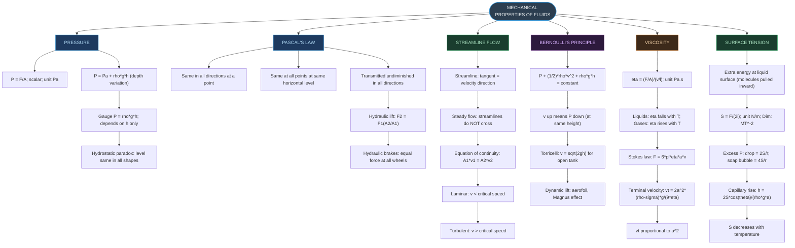
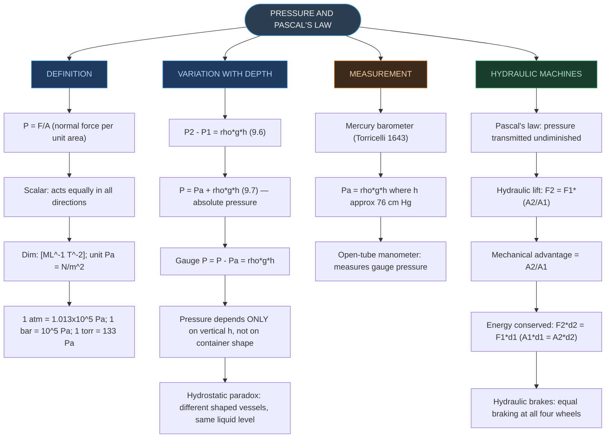
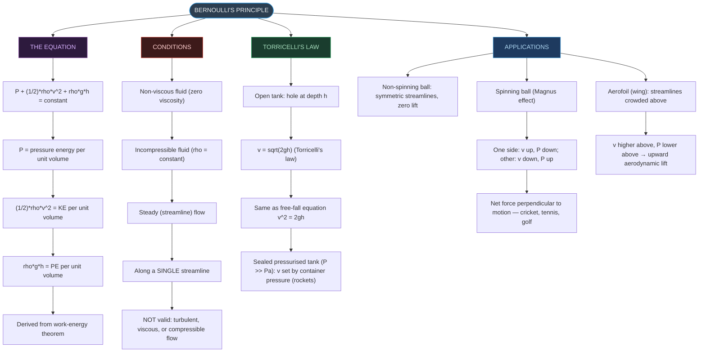
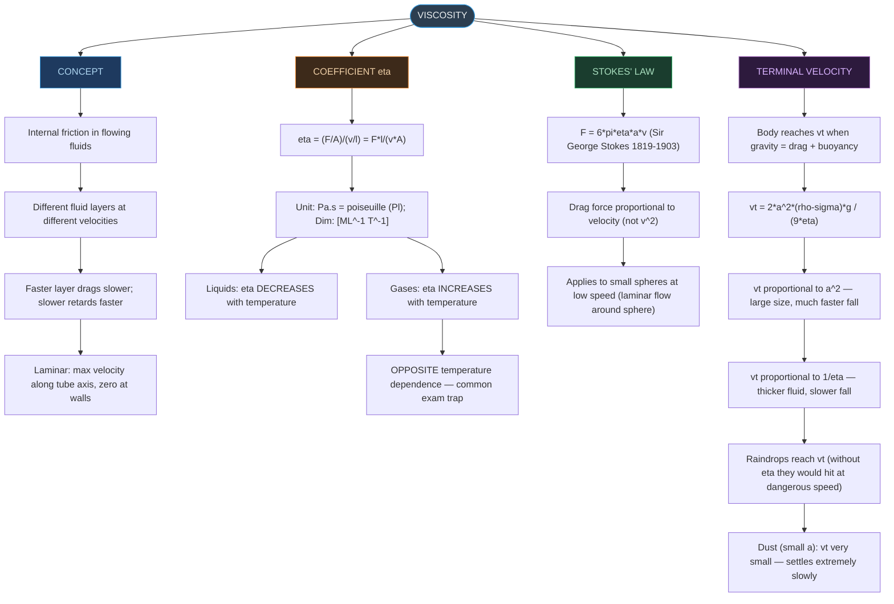
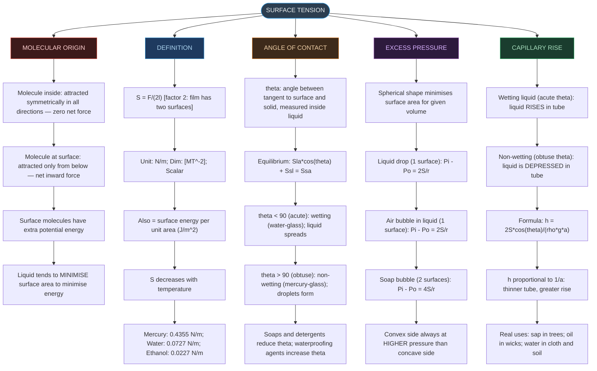

# CHAPTER 9 — RAPID REVISION + MIND MAPS

### Mechanical Properties of Fluids

---

# ⚡ ONE-PAGE RAPID REVISION SHEET

## 🔢 Key Definitions — Absolute Must-Memorise

|Quantity|Definition|Formula|SI Unit|
|:--|:--|:--|:--|
|**Pressure**|Normal force per unit area|$P = F/A$|Pa = N m⁻²|
|**Gauge Pressure**|Excess over atmospheric pressure|$P_g = P − P_a = \rho g h$|Pa|
|**Absolute Pressure**|Total pressure (gauge + atmospheric)|$P = P_a + \rho g h$|Pa|
|**Volume Flux**|Volume of fluid flowing per second|$Q = Av$|m³ s⁻¹|
|**Coefficient of Viscosity**|Shearing stress / Strain rate|$\eta = (F/A)/(v/l)$|Pa·s = Pl|
|**Surface Tension**|Force per unit length (or surface energy per unit area)|$S = F/2l$|N m⁻¹|
|**Capillary Rise**|Height of liquid rise in narrow tube|$h = 2S\cos\theta/\rho g a$|m|
|**Terminal Velocity**|Constant velocity when drag = net gravity|$v_t = 2a^2(\rho-\sigma)g/9\eta$|m s⁻¹|

---

## 📐 Essential Formulae — Must Know Cold

> [!important] Pressure and Depth $$P = P_a + \rho g h \quad \text{(absolute pressure at depth } h\text{)}$$
> 
> Gauge pressure: $P_g = P - P_a = \rho g h$
> 
> Pressure is the **SAME** at all points at the same horizontal level. Pressure does **NOT** depend on the shape of the container.
> 
> Units: 1 atm = 1.013×10⁵ Pa; 1 bar = 10⁵ Pa; 1 torr = 133 Pa

> [!important] Pascal's Law — Hydraulic Machines $$F_2 = \frac{F_1 A_2}{A_1} \quad \text{(hydraulic lift)}$$
> 
> Mechanical advantage = $A_2/A_1$
> 
> Volume conserved (incompressible): $A_1 d_1 = A_2 d_2$
> 
> Applications: Hydraulic lift, Hydraulic brakes (pressure transmitted equally to all wheel cylinders)

> [!important] Equation of Continuity (Mass Conservation) $$A_1 v_1 = A_2 v_2 \quad \Rightarrow \quad Av = \text{constant}$$
> 
> - Narrower pipe → higher velocity (streamlines closely spaced)
> - Wider pipe → lower velocity (streamlines widely spaced)
> - **NOT** the same as Bernoulli's equation; this is mass conservation only.

> [!important] Bernoulli's Equation (Energy Conservation) $$P + \frac{1}{2}\rho v^2 + \rho g h = \text{constant}$$
> 
> Valid for: **Non-viscous, incompressible, steady (streamline) flow** along a single streamline.
> 
> $v \uparrow \Rightarrow P \downarrow$ (at same height); $v \downarrow \Rightarrow P \uparrow$
> 
> **Torricelli's Law** (open tank, hole at depth h): $$v = \sqrt{2gh}$$
> 
> Same form as free-fall: $v^2 = 2gh$.

> [!important] Viscosity $$\eta = \frac{Fl}{vA} \quad [\text{ML}^{-1}\text{T}^{-1}]$$
> 
> **Stokes' Law** (viscous drag on a sphere): $$F = 6\pi\eta a v$$
> 
> **Terminal Velocity:** $$v_t = \frac{2a^2(\rho - \sigma)g}{9\eta}$$
> 
> $v_t \propto a^2$; $v_t \propto 1/\eta$; $v_t \propto (\rho - \sigma)$
> 
> Liquids: $\eta$ falls with $T$ | Gases: $\eta$ rises with $T$

> [!important] Surface Tension $$S = \frac{F}{2l} \quad [\text{MT}^{-2}] \quad \text{unit: N m}^{-1}$$
> 
> **Excess pressure:**
> 
> - Liquid drop (1 surface): $\Delta P = 2S/r$
> - Air bubble in liquid (1 surface): $\Delta P = 2S/r$
> - Soap bubble in air (2 surfaces): $\Delta P = 4S/r$
> 
> **Capillary rise:** $$h = \frac{2S\cos\theta}{\rho g a} \quad (h \propto 1/a)$$
> 
> Angle of contact: $S_{la}\cos\theta + S_{sl} = S_{sa}$
> 
> Acute $\theta$ → wetting (capillary rise) | Obtuse $\theta$ → non-wetting (capillary depression)

---

## 📊 Comparative Values — Important for MCQs

**Density at STP:**

|Fluid|ρ (kg m⁻³)|
|:--|:-:|
|Mercury|13,600|
|Sea water|1,030|
|Water (4°C)|1,000|
|Blood (whole)|1,060|
|Ethyl alcohol|806|
|Air|1.29|
|Hydrogen|0.09|

**Surface Tension (at 20°C):**

|Liquid|S (N m⁻¹)|
|:--|:-:|
|Mercury|0.4355|
|Water|0.0727|
|Ethanol|0.0227|

**Viscosity:**

|Fluid|T (°C)|η (mPl)|
|:--|:-:|:-:|
|Glycerine|20|830|
|Machine Oil|16|113|
|Blood|37|2.7|
|Water|20|1.0|
|Air|0|0.017|

---

## ⚠️ Critical Distinctions — High-Yield Exam Traps

> [!warning] Pressure Traps
> 
> - Pressure depends on **vertical height h only** — NOT on container shape, size, or cross-section. (Hydrostatic paradox)
> - Pressure is a **scalar quantity** — it acts equally in all directions at a point; cannot be assigned a direction.
> - **Gauge pressure** = P − Pₐ (what a tyre gauge or sphygmomanometer reads); **Absolute pressure** = Pₐ + ρgh.
> - The pressure at the bottom of the sea at 1000 m is ~104 atm, but the force on a submarine window depends on **gauge** pressure (the pressure difference), not absolute.

> [!warning] Continuity vs Bernoulli Traps
> 
> - **A₁v₁ = A₂v₂** is the equation of **continuity** (mass conservation) — has nothing to do with Bernoulli.
> - **Bernoulli** is energy conservation: $P + \frac{1}{2}\rho v^2 + \rho g h = \text{const}$.
> - In a narrower pipe: continuity gives **v increases**; Bernoulli then gives **P decreases**.
> - Do NOT confuse: narrower pipe does NOT directly increase pressure — it increases velocity, which then decreases pressure (via Bernoulli).

> [!warning] Bernoulli Validity Traps
> 
> - Bernoulli does NOT apply to: **turbulent** flow, **viscous** flow, **compressible** gases at high speed.
> - "Faster flow → lower pressure" is valid only at the **same height** (horizontal flow). In general: both velocity and height change.
> - When a fluid is at rest (v = 0 everywhere), Bernoulli correctly reduces to: $P_1 - P_2 = \rho g(h_2 - h_1)$.

> [!warning] Viscosity Traps
> 
> - Viscosity of **liquids** decreases with temperature (η ↓ as T ↑).
> - Viscosity of **gases** increases with temperature (η ↑ as T ↑) — opposite direction!
> - In fluids: stress ∝ **rate** of shear strain (v/l), NOT the strain itself (unlike solids where stress ∝ strain by Hooke's law).
> - **Blood is ~2.7× more viscous than water**, but blood's relative viscosity (η/η_water) stays constant between 0°C and 37°C.
> - **Terminal velocity ∝ a²** — a small increase in sphere size causes a large increase in vₜ. Very small particles (dust, aerosols) settle extremely slowly.

> [!warning] Surface Tension Traps
> 
> - **Soap bubble has 2 surfaces** → ΔP = 4S/r. **Liquid drop has 1 surface** → ΔP = 2S/r. Never confuse these.
> - **Air bubble in liquid = 1 surface** (liquid-air interface) → ΔP = 2S/r (same as a liquid drop).
> - Capillary rise: $h \propto 1/a$ → **thinner tube → greater rise**. Do NOT think thicker tube rises more.
> - Mercury-glass: obtuse θ → $\cos\theta < 0$ → **h is negative** → capillary **depression** (mercury falls, not rises).
> - S = F/(2l), NOT F/l — the factor of 2 accounts for the **two surfaces** of the liquid film. Do NOT drop the 2.
> - S and η both **decrease with temperature** for liquids.

---

# 🗺️ MIND MAP 1 — Chapter Overview

---

# 🗺️ MIND MAP 2 — Pressure and Pascal's Law

---

# 🗺️ MIND MAP 3 — Bernoulli's Principle and Applications

---

# 🗺️ MIND MAP 4 — Viscosity and Terminal Velocity

---

# 🗺️ MIND MAP 5 — Surface Tension

---

## 🏆 Last-Minute Exam Checklist

> [!tip] Before answering any Mechanical Properties of Fluids problem, run through this list
> 
> - **Pressure at depth?** → $P = P_a + \rho g h$ (absolute); Gauge = $\rho g h$; depends on h only, not container shape.
> - **Pascal's law problem?** → $F_2 = F_1(A_2/A_1)$; volume conserved: $A_1 d_1 = A_2 d_2$.
> - **Continuity or Bernoulli?** → Continuity = mass conservation ($A_1 v_1 = A_2 v_2$); Bernoulli = energy conservation. Apply separately.
> - **Bernoulli valid?** → Only for non-viscous, incompressible, steady flow along a streamline.
> - **v↑ means P↓?** → Only at the **same height** (horizontal pipe). In a general pipe, check height changes too.
> - **Torricelli's Law?** → $v = \sqrt{2gh}$ for open tank. Same form as free-fall.
> - **Viscosity temperature dependence?** → Liquids: η **decreases** with T. Gases: η **increases** with T. (Opposite directions!)
> - **Terminal velocity formula?** → $v_t = 2a^2(\rho-\sigma)g/9\eta$; $v_t \propto a^2$; $v_t \propto 1/\eta$.
> - **Excess pressure in a drop?** → Drop or air bubble (1 surface): $\Delta P = 2S/r$.
> - **Excess pressure in a soap bubble?** → 2 surfaces: $\Delta P = 4S/r$. **Double the drop formula!**
> - **Capillary rise formula?** → $h = 2S\cos\theta/(\rho g a)$; $h \propto 1/a$ (thinner = higher).
> - **Mercury in glass capillary?** → Obtuse θ → $\cos\theta < 0$ → capillary **depression**, not rise.
> - **S = F/(2l) not F/l?** → Factor of 2 because film has **two** surfaces. Never drop it.
> - **S and η both decrease with T for liquids?** → Yes — hot water cleans better (lower S and η).
> - **Pressure is scalar?** → Yes — no direction can be assigned to it; acts equally in all directions.
> - **Dim. formula for P, Y, G, B all the same?** → Yes: $[\text{ML}^{-1}\text{T}^{-2}]$ (they are all stress-like quantities).
> - **Dim. formula for η?** → $[\text{ML}^{-1}\text{T}^{-1}]$ (one less T than pressure — note the difference!).
> - **Dim. formula for S?** → $[\text{MT}^{-2}]$ (no L — force per unit length = mass × acceleration-like per length).

---

## 📌 Common Formula Errors to Avoid

|Wrong Formula|Correct Formula|Situation|
|:--|:--|:--|
|$P = \rho g h$|$P = P_a + \rho g h$|Absolute pressure at depth h — never forget Pₐ|
|$S = F/l$|$S = F/(2l)$|Film has **two** surfaces — factor of 2 essential|
|Soap bubble $\Delta P = 2S/r$|Soap bubble $\Delta P = \mathbf{4S/r}$|Two surfaces in a soap bubble — **double** the drop formula|
|$\eta$ falls with T for all fluids|Liquids: $\eta \downarrow$; Gases: $\eta \uparrow$|Opposite temperature dependence for liquids vs gases|
|$v_t \propto a$|$v_t \propto \mathbf{a^2}$|Terminal velocity depends on **square** of radius|
|Capillary rise $h \propto a$|$h \propto \mathbf{1/a}$|Rise is **inversely** proportional to tube radius|
|Mercury rises in glass capillary|Mercury is **depressed** in glass|Obtuse θ → $\cos\theta < 0$ → h < 0|
|A₁v₁ = A₂v₂ is Bernoulli|A₁v₁ = A₂v₂ is the **continuity equation**|Different law — mass conservation, not energy conservation|
|$v\uparrow \Rightarrow P\downarrow$ always|$v\uparrow \Rightarrow P\downarrow$ **only at same height**|Bernoulli: $P + \frac{1}{2}\rho v^2 + \rho g h = \text{const}$; if h also changes, P may not decrease|

---

_End of Revision Notes + Mind Maps — Physics Ch. 9_