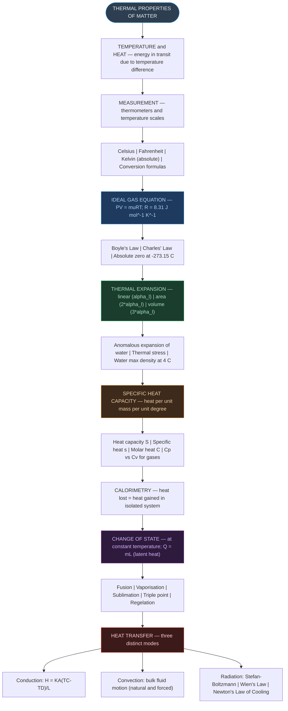

# CHAPTER 10: THERMAL PROPERTIES OF MATTER
### Complete Study Notes | Board · NEET · JEE Layered

---

## 🗺️ CONCEPT ROADMAP



---

## SECTION 1 — TEMPERATURE AND HEAT ⭐⭐

### 1.1 Basic Definitions

**Temperature** is a relative measure, or indication of the hotness or coldness of a body. It is a scalar quantity that determines the **direction of heat flow** when two bodies are in contact.

**Heat** is the form of energy transferred between two (or more) systems or a system and its surroundings **by virtue of a temperature difference** between them.

> [!important] Key Distinction — Heat vs Temperature Heat is energy **in transit** due to temperature difference. Once transferred, it becomes internal energy. Heat is **NOT** a property stored in a body — it only exists during the process of transfer.
> 
> - **SI unit of heat:** Joule (J)
> - **SI unit of temperature:** Kelvin (K); degree Celsius (°C) widely used
> - **Dimensional formula of heat:** $[\text{ML}^2\text{T}^{-2}]$

**Thermal equilibrium:** When two bodies in contact reach the same temperature and net heat transfer stops, they are in thermal equilibrium. This is the foundation of the **Zeroth Law of Thermodynamics**.

### 1.2 Why Temperature Sense is Unreliable

Our sense of temperature is qualitative and limited in range. Two metals at the same temperature feel different — metal feels colder because its higher thermal conductivity draws heat away faster. Scientific instruments (thermometers) are therefore necessary.

---

## SECTION 2 — MEASUREMENT OF TEMPERATURE ⭐⭐

### 2.1 Thermometers

A thermometer makes use of a **thermometric property** — any physical property that changes measurably and reproducibly with temperature.

|Thermometric Property|Thermometer Type|
|:--|:--|
|Volume of a liquid|Liquid-in-glass (mercury, alcohol)|
|Pressure of a gas at constant volume|Constant-volume gas thermometer|
|Electrical resistance|Resistance thermometer|
|EMF (Seebeck effect)|Thermocouple|
|Colour/intensity of radiation|Optical pyrometer|

### 2.2 Temperature Scales

Two fixed reference points are needed to define any temperature scale. These two points fix the origin and the size of the unit.

**Celsius Scale:** Ice point = **0 °C** | Steam point = **100 °C** | 100 equal divisions.

**Fahrenheit Scale:** Ice point = **32 °F** | Steam point = **212 °F** | 180 equal divisions.

> [!important] Celsius–Fahrenheit Conversion $$\boxed{\frac{t_F - 32}{180} = \frac{t_C}{100}} \quad \text{...(10.1)}$$
> 
> Equivalently: $t_F = \dfrac{9}{5}t_C + 32$
> 
> Useful check: **−40 °C = −40 °F** — the unique temperature where both scales give the same reading.

---

## SECTION 3 — IDEAL-GAS EQUATION AND ABSOLUTE TEMPERATURE ⭐⭐⭐

### 3.1 Gas Laws

**Boyle's Law (Robert Boyle, 1627–1691):** At constant temperature, pressure and volume of a given quantity of gas are inversely related:

$$PV = \text{constant} \quad (T = \text{constant})$$

**Charles' Law (Jacques Charles, 1747–1823):** At constant pressure, volume is directly proportional to absolute temperature:

$$\frac{V}{T} = \text{constant} \quad (P = \text{constant})$$

### 3.2 Ideal Gas Equation

Combining Boyle's and Charles' laws:

> [!important] Ideal Gas Equation $$\boxed{PV = \mu RT} \quad \text{...(10.2)}$$
> 
> - $P$ = pressure (Pa); $V$ = volume (m³); $T$ = absolute temperature (K)
> - $\mu$ = number of moles
> - **$R$ = Universal Gas Constant = 8.31 J mol⁻¹ K⁻¹**
> 
> Applies to **any quantity** of **any low-density gas**.

### 3.3 Absolute Zero and the Kelvin Scale

A constant-volume gas thermometer gives P ∝ T. Plotting P vs T for any low-density gas gives straight lines that all extrapolate to **P = 0 at T = −273.15 °C** — this is **absolute zero**, the theoretical lower limit of temperature.

$$\boxed{T = t_C + 273.15} \quad \text{...(10.3)}$$

**Kelvin Scale (Lord Kelvin):**

- Absolute zero = **0 K = −273.15 °C**
- Triple point of water = **273.16 K** (modern fixed reference point)
- Unit size: **1 K = 1 °C** (identical magnitude, different origin)

> [!note] Why is the triple point preferred over melting/boiling points?
> 
> The triple point of water occurs at a **unique** combination of temperature and pressure (273.16 K, 6.11 × 10⁻³ Pa). Melting and boiling points vary with external pressure, making them less reliable as universal fixed points. The triple point is a unique invariant.

### 3.4 Coefficient of Volume Expansion for Ideal Gas

From the ideal gas equation at constant pressure:

$$P\Delta V = \mu R \Delta T \quad \Rightarrow \quad \frac{\Delta V}{V} = \frac{\Delta T}{T} \quad \Rightarrow \quad \alpha_V = \frac{1}{T} \quad \text{...(10.6)}$$

At 0 °C: $\alpha_V = 1/273 \approx 3.7 \times 10^{-3}$ K⁻¹ — **orders of magnitude larger** than solids and liquids.

---

## SECTION 4 — THERMAL EXPANSION ⭐⭐⭐

### 4.1 What is Thermal Expansion?

Most substances **expand on heating** and **contract on cooling**. The increase in dimensions of a body due to an increase in temperature is called **thermal expansion**.

Three types:

- **Linear expansion** — increase in one dimension (length)
- **Area (superficial) expansion** — increase in two dimensions (surface area)
- **Volume (cubical) expansion** — increase in all three dimensions

### 4.2 Coefficient of Linear Expansion (αₗ)

> [!important] Coefficient of Linear Expansion $$\boxed{\frac{\Delta l}{l} = \alpha_l \Delta T} \quad \text{...(10.4)}$$
> 
> - $\alpha_l$ = coefficient of linear expansion (linear expansivity)
> - **SI unit:** K⁻¹ | **Dimensional formula:** [K⁻¹]
> - Characteristic of the material; approximately constant for small temperature changes.

**Table 10.1 — Values of αₗ (×10⁻⁵ K⁻¹):**

|Material|αₗ (×10⁻⁵ K⁻¹)|
|:--|:-:|
|Aluminium|2.5|
|Brass|1.8|
|Silver|1.9|
|Copper|1.7|
|Gold|1.4|
|Iron|1.2|
|Glass (pyrex)|0.32|
|Lead|0.29|

Metals generally have higher αₗ than non-metals. Copper expands about five times more than pyrex glass for the same temperature rise.

### 4.3 Coefficient of Volume Expansion (αᵥ)

> [!important] Coefficient of Volume Expansion $$\boxed{\alpha_V = \left(\frac{\Delta V}{V}\right)\frac{1}{\Delta T}} \quad \text{...(10.5)}$$
> 
> For isotropic solids: $\alpha_V = 3\alpha_l$ ...(10.9)
> 
> For area expansion: $\alpha_A = 2\alpha_l$

**Table 10.2 — Values of αᵥ:**

|Material|αᵥ (K⁻¹)|
|:--|:--|
|Alcohol (ethanol)|110 × 10⁻⁵|
|Water|20.7 × 10⁻⁵|
|Mercury|18.2 × 10⁻⁵|
|Hard rubber|2.4 × 10⁻⁴|
|Aluminium|7 × 10⁻⁵|
|Iron|3.55 × 10⁻⁵|
|Invar|2 × 10⁻⁶|

### 4.4 Anomalous Expansion of Water

Water **contracts** on heating between 0 °C and 4 °C (density increases). At **4 °C**, water reaches its **maximum density** (~1000 kg m⁻³). Above 4 °C, it expands normally.

> [!note] Ecological Importance of Anomalous Expansion
> 
> Lakes freeze at the top first. As a lake cools toward 4 °C, denser surface water sinks and warmer water rises. Below 4 °C, the surface water becomes less dense and stays at the top, where it eventually freezes. This ice layer insulates the water below, allowing aquatic life to survive in winter. If water behaved normally, lakes would freeze from the bottom up, destroying their ecosystems.

### 4.5 Thermal Stress

When a rod is **prevented from expanding** by rigid supports, it acquires a **compressive strain** and the corresponding stress set up is called **thermal stress**:

$$\text{Thermal stress} = Y \cdot \alpha_l \cdot \Delta T$$

where Y = Young's modulus. Railway tracks must have expansion gaps to prevent buckling in summer.

---

## SECTION 5 — SPECIFIC HEAT CAPACITY ⭐⭐⭐

### 5.1 Heat Capacity

The heat capacity S of a body is the amount of heat required to change its temperature by 1 K:

$$S = \frac{\Delta Q}{\Delta T} \quad \text{...(10.10)}$$

**SI unit:** J K⁻¹. Depends on both the mass and the nature of the material.

### 5.2 Specific Heat Capacity

> [!important] Specific Heat Capacity $$\boxed{s = \frac{1}{m}\frac{\Delta Q}{\Delta T}} \quad \text{...(10.11)}$$
> 
> Amount of heat per unit mass required to change temperature by 1 K.
> 
> - **SI unit:** J kg⁻¹ K⁻¹ | **Dimensional formula:** $[\text{L}^2\text{T}^{-2}\text{K}^{-1}]$
> - Depends on nature of substance and (slightly) on temperature.

**Table 10.3 — Specific heat capacities (J kg⁻¹ K⁻¹):**

|Substance|s (J kg⁻¹ K⁻¹)|
|:--|:-:|
|Water|4186|
|Kerosene|2118|
|Ice|2060|
|Edible oil|1965|
|Aluminium|900|
|Glass|840|
|Iron|450|
|Copper|386|
|Mercury|140|
|Lead|128|

Water has the **highest specific heat capacity** of all common substances. This is why water is used as a coolant in automobile radiators and as a heat store in hot-water bags. It also explains why coastal regions have moderate climates — the sea absorbs and releases heat slowly.

### 5.3 Molar Specific Heat Capacity

$$C = \frac{1}{\mu}\frac{\Delta Q}{\Delta T} \quad \text{...(10.12)}$$

**SI unit:** J mol⁻¹ K⁻¹. For gases, two values are defined depending on the process:

- **Cₚ** = molar specific heat at constant pressure
- **Cᵥ** = molar specific heat at constant volume
- **Always: Cₚ > Cᵥ** (at constant pressure, gas also does expansion work)

**Table 10.4 — Molar specific heat capacities of gases:**

|Gas|Cₚ (J mol⁻¹ K⁻¹)|Cᵥ (J mol⁻¹ K⁻¹)|
|:--|:-:|:-:|
|He|20.8|12.5|
|H₂|28.8|20.4|
|N₂|29.1|20.8|
|O₂|29.4|21.1|
|CO₂|37.0|28.5|

---

## SECTION 6 — CALORIMETRY ⭐⭐

**Calorimetry** means measurement of heat. Principle of calorimetry (in an isolated system):

$$\text{Heat lost by hot body} = \text{Heat gained by cold body}$$

A **calorimeter** consists of a metallic vessel (copper or aluminium) kept inside a wooden jacket lined with insulating material (glass wool) to minimise heat exchange with the surroundings. A stirrer ensures thermal equilibrium and a mercury thermometer measures temperature.

> [!note] Key condition
> 
> The principle holds only when no heat is lost to the surroundings — i.e., the system is thermally isolated. The wooden outer jacket and glass wool insulation serve this purpose.

---

## SECTION 7 — CHANGE OF STATE ⭐⭐⭐

### 7.1 Melting and Freezing

Matter exists in three states: solid, liquid, gas. A transition between states is a **change of state** (phase transition).

- **Melting (Fusion):** solid → liquid; occurs at the **melting point**
- **Freezing:** liquid → solid; occurs at the **freezing point** = melting point (same equilibrium)

During melting: **temperature stays constant** while the solid and liquid states coexist in thermal equilibrium. The melting point depends on pressure (increases slightly with pressure for most substances; **decreases** for water — basis of regelation and ice skating).

**Regelation:** A metallic wire with weights passes through an ice block because the ice beneath melts under increased pressure; it refreezes above the wire once pressure is removed.

### 7.2 Vaporisation and Boiling

- **Vaporisation:** liquid → vapour; occurs at the **boiling point**
- Both liquid and vapour states coexist in thermal equilibrium during vaporisation.
- **Boiling point increases with pressure** (pressure cooker) and **decreases with pressure reduction** (high altitude → cooking is difficult).

### 7.3 Sublimation

Some substances transition directly from **solid → vapour** without passing through the liquid phase. This is **sublimation**. Examples: dry ice (solid CO₂), iodine, naphthalene. During sublimation, solid and vapour coexist in thermal equilibrium.

### 7.4 Latent Heat ⭐⭐⭐

> [!important] Latent Heat $$\boxed{Q = mL} \quad \Rightarrow \quad L = \frac{Q}{m} \quad \text{...(10.13)}$$
> 
> $L$ = latent heat — characteristic of the substance. SI unit: J kg⁻¹.
> 
> - **Latent heat of fusion (Lf):** solid ↔ liquid
> - **Latent heat of vaporisation (Lv):** liquid ↔ vapour
> 
> During phase change, temperature is **constant** — all heat goes to change potential energy (break intermolecular bonds), not kinetic energy. Hence $\Delta T = 0$: never use $Q = ms\Delta T$ during a phase change.

**Key values for water:**

- Lf = **3.33 × 10⁵ J kg⁻¹** (heat to melt 1 kg of ice at 0 °C)
- Lv = **22.6 × 10⁵ J kg⁻¹** (heat to vaporise 1 kg of water at 100 °C)
- Lv ≈ 7 × Lf — vaporisation requires much more energy because **all** intermolecular bonds must be broken, not just partially disrupted.

> [!note] Why steam burns are more severe than boiling water burns
> 
> Steam at 100 °C and water at 100 °C are at the same temperature, but when steam condenses on skin it releases an additional Lv = 22.6 × 10⁵ J kg⁻¹ of energy — nearly 7 times the energy that would be released by the same mass of boiling water cooling from 100 °C to, say, 37 °C.

**Table 10.5 — Latent heats at 1 atm pressure:**

|Substance|Melting Point (°C)|Lf (×10⁵ J kg⁻¹)|Boiling Point (°C)|Lv (×10⁵ J kg⁻¹)|
|:--|:-:|:-:|:-:|:-:|
|Water|0|3.33|100|22.6|
|Ethanol|−114|1.0|78|8.5|
|Gold|1063|0.645|2660|15.8|
|Lead|328|0.25|1744|8.67|
|Mercury|−39|0.12|357|2.7|
|Nitrogen|−210|0.26|−196|2.0|
|Oxygen|−219|0.14|−183|2.1|

### 7.5 Triple Point

The temperature and pressure at which **all three phases** (solid, liquid, vapour) coexist in thermal equilibrium. For water: T = **273.16 K**, P = **6.11 × 10⁻³ Pa**. The triple point is a unique invariant — used as the single fixed reference point on the Kelvin scale.

---

## SECTION 8 — HEAT TRANSFER ⭐⭐⭐

Three distinct modes of heat transfer: **conduction, convection, radiation**.

### 8.1 Conduction

Conduction is heat transfer between adjacent parts of a body by **molecular collisions and lattice vibrations**, without bulk movement of matter. Possible in solids, liquids, and gases; most effective in solids, especially metals (free electrons carry heat efficiently).

> [!important] Fourier's Law of Heat Conduction $$\boxed{H = KA\frac{T_C - T_D}{L}} \quad \text{...(10.14)}$$
> 
> - $H$ = heat current (W); $A$ = cross-sectional area (m²); $L$ = length (m)
> - $K$ = **thermal conductivity** of the material
> - **SI unit of K:** J s⁻¹ m⁻¹ K⁻¹ = W m⁻¹ K⁻¹ | **Dimensional formula:** [MLT⁻³K⁻¹]
> - **Thermal resistance:** $R_{th} = L/(KA)$; in steady state: $H = \Delta T / R_{th}$

**Table 10.6 — Thermal conductivities (W m⁻¹ K⁻¹):**

|Material|K (W m⁻¹ K⁻¹)|
|:--|:-:|
|Silver|406|
|Copper|385|
|Aluminium|205|
|Brass|109|
|Steel|50.2|
|Ice|1.6|
|Glass / Water / Concrete|0.8|
|Wood|0.12|
|Glass wool|0.04|
|Air|0.024|

In **steady state**, heat current H is the same at every cross-section of a composite rod. For two rods in series (same H):

$$T_0 = \frac{K_1 A_1 T_1 / L_1 + K_2 A_2 T_2 / L_2}{K_1 A_1 / L_1 + K_2 A_2 / L_2}$$

When A₁ = A₂ and L₁ = L₂ this simplifies to $T_0 = (K_1 T_1 + K_2 T_2)/(K_1 + K_2)$.

### 8.2 Convection

Convection is heat transfer by **actual bulk movement of a fluid** (liquid or gas). Not possible in solids.

- **Natural convection:** driven by buoyancy — heated fluid expands, becomes less dense, rises; cooler denser fluid sinks and takes its place. Examples: sea breezes (day), land breezes (night), trade winds.
- **Forced convection:** an external agent (pump, fan) drives fluid flow. Examples: car radiator cooling systems, human circulatory system (heart as pump), HVAC systems.

> [!note] Sea Breeze and Land Breeze
> 
> During the day, land (lower s) heats up faster than the sea. Hot air over land rises; cooler sea air flows in — **sea breeze**. At night, land cools faster; the sea is warmer, reversing the cycle — **land breeze**. This is why wind at the beach often reverses after sunset.

### 8.3 Radiation

Radiation is heat transfer by **electromagnetic waves**. It requires **no medium** and travels at the speed of light (3 × 10⁸ m s⁻¹). All bodies at any temperature above 0 K emit thermal radiation. This is how the Sun heats the Earth across 150 million km of vacuum.

When thermal radiation falls on a body, it is partly absorbed and partly reflected. **Dark (black) surfaces absorb and emit radiation better** than light-coloured or shiny surfaces.

**Dewar Flask (Thermos):** Minimises all three heat transfer modes:

- **Vacuum** between double walls → eliminates conduction and convection
- **Silvered** inner and outer walls → reflects radiation (low emissivity)
- Insulating cork support → reduces conduction at the base

### 8.4 Blackbody Radiation

A **perfect blackbody** (e = 1) absorbs all incident radiation and emits the maximum possible radiation at any given temperature.

> [!important] Wien's Displacement Law $$\boxed{\lambda_m T = 2.9 \times 10^{-3} \text{ m K}} \quad \text{...(10.15)}$$
> 
> As temperature increases, the wavelength of peak emission **decreases** (shifts to shorter wavelengths). This explains why iron heated in a flame goes: dull red → reddish yellow → white hot. Used to estimate surface temperatures of stars from their colour.

> [!important] Stefan-Boltzmann Law $$\boxed{H = Ae\sigma T^4} \quad \text{...(10.17)}$$
> 
> - $\sigma$ = Stefan-Boltzmann constant = **5.67 × 10⁻⁸ W m⁻² K⁻⁴**
> - $e$ = emissivity (dimensionless; 0 ≤ e ≤ 1; e = 1 for perfect blackbody)
> - $A$ = surface area; $T$ = absolute temperature (Kelvin — essential!)
> 
> **Net heat loss** to surroundings at temperature $T_s$:
> 
> $$H_{net} = Ae\sigma(T^4 - T_s^4) \quad \text{...(10.18)}$$
> 
> $H \propto T^4$ — doubling T increases radiated power by 2⁴ = **16 times**.

---

## SECTION 9 — NEWTON'S LAW OF COOLING ⭐⭐⭐

> [!important] Newton's Law of Cooling $$\boxed{-\frac{dQ}{dt} = k(T_2 - T_1)} \quad \text{...(10.19)}$$
> 
> The rate of heat loss of a body is directly proportional to the **excess temperature** $(T_2 - T_1)$ over the surroundings.
> 
> - Valid only for **small temperature differences** (≲40 K over surroundings)
> - $k$ = positive constant depending on area and nature of surface of the body

Integrating, with $K = k/(ms)$:

$$T_2 = T_1 + C'e^{-Kt} \quad \text{...(10.23)}$$

A plot of $\log_e(T_2 - T_1)$ vs $t$ gives a **straight line with negative slope** $= -K$.

> [!note] Newton's Law as a Linearisation of Stefan's Law
> 
> Newton's law is valid for small temperature differences because, for small $\Delta T = T - T_s$:
> 
> $$T^4 - T_s^4 \approx 4T_s^3(T - T_s)$$
> 
> So Stefan's $T^4$ law reduces to a rate proportional to $(T - T_s)$ — Newton's law. For large $\Delta T$, use the full Stefan-Boltzmann law.

**Average temperature method** (used in numerical problems):

$$\frac{\Delta T}{\Delta t} = K \cdot (T_{mean} - T_{surroundings})$$

---

## SECTION 10 — NCERT SOLVED EXAMPLES WALKTHROUGH ⭐⭐

### Example 10.1 — Coefficient of Area Expansion

**Prove:** $(\Delta A/A)/\Delta T = 2\alpha_l$ for a rectangular sheet.

Consider a rectangle of sides $a$ and $b$. After temperature rise $\Delta T$:

$\Delta A = a\Delta b + b\Delta a = a(\alpha_l b \Delta T) + b(\alpha_l a \Delta T) = 2\alpha_l ab\Delta T = 2\alpha_l A\Delta T$

$\therefore (\Delta A/A)/\Delta T = 2\alpha_l$ ✓ (The second-order term $(\Delta a)(\Delta b)$ is negligible.)

### Example 10.2 — Fitting an Iron Ring

Rim D = 5.243 m; ring D = 5.231 m at 27 °C; αₗ(iron) = 1.20 × 10⁻⁵ K⁻¹.

> [!example] Solution $5.243 = 5.231[1 + 1.20\times10^{-5}(T_2 - 27)]$
> 
> $T_2 - 27 = \dfrac{5.243 - 5.231}{5.231 \times 1.20\times10^{-5}} = \dfrac{0.012}{6.277\times10^{-5}} \approx 191\ {}^\circ\text{C}$
> 
> $\boxed{T_2 \approx 218\ {}^\circ\text{C}}$

### Example 10.3 — Specific Heat of Aluminium by Calorimetry

Al sphere (0.047 kg) at 100 °C placed in copper calorimeter (0.14 kg) with 0.25 kg water at 20 °C; final T = 23 °C.

> [!example] Solution Heat lost by Al = $0.047 \times s_{Al} \times 77$
> 
> Heat gained = $(0.25 \times 4180 + 0.14 \times 386) \times 3$
> 
> Setting equal: $s_{Al} = \mathbf{0.911\ \text{kJ kg}^{-1}\text{K}^{-1}}$

### Example 10.4 — Heat of Fusion (Ice-Water Mixture)

Ice (0.15 kg at 0 °C) mixed with water (0.30 kg at 50 °C) → final T = 6.7 °C.

> [!example] Solution Heat lost by water = $0.30 \times 4186 \times 43.3 = 54{,}376$ J
> 
> Heat to raise melted ice-water = $0.15 \times 4186 \times 6.7 = 4{,}207$ J
> 
> Heat for melting = $54376 - 4207 = 50{,}169$ J
> 
> $\boxed{L_f = 50169/0.15 = 3.34\times10^5\ \text{J kg}^{-1}}$ ✓

### Example 10.5 — Complete Phase Change (Ice → Steam)

Converting 3 kg of ice at −12 °C to steam at 100 °C:

|Step|Process|Heat Required|
|:--|:--|:-:|
|Q₁|Ice (−12 °C → 0 °C): $ms_{ice} \times 12$|75,600 J|
|Q₂|Melting ice at 0 °C: $mL_f$|1,005,000 J|
|Q₃|Water (0 °C → 100 °C): $ms_w \times 100$|1,255,800 J|
|Q₄|Vaporising water at 100 °C: $mL_v$|6,768,000 J|
|**Total Q**|Sum of all steps|**≈ 9.1 × 10⁶ J**|

### Example 10.6 — Steady-State Junction Temperature

Steel rod (L₁ = 15 cm, K₁ = 50.2 W m⁻¹K⁻¹, A₁ = 2A₂) + copper rod (L₂ = 10 cm, K₂ = 385 W m⁻¹K⁻¹) in series. Furnace = 300 °C; cold end = 0 °C.

> [!example] Solution In steady state H₁ = H₂:
> 
> $\dfrac{50.2 \times 2A(300-T)}{0.15} = \dfrac{385 \times A(T-0)}{0.10}$
> 
> $\dfrac{100.4(300-T)}{0.15} = \dfrac{385T}{0.10}$
> 
> Solving: $\boxed{T \approx 44.4\ {}^\circ\text{C}}$

### Example 10.8 — Newton's Law of Cooling

Pan cools 94 °C → 86 °C in 2 min at room temperature 20 °C. Find time to cool 71 °C → 69 °C.

> [!example] Solution Mean temperature (94–86): 90 °C → excess = 70 °C; rate = 8/2 = 4 °C min⁻¹.
> 
> $\dfrac{8}{2} = K(70)$
> 
> Mean temperature (71–69): 70 °C → excess = 50 °C.
> 
> $\dfrac{2}{\text{time}} = K(50)$
> 
> Dividing: $\dfrac{8/2}{2/\text{time}} = \dfrac{70}{50}$ → $\text{time} = \dfrac{2 \times 2 \times 70}{8 \times 50} = 0.7\ \text{min} = \boxed{42\ \text{s}}$

---

## 📋 QUICK REFERENCE — All Laws, Formulas, and Dimensional Formulae

```
TEMPERATURE SCALES:
┌──────────────────────────────────────────────────────────────┐
│  (tF − 32)/180 = tC/100;  tF = (9/5)tC + 32                │
│  T = tC + 273.15;  1 K = 1 °C  (same unit size)            │
│  Triple point of water = 273.16 K; Absolute zero = 0 K      │
│  −40 °C = −40 °F (only point where Celsius = Fahrenheit)    │
└──────────────────────────────────────────────────────────────┘

IDEAL GAS EQUATION:
┌──────────────────────────────────────────────────────────────┐
│  PV = μRT;  R = 8.31 J mol⁻¹ K⁻¹                           │
│  Boyle's: PV = const (T = const)                            │
│  Charles': V/T = const (P = const)                          │
│  αᵥ (ideal gas at const P) = 1/T                            │
└──────────────────────────────────────────────────────────────┘

THERMAL EXPANSION:
┌──────────────────────────────────────────────────────────────┐
│  Δl/l = αₗ ΔT;  ΔA/A = 2αₗ ΔT;  ΔV/V = αᵥ ΔT             │
│  αᵥ = 3αₗ  (isotropic materials)                           │
│  Thermal stress = Y × αₗ × ΔT                               │
│  Water: max density at 4 °C (anomalous expansion 0–4 °C)    │
└──────────────────────────────────────────────────────────────┘

SPECIFIC HEAT AND CALORIMETRY:
┌──────────────────────────────────────────────────────────────┐
│  s = ΔQ/(mΔT);  Unit: J kg⁻¹ K⁻¹;  Dim: [L²T⁻²K⁻¹]       │
│  C = ΔQ/(μΔT);  Unit: J mol⁻¹ K⁻¹                         │
│  Water: s = 4186 J kg⁻¹ K⁻¹ (HIGHEST of common substances) │
│  Cₚ > Cᵥ for gases;  Cₚ − Cᵥ = R (ideal gas)              │
│  Heat lost = Heat gained (isolated system)                   │
└──────────────────────────────────────────────────────────────┘

LATENT HEAT:
┌──────────────────────────────────────────────────────────────┐
│  Q = mL;  L = Q/m;  Unit: J kg⁻¹;  Dim: [L²T⁻²]           │
│  Water: Lf = 3.33×10⁵ J kg⁻¹;  Lv = 22.6×10⁵ J kg⁻¹      │
│  Temperature is CONSTANT during phase change                 │
│  Lv >> Lf (much more energy needed for vaporisation)        │
└──────────────────────────────────────────────────────────────┘

HEAT TRANSFER — CONDUCTION:
┌──────────────────────────────────────────────────────────────┐
│  H = KA(TC − TD)/L  (Fourier's Law)                         │
│  K = thermal conductivity;  Unit: W m⁻¹ K⁻¹                │
│  Dim of K: [MLT⁻³K⁻¹]                                      │
│  Thermal resistance R = L/(KA);  Series: Rtotal = ΣRᵢ      │
│  Ag > Cu > Al > Brass > Steel  (conductivity order)         │
└──────────────────────────────────────────────────────────────┘

RADIATION:
┌──────────────────────────────────────────────────────────────┐
│  Wien's Law: λmT = 2.9×10⁻³ m K;  T↑ → λm ↓               │
│  Stefan-Boltzmann: H = AeσT⁴                                │
│  σ = 5.67×10⁻⁸ W m⁻² K⁻⁴                                  │
│  Net loss: Hnet = Aeσ(T⁴ − Ts⁴)                            │
│  Perfect blackbody: e = 1;  Good reflector: e ≈ 0          │
└──────────────────────────────────────────────────────────────┘

NEWTON'S LAW OF COOLING:
┌──────────────────────────────────────────────────────────────┐
│  −dQ/dt = k(T₂ − T₁);  Valid for small ΔT only             │
│  T₂ = T₁ + C′e⁻ᴷᵗ  (exponential decay to T₁)             │
│  ln(T₂ − T₁) vs t → straight line with slope = −K         │
└──────────────────────────────────────────────────────────────┘
```

---

## ⚡ POINTS TO PONDER (High-Yield for Exams)

1. **Heat ≠ Temperature.** Heat is energy in transit due to temperature difference. Temperature is a state property. Two bodies at the same temperature have zero heat flow between them.
    
2. **Absolute zero (0 K) cannot be reached.** It is the theoretical lower limit. The third law of thermodynamics forbids reaching absolute zero in a finite number of steps.
    
3. **Triple point vs melting/boiling points.** Triple point (273.16 K) is unique — occurs at only one T-P combination. Melting/boiling points vary with pressure. Triple point is the preferred thermometric standard.
    
4. **αᵥ = 3αₗ holds only for isotropic materials.** For anisotropic crystals: αᵥ = αx + αy + αz. For area expansion: αₐ = 2αₗ.
    
5. **A hole in a material expands just like the material itself** — the hole gets bigger, not smaller, on heating.
    
6. **Anomalous expansion of water protects aquatic life.** Ice floats (less dense than water), insulates the water below, and allows life to survive freezing winters.
    
7. **During phase change, temperature is CONSTANT.** Heat absorbed increases potential energy (breaks bonds), NOT kinetic energy (temperature). Always use Q = mL, never Q = msΔT.
    
8. **Lᵥ >> Lf for water** (22.6 × 10⁵ vs 3.33 × 10⁵ J kg⁻¹). Vaporisation breaks all intermolecular bonds; fusion only partially disrupts the lattice.
    
9. **Steam burns are worse than boiling water burns** at the same temperature because condensing steam releases an additional Lv = 22.6 × 10⁵ J kg⁻¹ into the skin.
    
10. **Convection cannot occur in solids.** It requires bulk movement of matter. Natural convection needs gravity; forced convection uses an external agent (pump, fan, heart).
    
11. **Stefan-Boltzmann H ∝ T⁴** makes radiation very sensitive to temperature. Doubling T increases radiated power by 2⁴ = **16 times**.
    
12. **Wien's law: hotter objects emit at shorter wavelengths.** Iron: dull red → orange → yellow → white as temperature rises. Allows astronomers to estimate stellar surface temperatures from colour.
    
13. **Newton's law of cooling is valid only for small temperature differences.** It is a linearisation of Stefan's T⁴ law. For large ΔT, use Stefan-Boltzmann directly.
    
14. **Rate of cooling is NOT constant** — it is exponential and slows as the body approaches the surroundings' temperature.
    
15. **Cₚ > Cᵥ always for gases.** At constant pressure, the gas must also do work in expanding; hence more heat is needed for the same temperature rise.
    

---

## 📊 Dimensional Formulae Summary

|Quantity|Symbol|Dimensional Formula|SI Unit|
|:--|:--|:--|:--|
|Heat / Internal energy|Q|$[\text{ML}^2\text{T}^{-2}]$|J|
|Temperature|T|[K]|K|
|Specific heat capacity|s|$[\text{L}^2\text{T}^{-2}\text{K}^{-1}]$|J kg⁻¹ K⁻¹|
|Molar heat capacity|C|$[\text{ML}^2\text{T}^{-2}\text{mol}^{-1}\text{K}^{-1}]$|J mol⁻¹ K⁻¹|
|Latent heat|L|$[\text{L}^2\text{T}^{-2}]$|J kg⁻¹|
|Coeff. of linear expansion|αₗ|[K⁻¹]|K⁻¹|
|Coeff. of volume expansion|αᵥ|[K⁻¹]|K⁻¹|
|Thermal conductivity|K|$[\text{MLT}^{-3}\text{K}^{-1}]$|W m⁻¹ K⁻¹|
|Stefan-Boltzmann constant|σ|$[\text{MT}^{-3}\text{K}^{-4}]$|W m⁻² K⁻⁴|
|Wien's constant|b|[LK]|m K|
|Heat current / Radiated power|H|$[\text{ML}^2\text{T}^{-3}]$|W|
|Thermal resistance|R_th|$[\text{M}^{-1}\text{L}^{-2}\text{T}^3\text{K}]$|K W⁻¹|

---

_End of Notes — Physics Chapter 10 | Total Sections: 10_