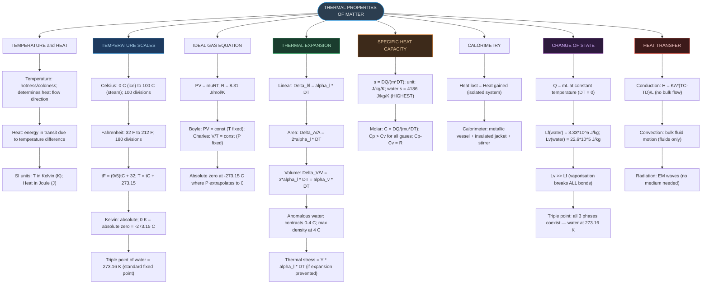
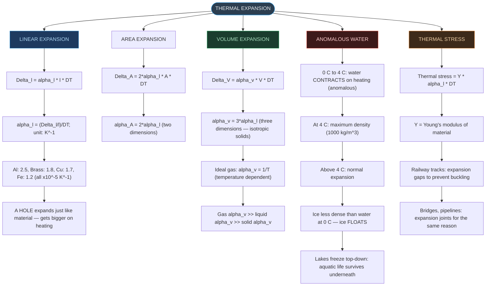
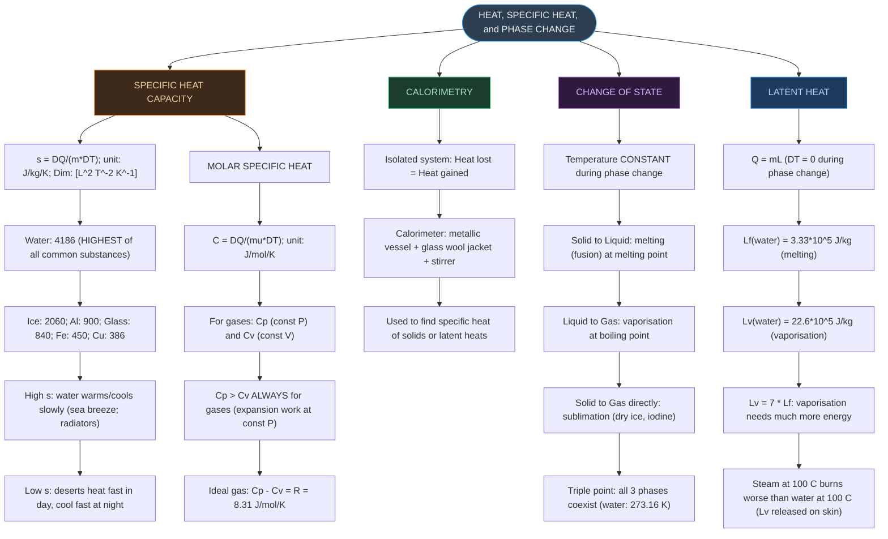
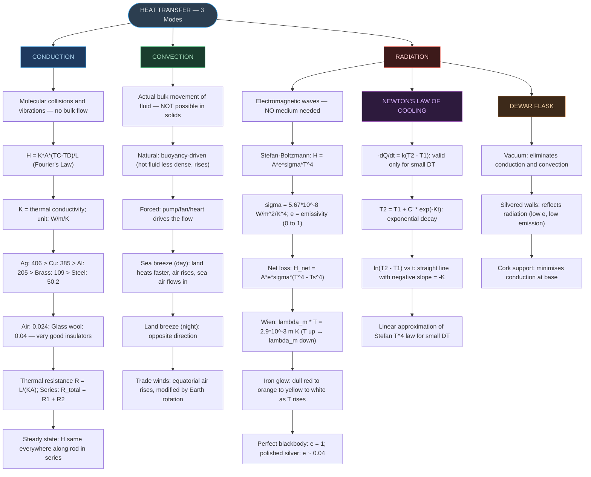

# CHAPTER 10 — RAPID REVISION + MIND MAPS

### Thermal Properties of Matter

---

# ⚡ ONE-PAGE RAPID REVISION SHEET

## 🔢 Key Definitions — Absolute Must-Memorise

|Quantity|Definition|Formula|SI Unit|
|:--|:--|:--|:--|
|**Temperature**|Measure of hotness/coldness; determines direction of heat flow|—|K (or °C)|
|**Heat**|Energy transferred due to temperature difference|$Q = ms\Delta T$|J|
|**Specific heat capacity**|Heat per unit mass per unit degree rise (no phase change)|$s = Q/(m\Delta T)$|J kg⁻¹ K⁻¹|
|**Latent heat**|Heat per unit mass during phase change (at constant T)|$L = Q/m$|J kg⁻¹|
|**Coeff. of linear expansion**|Fractional change in length per degree|$\alpha_l = (\Delta l/l)/\Delta T$|K⁻¹|
|**Coeff. of volume expansion**|Fractional change in volume per degree|$\alpha_v = (\Delta V/V)/\Delta T$|K⁻¹|
|**Thermal conductivity**|Heat conducted per unit area per unit temperature gradient|$H = KA\Delta T/L$|W m⁻¹ K⁻¹|
|**Emissivity**|Ratio of actual radiation to blackbody radiation|$e = H/(Ae\sigma T^4)$|Dimensionless|

---

## 📐 Essential Formulae — Must Know Cold

> [!important] Temperature Scale Conversions $$t_F = \frac{9}{5}t_C + 32 \quad \Leftrightarrow \quad \frac{t_F - 32}{180} = \frac{t_C}{100}$$
> 
> $$T(\text{K}) = t_C + 273.15$$
> 
> - **−40 °C = −40 °F** — the only point where Celsius = Fahrenheit.
> - **Triple point of water = 273.16 K** (standard fixed point of Kelvin scale).
> - Triple point ≠ melting point at 1 atm (273.15 K ≈ 0 °C) — differ by 0.01 K.

> [!important] Ideal Gas Equation $$PV = \mu RT \quad \text{; } \quad R = 8.31\ \text{J mol}^{-1}\ \text{K}^{-1}$$
> 
> $$\alpha_v\ (\text{ideal gas at constant } P) = \frac{1}{T}$$
> 
> - Absolute zero = 0 K = −273.15 °C (found by extrapolating P vs T to P = 0).
> - Boyle: $PV = \text{const}$ (at constant T); Charles: $V/T = \text{const}$ (at constant P).

> [!important] Thermal Expansion $$\frac{\Delta l}{l} = \alpha_l \Delta T \quad \text{(linear)}$$
> 
> $$\frac{\Delta A}{A} = 2\alpha_l \Delta T \quad \text{(area)} \quad \Rightarrow \quad \alpha_A = 2\alpha_l$$
> 
> $$\frac{\Delta V}{V} = \alpha_v \Delta T \quad \text{(volume)} \quad \Rightarrow \quad \alpha_v = 3\alpha_l$$
> 
> - Thermal stress (expansion prevented): $\text{stress} = Y \times \alpha_l \times \Delta T$
> - A **hole** in a material expands just like the material — hole gets **bigger**, not smaller.
> - Water: contracts from 0 °C to 4 °C → **maximum density at 4 °C** (anomalous).

> [!important] Specific Heat and Latent Heat $$Q = ms\Delta T \quad \text{(no phase change)}$$
> 
> $$Q = mL \quad \text{(phase change; } \Delta T = 0\text{)}$$
> 
> - $s_\text{water} = 4186$ J kg⁻¹ K⁻¹ — **highest** of all common substances.
> - $L_f(\text{water}) = 3.33\times10^5$ J kg⁻¹; $L_v(\text{water}) = 22.6\times10^5$ J kg⁻¹.
> - Calorimetry: heat lost = heat gained (isolated system).
> - $C_p > C_v$ always for gases; $C_p - C_v = R$ for ideal gas.

> [!important] Conduction — Fourier's Law $$H = KA\frac{T_C - T_D}{L}$$
> 
> - Thermal resistance: $R_{th} = L/(KA)$; in steady state: $H = \Delta T/R_{th}$
> - Rods in series: H (heat current) is the **same** throughout; temperature drops add.
> - Rods in parallel: temperature difference is the **same**; heat currents add.
> - Junction temperature (same A and L): $T_0 = (K_1 T_1 + K_2 T_2)/(K_1 + K_2)$

> [!important] Radiation — Stefan-Boltzmann and Wien $$H = Ae\sigma T^4 \quad \text{(Stefan-Boltzmann)}$$
> 
> $$H_{net} = Ae\sigma(T^4 - T_s^4) \quad \text{(net loss to surroundings at } T_s\text{)}$$
> 
> $$\lambda_m T = 2.9\times10^{-3}\ \text{m K} \quad \text{(Wien's law)}$$
> 
> - $\sigma = 5.67\times10^{-8}$ W m⁻² K⁻⁴; perfect blackbody: $e = 1$.
> - **T must be in Kelvin** — using Celsius gives completely wrong answers.
> - Doubling T → radiation increases by $2^4 = 16$ times.

> [!important] Newton's Law of Cooling $$-\frac{dQ}{dt} = k(T_2 - T_1)$$
> 
> $$T_2 = T_1 + C'e^{-Kt} \quad \text{(exponential decay)}$$
> 
> - Valid only for **small temperature differences** (≲40 K excess over surroundings).
> - $\ln(T_2 - T_1)$ vs $t$ → straight line with **negative slope** = $-K$.
> - Average method: $\Delta T/\Delta t = K \times (T_{mean} - T_{surroundings})$

---

## 📊 Comparative Values — Important for MCQs

**Specific Heat Capacities (J kg⁻¹ K⁻¹):**

|Substance|s (J kg⁻¹ K⁻¹)|
|:--|:-:|
|Water|4186|
|Kerosene|2118|
|Ice|2060|
|Edible oil|1965|
|Aluminium|900|
|Glass|840|
|Iron|450|
|Copper|386|
|Mercury|140|
|Lead|128|

**Thermal Conductivities (W m⁻¹ K⁻¹):**

|Material|K (W m⁻¹ K⁻¹)|
|:--|:-:|
|Silver|406|
|Copper|385|
|Aluminium|205|
|Brass|109|
|Steel|50.2|
|Glass / Water / Concrete|0.8|
|Wood|0.12|
|Glass wool|0.04|
|Air|0.024|

**Coefficients of Linear Expansion (×10⁻⁵ K⁻¹):**

|Material|αₗ (×10⁻⁵ K⁻¹)|
|:--|:-:|
|Aluminium|2.5|
|Brass|1.8|
|Copper|1.7|
|Iron|1.2|
|Glass (pyrex)|0.32|

---

## ⚠️ Critical Distinctions — High-Yield Exam Traps

> [!warning] Temperature and Heat Traps
> 
> - Heat is NOT stored in a body — it is energy **IN TRANSIT** due to ΔT.
> - Two bodies in thermal equilibrium: same **temperature**, NOT same heat content.
> - **−40 °C = −40 °F** is the ONLY point where Celsius = Fahrenheit.
> - Triple point (273.16 K) ≠ melting point of ice at 1 atm (273.15 K); differ by 0.01 K.
> - **Stefan's law and Wien's law require T in Kelvin** — never substitute °C.

> [!warning] Thermal Expansion Traps
> 
> - $\alpha_v = 3\alpha_l$ (NOT $\alpha_l$ or $2\alpha_l$) — THREE dimensions expand.
> - $\alpha_A = 2\alpha_l$ (area = TWO dimensions) — not $3\alpha_l$.
> - A **hole** in a material expands just like the surrounding material — the hole gets bigger.
> - Water: **contracts** from 0 °C to 4 °C → maximum density at 4 °C (anomalous).
> - Ice is **LESS dense** than water — this is why ice floats and lakes freeze top-down.
> - Thermal stress formula uses **Young's modulus Y**, NOT bulk modulus.

> [!warning] Specific Heat and Latent Heat Traps
> 
> - During phase change: T is CONSTANT → $\Delta T = 0$ → **use Q = mL, NOT Q = msΔT**.
> - $Q = ms\Delta T$ is used ONLY when there is **no phase change**.
> - Water has the **HIGHEST** specific heat of all common substances (4186 J kg⁻¹ K⁻¹).
> - $C_p > C_v$ ALWAYS for gases; $C_p - C_v = R$ for ideal gas.
> - $L_v(\text{water}) = 22.6\times10^5$ J kg⁻¹ — steam burns far more severe than boiling water burns.

> [!warning] Conduction Traps
> 
> - H (heat current) = **same** everywhere in steady state for rods in series.
> - Thermal resistance formula: $R_{th} = L/(KA)$ — NOT $L/K$ or $LK/A$.
> - Better insulator = **LOWER** thermal conductivity K.
> - Hollow walls with air gaps are good insulators ($K_{air} = 0.024$ W m⁻¹ K⁻¹ — very low).

> [!warning] Radiation Traps
> 
> - Stefan's law: $H \propto T^4$ (NOT T or T² or T³) — very sensitive to temperature.
> - Doubling T → radiation increases $2^4 = 16$ times.
> - Wien: T↑ → $\lambda_m$ ↓ (hotter object → peak at **shorter** wavelength).
> - Good absorbers are also good emitters (Kirchhoff's law of radiation).
> - White/shiny bodies: low absorptivity AND low emissivity.
> - Radiation needs **NO medium**; conduction and convection need matter.

> [!warning] Newton's Law of Cooling Traps
> 
> - Valid ONLY for small temperature differences (≲40 K over surroundings).
> - Cooling is NOT linear with time — it is **EXPONENTIAL**.
> - Rate of cooling depends on **excess** temperature, not absolute temperature.
> - Slope of $\ln(T_2 - T_1)$ vs $t$ graph = $-K$ — **negative** slope.
> - Newton's law is a **LINEAR APPROXIMATION** of Stefan's T⁴ law for small ΔT.

---

# 🗺️ MIND MAP 1 — Chapter Overview

---

# 🗺️ MIND MAP 2 — Thermal Expansion

---

# 🗺️ MIND MAP 3 — Specific Heat and Change of State

---

# 🗺️ MIND MAP 4 — Heat Transfer

---

## 🏆 Last-Minute Exam Checklist

> [!tip] Before answering any Thermal Properties question, run through this list
> 
> - **Temperature conversion?** → $t_F = (9/5)t_C + 32$; $T = t_C + 273.15$; crosspoint = −40 °C = −40 °F.
> - **Ideal gas problem?** → $PV = \mu RT$; R = 8.31 J mol⁻¹ K⁻¹; T must be in Kelvin.
> - **Thermal expansion problem?** → Linear: $\Delta l = \alpha_l l \Delta T$; Area: $\Delta A = 2\alpha_l A \Delta T$; Volume: $\Delta V = 3\alpha_l V \Delta T$.
> - **Hole expands or contracts?** → **Expands** just like material (hole gets bigger).
> - **Thermal stress?** → $\text{stress} = Y \times \alpha_l \times \Delta T$ (uses Young's modulus).
> - **Specific heat or latent heat?** → No phase change: $Q = ms\Delta T$. Phase change: $Q = mL$ ($\Delta T = 0$!). Never mix the two.
> - **Calorimetry?** → Heat lost = Heat gained (isolated system). $m_H s_H \Delta T_H = m_C s_C \Delta T_C$.
> - **Conduction problem?** → $H = KA(T_C - T_D)/L$. Series rods: same H throughout; find junction $T_0 = (K_1 T_1 + K_2 T_2)/(K_1 + K_2)$ (for equal A and L).
> - **Radiation problem?** → $H = Ae\sigma T^4$ (**T in Kelvin!**). Net loss: $H_{net} = Ae\sigma(T^4 - T_s^4)$. Wien: $\lambda_m = 2.9\times10^{-3}/T$.
> - **Newton's Law of Cooling?** → $-dQ/dt = k(T_2 - T_1)$; valid for small ΔT only; cooling is exponential; $\ln(T_2 - T_1)$ vs $t$ is a straight line with slope $= -K$.
> - **Dimensional formula for s?** → $[\text{L}^2\text{T}^{-2}\text{K}^{-1}]$ (same as latent heat $[\text{L}^2\text{T}^{-2}]$ but with extra K⁻¹).
> - **Dim. formula for K (conductivity)?** → $[\text{MLT}^{-3}\text{K}^{-1}]$.
> - **Dim. formula for σ (Stefan's)?** → $[\text{MT}^{-3}\text{K}^{-4}]$.
> - **Stefan's law: T doubled → H?** → $H$ increases by $2^4 = 16$ times.
> - **Water anomaly?** → Maximum density at 4 °C; contracts from 0–4 °C; ice floats (less dense than water).

---

## 📌 Common Formula Errors to Avoid

|Wrong Formula|Correct Formula|Situation|
|:--|:--|:--|
|$Q = ms\Delta T$ during melting|$Q = \mathbf{mL}$ ($\Delta T = 0$!)|Phase change — temperature does not change|
|$\alpha_v = \alpha_l$ or $\alpha_v = 2\alpha_l$|$\alpha_v = \mathbf{3\alpha_l}$|Volume is 3-dimensional|
|$\alpha_A = \alpha_l$ or $\alpha_A = 3\alpha_l$|$\alpha_A = \mathbf{2\alpha_l}$|Area is 2-dimensional|
|$H = K(T_C - T_D)/L$|$H = KA(T_C - T_D)/L$|Area A must appear in Fourier's law|
|Stefan's $H = Ae\sigma T^4$ with T in °C|$H = Ae\sigma T^4$ with **T in Kelvin**|Stefan-Boltzmann uses absolute temperature|
|Wien: $\lambda_m \times t_C = \text{const}$|$\lambda_m \times \mathbf{T(\text{K})} = 2.9\times10^{-3}$|Wien's law uses absolute temperature|
|$C_v > C_p$|$\mathbf{C_p > C_v}$ always for gases|At const P, expansion work requires extra heat|
|Hole in metal shrinks on heating|Hole **expands** (material expands outward)|Material expands in all directions — hole grows|
|Rate of cooling is linear with time|Rate of cooling is **exponential**|Newton's law → $T_2 = T_1 + C'e^{-Kt}$|
|Newton's law valid for any ΔT|Valid only for **small** ΔT|Linear approximation of T⁴ law|
|$L_v \approx L_f$ for water|$L_v = 22.6\times10^5 \approx \mathbf{7} \times L_f$|Vaporisation requires breaking ALL bonds|

---

_End of Revision Notes + Mind Maps — Physics Ch. 10_