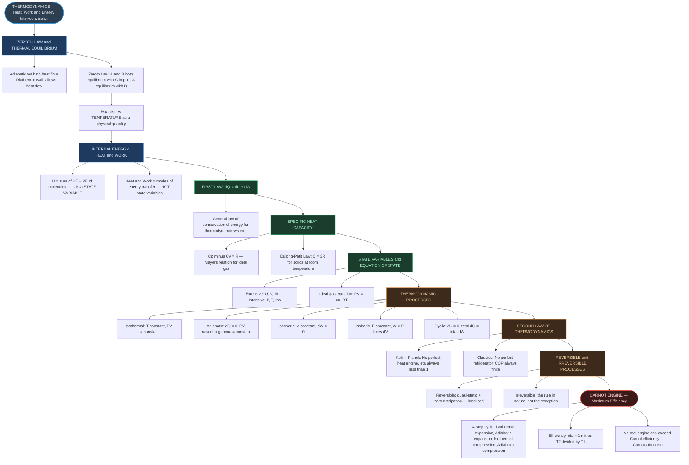

# ⚡ CHAPTER 11 — THERMODYNAMICS
> **Complete Study Notes** | Board · NEET · JEE Layered

---

## 🗺️ CONCEPT ROADMAP

---

## SECTION 1 — INTRODUCTION TO THERMODYNAMICS ⭐⭐

### 1.1 What is Thermodynamics?

**Thermodynamics** is the branch of physics that deals with the concepts of heat and temperature and the inter-conversion of heat and other forms of energy.

Key characteristics:
- It is a **macroscopic science** — deals with bulk systems, not individual molecules
- Concepts and laws were formulated in the 19th century, before the molecular picture of matter was established
- A thermodynamic description requires relatively **few macroscopic variables** (P, V, T, mass, composition)

> [!note] Contrast with Mechanics
> Mechanics deals with motion of particles under forces/torques. Thermodynamics is NOT concerned with the motion of the system as a whole — it is concerned with the **internal macroscopic state** of the body.

**Classic example:** When a bullet is fired, its temperature does NOT rise (mechanical energy added). When the bullet pierces wood and stops, kinetic energy converts to heat, raising the temperature of the bullet and wood. **Temperature is related to internal (disordered) molecular energy, not bulk motion.**

### 1.2 Historical Note

Before modern physics, heat was regarded as a fine invisible fluid called **caloric** that flowed from hot to cold bodies. Benjamin Thomson (Count Rumford, 1798) disproved this by showing that boring a cannon generated unlimited heat — dependent on work done, NOT on the amount of material. This established **heat as a form of energy**.

---

## SECTION 2 — THERMAL EQUILIBRIUM & ZEROTH LAW ⭐⭐⭐

### 2.1 Thermal Equilibrium

**Equilibrium in thermodynamics** (≠ equilibrium in mechanics):

> [!info] Thermodynamic Equilibrium
> A system is in **thermodynamic equilibrium** if all macroscopic variables (P, V, T, mass, composition) remain constant with time.

Two types of walls:

| Wall Type | Property | Effect |
|:---|:---|:---|
| **Adiabatic wall** | Insulating — does NOT allow heat flow | Systems remain thermally independent |
| **Diathermic wall** | Conducting — ALLOWS heat flow | Systems exchange energy and reach thermal equilibrium |

When two systems A and B are separated by a diathermic wall, their macroscopic variables change until they reach a state of **thermal equilibrium** — at which point there is no more energy flow.

> [!note] Characteristic of Thermal Equilibrium
> The temperatures of the two systems become equal.

### 2.2 Zeroth Law of Thermodynamics

**Statement:** *Two systems in thermal equilibrium with a third system separately are in thermal equilibrium with each other.*

**Setup:** A and B are each in contact with C via diathermic walls (A-B separated by adiabatic wall). Both A and B reach equilibrium with C. When adiabatic wall between A and B is replaced by diathermic wall → A and B are found to be in thermal equilibrium with each other without any further change.

**Mathematical implication:** If $T_A = T_C$ and $T_B = T_C$, then $T_A = T_B$.

> [!note] Why the Zeroth Law Matters
> The Zeroth Law **establishes temperature as a physical quantity**. There must be a quantity (T) that has the same value for all systems in mutual thermal equilibrium.

**Historical note:** Formulated by R.H. Fowler in 1931 — after the First and Second Laws — hence called "Zeroth." It logically precedes the other laws but was recognised last.

---

## SECTION 3 — HEAT, INTERNAL ENERGY AND WORK ⭐⭐⭐

### 3.1 Internal Energy (U)

**Definition:** Internal energy U of a system is the **sum of the kinetic energies and potential energies of all the molecular constituents** of the system, in the frame of reference in which the centre of mass is at rest.

Key points about U:
- Includes molecular KE (translational, rotational, vibrational) and PE (intermolecular)
- Does **NOT** include the KE of the system as a whole (bulk motion)
- **U is a STATE VARIABLE** — depends only on the current state (P, V, T), NOT on the path taken to reach that state
- For an ideal gas (negligible intermolecular forces): U = sum of kinetic energies of molecules only
- U depends **only on temperature** for an ideal gas

> [!important] Critical Exam Point
> Internal energy is a state variable. Heat and work are NOT state variables — they describe processes (energy in transit), not states.

### 3.2 Heat (ΔQ)

**Heat** is energy in **transit** due to a temperature difference between a system and its surroundings.

- Heat flows from higher T to lower T
- Heat is NOT stored in a body — it only exists during a process of transfer
- Once transferred, it becomes part of the internal energy
- **ΔQ is NOT a state variable**

> [!important] Crucial Distinction
> "A gas has a certain amount of internal energy" — ✅ MEANINGFUL.
>
> "A gas has a certain amount of heat" — ❌ MEANINGLESS. Heat is always heat *in transit*.

### 3.3 Work (ΔW)

**Work** is the energy transferred by means other than temperature difference (e.g., compressing a gas with a piston).

For a gas in a cylinder with a movable piston at constant pressure P:

$$\boxed{\Delta W = P \Delta V} \quad \text{...(11.1)}$$

- **ΔW is NOT a state variable** — it depends on the path taken
- Work done BY the system: ΔW > 0 (gas expands, ΔV > 0)
- Work done ON the system: ΔW < 0 (gas compressed, ΔV < 0)

### 3.4 Two Ways to Change Internal Energy

1. **Supply/remove heat** (temperature difference with surroundings)
2. **Do mechanical work** on/by the system (move piston)

Both change U — but through different mechanisms. This is the conceptual foundation of the First Law.

---

## SECTION 4 — FIRST LAW OF THERMODYNAMICS ⭐⭐⭐⭐

### 4.1 Statement

$$\boxed{\Delta Q = \Delta U + \Delta W} \quad \text{...(11.2)}$$

Where:
- **ΔQ** = heat supplied TO the system by surroundings (positive when heat absorbed)
- **ΔW** = work done BY the system on surroundings
- **ΔU** = change in internal energy of the system

**In words:** The heat energy supplied to a system goes partly to increase its internal energy and partly to do work on the surroundings.

Equivalently: $\Delta Q - \Delta W = \Delta U$

> [!note] First Law in Context
> The First Law is simply the **general law of conservation of energy** applied to thermodynamic systems.

### 4.2 Sign Conventions

| Quantity | Sign | Meaning |
|:---:|:---:|:---|
| ΔQ | + | Heat absorbed by system |
| ΔQ | − | Heat released by system |
| ΔW | + | Work done BY system (expansion) |
| ΔW | − | Work done ON system (compression) |
| ΔU | + | Internal energy increases (T rises) |
| ΔU | − | Internal energy decreases (T falls) |

### 4.3 Path Dependence

- **ΔU** depends only on initial and final states → **path independent** (state variable)
- **ΔQ** and **ΔW** individually depend on path → **path dependent**
- But the combination **ΔQ − ΔW = ΔU** is **path independent**

**Implication:** For a system going between the same two states via different paths, ΔQ and ΔW differ, but their difference (= ΔU) is always the same.

### 4.4 Application: Water to Vapour (NCERT Example)

For 1 g of water at atmospheric pressure:
- ΔQ = 2256 J (latent heat of vaporisation)
- Volume in liquid phase: $V_l = 1\ \text{cm}^3$; Volume as vapour: $V_g = 1671\ \text{cm}^3$
- $\Delta W = P(V_g - V_l) = 1.013 \times 10^5 \times (1671 - 1) \times 10^{-6} = \textbf{169.2 J}$
- $\Delta U = 2256 - 169.2 = \textbf{2086.8 J}$

> [!note] Conclusion
> Most of the heat goes to increase internal energy (breaking intermolecular bonds), only a small fraction (~7.5%) goes to doing work against the atmosphere.

---

## SECTION 5 — SPECIFIC HEAT CAPACITY ⭐⭐⭐

### 5.1 Heat Capacity (S) and Specific Heat Capacity (s)

**Heat capacity** S of a body:
$$S = \frac{\Delta Q}{\Delta T} \quad \text{...(11.3)}$$
Unit: J K⁻¹

**Specific heat capacity** s (per unit mass):
$$\boxed{s = \frac{1}{m}\frac{\Delta Q}{\Delta T}} \quad \text{...(11.4)}$$
Unit: J kg⁻¹ K⁻¹

**Molar specific heat capacity** C (per mole):
$$\boxed{C = \frac{1}{\mu}\frac{\Delta Q}{\Delta T}} \quad \text{...(11.5)}$$
Unit: J mol⁻¹ K⁻¹

> [!important] Key Property
> **C and s are independent of the amount of substance** (intensive properties) — characteristic of the material.

### 5.2 Molar Specific Heat of Solids (Dulong-Petit Law)

Using the **law of equipartition of energy** for a solid of N atoms, each vibrating in 3D:

- Average energy per oscillator in 1D = $k_B T$ → Average energy per atom in 3D = $3k_B T$
- Total energy for 1 mole: $U = 3k_B T \times N_A = 3RT$

At constant pressure (ΔV negligible for solids):
$$\boxed{C = \frac{\Delta U}{\Delta T} = 3R} \quad \text{...(11.6)}$$
Value: $3R \approx 24.9$ J mol⁻¹ K⁻¹

This is the **Dulong-Petit Law**. From Table 11.1:

| Substance | Molar C (J mol⁻¹ K⁻¹) |
|:---|:---:|
| Aluminium | 24.4 |
| Copper | 24.5 |
| Lead | 26.5 |
| Silver | 25.5 |
| Tungsten | 24.9 |
| Carbon | 6.1 ← Exception! |

> [!note] Exception and Limitation
> Carbon deviates significantly. Agreement breaks down at low temperatures for all substances (quantum effects become important).

### 5.3 Specific Heat Capacity of Water

The specific heat of water varies slightly with temperature (Fig. 11.5 in NCERT). For precise measurements:

- **1 calorie** = heat to raise temperature of 1 g of water from 14.5°C to 15.5°C
- **1 cal = 4.186 J** (this is the "mechanical equivalent of heat")
- In SI units: **s(water) = 4186 J kg⁻¹ K⁻¹**

### 5.4 Specific Heat Capacities of Gases: Cₚ and Cᵥ

For gases, specific heat depends on the **process** (path):

- **Cᵥ** = molar specific heat at **constant volume**
- **Cₚ** = molar specific heat at **constant pressure**

**Derivation of Cₚ − Cᵥ = R (Mayer's Relation):**

For 1 mole of ideal gas, at constant volume (ΔV = 0):
$$C_v = \left(\frac{\Delta U}{\Delta T}\right)_v = \frac{\Delta U}{\Delta T} \quad \text{...(11.7)}$$

At constant pressure:
$$C_p = \left(\frac{\Delta U}{\Delta T}\right)_p + P\left(\frac{\Delta V}{\Delta T}\right)_p \quad \text{...(11.8)}$$

Since $PV = RT$ for 1 mole: $P\left(\frac{\Delta V}{\Delta T}\right)_p = R$

Therefore:
$$\boxed{C_p - C_v = R} \quad \text{...(11.9)}$$

> [!important] Cₚ > Cᵥ Always
> At constant pressure, some of the supplied heat must do work in expansion ($P\Delta V = R\Delta T$ per mole), so more heat is needed for the same temperature rise.

---

## SECTION 6 — THERMODYNAMIC STATE VARIABLES & EQUATION OF STATE ⭐⭐

### 6.1 State Variables

**State variables** are macroscopic variables that completely describe an equilibrium state. Examples: P, V, T, mass (m), internal energy (U).

**Key property:** Value of a state variable depends only on the state, NOT on the path used to reach it.

Two types:

| Type | Definition | Examples |
|:---|:---|:---|
| **Extensive** | Depends on the 'size' of the system — halves when system is halved | U, V, total mass M |
| **Intensive** | Independent of system size — unchanged when system is halved | P, T, density ρ |

> [!note] Test for Extensive vs Intensive
> Imagine dividing the system into two equal halves. If the variable is halved → extensive. If unchanged → intensive.

Note: Product of intensive × extensive = extensive. E.g., PΔV is extensive.

### 6.2 Equation of State

The **equation of state** is the relation connecting the state variables of a system at equilibrium.

For an ideal gas: $PV = \mu RT$

For a fixed amount of gas (given μ), only **two independent variables** are needed (e.g., P and V, or T and V).

**Isotherm:** P-V curve at fixed temperature. For ideal gas: PV = constant → hyperbola.

### 6.3 Non-Equilibrium States

A thermodynamic system is not always in equilibrium. Examples:
- Gas expanding freely against vacuum (pressure not uniform)
- Mixture of gases undergoing explosive reaction (T and P not uniform)

State variables **cannot be defined** for non-equilibrium states.

---

## SECTION 7 — THERMODYNAMIC PROCESSES ⭐⭐⭐⭐

### 7.1 Quasi-Static Process

A **quasi-static process** is an idealised infinitely slow process in which the system remains in thermal and mechanical equilibrium with its surroundings at every stage.

Characteristics:
- Pressure difference between system and surroundings: infinitesimally small
- Temperature difference between system and surroundings: infinitesimally small
- The system moves through a continuous sequence of equilibrium states
- Can be represented as a path on a P-V diagram

> [!note] Convention
> All thermodynamic processes discussed (unless stated otherwise) are quasi-static.

**In practice:** Sufficiently slow processes without large temperature gradients or accelerated piston motion approximate quasi-static behaviour.

### 7.2 Summary Table of Special Processes

| Process | Constant Variable | Feature | ΔQ | ΔU | ΔW |
|:---|:---:|:---|:---:|:---:|:---:|
| **Isothermal** | Temperature (T) | PV = const | ≠ 0 | = 0 (ideal gas) | = ΔQ |
| **Adiabatic** | No heat exchange | ΔQ = 0 | 0 | = −ΔW | = −ΔU |
| **Isochoric** | Volume (V) | ΔV = 0, ΔW = 0 | = ΔU | = ΔQ | 0 |
| **Isobaric** | Pressure (P) | ΔW = PΔV | = ΔU + PΔV | ≠ 0 | = PΔV |
| **Cyclic** | — | Returns to start | = ΔW | = 0 | = ΔQ |

### 7.3 Isothermal Process (T = constant)

For an ideal gas: PV = constant (Boyle's Law)

**Work done in isothermal expansion** from V₁ to V₂:
$$\boxed{W = \mu RT \ln\frac{V_2}{V_1}} \quad \text{...(11.10)}$$

Since U depends only on T for an ideal gas, and T is constant:
$$\Delta U = 0 \Rightarrow \Delta Q = W = \mu RT \ln\frac{V_2}{V_1}$$

- If $V_2 > V_1$ (expansion): W > 0 → gas absorbs heat and does positive work
- If $V_2 < V_1$ (compression): W < 0 → work done ON gas, gas releases heat

**Example:** Expanding gas in a metallic cylinder in a large reservoir of fixed temperature.

### 7.4 Adiabatic Process (ΔQ = 0)

No heat exchange with surroundings (thermally insulated system).

From First Law: $0 = \Delta U + \Delta W \Rightarrow \Delta W = -\Delta U$

**For an ideal gas:**
$$\boxed{PV^\gamma = \text{constant}} \quad \text{...(11.11)}$$

where $\gamma = \frac{C_p}{C_v}$ (ratio of specific heats; also called adiabatic exponent)

Typical values: $\gamma = 5/3$ for monoatomic gases; $\gamma = 7/5 = 1.4$ for diatomic gases at room temperature.

If state changes from $(P_1, V_1, T_1)$ to $(P_2, V_2, T_2)$:
$$P_1V_1^\gamma = P_2V_2^\gamma \quad \text{...(11.12)}$$

**Work done in adiabatic process:**
$$\boxed{W = \frac{\mu R(T_1 - T_2)}{\gamma - 1}} \quad \text{...(11.13)}$$

- Adiabatic expansion (W > 0): T₂ < T₁ — gas cools
- Adiabatic compression (W < 0): T₂ > T₁ — gas heats up

> [!important] On P-V Diagram
> Adiabatic curve is **steeper than isothermal** at any point (because $\gamma > 1$). Both isothermals and adiabatics for the same ideal gas are represented in Fig. 11.8.

**Real examples:**
- Propagation of sound waves in air (compression/rarefaction is adiabatic)
- Diesel engine ignition (sudden adiabatic compression heats air enough to ignite fuel)
- Pumping up a bicycle tyre (air gets warm at the pump)

### 7.5 Isochoric Process (V = constant)

No work is done ($\Delta W = P \Delta V = 0$).

From First Law: $\Delta Q = \Delta U$

All the heat supplied goes entirely into changing the internal energy (and temperature). The change in temperature is governed by the **specific heat at constant volume** ($C_v$):
$$\Delta Q = \mu C_v \Delta T$$

### 7.6 Isobaric Process (P = constant)

Work done by gas:
$$W = P(V_2 - V_1) = \mu R(T_2 - T_1) \quad \text{...(11.14)}$$

Heat absorbed goes partly to increase internal energy and partly to do work. Governed by **specific heat at constant pressure** ($C_p$):
$$\Delta Q = \mu C_p \Delta T$$

**Example:** Boiling water at standard atmospheric pressure (isobaric phase change).

### 7.7 Cyclic Process

The system returns to its initial state. Since U is a state variable:
$$\Delta U = 0 \Rightarrow \Delta Q_{total} = \Delta W_{total}$$

Total heat absorbed = Total work done by the system in one complete cycle.

**P-V diagram:** Cyclic process traces a closed loop. Work done = area enclosed by the loop.

---

## SECTION 8 — SECOND LAW OF THERMODYNAMICS ⭐⭐⭐⭐

### 8.1 Why a Second Law?

The First Law (energy conservation) allows many processes that are **never actually observed.** For example:
- A book lying on a table does not spontaneously jump up by itself (table's internal energy converting to book's KE)
- Heat does not spontaneously flow from cold to hot

The **Second Law** is an additional principle of nature that rules out such processes.

### 8.2 Two Classical Statements

> [!important] Kelvin-Planck Statement
> *No process is possible whose sole result is the absorption of heat from a reservoir and the complete conversion of the heat into work.*
>
> Denies the possibility of a **perfect heat engine** (η = 100%)

> [!important] Clausius Statement
> *No process is possible whose sole result is the transfer of heat from a colder object to a hotter object.*
>
> Denies the possibility of a **perfect refrigerator** (COP = ∞)

> [!important] Equivalence
> **The two statements are completely equivalent** — either one can be derived from the other.

### 8.3 Implications

| Limitation | First Law | Second Law |
|:---|:---|:---|
| Heat engine efficiency | η can be anything ≤ 1 | η can never = 1 |
| Refrigerator COP | α can be anything | α can never = ∞ |
| Spontaneous heat flow | Allows both directions | Only from hot → cold |

> [!note] Deeper Significance
> The Second Law gives **direction** to spontaneous processes. It introduces the concept of irreversibility and (at a deeper level, beyond this syllabus) entropy.

---

## SECTION 9 — REVERSIBLE AND IRREVERSIBLE PROCESSES ⭐⭐⭐

### 9.1 Reversible Process

**Definition:** A thermodynamic process (state i → state f) is reversible if it can be turned back such that **both the system and surroundings return to their original states, with no other change anywhere else in the universe.**

**Conditions for reversibility:**
1. Process must be **quasi-static** (infinitely slow, system always in equilibrium)
2. **No dissipative effects** (no friction, no viscosity, no turbulence)

**Example:** Quasi-static isothermal expansion of ideal gas in frictionless cylinder — a reversible process.

> [!note] Idealised Notion
> A reversible process is an **idealised notion** — in practice, every real process involves some dissipation.

### 9.2 Irreversible Processes

Irreversibility is the **rule, not the exception** in nature.

**Two main causes of irreversibility:**
1. Many processes take the system through **non-equilibrium states** (e.g., free expansion)
2. **Dissipative effects** (friction, viscosity) are present everywhere

**Examples of irreversible processes:**
- Free expansion of a gas into vacuum
- Combustion of fuel
- Heat conduction down a finite temperature gradient
- Stirring of a liquid (work → heat; can't be reversed without external effort)
- Diffusion of gases
- All spontaneous processes in nature

### 9.3 Significance

A reversible heat engine achieves the **maximum possible efficiency** between two temperature reservoirs. All irreversible engines have lower efficiency. This forms the basis of Carnot's theorem.

---

## SECTION 10 — CARNOT ENGINE ⭐⭐⭐⭐⭐

### 10.1 The Problem

Question posed by Sadi Carnot (French engineer, 1824): *What is the maximum possible efficiency for a heat engine operating between two reservoirs at temperatures T₁ (hot) and T₂ (cold)?*

### 10.2 Carnot Cycle

A **Carnot engine** is a reversible heat engine operating between exactly two reservoirs. It consists of four quasi-static steps (shown in Fig. 11.9):

| Step | Process | Description | Work Done |
|:---:|:---|:---|:---|
| 1 → 2 | Isothermal expansion at T₁ | Gas absorbs Q₁ from hot reservoir | $W_{12} = Q_1 = \mu RT_1 \ln(V_2/V_1)$ |
| 2 → 3 | Adiabatic expansion T₁ → T₂ | Gas cools from T₁ to T₂; no heat | $W_{23} = \mu R(T_1-T_2)/(\gamma-1)$ |
| 3 → 4 | Isothermal compression at T₂ | Gas releases Q₂ to cold reservoir | $W_{34} = Q_2 = \mu RT_2 \ln(V_3/V_4)$ |
| 4 → 1 | Adiabatic compression T₂ → T₁ | Gas heats back to T₁; no heat | $W_{41} = \mu R(T_1-T_2)/(\gamma-1)$ |

**Total work done** per cycle:
$$W = Q_1 - Q_2 = \mu RT_1\ln\frac{V_2}{V_1} - \mu RT_2\ln\frac{V_3}{V_4}$$

Using the adiabatic relation $T_1 V_2^{\gamma-1} = T_2 V_3^{\gamma-1}$ and $T_2 V_4^{\gamma-1} = T_1 V_1^{\gamma-1}$:

$$\frac{V_3}{V_4} = \frac{V_2}{V_1} \quad \text{(derived from adiabats)}$$

Therefore:
$$W = \mu R(T_1 - T_2)\ln\frac{V_2}{V_1}$$

### 10.3 Efficiency of Carnot Engine

$$\eta = \frac{W}{Q_1} = 1 - \frac{Q_2}{Q_1}$$

$$\boxed{\eta = 1 - \frac{T_2}{T_1}} \quad \text{...(11.15) (Carnot Engine)}$$

> [!important] Most Important Result in Thermodynamics
> The efficiency depends ONLY on the temperatures of the hot and cold reservoirs.

**Key observations:**
- η < 1 always (since T₂ > 0 K always in practice)
- η → 1 only if T₂ → 0 K (absolute zero) — unachievable
- Higher T₁ or lower T₂ → higher efficiency
- η is **independent of the working substance**

### 10.4 Carnot's Theorem

**(a)** No engine operating between two temperatures T₁ and T₂ can have efficiency **greater than** that of the Carnot engine.

**(b)** The efficiency of the Carnot engine is **independent of the nature of the working substance** — it depends only on T₁ and T₂.

**Proof sketch (by contradiction):** If an irreversible engine I had $\eta_I > \eta_R$ (Carnot), we could use the Carnot engine as a refrigerator and couple them. The combined system would extract heat from the cold reservoir and deliver work — violating the Kelvin-Planck statement.

### 10.5 Universal Thermodynamic Temperature

From the Carnot efficiency result:
$$\frac{Q_1}{Q_2} = \frac{T_1}{T_2} \quad \text{...(11.16)}$$

This is a **universal relation** independent of the working substance. It defines an absolute thermodynamic temperature scale that doesn't depend on the properties of any particular substance.

### 10.6 Carnot Engine as a Refrigerator

Running the Carnot cycle in reverse (refrigerator mode):
- Takes heat Q₂ from cold reservoir at T₂
- Requires work W to be done on the system
- Delivers heat Q₁ = Q₂ + W to hot reservoir at T₁

**Coefficient of Performance (COP):**
$$\alpha = \frac{Q_2}{W} = \frac{Q_2}{Q_1 - Q_2} = \frac{T_2}{T_1 - T_2}$$

---

## SECTION 11 — NCERT SOLVED EXAMPLES WALKTHROUGH ⭐⭐

### Example 11.1 — Internal Energy Change: Water to Vapour

**Problem:** For 1 g of water going from liquid to vapour at atmospheric pressure. Latent heat = 2256 J/g.

**Solution:**
- $V_{liquid} = 1\ \text{cm}^3$; $V_{vapour} = 1671\ \text{cm}^3$
- $\Delta W = P(V_g - V_l) = 1.013 \times 10^5 \times 1670 \times 10^{-6} = 169.2\ \text{J}$
- $\Delta U = \Delta Q - \Delta W = 2256 - 169.2 = \textbf{2086.8 J}$
- Interpretation: 93% of heat increases internal energy; 7% does expansion work against atmosphere.

### Example 11.2 — Heat Supplied to Nitrogen at Constant Pressure (NCERT Ex. 11.2)

**Given:** $m = 2.0 \times 10^{-2}$ kg of N₂; $\Delta T = 45°$C at constant pressure; $M(N_2) = 28$; $R = 8.3$ J mol⁻¹ K⁻¹.

- $\mu = 0.02/0.028 = \textbf{0.714}$ mol
- For N₂ (diatomic): $C_v = (5/2)R$; $C_p = (7/2)R = 3.5 \times 8.3 = \textbf{29.05}$ J mol⁻¹ K⁻¹
- $\Delta Q = \mu C_p \Delta T = 0.714 \times 29.05 \times 45 = \textbf{933}$ J $\approx 0.933$ kJ

### Example 11.3 — Geyser Fuel Consumption (NCERT Ex. 11.1)

**Given:** Flow rate = 3.0 L/min; $T_1 = 27°$C; $T_2 = 77°$C; heat of combustion = $4.0 \times 10^4$ J/g.

- Heat needed per minute = mass × s × ΔT = $3000 \times 4.2 \times 50 = 630{,}000$ J/min
- Rate of fuel consumption = $630{,}000 / (4.0 \times 10^4) = \textbf{15.75}$ g/min

### Example 11.4 — Carnot Engine Efficiency

**Given:** $T_1 = 500\ \text{K}$; $T_2 = 300\ \text{K}$.

$$\eta = 1 - \frac{T_2}{T_1} = 1 - \frac{300}{500} = 1 - 0.6 = \textbf{0.4 = 40\%}$$

---

## SECTION 12 — FIRST LAW APPLIED TO PROCESSES (CONSOLIDATED) ⭐⭐⭐

> [!note] Isothermal Process (T = constant)
> - $\Delta U = 0$ for ideal gas (U depends only on T)
> - $\Delta Q = \Delta W = \mu RT \ln(V_2/V_1)$
> - Graph: **Hyperbola** on P-V plot ($PV = \text{const}$)

> [!note] Adiabatic Process (ΔQ = 0)
> - $\Delta Q = 0 \Rightarrow \Delta U = -\Delta W$
> - $W = \mu R(T_1 - T_2)/(\gamma - 1)$
> - $PV^\gamma = \text{const}$
> - Graph: **Steeper curve** than isothermal on P-V plot

> [!note] Isochoric Process (V = constant)
> - $\Delta W = 0$ (no volume change)
> - $\Delta Q = \Delta U = \mu C_v \Delta T$
> - Graph: **Vertical line** on P-V plot

> [!note] Isobaric Process (P = constant)
> - $\Delta W = P\Delta V = \mu R\Delta T$
> - $\Delta Q = \mu C_p \Delta T$
> - $\Delta U = \mu C_v \Delta T$
> - Graph: **Horizontal line** on P-V plot

> [!note] Cyclic Process
> - $\Delta U = 0$ (system returns to initial state)
> - $\Delta Q = \Delta W =$ area enclosed by loop on P-V diagram

---

## SECTION 13 — HEAT ENGINE AND REFRIGERATOR ⭐⭐⭐

### 13.1 Heat Engine

A device that converts heat into work in a cyclic process.

- **Working substance** (gas) operates between hot reservoir (T₁) and cold reservoir (T₂)
- Absorbs Q₁ from hot source, does work W, releases Q₂ to cold sink
- From First Law: $W = Q_1 - Q_2$
- **Efficiency:** $\eta = \frac{W}{Q_1} = 1 - \frac{Q_2}{Q_1}$
- Second Law: η < 1 always (Q₂ > 0 always — some heat must be rejected)

### 13.2 Refrigerator / Heat Pump

- Exactly the reverse of a heat engine
- Work W is done ON the system to transfer heat Q₂ from cold body to hot body
- **COP of refrigerator:** $\beta = \frac{Q_2}{W} = \frac{Q_2}{Q_1 - Q_2}$
- Second Law: β can never be infinite (W > 0 always)

| Device | Input | Output | Performance |
|:---|:---|:---|:---|
| Heat engine | Q₁ (heat from source) | W (work) + Q₂ (waste heat) | $\eta = W/Q_1$ |
| Refrigerator | W (work) | Q₂ (heat from cold body) | $\beta = Q_2/W$ |
| Heat pump | W (work) | Q₁ (heat to hot body) | $\beta' = Q_1/W$ |

---

## 📋 QUICK REFERENCE — All Laws, Formulae, and Dimensional Formulae

> [!important] Zeroth Law
> Two systems in equilibrium with a third are in equilibrium with each other → temperature is defined as the common thermodynamic variable.

> [!important] First Law
> $\Delta Q = \Delta U + \Delta W$ — conservation of energy
>
> $\Delta W = P\Delta V$ (work at constant pressure)
>
> $\Delta U$ is a state variable; $\Delta Q$, $\Delta W$ are not
>
> | Process | Result |
> |:---|:---|
> | Isothermal (ideal gas) | $\Delta U = 0$; $\Delta Q = \Delta W$ |
> | Adiabatic | $\Delta Q = 0$; $\Delta U = -\Delta W$ |
> | Isochoric | $\Delta W = 0$; $\Delta Q = \Delta U$ |
> | Cyclic | $\Delta U = 0$; $\Delta Q = \Delta W$ |

> [!important] Specific Heat Capacities
> $s = \Delta Q / (m\Delta T)$ — specific heat capacity
>
> $C = \Delta Q / (\mu\Delta T)$ — molar specific heat capacity
>
> For solids: $C = 3R \approx 24.9$ J mol⁻¹ K⁻¹ (Dulong-Petit)
>
> For ideal gas: $C_p - C_v = R$ (Mayer's relation)
>
> $\gamma = C_p/C_v$ — Monoatomic: $\gamma = 5/3$ — Diatomic: $\gamma = 7/5 = 1.4$

> [!important] Thermodynamic Processes
> | Process | Work Formula | Condition |
> |:---|:---|:---|
> | Isothermal | $W = \mu RT \ln(V_2/V_1)$ | $PV = \text{const}$ |
> | Adiabatic | $W = \mu R(T_1-T_2)/(\gamma-1)$ | $PV^\gamma = \text{const}$ |
> | Isochoric | $W = 0$ | $\Delta Q = \mu C_v \Delta T$ |
> | Isobaric | $W = \mu R\Delta T = P\Delta V$ | $\Delta Q = \mu C_p \Delta T$ |

> [!important] Second Law
> **Kelvin-Planck:** No process can convert heat entirely into work
>
> **Clausius:** No process can transfer heat cold → hot alone
>
> Heat engine: $\eta < 1$ always — Refrigerator: COP $< \infty$ always

> [!important] Carnot Engine
> $$\eta = 1 - \frac{T_2}{T_1} \quad \text{(temperatures in Kelvin!)}$$
>
> $$\frac{Q_1}{Q_2} = \frac{T_1}{T_2} \quad \text{(universal relation)}$$
>
> 4-step cycle: Isothermal ($T_1$) → Adiabatic → Isothermal ($T_2$) → Adiabatic (back to start)
>
> No engine can exceed Carnot efficiency — Efficiency independent of working substance

---

## ⚡ POINTS TO PONDER (High-Yield for Exams)

1. **Heat ≠ Internal energy.** Heat is energy in transit due to ΔT. Internal energy U is the actual energy stored in the system. "A system has a certain amount of heat" is meaningless.

2. **U is a state variable; Q and W are not.** ΔU is the same for all paths between two states. ΔQ and ΔW individually depend on the path.

3. **Isothermal process for ideal gas: ΔU = 0** — because U of an ideal gas depends only on T. All heat supplied = work done.

4. **Adiabatic is steeper than isothermal on P-V diagram** because $PV^\gamma = \text{const}$ and $\gamma > 1$, compared to $PV = \text{const}$ (isothermal). Slope at any point: $-\gamma P/V$ (adiabat) vs $-P/V$ (isotherm).

5. **Cₚ > Cᵥ for all gases** — at constant P, gas expands and does work; at constant V, no work done; so more heat per degree rise at constant P.

6. **Carnot efficiency depends ONLY on T₁ and T₂** — not on the working substance, the exact nature of the cycle, or the amount of gas.

7. **No engine can have η = 1** (unless the cold reservoir is at 0 K, which is unachievable — Third Law of Thermodynamics).

8. **Irreversibility arises from:** non-equilibrium states (free expansion, explosions) AND dissipative effects (friction, viscosity). Both are always present in real processes.

9. **A reversible process is quasi-static AND non-dissipative.** Quasi-static alone is not sufficient for reversibility.

10. **The Zeroth Law establishes the concept of temperature.** Without it, temperature as a measurable quantity has no logical basis.

11. **Second Law: The direction of spontaneous processes.** All spontaneous (natural) processes are irreversible. The reverse never happens on its own.

12. **For a cyclic process on P-V diagram:** work done = area enclosed by the loop. Clockwise loop → positive work done by system (heat engine). Anticlockwise → work done on system (refrigerator/heat pump).

13. **Q₁/Q₂ = T₁/T₂ for Carnot cycle** — this universal relation defines the absolute thermodynamic temperature scale, independent of any particular working substance.

14. **Diesel vs Petrol engine:** Diesel uses adiabatic compression (high γ ratio, higher compression ratio → higher efficiency). Petrol (Otto) cycle has lower compression ratio.

---

## 📊 Dimensional Formulae Summary

| Quantity | Symbol | Dimensional Formula | SI Unit |
|:---|:---:|:---:|:---|
| Heat / Work / Internal energy | Q, W, U | $[ML^2T^{-2}]$ | J |
| Temperature | T | $[K]$ | K |
| Specific heat capacity | s | $[L^2T^{-2}K^{-1}]$ | J kg⁻¹ K⁻¹ |
| Molar heat capacity | C | $[ML^2T^{-2}\text{mol}^{-1}K^{-1}]$ | J mol⁻¹ K⁻¹ |
| Entropy | S | $[ML^2T^{-2}K^{-1}]$ | J K⁻¹ |
| Universal gas constant | R | $[ML^2T^{-2}\text{mol}^{-1}K^{-1}]$ | J mol⁻¹ K⁻¹ |
| Efficiency (η) | η | Dimensionless | — |
| Adiabatic index | γ | Dimensionless | — |
| Thermal conductivity | K | $[MLT^{-3}K^{-1}]$ | W m⁻¹ K⁻¹ |

---

## 🔢 Key Constants

| Quantity | Value |
|:---|:---|
| Universal gas constant R | 8.31 J mol⁻¹ K⁻¹ |
| Cₚ − Cᵥ for ideal gas | R = 8.31 J mol⁻¹ K⁻¹ |
| Molar specific heat of solids (Dulong-Petit) | 3R ≈ 24.9 J mol⁻¹ K⁻¹ |
| γ for monoatomic ideal gas | 5/3 ≈ 1.67 |
| γ for diatomic gas (room T) | 7/5 = 1.4 |
| 1 calorie | 4.186 J |
| Specific heat of water | 4186 J kg⁻¹ K⁻¹ |
| Latent heat of vaporisation of water | 2256 J/g = 22.56 × 10⁵ J kg⁻¹ |

---

*End of Core Notes — Ch. 11: Thermodynamics*
*Exam Tags: Board · NEET · JEE Mains · JEE Advanced*