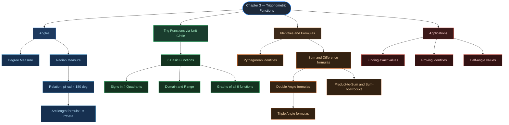

# 🔺 CHAPTER 3 — TRIGONOMETRIC FUNCTIONS

> **Complete Study Notes** | Board · NEET · JEE Layered
> *Class XI Mathematics — NCERT*

---

## 🗺️ CONCEPT ROADMAP



---

## SECTION 1 — ANGLES & MEASUREMENT ⭐⭐

### 1.1 What is an Angle?

> [!info] Definition — Angle
> An **angle** is the measure of rotation of a ray from its **initial side** to its **terminal side** about the vertex (pivot point).
>
> - **Positive angle** → anticlockwise rotation
> - **Negative angle** → clockwise rotation

```tikz
\usetikzlibrary{arrows.meta}
\begin{tikzpicture}[>={Stealth[length=7pt,width=5pt]}, thick, scale=1.2]
  % Positive angle diagram
  \draw[->, black!70, line width=1.2pt] (-0.3,0) -- (3,0) node[right, font=\small] {Initial side};
  \draw[->, blue!80!black, line width=1.5pt] (0,0) -- (2.3,1.5) node[right, font=\small] {Terminal side};
  \draw[->, orange!80!black, thin] (0.7,0) arc (0:33:0.7) node[midway, right, font=\footnotesize] {$+\theta$};
  \fill (0,0) circle (2.5pt) node[below left, font=\small] {O (vertex)};
  \node[below, font=\small, text=gray] at (1.0,-0.5) {Positive angle (anticlockwise)};

  % Negative angle diagram
  \begin{scope}[xshift=5.5cm]
    \draw[->, black!70, line width=1.2pt] (-0.3,0) -- (3,0) node[right, font=\small] {Initial side};
    \draw[->, red!80!black, line width=1.5pt] (0,0) -- (2.3,-1.5) node[right, font=\small] {Terminal side};
    \draw[->, orange!80!black, thin] (0.7,0) arc (0:-33:0.7) node[midway, right, font=\footnotesize] {$-\theta$};
    \fill (0,0) circle (2.5pt) node[below left, font=\small] {O};
    \node[below, font=\small, text=gray] at (1.0,-2.0) {Negative angle (clockwise)};
  \end{scope}
\end{tikzpicture}
```

---

### 1.2 Degree Measure ⭐

> [!info] Degree Measure
> If a rotation from initial to terminal side is $\dfrac{1}{360}$ of a full revolution, the angle measures **1 degree** (written as 1°).
>
> **Subdivisions:**
>
> $$
> 1° = 60' \quad \text{(minutes)} \qquad 1' = 60'' \quad \text{(seconds)}
> $$

---

### 1.3 Radian Measure ⭐⭐

> [!important] Radian Measure — Definition
> **1 radian** is the angle subtended at the centre of a **unit circle** (radius = 1) by an arc of length **1 unit**.
>
> For a circle of radius $r$, if arc length $l$ subtends angle $\theta$ at the centre:
>
> $$
> \boxed{\theta = \frac{l}{r} \quad \Longleftrightarrow \quad l = r\theta}
> $$

```tikz
\usetikzlibrary{arrows.meta}
\begin{tikzpicture}[>={Stealth[length=6pt,width=4pt]}, thick, scale=1.6]
  % Unit circle
  \draw[gray, line width=1pt] (0,0) circle (1.5cm);
  \fill (0,0) circle (2pt) node[below left, font=\small] {O};
  % Radius OA
  \draw[blue!70!black, line width=1.3pt] (0,0) -- (1.5,0) node[below, font=\small] {A};
  \fill (1.5,0) circle (2pt);
  % Arc of length r = 1 (in unit circle, arc = angle in radians)
  % 1 radian arc from 0 to ~57.3 degrees
  \draw[red!80!black, line width=2pt] (1.5,0) arc (0:57.3:1.5) node[above right, font=\small, red!80!black] {arc $= r$};
  % Radius OB
  \coordinate (B) at ({1.5*cos(57.3)}, {1.5*sin(57.3)});
  \draw[blue!70!black, line width=1.3pt] (0,0) -- (B) node[above right, font=\small] {B};
  \fill (B) circle (2pt);
  % Angle label
  \draw[->, orange!80!black, thin] (0.45,0) arc (0:57.3:0.45) node[midway, right, font=\footnotesize] {$1$ rad};
  % Radius labels
  \node[below, font=\small] at (0.75,0) {$r$};
  \node[left, font=\small] at ({0.75*cos(57.3)+0.05}, {0.75*sin(57.3)}) {$r$};
  % Caption
  \node[below, font=\small, text=gray] at (0,-2.1) {When arc length $= r$, angle $= 1$ radian};
\end{tikzpicture}
```

---

### 1.4 Degree ↔ Radian Conversion ⭐⭐

> [!important] Conversion Formulae
> Since one complete revolution = $360°$ = $2\pi$ radians:
>
> $$
> \pi \text{ rad} = 180°
> $$
>
> $$
> \boxed{\text{Radian} = \frac{\pi}{180} \times \text{Degree}} \qquad \boxed{\text{Degree} = \frac{180}{\pi} \times \text{Radian}}
> $$
>
> Quick approximations: $1 \text{ rad} \approx 57°16'$ and $1° \approx 0.01746 \text{ rad}$

**Standard Angle Table:**

| Degree | $0°$ |      $30°$      |      $45°$      |      $60°$      |      $90°$      | $180°$ |      $270°$      | $360°$ |
| :----: | :-----: | :----------------: | :----------------: | :----------------: | :----------------: | :-------: | :-----------------: | :-------: |
| Radian |  $0$  | $\dfrac{\pi}{6}$ | $\dfrac{\pi}{4}$ | $\dfrac{\pi}{3}$ | $\dfrac{\pi}{2}$ |  $\pi$  | $\dfrac{3\pi}{2}$ | $2\pi$ |

> [!example] Example 1 — Degree → Radian
> Convert $40°20'$ to radians.
>
> $40°20' = 40\tfrac{1}{3}° = \dfrac{121}{3}°$
>
> $$
> \text{Radian} = \frac{\pi}{180} \times \frac{121}{3} = \frac{121\pi}{540} \text{ rad}
> $$

> [!example] Example 2 — Radian → Degree
> Convert $6$ radians to degrees.
>
> $$
> 6 \text{ rad} = \frac{180}{\pi} \times 6 = \frac{1080 \times 7}{22} \approx 343°38'11''
> $$

> [!example] Example 3 — Arc Length
> Find the radius of a circle where central angle $60°$ intercepts arc of $37.4$ cm.
>
> $\theta = 60° = \dfrac{\pi}{3}$ rad, $\quad l = 37.4$ cm
>
> $$
> r = \frac{l}{\theta} = \frac{37.4 \times 3}{\pi} = \frac{37.4 \times 3 \times 7}{22} = 35.7 \text{ cm}
> $$

---

## SECTION 2 — TRIGONOMETRIC FUNCTIONS VIA UNIT CIRCLE ⭐⭐⭐

### 2.1 Unit Circle Definition

> [!important] Definitions — Six Trig Functions
> Consider a **unit circle** centred at the origin. Let $P(a, b)$ be any point on the circle with arc $AP = x$ (in radians). Then:
>
> $$
> \cos x = a \qquad \sin x = b
> $$
>
> Since $a^2 + b^2 = 1$ for every point on the unit circle:
>
> $$
> \boxed{\cos^2 x + \sin^2 x = 1}
> $$

```tikz
\usetikzlibrary{arrows.meta}
\begin{tikzpicture}[>={Stealth[length=6pt,width=4pt]}, scale=1.8]
  % Axes
  \draw[->] (-1.6,0) -- (1.7,0) node[right, font=\small] {$X$};
  \draw[->] (0,-1.6) -- (0,1.7) node[above, font=\small] {$Y$};
  % Unit circle
  \draw[gray!80, line width=1pt] (0,0) circle (1.3cm);
  % Key points
  \fill[blue!60!black] (1.3,0) circle (2pt)  node[below right, font=\footnotesize] {$A(1,0)$};
  \fill[blue!60!black] (0,1.3) circle (2pt)  node[above right, font=\footnotesize] {$B(0,1)$};
  \fill[blue!60!black] (-1.3,0) circle (2pt) node[below left,  font=\footnotesize] {$C(-1,0)$};
  \fill[blue!60!black] (0,-1.3) circle (2pt) node[below right, font=\footnotesize] {$D(0,-1)$};
  % Point P
  \coordinate (P) at ({1.3*cos(40)}, {1.3*sin(40)});
  \filldraw[red!80!black] (P) circle (2.5pt) node[above right, font=\small] {$P(a,b)$};
  % Radius
  \draw[red!70!black, line width=1.3pt] (0,0) -- (P);
  \node[font=\small, red!70!black] at (0.4,0.35) {$1$};
  % Dashed projections
  \draw[dashed, gray] (P) -- ({1.3*cos(40)},0) node[below, font=\footnotesize] {$\cos x$};
  \draw[dashed, gray] (P) -- (0,{1.3*sin(40)}) node[left,  font=\footnotesize] {$\sin x$};
  % Angle arc
  \draw[->, orange!80!black] (0.3,0) arc (0:40:0.3) node[midway, right, font=\footnotesize] {$x$};
  % Origin
  \fill (0,0) circle (1.5pt) node[below left, font=\small] {O};
  \node[below, font=\small, text=gray] at (0,-1.8) {Unit circle: $\cos x = a$, $\sin x = b$};
\end{tikzpicture}
```

**The Four Quadrantal Points:**

|  Angle  | $0$ | $\dfrac{\pi}{2}$ | $\pi$ | $\dfrac{3\pi}{2}$ | $2\pi$ |
| :------: | :---: | :----------------: | :-----: | :-----------------: | :------: |
| $\cos$ | $1$ |       $0$       | $-1$ |        $0$        |  $1$  |
| $\sin$ | $0$ |       $1$       |  $0$  |       $-1$       |  $0$  |

---

### 2.2 The Six Trigonometric Functions

> [!note] Other Four Functions
> Defined from $\sin$ and $\cos$:
>
> $$
> \tan x = \frac{\sin x}{\cos x}, \quad x \neq (2n+1)\frac{\pi}{2}
> $$
>
> $$
> \cot x = \frac{\cos x}{\sin x}, \quad x \neq n\pi
> $$
>
> $$
> \sec x = \frac{1}{\cos x}, \quad x \neq (2n+1)\frac{\pi}{2}
> $$
>
> $$
> \text{cosec}\, x = \frac{1}{\sin x}, \quad x \neq n\pi
> $$
>
> where $n$ is any integer.

---

### 2.3 Standard Values Table ⭐⭐⭐

|                  | $0°$ | $30°\,\left(\frac{\pi}{6}\right)$ | $45°\,\left(\frac{\pi}{4}\right)$ | $60°\,\left(\frac{\pi}{3}\right)$ | $90°\,\left(\frac{\pi}{2}\right)$ |
| :--------------: | :-----: | :----------------------------------: | :----------------------------------: | :----------------------------------: | :----------------------------------: |
|     $\sin$     |  $0$  |           $\dfrac{1}{2}$           |       $\dfrac{1}{\sqrt{2}}$       |       $\dfrac{\sqrt{3}}{2}$       |                $1$                |
|     $\cos$     |  $1$  |       $\dfrac{\sqrt{3}}{2}$       |       $\dfrac{1}{\sqrt{2}}$       |           $\dfrac{1}{2}$           |                $0$                |
|     $\tan$     |  $0$  |       $\dfrac{1}{\sqrt{3}}$       |                $1$                |             $\sqrt{3}$             |                  ND                  |
|     $\cot$     |   ND   |             $\sqrt{3}$             |                $1$                |       $\dfrac{1}{\sqrt{3}}$       |                $0$                |
|     $\sec$     |  $1$  |       $\dfrac{2}{\sqrt{3}}$       |             $\sqrt{2}$             |                $2$                |                  ND                  |
| $\text{cosec}$ |   ND   |                $2$                |             $\sqrt{2}$             |       $\dfrac{2}{\sqrt{3}}$       |                $1$                |

> [!warning] Memory Trick for sin
> **"0, 1, 2, 3, 4 under root, divided by 2"**
> $\sin 0°\!=\!\sqrt{\tfrac{0}{4}}$, $\sin 30°\!=\!\sqrt{\tfrac{1}{4}}$, $\sin 45°\!=\!\sqrt{\tfrac{2}{4}}$, $\sin 60°\!=\!\sqrt{\tfrac{3}{4}}$, $\sin 90°\!=\!\sqrt{\tfrac{4}{4}}$
>
> **cos values are sin values in reverse order.**

---

### 2.4 Signs in Quadrants ⭐⭐⭐

> [!important] ASTC Rule — "All Students Take Calculus"
>
> - **Quadrant I** — **A**ll positive
> - **Quadrant II** — **S**in (and cosec) positive
> - **Quadrant III** — **T**an (and cot) positive
> - **Quadrant IV** — **C**os (and sec) positive

```tikz
\usetikzlibrary{arrows.meta}
\begin{tikzpicture}[>={Stealth[length=6pt,width=4pt]}, scale=1.0]
  % Axes
  \draw[->] (-3.5,0) -- (3.5,0) node[right, font=\small] {$X$};
  \draw[->] (0,-3.5) -- (0,3.5) node[above, font=\small] {$Y$};
  % Quadrant labels and signs
  % Quadrant I (top right) — all positive — green
  \fill[green!10!white] (0,0) rectangle (3.3,3.3);
  \node[font=\normalsize, green!60!black] at (1.65,2.2) {\textbf{Quadrant I}};
  \node[font=\small, green!60!black] at (1.65,1.5) {$\sin +$};
  \node[font=\small, green!60!black] at (1.65,1.0) {$\cos +$};
  \node[font=\small, green!60!black] at (1.65,0.5) {$\tan +$};
  \node[font=\large, green!50!black] at (1.65,2.8) {\textbf{ALL +}};
  % Quadrant II (top left) — sin positive — blue
  \fill[blue!10!white] (-3.3,0) rectangle (0,3.3);
  \node[font=\normalsize, blue!70!black] at (-1.65,2.2) {\textbf{Quadrant II}};
  \node[font=\small, blue!70!black] at (-1.65,1.5) {$\sin +$};
  \node[font=\small, red!70!black] at (-1.65,1.0) {$\cos -$};
  \node[font=\small, red!70!black] at (-1.65,0.5) {$\tan -$};
  \node[font=\large, blue!60!black] at (-1.65,2.8) {\textbf{SIN +}};
  % Quadrant III (bottom left) — tan positive — orange
  \fill[orange!10!white] (-3.3,-3.3) rectangle (0,0);
  \node[font=\normalsize, orange!70!black] at (-1.65,-0.5) {\textbf{Quadrant III}};
  \node[font=\small, red!70!black] at (-1.65,-1.0) {$\sin -$};
  \node[font=\small, red!70!black] at (-1.65,-1.5) {$\cos -$};
  \node[font=\small, orange!70!black] at (-1.65,-2.0) {$\tan +$};
  \node[font=\large, orange!60!black] at (-1.65,-2.8) {\textbf{TAN +}};
  % Quadrant IV (bottom right) — cos positive — purple
  \fill[purple!10!white] (0,-3.3) rectangle (3.3,0);
  \node[font=\normalsize, purple!70!black] at (1.65,-0.5) {\textbf{Quadrant IV}};
  \node[font=\small, red!70!black] at (1.65,-1.0) {$\sin -$};
  \node[font=\small, purple!70!black] at (1.65,-1.5) {$\cos +$};
  \node[font=\small, red!70!black] at (1.65,-2.0) {$\tan -$};
  \node[font=\large, purple!60!black] at (1.65,-2.8) {\textbf{COS +}};
  % Redraw axes on top
  \draw[black, line width=1.2pt] (-3.3,0) -- (3.3,0);
  \draw[black, line width=1.2pt] (0,-3.3) -- (0,3.3);
\end{tikzpicture}
```

**Sign Chart:**

|       Function       |  Q I  | Q II | Q III | Q IV |
| :------------------: | :---: | :---: | :---: | :---: |
|      $\sin x$      | $+$ | $+$ | $-$ | $-$ |
|      $\cos x$      | $+$ | $-$ | $-$ | $+$ |
|      $\tan x$      | $+$ | $-$ | $+$ | $-$ |
| $\text{cosec}\, x$ | $+$ | $+$ | $-$ | $-$ |
|      $\sec x$      | $+$ | $-$ | $-$ | $+$ |
|      $\cot x$      | $+$ | $-$ | $+$ | $-$ |

---

### 2.5 Domain & Range ⭐⭐

|       Function       | Domain                                            |             Range             |
| :------------------: | :------------------------------------------------ | :----------------------------: |
|      $\sin x$      | $\mathbb{R}$                                    |         $[-1,\, 1]$         |
|      $\cos x$      | $\mathbb{R}$                                    |         $[-1,\, 1]$         |
|      $\tan x$      | $\mathbb{R} \setminus \{(2n+1)\tfrac{\pi}{2}\}$ |         $\mathbb{R}$         |
|      $\cot x$      | $\mathbb{R} \setminus \{n\pi\}$                 |         $\mathbb{R}$         |
|      $\sec x$      | $\mathbb{R} \setminus \{(2n+1)\tfrac{\pi}{2}\}$ | $(-\infty,-1]\cup[1,\infty)$ |
| $\text{cosec}\, x$ | $\mathbb{R} \setminus \{n\pi\}$                 | $(-\infty,-1]\cup[1,\infty)$ |

> [!note] Periodicity
>
> - $\sin x$, $\cos x$, $\text{cosec}\, x$, $\sec x$ have period $\mathbf{2\pi}$
> - $\tan x$, $\cot x$ have period $\boldsymbol{\pi}$

---

### 2.6 Graphs of Trig Functions ⭐⭐

**Graph of $y = \sin x$:**

```tikz
\usetikzlibrary{arrows.meta}
\begin{tikzpicture}[>={Stealth[length=6pt,width=4pt]}, scale=0.95]
  % Axes
  \draw[->] (-6.8,0) -- (6.8,0) node[right, font=\small] {$x$};
  \draw[->] (0,-1.5) -- (0,1.7) node[above, font=\small] {$y$};
  % Sine curve
  \draw[blue!80!black, line width=1.8pt, domain=-6.28:6.28, samples=200]
    plot (\x, {1.2*sin(\x r)});
  % Key labels on x-axis
  \node[below, font=\footnotesize] at (-6.28,0) {$-2\pi$};
  \node[below, font=\footnotesize] at (-4.71,0) {$-\frac{3\pi}{2}$};
  \node[below, font=\footnotesize] at (-3.14,0) {$-\pi$};
  \node[below, font=\footnotesize] at (-1.57,0) {$-\frac{\pi}{2}$};
  \node[below, font=\footnotesize] at (1.57,0) {$\frac{\pi}{2}$};
  \node[below, font=\footnotesize] at (3.14,0) {$\pi$};
  \node[below, font=\footnotesize] at (4.71,0) {$\frac{3\pi}{2}$};
  \node[below, font=\footnotesize] at (6.28,0) {$2\pi$};
  % Y-axis labels
  \node[left, font=\footnotesize] at (0,1.2) {$1$};
  \node[left, font=\footnotesize] at (0,-1.2) {$-1$};
  % Tick marks
  \foreach \x in {-6.28,-4.71,-3.14,-1.57,1.57,3.14,4.71,6.28}
    \draw (\x,0.06) -- (\x,-0.06);
  \draw (0.06,1.2) -- (-0.06,1.2);
  \draw (0.06,-1.2) -- (-0.06,-1.2);
  % Function label
  \node[blue!80!black, font=\small] at (5.5,1.45) {$y = \sin x$};
\end{tikzpicture}
```

**Graph of $y = \cos x$:**

```tikz
\usetikzlibrary{arrows.meta}
\begin{tikzpicture}[>={Stealth[length=6pt,width=4pt]}, scale=0.95]
  % Axes
  \draw[->] (-6.8,0) -- (6.8,0) node[right, font=\small] {$x$};
  \draw[->] (0,-1.5) -- (0,1.7) node[above, font=\small] {$y$};
  % Cosine curve
  \draw[red!80!black, line width=1.8pt, domain=-6.28:6.28, samples=200]
    plot (\x, {1.2*cos(\x r)});
  % Key labels on x-axis
  \node[below, font=\footnotesize] at (-6.28,0) {$-2\pi$};
  \node[below, font=\footnotesize] at (-4.71,0) {$-\frac{3\pi}{2}$};
  \node[below, font=\footnotesize] at (-3.14,0) {$-\pi$};
  \node[below, font=\footnotesize] at (-1.57,0) {$-\frac{\pi}{2}$};
  \node[below, font=\footnotesize] at (1.57,0) {$\frac{\pi}{2}$};
  \node[below, font=\footnotesize] at (3.14,0) {$\pi$};
  \node[below, font=\footnotesize] at (4.71,0) {$\frac{3\pi}{2}$};
  \node[below, font=\footnotesize] at (6.28,0) {$2\pi$};
  % Y-axis labels
  \node[left, font=\footnotesize] at (0,1.2) {$1$};
  \node[left, font=\footnotesize] at (0,-1.2) {$-1$};
  % Tick marks
  \foreach \x in {-6.28,-4.71,-3.14,-1.57,1.57,3.14,4.71,6.28}
    \draw (\x,0.06) -- (\x,-0.06);
  \draw (0.06,1.2) -- (-0.06,1.2);
  \draw (0.06,-1.2) -- (-0.06,-1.2);
  % Function label
  \node[red!80!black, font=\small] at (5.5,1.45) {$y = \cos x$};
\end{tikzpicture}
```

---

## SECTION 3 — PYTHAGOREAN & EVEN/ODD IDENTITIES ⭐⭐⭐

### 3.1 The Three Pythagorean Identities

> [!important] Pythagorean Identities — MUST MEMORISE
>
> $$
> \boxed{\sin^2 x + \cos^2 x = 1}
> $$
>
> $$
> \boxed{1 + \tan^2 x = \sec^2 x}
> $$
>
> $$
> \boxed{1 + \cot^2 x = \text{cosec}^2\, x}
> $$

> [!note] Derivation of 2nd and 3rd identities
> Divide the first identity by $\cos^2 x$ to get the second, and by $\sin^2 x$ to get the third.

---

### 3.2 Even and Odd Identities

> [!important] Even / Odd Properties
>
> $$
> \sin(-x) = -\sin x \quad \text{(odd function)}
> $$
>
> $$
> \cos(-x) = \cos x \quad \text{(even function)}
> $$
>
> $$
> \tan(-x) = -\tan x, \quad \cot(-x) = -\cot x, \quad \sec(-x) = \sec x, \quad \text{cosec}(-x) = -\text{cosec}\,x
> $$

---

## SECTION 4 — ALLIED ANGLE IDENTITIES ⭐⭐

```tikz
\usetikzlibrary{arrows.meta}
\begin{tikzpicture}[>={Stealth[length=5pt,width=4pt]}, scale=1.0]
  % A clean reference wheel showing allied angle relationships
  \draw[gray!50, line width=1pt] (0,0) circle (2.5cm);
  \draw[->] (-2.9,0) -- (2.9,0) node[right, font=\footnotesize] {$0, 2\pi$};
  \draw[->] (0,-2.9) -- (0,2.9) node[above, font=\footnotesize] {$\pi/2$};
  % Quadrant markers
  \node[font=\small, green!60!black] at (1.6,1.6) {\textbf{I}};
  \node[font=\small, blue!60!black]  at (-1.6,1.6) {\textbf{II}};
  \node[font=\small, orange!60!black] at (-1.6,-1.6) {\textbf{III}};
  \node[font=\small, purple!60!black] at (1.6,-1.6) {\textbf{IV}};
  % Key angle positions
  \node[font=\footnotesize] at (2.9, 0.2) {$0$};
  \node[font=\footnotesize] at (0.2, 2.9) {$\frac{\pi}{2}$};
  \node[font=\footnotesize] at (-2.9,0.2) {$\pi$};
  \node[font=\footnotesize] at (0.2,-2.9) {$\frac{3\pi}{2}$};
  % Allied angle transformations as text nodes
  \node[font=\footnotesize, blue!70!black] at (-2.0, 2.5)  {$\sin(\pi-x)=\sin x$};
  \node[font=\footnotesize, blue!70!black] at (-2.0, 2.1)  {$\cos(\pi-x)=-\cos x$};
  \node[font=\footnotesize, orange!70!black] at (-2.5,-2.2) {$\sin(\pi+x)=-\sin x$};
  \node[font=\footnotesize, orange!70!black] at (-2.5,-2.6) {$\cos(\pi+x)=-\cos x$};
  \node[font=\footnotesize, purple!70!black] at (2.0,-2.2)  {$\sin(2\pi-x)=-\sin x$};
  \node[font=\footnotesize, purple!70!black] at (2.0,-2.6)  {$\cos(2\pi-x)=\cos x$};
\end{tikzpicture}
```

**Complete Allied Angle Table:**

|     Transformation     |  $\sin$  |  $\cos$  |  $\tan$  |
| :---------------------: | :---------: | :---------: | :---------: |
| $\dfrac{\pi}{2} - x$ | $\cos x$ | $\sin x$ | $\cot x$ |
| $\dfrac{\pi}{2} + x$ | $\cos x$ | $-\sin x$ | $-\cot x$ |
|       $\pi - x$       | $\sin x$ | $-\cos x$ | $-\tan x$ |
|       $\pi + x$       | $-\sin x$ | $-\cos x$ | $\tan x$ |
| $\dfrac{3\pi}{2} - x$ | $-\cos x$ | $-\sin x$ | $\cot x$ |
| $\dfrac{3\pi}{2} + x$ | $-\cos x$ | $\sin x$ | $-\cot x$ |
|      $2\pi - x$      | $-\sin x$ | $\cos x$ | $-\tan x$ |

> [!warning] Key Memory Rule for Allied Angles
> **Step 1:** Check if the multiple of $\dfrac{\pi}{2}$ is odd or even.
>
> - **Odd multiple** → function changes (sin↔cos, tan↔cot, sec↔cosec)
> - **Even multiple** → function stays the same
>
> **Step 2:** Determine the sign by placing angle $x$ (small acute) in the relevant quadrant and checking the sign of the original function.

---

## SECTION 5 — SUM & DIFFERENCE FORMULAS ⭐⭐⭐

### 5.1 Core Sum/Difference Identities

> [!important] Addition Formulas — The Most Important Set
>
> $$
> \boxed{\cos(x+y) = \cos x\cos y - \sin x\sin y}
> $$
>
> $$
> \boxed{\cos(x-y) = \cos x\cos y + \sin x\sin y}
> $$
>
> $$
> \boxed{\sin(x+y) = \sin x\cos y + \cos x\sin y}
> $$
>
> $$
> \boxed{\sin(x-y) = \sin x\cos y - \cos x\sin y}
> $$
>
> $$
> \boxed{\tan(x+y) = \frac{\tan x + \tan y}{1 - \tan x\tan y}}
> $$
>
> $$
> \boxed{\tan(x-y) = \frac{\tan x - \tan y}{1 + \tan x\tan y}}
> $$
>
> $$
> \cot(x+y) = \frac{\cot x\cot y - 1}{\cot y + \cot x}
> $$

> [!example] Example — Find $\sin 15°$
>
> $$
> \sin 15° = \sin(45° - 30°) = \sin 45°\cos 30° - \cos 45°\sin 30°
> $$
>
> $$
> = \frac{1}{\sqrt{2}}\cdot\frac{\sqrt{3}}{2} - \frac{1}{\sqrt{2}}\cdot\frac{1}{2} = \frac{\sqrt{3}-1}{2\sqrt{2}}
> $$

> [!example] Example — Find $\tan\dfrac{13\pi}{12}$
>
> $\dfrac{13\pi}{12} = \pi + \dfrac{\pi}{12} = \pi + \left(\dfrac{\pi}{4} - \dfrac{\pi}{6}\right)$
>
> Since $\tan(\pi + x) = \tan x$:
>
> $$
> \tan\frac{13\pi}{12} = \tan\left(\frac{\pi}{4}-\frac{\pi}{6}\right) = \frac{1 - \frac{1}{\sqrt{3}}}{1 + \frac{1}{\sqrt{3}}} = \frac{\sqrt{3}-1}{\sqrt{3}+1} = 2-\sqrt{3}
> $$

---

## SECTION 6 — DOUBLE ANGLE & TRIPLE ANGLE FORMULAS ⭐⭐⭐

### 6.1 Double Angle Formulas

> [!important] Double Angle — Derived by substituting $y = x$ in sum formulas
>
> **For $\cos 2x$** (four equivalent forms):
>
> $$
> \boxed{\cos 2x = \cos^2 x - \sin^2 x = 2\cos^2 x - 1 = 1 - 2\sin^2 x = \frac{1-\tan^2 x}{1+\tan^2 x}}
> $$
>
> **For $\sin 2x$:**
>
> $$
> \boxed{\sin 2x = 2\sin x\cos x = \frac{2\tan x}{1+\tan^2 x}}
> $$
>
> **For $\tan 2x$:**
>
> $$
> \boxed{\tan 2x = \frac{2\tan x}{1-\tan^2 x}}
> $$

> [!note] Useful rearrangements
>
> From $\cos 2x = 1-2\sin^2 x \Rightarrow \sin^2 x = \dfrac{1-\cos 2x}{2}$
>
> From $\cos 2x = 2\cos^2 x - 1 \Rightarrow \cos^2 x = \dfrac{1+\cos 2x}{2}$
>
> These are the **half-angle** forms (extremely useful in integration).

---

### 6.2 Triple Angle Formulas

> [!important] Triple Angle — Derived from $f(2x+x)$
>
> $$
> \boxed{\sin 3x = 3\sin x - 4\sin^3 x}
> $$
>
> $$
> \boxed{\cos 3x = 4\cos^3 x - 3\cos x}
> $$
>
> $$
> \boxed{\tan 3x = \frac{3\tan x - \tan^3 x}{1 - 3\tan^2 x}}
> $$

> [!example] Example — Prove identity
> **Show:** $\tan 3x\cdot\tan 2x\cdot\tan x = \tan 3x - \tan 2x - \tan x$
>
> **Proof:** Write $3x = 2x+x$, so $\tan 3x = \dfrac{\tan 2x + \tan x}{1-\tan 2x\tan x}$
>
> Cross-multiply: $\tan 3x - \tan 3x\tan 2x\tan x = \tan 2x + \tan x$
>
> Rearranging: $\tan 3x\tan 2x\tan x = \tan 3x - \tan 2x - \tan x$ $\quad\blacksquare$

---

## SECTION 7 — PRODUCT-TO-SUM & SUM-TO-PRODUCT ⭐⭐

### 7.1 Sum-to-Product Formulas

> [!important] Sum-to-Product (Identity 20)
>
> $$
> \boxed{\cos x + \cos y = 2\cos\frac{x+y}{2}\cos\frac{x-y}{2}}
> $$
>
> $$
> \boxed{\cos x - \cos y = -2\sin\frac{x+y}{2}\sin\frac{x-y}{2}}
> $$
>
> $$
> \boxed{\sin x + \sin y = 2\sin\frac{x+y}{2}\cos\frac{x-y}{2}}
> $$
>
> $$
> \boxed{\sin x - \sin y = 2\cos\frac{x+y}{2}\sin\frac{x-y}{2}}
> $$

---

### 7.2 Product-to-Sum Formulas

> [!important] Product-to-Sum (Identity 21)
>
> $$
> 2\cos x\cos y = \cos(x+y) + \cos(x-y)
> $$
>
> $$
> -2\sin x\sin y = \cos(x+y) - \cos(x-y)
> $$
>
> $$
> 2\sin x\cos y = \sin(x+y) + \sin(x-y)
> $$
>
> $$
> 2\cos x\sin y = \sin(x+y) - \sin(x-y)
> $$

> [!example] Example — Prove it
> **Prove:** $\dfrac{\cos 7x + \cos 5x}{\sin 7x - \sin 5x} = \cot x$
>
> **Numerator:** $\cos 7x + \cos 5x = 2\cos 6x\cos x$
>
> **Denominator:** $\sin 7x - \sin 5x = 2\cos 6x\sin x$
>
> $$
> \therefore \frac{2\cos 6x\cos x}{2\cos 6x\sin x} = \frac{\cos x}{\sin x} = \cot x \quad\blacksquare
> $$

---

## SECTION 8 — MISCELLANEOUS EXAMPLES ⭐⭐

> [!example] Finding half-angle values — $\tan\dfrac{\pi}{8}$
>
> Let $x = \dfrac{\pi}{8}$, so $2x = \dfrac{\pi}{4}$.
>
> From $\tan 2x = \dfrac{2\tan x}{1-\tan^2 x}$:
>
> $$
> 1 = \frac{2y}{1-y^2} \quad \Rightarrow \quad y^2 + 2y - 1 = 0 \quad \Rightarrow \quad y = -1\pm\sqrt{2}
> $$
>
> Since $\dfrac{\pi}{8}$ is in Q1, $y > 0$:
>
> $$
> \boxed{\tan\frac{\pi}{8} = \sqrt{2}-1}
> $$

> [!example] Given $\tan x = \dfrac{3}{4}$, $\pi < x < \dfrac{3\pi}{2}$ — find $\sin\dfrac{x}{2}$, $\cos\dfrac{x}{2}$, $\tan\dfrac{x}{2}$
>
> $x$ in Q3, so $\cos x < 0$. From $\sec^2 x = 1+\tan^2 x = \dfrac{25}{16}$: $\cos x = -\dfrac{4}{5}$
>
> $x \in (\pi, \tfrac{3\pi}{2}) \Rightarrow \tfrac{x}{2} \in (\tfrac{\pi}{2}, \tfrac{3\pi}{4})$ → Q2, so $\sin\tfrac{x}{2} > 0$, $\cos\tfrac{x}{2} < 0$
>
> $$
> \sin^2\frac{x}{2} = \frac{1-\cos x}{2} = \frac{1+\frac{4}{5}}{2} = \frac{9}{10} \quad\Rightarrow\quad \sin\frac{x}{2} = \frac{3}{\sqrt{10}}
> $$
>
> $$
> \cos^2\frac{x}{2} = \frac{1+\cos x}{2} = \frac{1-\frac{4}{5}}{2} = \frac{1}{10} \quad\Rightarrow\quad \cos\frac{x}{2} = -\frac{1}{\sqrt{10}}
> $$
>
> $$
> \tan\frac{x}{2} = \frac{\sin\frac{x}{2}}{\cos\frac{x}{2}} = \frac{3}{\sqrt{10}} \cdot (-\sqrt{10}) = -3
> $$

---

## SECTION 9 — QUICK FORMULA REFERENCE ⭐⭐⭐

```tikz
\usetikzlibrary{arrows.meta, positioning}
\begin{tikzpicture}[scale=1.0, node distance=0.5cm]
  % Central hub
  \node[draw, rounded corners=6pt, fill=blue!15!white, line width=1.2pt,
        minimum width=3cm, minimum height=0.8cm, font=\small\bfseries]
    (center) at (0,0) {Trig Identities Hub};

  % Pythagoras cluster
  \node[draw, rounded corners=4pt, fill=green!15!white, line width=1pt,
        minimum width=3.8cm, minimum height=0.6cm, font=\footnotesize]
    (py1) at (0, 2.2) {$\sin^2 x + \cos^2 x = 1$};
  \node[draw, rounded corners=4pt, fill=green!15!white, line width=1pt,
        minimum width=3.8cm, minimum height=0.6cm, font=\footnotesize]
    (py2) at (0, 1.5) {$\sec^2 x = 1 + \tan^2 x$};
  \node[draw, rounded corners=4pt, fill=green!15!white, line width=1pt,
        minimum width=3.8cm, minimum height=0.6cm, font=\footnotesize]
    (py3) at (0, 0.8) {$\text{cosec}^2 x = 1 + \cot^2 x$};
  \draw[gray, dashed] (center.north) -- (py3.south);

  % Double angle cluster
  \node[draw, rounded corners=4pt, fill=orange!15!white, line width=1pt,
        minimum width=3.8cm, minimum height=0.6cm, font=\footnotesize]
    (da1) at (5.5, 1.8) {$\sin 2x = 2\sin x\cos x$};
  \node[draw, rounded corners=4pt, fill=orange!15!white, line width=1pt,
        minimum width=3.8cm, minimum height=0.6cm, font=\footnotesize]
    (da2) at (5.5, 1.1) {$\cos 2x = \cos^2 x - \sin^2 x$};
  \node[draw, rounded corners=4pt, fill=orange!15!white, line width=1pt,
        minimum width=3.8cm, minimum height=0.6cm, font=\footnotesize]
    (da3) at (5.5, 0.4) {$\tan 2x = \frac{2\tan x}{1-\tan^2 x}$};
  \draw[gray, dashed] (center.east) -- (da3.west);

  % Triple angle cluster
  \node[draw, rounded corners=4pt, fill=red!12!white, line width=1pt,
        minimum width=3.8cm, minimum height=0.6cm, font=\footnotesize]
    (ta1) at (5.5,-1.0) {$\sin 3x = 3\sin x - 4\sin^3 x$};
  \node[draw, rounded corners=4pt, fill=red!12!white, line width=1pt,
        minimum width=3.8cm, minimum height=0.6cm, font=\footnotesize]
    (ta2) at (5.5,-1.7) {$\cos 3x = 4\cos^3 x - 3\cos x$};
  \draw[gray, dashed] (center.east) -- (ta2.west);

  % Sum-to-product
  \node[draw, rounded corners=4pt, fill=purple!12!white, line width=1pt,
        minimum width=4.2cm, minimum height=0.6cm, font=\footnotesize]
    (sp1) at (-5.5, 1.5) {$\sin x + \sin y = 2\sin\frac{x+y}{2}\cos\frac{x-y}{2}$};
  \node[draw, rounded corners=4pt, fill=purple!12!white, line width=1pt,
        minimum width=4.2cm, minimum height=0.6cm, font=\footnotesize]
    (sp2) at (-5.5, 0.8) {$\cos x + \cos y = 2\cos\frac{x+y}{2}\cos\frac{x-y}{2}$};
  \draw[gray, dashed] (center.west) -- (sp2.east);

  % Addition formulas
  \node[draw, rounded corners=4pt, fill=cyan!12!white, line width=1pt,
        minimum width=4.0cm, minimum height=0.6cm, font=\footnotesize]
    (af1) at (0,-1.5) {$\sin(x+y) = \sin x\cos y + \cos x\sin y$};
  \node[draw, rounded corners=4pt, fill=cyan!12!white, line width=1pt,
        minimum width=4.0cm, minimum height=0.6cm, font=\footnotesize]
    (af2) at (0,-2.2) {$\cos(x+y) = \cos x\cos y - \sin x\sin y$};
  \draw[gray, dashed] (center.south) -- (af1.north);
\end{tikzpicture}
```

---

## SECTION 10 — EXAM TRAPS & COMMON MISTAKES ⭐⭐⭐

> [!warning] Top Exam Traps — Trigonometric Functions
>
> **1. Forgetting the sign from quadrant.**
> e.g. $\sin x = \pm\sqrt{1-\cos^2 x}$ — always check which quadrant $x$ is in before choosing $+$ or $-$.
>
> **2. Treating $\sin^{-1}(\sin x) = x$ universally.**
> This is only true when $x \in [-\tfrac{\pi}{2}, \tfrac{\pi}{2}]$. Outside this range, simplify first using periodicity.
>
> **3. Wrong formula for $\cos 2x$.**
> There are FOUR forms — students often mix up $2\cos^2 x - 1$ and $1 - 2\sin^2 x$. Remember: if you have $\cos^2$ only, use $2\cos^2 x - 1$; if $\sin^2$ only, use $1-2\sin^2 x$.
>
> **4. Applying double angle formula when $\tan$ is undefined.**
> $\tan 2x = \dfrac{2\tan x}{1-\tan^2 x}$ fails when $\tan^2 x = 1$, i.e., $x = \pm\dfrac{\pi}{4}, \pm\dfrac{3\pi}{4},\ldots$
>
> **5. Allied angle: changing the function incorrectly.**
> For odd multiples of $\tfrac{\pi}{2}$: sin ↔ cos, tan ↔ cot, sec ↔ cosec.
> For even multiples of $\tfrac{\pi}{2}$ or $\pi$: functions do NOT change.
>
> **6. Confusing $\sin(x+y)$ and $\sin x + \sin y$.**
> $\sin(x+y) \neq \sin x + \sin y$ in general. These are completely different.
>
> **7. Radian-degree confusion in arc length.**
> In $l = r\theta$, $\theta$ MUST be in radians. Convert first if degrees are given.
>
> **8. Forgetting the $2\pi$ periodicity.**
> $\sin(31\pi/3) = \sin(\pi/3)$ because $31\pi/3 = 10\pi + \pi/3$. Always reduce first.
>
> **9. $\text{cosec}\, x$ is NOT $\cos^{-1} x$.**
> $\text{cosec}\, x = \dfrac{1}{\sin x}$ (reciprocal), NOT the inverse function.
>
> **10. Mismatch of formula type when proving identities.**
> For $\dfrac{\sin x + \sin y}{\cos x + \cos y}$: always use **sum-to-product**, not addition formulas. Pattern recognition saves time.

---

## SECTION 11 — SOLVED PROBLEMS (JEE/NEET LEVEL) ⭐⭐⭐

> [!example] Problem 1 — Find $\sin x$, $\cos x$ given quadrant
> If $\cos x = -\dfrac{3}{5}$, $x$ in third quadrant, find the other five trig ratios.
>
> $\cos x = -\tfrac{3}{5} \Rightarrow \sec x = -\tfrac{5}{3}$
>
> $\sin^2 x = 1 - \cos^2 x = 1 - \tfrac{9}{25} = \tfrac{16}{25}$
>
> Q3 → $\sin x < 0$, so $\sin x = -\tfrac{4}{5}$, $\text{cosec}\, x = -\tfrac{5}{4}$
>
> $\tan x = \dfrac{\sin x}{\cos x} = \dfrac{-4/5}{-3/5} = \dfrac{4}{3}$, $\quad\cot x = \dfrac{3}{4}$

> [!example] Problem 2 — Prove a sum identity
> **Prove:** $\cos^2 x + \cos^2\!\left(x+\dfrac{\pi}{3}\right) + \cos^2\!\left(x-\dfrac{\pi}{3}\right) = \dfrac{3}{2}$
>
> Use $\cos^2\theta = \dfrac{1+\cos 2\theta}{2}$ on each term:
>
> $$
> \text{LHS} = \frac{1+\cos 2x}{2} + \frac{1+\cos(2x+\frac{2\pi}{3})}{2} + \frac{1+\cos(2x-\frac{2\pi}{3})}{2}
> $$
>
> $$
> = \frac{3}{2} + \frac{1}{2}\left[\cos 2x + \cos\!\left(2x+\frac{2\pi}{3}\right) + \cos\!\left(2x-\frac{2\pi}{3}\right)\right]
> $$
>
> The bracket: use $\cos A + \cos B = 2\cos\tfrac{A+B}{2}\cos\tfrac{A-B}{2}$:
>
> $\cos(2x+\tfrac{2\pi}{3})+\cos(2x-\tfrac{2\pi}{3}) = 2\cos 2x\cdot\cos\tfrac{2\pi}{3} = 2\cos 2x\cdot(-\tfrac{1}{2}) = -\cos 2x$
>
> $\therefore$ Bracket $= \cos 2x - \cos 2x = 0$
>
> $$
> \text{LHS} = \frac{3}{2} + 0 = \frac{3}{2} = \text{RHS} \quad\blacksquare
> $$

> [!example] Problem 3 — Simplify using periodicity
> Find $\cos(-1710°)$.
>
> $-1710° + 5(360°) = -1710° + 1800° = 90°$
>
> $\therefore \cos(-1710°) = \cos 90° = 0$

---

## SECTION 12 — COMPLETE FORMULA SHEET ⭐⭐⭐

### Fundamental Identities

| Identity        | Formula                                             |
| :-------------- | :-------------------------------------------------- |
| Pythagorean I   | $\sin^2 x + \cos^2 x = 1$                         |
| Pythagorean II  | $1 + \tan^2 x = \sec^2 x$                         |
| Pythagorean III | $1 + \cot^2 x = \text{cosec}^2\, x$               |
| Even/Odd        | $\sin(-x) = -\sin x;\quad \cos(-x) = \cos x$      |
| Periodicity     | $\sin(2n\pi+x)=\sin x;\quad \cos(2n\pi+x)=\cos x$ |

### Addition Formulas

| Identity         | Formula                                   |
| :--------------- | :---------------------------------------- |
| $\cos(x\pm y)$ | $\cos x\cos y \mp \sin x\sin y$         |
| $\sin(x\pm y)$ | $\sin x\cos y \pm \cos x\sin y$         |
| $\tan(x+y)$    | $\dfrac{\tan x+\tan y}{1-\tan x\tan y}$ |
| $\tan(x-y)$    | $\dfrac{\tan x-\tan y}{1+\tan x\tan y}$ |
| $\cot(x+y)$    | $\dfrac{\cot x\cot y-1}{\cot y+\cot x}$ |

### Double/Triple Angle

| Identity    | Formula                                                                            |
| :---------- | :--------------------------------------------------------------------------------- |
| $\sin 2x$ | $2\sin x\cos x = \dfrac{2\tan x}{1+\tan^2 x}$                                    |
| $\cos 2x$ | $\cos^2 x-\sin^2 x = 2\cos^2 x-1 = 1-2\sin^2 x = \dfrac{1-\tan^2 x}{1+\tan^2 x}$ |
| $\tan 2x$ | $\dfrac{2\tan x}{1-\tan^2 x}$                                                    |
| $\sin 3x$ | $3\sin x - 4\sin^3 x$                                                            |
| $\cos 3x$ | $4\cos^3 x - 3\cos x$                                                            |
| $\tan 3x$ | $\dfrac{3\tan x-\tan^3 x}{1-3\tan^2 x}$                                          |

### Sum-to-Product

| Identity          | Formula                                    |
| :---------------- | :----------------------------------------- |
| $\sin x+\sin y$ | $2\sin\tfrac{x+y}{2}\cos\tfrac{x-y}{2}$  |
| $\sin x-\sin y$ | $2\cos\tfrac{x+y}{2}\sin\tfrac{x-y}{2}$  |
| $\cos x+\cos y$ | $2\cos\tfrac{x+y}{2}\cos\tfrac{x-y}{2}$  |
| $\cos x-\cos y$ | $-2\sin\tfrac{x+y}{2}\sin\tfrac{x-y}{2}$ |

### Product-to-Sum

| Identity          | Formula                 |
| :---------------- | :---------------------- |
| $2\sin x\cos y$ | $\sin(x+y)+\sin(x-y)$ |
| $2\cos x\cos y$ | $\cos(x+y)+\cos(x-y)$ |
| $2\sin x\sin y$ | $\cos(x-y)-\cos(x+y)$ |
| $2\cos x\sin y$ | $\sin(x+y)-\sin(x-y)$ |

---

*End of Core Notes — Ch. 3: Trigonometric Functions*
*Exam Tags: Board · NEET · JEE Mains · JEE Advanced*
*Source: NCERT Class XI Mathematics, Chapter 3*
